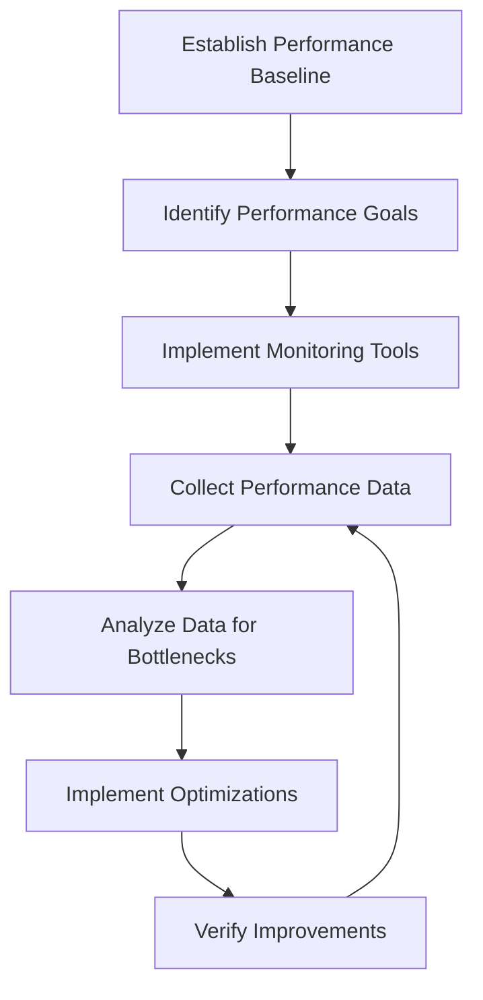

# React Performance Monitoring

## Introduction

Performance is a critical aspect of any web application. A fast and responsive application leads to better user experience, higher user engagement, and improved conversion rates. In the context of React applications, monitoring performance helps you identify bottlenecks, optimize rendering, and ensure your application runs smoothly even as it grows in complexity.

In this guide, we'll explore various tools and techniques to monitor your React application's performance. We'll learn how to identify performance issues and implement strategies to resolve them.

## Why Monitor React Performance?

Before diving into the tools and techniques, let's understand why performance monitoring is essential for React applications:

1. **User Experience**: Slow applications frustrate users and lead to higher bounce rates.
2. **SEO**: Page speed is a ranking factor for search engines.
3. **Resource Efficiency**: Optimized applications use fewer server resources, reducing hosting costs.
4. **Early Detection**: Identifying performance issues early makes them easier to fix.

## Built-in React Performance Tools

React provides several built-in tools to help you monitor and improve performance.

### React DevTools Profiler

The React DevTools browser extension includes a Profiler that lets you record and analyze component rendering performance.

#### How to use React DevTools Profiler:

1. Install the [React DevTools extension](https://reactjs.org/blog/2019/08/15/new-react-devtools.html) for your browser
2. Open your application and navigate to the React DevTools panel
3. Switch to the "Profiler" tab
4. Click the record button (circle) and interact with your application
5. Stop the recording to see the results

The Profiler shows you:
- Which components rendered
- How long each component took to render
- Why each component rendered (props changes, state changes, etc.)

```jsx
// Example component that might cause performance issues
function ExpensiveComponent({ data }) {
  // Imagine this is a component with expensive calculations
  const processedData = data.map(item => {
    // Some expensive operation
    return item.value * 2;
  });
  
  return (
    <div>
      {processedData.map((value, index) => (
        <div key={index}>{value}</div>
      ))}
    </div>
  );
}
```

### React.memo, useMemo, and useCallback

React provides optimization hooks and components to prevent unnecessary re-renders:

```jsx
// Using React.memo to prevent re-renders when props haven't changed
const MemoizedComponent = React.memo(function MyComponent(props) {
  // Only re-renders if props change
  return <div>{props.value}</div>;
});

function ParentComponent() {
  const [count, setCount] = useState(0);
  
  // useCallback memoizes the function between renders
  const handleClick = useCallback(() => {
    console.log("Button clicked");
  }, []); // Empty dependency array means this function never changes
  
  // useMemo memoizes the value between renders
  const expensiveValue = useMemo(() => {
    return performExpensiveCalculation(count);
  }, [count]); // Only recalculate when count changes
  
  return (
    <>
      <button onClick={() => setCount(count + 1)}>Increment</button>
      <MemoizedComponent value={expensiveValue} onClick={handleClick} />
    </>
  );
}

function performExpensiveCalculation(num) {
  console.log("Performing expensive calculation...");
  // Simulate expensive operation
  let result = 0;
  for (let i = 0; i < 1000000; i++) {
    result += num;
  }
  return result;
}
```

## External Performance Monitoring Tools

While React DevTools is great for development, you'll need more comprehensive tools to monitor performance in production.

### Lighthouse

Lighthouse is an open-source tool from Google that audits web applications for performance, accessibility, SEO, and more.

#### How to use Lighthouse:

1. Open Chrome DevTools
2. Navigate to the "Lighthouse" tab
3. Select the categories you want to audit
4. Click "Generate report"

Lighthouse provides metrics like:
- First Contentful Paint (FCP)
- Largest Contentful Paint (LCP)
- Total Blocking Time (TBT)
- Cumulative Layout Shift (CLS)

### Web Vitals

Web Vitals is a Google initiative that provides unified guidance for quality signals that are essential to delivering a great user experience on the web.

You can measure Web Vitals in your React application using the `web-vitals` library:

```jsx
// In your index.js or App.js
import { getCLS, getFID, getLCP } from 'web-vitals';

function reportWebVitals({ name, value }) {
  console.log(`Metric: ${name}, Value: ${value}`);
  // You could send this data to an analytics service
}

getCLS(reportWebVitals);
getFID(reportWebVitals);
getLCP(reportWebVitals);
```

### Performance Monitoring Services

Several third-party services provide comprehensive performance monitoring for React applications:

1. **New Relic**: Offers real user monitoring and detailed performance metrics
2. **Sentry**: Tracks errors and performance issues in real-time
3. **LogRocket**: Records user sessions to help debug performance issues

## Common Performance Issues in React

Let's explore some common performance issues in React applications and how to identify them:

### Unnecessary Re-renders

When a component re-renders without any visible changes, it wastes resources.

```jsx
// Bad practice: Creating new objects in render
function BadComponent() {
  const [count, setCount] = useState(0);
  
  return (
    <div>
      <button onClick={() => setCount(count + 1)}>Increment</button>
      {/* This creates a new object on every render */}
      <ChildComponent data={{ value: 'hello' }} />
    </div>
  );
}

// Better practice: Memoize objects
function GoodComponent() {
  const [count, setCount] = useState(0);
  const data = useMemo(() => ({ value: 'hello' }), []);
  
  return (
    <div>
      <button onClick={() => setCount(count + 1)}>Increment</button>
      <ChildComponent data={data} />
    </div>
  );
}
```

### Large Bundle Sizes

Large JavaScript bundles take longer to download, parse, and execute.

#### Code Splitting with React.lazy and Suspense

```jsx
import React, { Suspense, lazy } from 'react';

// Instead of:
// import ExpensiveComponent from './ExpensiveComponent';

// Use lazy loading:
const ExpensiveComponent = lazy(() => import('./ExpensiveComponent'));

function MyApp() {
  return (
    <div>
      <Suspense fallback={<div>Loading...</div>}>
        <ExpensiveComponent />
      </Suspense>
    </div>
  );
}
```

### Unoptimized Images

Large images can slow down your application significantly.

```jsx
// Bad practice: Using large images directly
function BadImageComponent() {
  return ;
}

// Better practice: Use responsive images with proper sizing
function GoodImageComponent() {
  return (
    
  );
}
```

## Real-world Performance Monitoring Example

Let's create a practical example of implementing performance monitoring in a React application:

```jsx
import React, { useState, useEffect } from 'react';
import { getCLS, getFID, getLCP, getTTFB, getFCP } from 'web-vitals';

function PerformanceMonitor() {
  const [metrics, setMetrics] = useState({});
  
  useEffect(() => {
    // Function to update metrics in state
    const reportWebVital = (metric) => {
      setMetrics(prevMetrics => ({
        ...prevMetrics,
        [metric.name]: Math.round(metric.value),
      }));
      
      // You could also send this data to your analytics service
      sendToAnalytics(metric);
    };
    
    // Register all web vitals to be measured
    getCLS(reportWebVital);
    getFID(reportWebVital);
    getLCP(reportWebVital);
    getTTFB(reportWebVital);
    getFCP(reportWebVital);
  }, []);
  
  return (
    <div className="performance-monitor">
      <h2>Performance Metrics</h2>
      <div className="metrics-grid">
        {Object.entries(metrics).map(([key, value]) => (
          <div key={key} className="metric-card">
            <h3>{metricNames[key] || key}</h3>
            <p className={getPerformanceClass(key, value)}>
              {value}ms
            </p>
          </div>
        ))}
      </div>
    </div>
  );
}

// Helper function to send metrics to your analytics service
function sendToAnalytics(metric) {
  // This is where you'd implement your analytics code
  console.log(`Sending metric to analytics: ${metric.name}=${metric.value}`);
  
  // Example: Google Analytics
  // window.gtag('event', 'web_vitals', {
  //   event_category: 'Web Vitals',
  //   event_action: metric.name,
  //   event_value: Math.round(metric.value),
  //   event_label: metric.id,
  // });
}

// Human-readable names for the metrics
const metricNames = {
  CLS: 'Cumulative Layout Shift',
  FID: 'First Input Delay',
  LCP: 'Largest Contentful Paint',
  TTFB: 'Time to First Byte',
  FCP: 'First Contentful Paint',
};

// Helper function to determine color based on performance
function getPerformanceClass(metric, value) {
  const thresholds = {
    LCP: { good: 2500, poor: 4000 },
    FID: { good: 100, poor: 300 },
    CLS: { good: 0.1, poor: 0.25 },
    TTFB: { good: 800, poor: 1800 },
    FCP: { good: 1800, poor: 3000 },
  };
  
  const metricThresholds = thresholds[metric] || { good: 1000, poor: 3000 };
  
  if (value <= metricThresholds.good) return 'metric-good';
  if (value >= metricThresholds.poor) return 'metric-poor';
  return 'metric-needs-improvement';
}

export default PerformanceMonitor;
```

You can include this component in your application to display real-time performance metrics:

```jsx
function App() {
  return (
    <div className="app">
      <header>
        <h1>My React App</h1>
      </header>
      <main>
        {/* Your app content */}
      </main>
      {process.env.NODE_ENV === 'development' && <PerformanceMonitor />}
    </div>
  );
}
```

## Performance Monitoring Workflow

Here's a recommended workflow for monitoring and improving your React application's performance:



## Summary

In this guide, we've explored various aspects of React performance monitoring:

1. **Built-in React Performance Tools**: React DevTools Profiler, React.memo, useMemo, and useCallback
2. **External Monitoring Tools**: Lighthouse, Web Vitals, and third-party services
3. **Common Performance Issues**: Unnecessary re-renders, large bundle sizes, and unoptimized images
4. **Real-world Implementation**: How to integrate performance monitoring in your React application

By implementing these techniques, you can ensure your React application delivers a fast and smooth experience to your users.

Remember that performance optimization is an ongoing process. As your application evolves, continue monitoring performance metrics and making improvements where necessary.

## Additional Resources

- [React Documentation: Optimizing Performance](https://reactjs.org/docs/optimizing-performance.html)
- [Web Vitals Documentation](https://web.dev/vitals/)
- [Lighthouse Documentation](https://developers.google.com/web/tools/lighthouse)
- [React DevTools Documentation](https://reactjs.org/blog/2019/08/15/new-react-devtools.html)

## Exercises

1. Set up React DevTools and profile your existing React application. Identify the component that takes the longest to render.
2. Implement the Web Vitals library in your application and log the metrics to the console.
3. Use React.memo, useMemo, and useCallback to optimize a component that's re-rendering unnecessarily.
4. Set up code splitting with React.lazy and Suspense for a large component in your application.
5. Create a custom performance monitoring dashboard for your React application using the example provided in this guide.