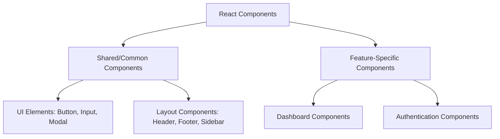

# React Project Structure

## Introduction

A well-organized project structure is the foundation of any successful React application. Just like a well-designed building needs a solid architectural plan, your React project needs a thoughtful structure to support its growth. In this guide, we'll explore best practices for organizing your React applications to make them maintainable, scalable, and collaboration-friendly.

Why is project structure important?
- **Maintainability**: Makes it easier to find, update, and debug code
- **Scalability**: Allows your application to grow without becoming chaotic
- **Collaboration**: Helps team members understand and navigate the codebase
- **Reusability**: Promotes component and utility reuse

Let's dive into creating an effective React project structure!

## Basic React Project Structure

When you create a new React application using Create React App (CRA), you'll get a basic structure like this:

```
my-react-app/
├── node_modules/
├── public/
│   ├── favicon.ico
│   ├── index.html
│   └── manifest.json
├── src/
│   ├── App.css
│   ├── App.js
│   ├── App.test.js
│   ├── index.css
│   ├── index.js
│   ├── logo.svg
│   └── serviceWorker.js
├── .gitignore
├── package.json
└── README.md
```

While this works for small applications, as your project grows, you'll need a more organized structure. Let's explore a better approach.

## Feature-Based Project Structure

One of the most effective ways to organize a React application is by features or domains. This approach groups related components, styles, and logic together.

```
my-react-app/
├── public/
├── src/
│   ├── assets/                   # Static assets like images, fonts
│   ├── components/               # Shared components
│   │   ├── Button/
│   │   │   ├── Button.js
│   │   │   ├── Button.test.js
│   │   │   ├── Button.module.css
│   │   │   └── index.js
│   │   └── Modal/
│   │       ├── Modal.js
│   │       ├── Modal.test.js
│   │       ├── Modal.module.css
│   │       └── index.js
│   ├── features/                # Feature-based modules
│   │   ├── auth/
│   │   │   ├── components/
│   │   │   ├── hooks/
│   │   │   ├── services/
│   │   │   ├── utils/
│   │   │   └── index.js
│   │   └── dashboard/
│   │       ├── components/
│   │       ├── hooks/
│   │       ├── services/
│   │       ├── utils/
│   │       └── index.js
│   ├── hooks/                   # Custom hooks
│   ├── services/                # API services
│   ├── utils/                   # Utility functions
│   ├── App.js                   # Root component
│   └── index.js                 # Entry point
├── package.json
└── README.md
```

### Organizing by Component

For each component, it's beneficial to group all related files:

```
Button/
├── Button.js          # Component definition
├── Button.test.js     # Component tests
├── Button.module.css  # Component styles
└── index.js           # Export file
```

The `index.js` file typically just re-exports the component:

```jsx
// Button/index.js
export { default } from './Button';
```

This allows for cleaner imports in other files:

```jsx
import Button from 'components/Button';
// Instead of: import Button from 'components/Button/Button';
```

## Hierarchical Component Organization

Components in React applications can be categorized based on their scope and reusability:



### Example: Implementing the Structure

Let's see a practical example of how to organize a user authentication feature:

```
auth/
├── components/
│   ├── LoginForm/
│   │   ├── LoginForm.js
│   │   ├── LoginForm.test.js
│   │   ├── LoginForm.module.css
│   │   └── index.js
│   └── SignupForm/
│       ├── SignupForm.js
│       ├── SignupForm.test.js
│       ├── SignupForm.module.css
│       └── index.js
├── hooks/
│   └── useAuth.js
├── services/
│   └── authService.js
├── utils/
│   └── validationUtils.js
└── index.js
```

Here's what the implementation might look like:

```jsx
// auth/hooks/useAuth.js
import { useState } from 'react';
import authService from '../services/authService';

export default function useAuth() {
  const [user, setUser] = useState(null);
  const [loading, setLoading] = useState(false);
  const [error, setError] = useState(null);

  const login = async (credentials) => {
    setLoading(true);
    try {
      const user = await authService.login(credentials);
      setUser(user);
      setError(null);
      return user;
    } catch (err) {
      setError(err.message);
      return null;
    } finally {
      setLoading(false);
    }
  };

  // Other auth methods like logout, signup, etc.

  return { user, loading, error, login };
}
```

```jsx
// auth/components/LoginForm/LoginForm.js
import React, { useState } from 'react';
import styles from './LoginForm.module.css';
import { useAuth } from '../../hooks/useAuth';
import Button from '../../../components/Button';

function LoginForm() {
  const [email, setEmail] = useState('');
  const [password, setPassword] = useState('');
  const { login, loading, error } = useAuth();

  const handleSubmit = async (e) => {
    e.preventDefault();
    await login({ email, password });
  };

  return (
    <form onSubmit={handleSubmit} className={styles.form}>
      {error && <div className={styles.error}>{error}</div>}
      <div className={styles.formGroup}>
        <label htmlFor="email">Email</label>
        <input
          id="email"
          type="email"
          value={email}
          onChange={(e) => setEmail(e.target.value)}
          required
        />
      </div>
      <div className={styles.formGroup}>
        <label htmlFor="password">Password</label>
        <input
          id="password"
          type="password"
          value={password}
          onChange={(e) => setPassword(e.target.value)}
          required
        />
      </div>
      <Button type="submit" disabled={loading}>
        {loading ? 'Logging in...' : 'Log In'}
      </Button>
    </form>
  );
}

export default LoginForm;
```

## Absolute Imports

To make imports cleaner and more maintainable, configure absolute imports. In Create React App, you can add a `jsconfig.json` file at the root:

```json
{
  "compilerOptions": {
    "baseUrl": "src"
  },
  "include": ["src"]
}
```

This allows you to import components like this:

```jsx
// Before
import Button from '../../../components/Button';

// After
import Button from 'components/Button';
```

## State Management Organization

If you're using Redux or another state management library, consider organizing your state files by feature as well:

```
store/
├── index.js          # Store configuration
└── features/
    ├── auth/
    │   ├── authSlice.js
    │   └── authSelectors.js
    └── products/
        ├── productsSlice.js
        └── productsSelectors.js
```

## Common Mistakes to Avoid

1. **Deeply Nested Folders**: Too many levels of nesting makes navigation difficult.
2. **Inconsistent Naming Conventions**: Stick to a consistent naming convention for files and folders.
3. **Mixing Component Types**: Avoid mixing presentational and container components in the same directory.
4. **Large Component Files**: Keep components focused on a single responsibility.

## Real-World Example: E-Commerce Application

Let's look at a practical example of how to structure a more complex React e-commerce application:

```
src/
├── assets/
├── components/
│   ├── Button/
│   ├── Card/
│   ├── Input/
│   └── Modal/
├── features/
│   ├── auth/
│   │   ├── components/
│   │   ├── hooks/
│   │   ├── services/
│   │   └── index.js
│   ├── products/
│   │   ├── components/
│   │   │   ├── ProductCard/
│   │   │   ├── ProductList/
│   │   │   └── ProductDetail/
│   │   ├── hooks/
│   │   │   ├── useProducts.js
│   │   │   └── useProductFilters.js
│   │   ├── services/
│   │   │   └── productService.js
│   │   └── index.js
│   └── cart/
│       ├── components/
│       ├── hooks/
│       ├── services/
│       └── index.js
├── hooks/
├── services/
│   ├── api.js
│   └── storage.js
├── utils/
│   ├── formatters.js
│   └── validators.js
├── App.js
└── index.js
```

A product listing component might be structured as:

```jsx
// features/products/components/ProductList/ProductList.js
import React from 'react';
import styles from './ProductList.module.css';
import ProductCard from '../ProductCard';
import { useProducts } from '../../hooks/useProducts';

function ProductList() {
  const { products, loading, error } = useProducts();

  if (loading) return <div>Loading products...</div>;
  if (error) return <div>Error: {error}</div>;

  return (
    <div className={styles.productGrid}>
      {products.map(product => (
        <ProductCard key={product.id} product={product} />
      ))}
    </div>
  );
}

export default ProductList;
```

## Best Practices Summary

1. **Group by Feature**: Organize related components, hooks, and services together.
2. **Component Co-location**: Keep component files (JS, CSS, tests) together.
3. **Consistent Naming**: Use consistent naming conventions across your project.
4. **Shallow Hierarchies**: Aim for shallow folder structures when possible.
5. **Isolation**: Ensure features have clear boundaries and minimal dependencies.
6. **Scalable from Start**: Design your structure to accommodate growth from the beginning.
7. **Documentation**: Include README files explaining the purpose of complex features.

## Conclusion

A well-organized React project structure is essential for maintaining code quality and developer productivity as your application grows. By organizing your code by features and keeping related files together, you create a codebase that's easier to navigate, understand, and extend.

Remember that there's no one-size-fits-all solution. Adapt these recommendations to your team's preferences and project requirements. The key is to establish clear conventions and to be consistent.

## Additional Resources

- **Official React Documentation**: [Thinking in React](https://reactjs.org/docs/thinking-in-react.html)
- **Book**: "Clean Architecture: A Craftsman's Guide to Software Structure and Design" by Robert C. Martin
- **Tool**: [Create React App](https://create-react-app.dev/) for setting up new React projects

## Exercises

1. Refactor an existing React application to use a feature-based structure.
2. Create a new React project with a well-organized structure following the principles discussed.
3. Identify components in your application that could be extracted as shared components.
4. Write documentation for your project's structure to help new team members understand it.

By following these guidelines, you'll build React applications that remain maintainable as they scale, making development faster and more enjoyable in the long run.