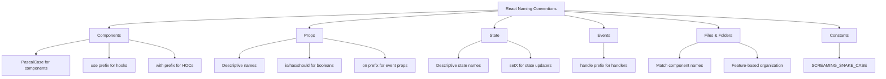

# React Naming Conventions

## Introduction

Writing clean, maintainable code starts with consistent naming conventions. In React applications, following established naming patterns makes your code more readable, easier to debug, and more professional. This guide covers essential naming conventions that every React developer should follow, from component naming to variables, events, and more.

Good naming conventions help you and your team members:
- Understand code purpose at a glance
- Predict how components interact
- Maintain consistency across your codebase
- Avoid naming conflicts
- Follow React community standards

Let's explore the key naming conventions that will elevate your React code quality.

## Component Naming Conventions

### PascalCase for Component Names

React components should always use **PascalCase** (also known as UpperCamelCase), where each word starts with a capital letter.

```jsx
// Good
function UserProfile() {
  return <div>User Profile Content</div>;
}

// Bad
function userProfile() {
  return <div>User Profile Content</div>;
}
```

This convention aligns with how JSX works - React treats components starting with lowercase letters as DOM tags.

### Component File Names

Match your component file names with the component names:

```
// Good
UserProfile.jsx
SearchBar.jsx
NavigationMenu.jsx

// Bad
userprofile.jsx
search_bar.jsx
navigation-menu.jsx
```

### Higher-Order Components (HOCs)

Use the `with` prefix for Higher-Order Components:

```jsx
// Higher Order Component naming
function withAuth(Component) {
  return function WithAuth(props) {
    const isAuthenticated = checkAuth();
    
    if (!isAuthenticated) {
      return <Redirect to="/login" />;
    }
    
    return <Component {...props} />;
  };
}

// Usage
const ProtectedDashboard = withAuth(Dashboard);
```

### Custom Hooks

Prefix custom hooks with `use` to follow React's built-in hook naming pattern:

```jsx
// Good
function useFormInput(initialValue) {
  const [value, setValue] = useState(initialValue);
  
  function handleChange(e) {
    setValue(e.target.value);
  }
  
  return {
    value,
    onChange: handleChange,
  };
}

// Bad
function formInput(initialValue) {
  // ...same implementation
}
```

## Props Naming Conventions

### Descriptive and Clear Prop Names

Use clear, descriptive prop names that explain the purpose:

```jsx
// Good
<UserProfile 
  userId={123}
  isAdmin={true}
  lastLoginDate="2023-05-10"
/>

// Bad
<UserProfile 
  id={123}
  admin={true}
  date="2023-05-10"
/>
```

### Boolean Props

For boolean props, use `is`, `has`, or `should` prefixes:

```jsx
// Good
<Button 
  isDisabled={true}
  hasIcon={true}
  shouldDisplay={false}
/>

// Bad
<Button 
  disabled={true}
  icon={true}
  display={false}
/>
```

### Event Handler Props

Prefix event handler props with `on` and handler implementations with `handle`:

```jsx
// In parent component
function ParentComponent() {
  function handleClick() {
    console.log('Button clicked!');
  }
  
  return <Button onClick={handleClick} />;
}

// In child component
function Button({ onClick }) {
  return <button onClick={onClick}>Click Me</button>;
}
```

### Consistent Props Naming

Keep prop names consistent across components with similar functionality:

```jsx
// Good - Consistent use of onSubmit
<LoginForm onSubmit={handleLoginSubmit} />
<RegistrationForm onSubmit={handleRegistrationSubmit} />

// Bad - Inconsistent event naming
<LoginForm onSubmit={handleLoginSubmit} />
<RegistrationForm submitForm={handleRegistrationSubmit} />
```

## State Naming Conventions

### Descriptive State Variables

Name state variables clearly to indicate their purpose:

```jsx
// Good
const [isLoading, setIsLoading] = useState(false);
const [userList, setUserList] = useState([]);
const [selectedItem, setSelectedItem] = useState(null);

// Bad
const [loading, setLoading] = useState(false);
const [users, setUsers] = useState([]);
const [selected, setSelected] = useState(null);
```

### State Update Functions

Follow the `setX` pattern for state updater functions:

```jsx
// Good
const [count, setCount] = useState(0);
const [username, setUsername] = useState('');

// Bad
const [count, updateCount] = useState(0);
const [username, changeUsername] = useState('');
```

## Function and Event Handler Naming

### Event Handlers

Prefix event handlers with `handle` followed by the event and optionally the element:

```jsx
// Good
function handleClick() { /* ... */ }
function handleSubmit() { /* ... */ }
function handleInputChange() { /* ... */ }
function handleLoginButtonClick() { /* ... */ }

// Bad
function click() { /* ... */ }
function submit() { /* ... */ }
function changeInput() { /* ... */ }
function loginClick() { /* ... */ }
```

### Context-Specific Functions

Name functions based on what they do in the business logic context:

```jsx
// Good
function fetchUserData() { /* ... */ }
function validateUserInput() { /* ... */ }
function calculateTotalPrice() { /* ... */ }

// Bad
function getData() { /* ... */ }
function checkData() { /* ... */ }
function calculate() { /* ... */ }
```

## CSS and Styling Naming Conventions

### CSS in JS

For styled components or CSS-in-JS solutions, use descriptive names with the component prefix:

```jsx
// Good
const ButtonContainer = styled.div`
  display: flex;
  justify-content: center;
`;

const ButtonText = styled.span`
  font-weight: bold;
  color: white;
`;

// Bad
const Container = styled.div`
  display: flex;
  justify-content: center;
`;

const Text = styled.span`
  font-weight: bold;
  color: white;
`;
```

### CSS Modules

For CSS modules, use kebab-case for class names:

```css
/* styles.module.css */
.button-primary {
  background-color: blue;
  color: white;
}

.user-profile-card {
  border: 1px solid #eee;
  padding: 16px;
}
```

```jsx
import styles from './styles.module.css';

function Button() {
  return <button className={styles['button-primary']}>Click Me</button>;
}
```

## Folder Structure Naming

### Feature or Component-based Folders

Group related files in descriptively named folders:

```
src/
  components/
    Button/
      Button.jsx
      Button.test.jsx
      Button.module.css
    UserProfile/
      UserProfile.jsx
      UserProfile.test.jsx
      UserProfile.module.css
  features/
    Authentication/
      Login.jsx
      Registration.jsx
      authSlice.js
    Dashboard/
      Dashboard.jsx
      DashboardHeader.jsx
      dashboardSlice.js
```

## Constants and Enums

### Constants

Use SCREAMING_SNAKE_CASE for constant values:

```jsx
// Good
const API_BASE_URL = 'https://api.example.com';
const MAX_ITEMS_PER_PAGE = 20;
const DEFAULT_USER_ROLE = 'customer';

// Bad
const apiBaseUrl = 'https://api.example.com';
const maxItemsPerPage = 20;
```

### Enumeration-like Objects

Use PascalCase for enum-like objects and SCREAMING_SNAKE_CASE for their properties:

```jsx
// Good
const UserRoles = {
  ADMIN: 'admin',
  EDITOR: 'editor',
  CUSTOMER: 'customer',
};

function UserPermissions({ role }) {
  if (role === UserRoles.ADMIN) {
    return <AdminPanel />;
  }
  return <CustomerPanel />;
}

// Bad
const userRoles = {
  admin: 'admin',
  editor: 'editor',
  customer: 'customer',
};
```

## Real-world Example: Building a User Management Component

Let's apply these naming conventions in a real-world example - a user management component:

```jsx
import React, { useState, useEffect } from 'react';
import styled from 'styled-components';
import { useUserData } from './hooks/useUserData';

// Constants
const USER_TYPES = {
  ADMIN: 'admin',
  REGULAR: 'regular',
  GUEST: 'guest',
};

// Styled components
const UserCardContainer = styled.div`
  border: 1px solid #ddd;
  border-radius: 4px;
  padding: 16px;
  margin-bottom: 8px;
`;

const UserName = styled.h3`
  margin: 0 0 8px;
  color: #333;
`;

const UserBadge = styled.span`
  background-color: ${props => props.isAdmin ? '#ff5722' : '#2196f3'};
  color: white;
  padding: 2px 6px;
  border-radius: 3px;
  font-size: 0.8rem;
  margin-left: 8px;
`;

// Component
function UserCard({ user, onEdit, onDelete }) {
  const { id, name, email, type } = user;
  const isAdmin = type === USER_TYPES.ADMIN;
  
  function handleEditClick() {
    onEdit(id);
  }
  
  function handleDeleteClick() {
    onDelete(id);
  }
  
  return (
    <UserCardContainer>
      <UserName>
        {name}
        {isAdmin && <UserBadge isAdmin={isAdmin}>Admin</UserBadge>}
      </UserName>
      <div>{email}</div>
      <button onClick={handleEditClick}>Edit</button>
      <button onClick={handleDeleteClick}>Delete</button>
    </UserCardContainer>
  );
}

// Main component using custom hook
function UserManagement() {
  const { users, isLoading, errorMessage, fetchUsers } = useUserData();
  const [selectedUserId, setSelectedUserId] = useState(null);
  
  useEffect(() => {
    fetchUsers();
  }, [fetchUsers]);
  
  function handleUserEdit(userId) {
    setSelectedUserId(userId);
    // Open edit form logic here
  }
  
  function handleUserDelete(userId) {
    // Delete confirmation logic here
  }
  
  if (isLoading) {
    return <div>Loading users...</div>;
  }
  
  if (errorMessage) {
    return <div>Error: {errorMessage}</div>;
  }
  
  return (
    <div>
      <h2>User Management</h2>
      {users.map(user => (
        <UserCard 
          key={user.id}
          user={user}
          onEdit={handleUserEdit}
          onDelete={handleUserDelete}
        />
      ))}
    </div>
  );
}

export default UserManagement;
```

## Summary

Consistent naming conventions contribute significantly to code quality and maintainability. Here's a recap of the key React naming conventions:



Following these naming conventions will help you:
- Write more readable and self-documenting code
- Collaborate more effectively with other developers
- Follow React community standards
- Create a more maintainable codebase

Remember that consistency is key. It's better to follow a single convention consistently throughout your project than to mix different naming styles.

## Additional Resources and Practice

### Practice Exercises

1. Rename a component that doesn't follow proper conventions
2. Create a new component with props and event handlers using the correct naming patterns
3. Refactor existing code to follow these naming conventions
4. Review an existing project and identify naming inconsistencies

### Further Reading

- [React Official Documentation](https://reactjs.org/docs/getting-started.html)
- [Airbnb React/JSX Style Guide](https://github.com/airbnb/javascript/tree/master/react)
- Clean Code by Robert C. Martin
- JavaScript: The Good Parts by Douglas Crockford

By following these conventions consistently, you'll write more professional React code and build applications that are easier to maintain and extend over time.