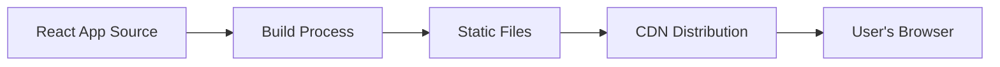

# React Production Readiness

## Introduction

As you develop React applications, you'll eventually need to deploy them to production for real users. Moving from development to production requires careful consideration of performance, security, user experience, and maintainability. This guide covers essential practices to ensure your React application is ready for production deployment.

Production-ready React applications are optimized to load quickly, run efficiently, maintain security, and provide the best possible user experience. This preparation makes a significant difference in how your application performs in the real world.

## Why Production Readiness Matters

Development builds of React are optimized for developer experience, while production builds focus on:

- **Performance**: Faster loading and rendering
- **Smaller bundle size**: Reduced download times for users
- **Security**: Protection against common vulnerabilities
- **Error handling**: Better user experience when things go wrong
- **SEO and accessibility**: Reaching and serving all users

Let's explore the key aspects of making your React application production-ready.

## Build Optimization

### Creating a Production Build

React includes development-specific warnings and debugging tools that should be removed in production.

```jsx
// This is automatically handled by build tools like Create React App
// For manual webpack configuration:

module.exports = {
  mode: 'production',
  // Other webpack configuration...
}
```

For Create React App (CRA), simply run:

```bash
npm run build
```

This command creates an optimized production build in the `build` folder.

### Code Splitting

Code splitting helps reduce the initial bundle size by breaking your application into smaller chunks that load on demand.

```jsx
import React, { Suspense, lazy } from 'react';

// Instead of:
// import ExpensiveComponent from './ExpensiveComponent';

// Use lazy loading:
const ExpensiveComponent = lazy(() => import('./ExpensiveComponent'));

function App() {
  return (
    <div>
      <Suspense fallback={<div>Loading...</div>}>
        <ExpensiveComponent />
      </Suspense>
    </div>
  );
}
```

For route-based code splitting:

```jsx
import React, { Suspense, lazy } from 'react';
import { BrowserRouter as Router, Routes, Route } from 'react-router-dom';

const Home = lazy(() => import('./routes/Home'));
const About = lazy(() => import('./routes/About'));
const Dashboard = lazy(() => import('./routes/Dashboard'));

function App() {
  return (
    <Router>
      <Suspense fallback={<div>Loading...</div>}>
        <Routes>
          <Route path="/" element={<Home />} />
          <Route path="/about" element={<About />} />
          <Route path="/dashboard" element={<Dashboard />} />
        </Routes>
      </Suspense>
    </Router>
  );
}
```

### Tree Shaking

Tree shaking is the process of removing unused code from your bundle. Most modern bundlers like Webpack support this feature in production mode.

To enable effective tree shaking:

1. Use ES modules syntax (import/export)
2. Avoid side effects in modules
3. Use a bundler that supports tree shaking (Webpack, Rollup, Parcel)

```jsx
// Good - enables tree shaking
import { Button } from 'ui-library';

// Bad - imports the entire library
import UILibrary from 'ui-library';
const { Button } = UILibrary;
```

## Performance Optimization

### Memoization

Use React's memoization features to prevent unnecessary re-renders:

```jsx
import React, { useState, useMemo, useCallback } from 'react';

function ExpensiveList({ items, onItemClick }) {
  // Memoize expensive calculations
  const sortedItems = useMemo(() => {
    console.log('Sorting items...');
    return [...items].sort((a, b) => a.value - b.value);
  }, [items]);

  // Memoize callbacks
  const handleClick = useCallback((item) => {
    console.log('Item clicked:', item);
    onItemClick(item);
  }, [onItemClick]);

  return (
    <ul>
      {sortedItems.map(item => (
        <li key={item.id} onClick={() => handleClick(item)}>
          {item.name}
        </li>
      ))}
    </ul>
  );
}

// Use React.memo for function components
const MemoizedExpensiveList = React.memo(ExpensiveList);
```

### React DevTools Profiler

The React DevTools Profiler helps identify performance bottlenecks:

1. Install React DevTools for your browser
2. Run your application
3. Open DevTools and switch to the "Profiler" tab
4. Click "Record" and interact with your application
5. Analyze the results to identify slow components or unnecessary renders

### Web Vitals Monitoring

Monitor Core Web Vitals in your production application:

```jsx
import { useEffect } from 'react';
import { getCLS, getFID, getLCP } from 'web-vitals';

function reportWebVitals(metric) {
  // Analytics implementation
  console.log(metric.name, metric.value);
}

function App() {
  useEffect(() => {
    getCLS(reportWebVitals);
    getFID(reportWebVitals);
    getLCP(reportWebVitals);
  }, []);

  return (
    // Your app content
  );
}
```

## Error Handling

### Error Boundaries

Error boundaries catch JavaScript errors in their child component tree and display fallback UI:

```jsx
import React, { Component } from 'react';

class ErrorBoundary extends Component {
  constructor(props) {
    super(props);
    this.state = { hasError: false };
  }

  static getDerivedStateFromError(error) {
    // Update state to show fallback UI
    return { hasError: true };
  }

  componentDidCatch(error, errorInfo) {
    // Log error to an error reporting service
    console.error('Error caught by boundary:', error, errorInfo);
    // You could send this to Sentry, LogRocket, etc.
  }

  render() {
    if (this.state.hasError) {
      return <h2>Something went wrong. Please try again later.</h2>;
    }

    return this.props.children;
  }
}

// Usage
function App() {
  return (
    <ErrorBoundary>
      <MyComponent />
    </ErrorBoundary>
  );
}
```

### Logging and Monitoring

Implement error logging to track issues in production:

```jsx
// Example integration with a service like Sentry
import * as Sentry from '@sentry/react';

Sentry.init({
  dsn: "your-dsn-here",
  environment: process.env.NODE_ENV
});

function App() {
  return (
    <Sentry.ErrorBoundary fallback={<p>An error has occurred</p>}>
      <YourApplication />
    </Sentry.ErrorBoundary>
  );
}
```

## Environment Variables

Use environment variables to manage configuration across different environments:

```jsx
// .env.production
REACT_APP_API_URL=https://api.example.com
REACT_APP_FEATURE_FLAG=true

// Usage in React
function ApiService() {
  const apiUrl = process.env.REACT_APP_API_URL;
  
  useEffect(() => {
    fetch(`${apiUrl}/data`)
      .then(response => response.json())
      .then(data => console.log(data));
  }, [apiUrl]);
  
  return <div>API Service Connected</div>;
}
```

:::caution
Never include sensitive information like API keys in environment variables that are bundled with your client-side code. These values are accessible to anyone who inspects your application.
:::

## Security Considerations

### Content Security Policy (CSP)

Implement a Content Security Policy to prevent XSS attacks:

```html
<!-- In your HTML head or server response headers -->
<meta http-equiv="Content-Security-Policy" content="default-src 'self'; script-src 'self'; style-src 'self';">
```

### Sanitizing User Input

Always sanitize user input to prevent XSS attacks:

```jsx
import DOMPurify from 'dompurify';

function UserGeneratedContent({ content }) {
  const sanitizedContent = DOMPurify.sanitize(content);
  
  return <div dangerouslySetInnerHTML={{ __html: sanitizedContent }} />;
}
```

## SEO and Accessibility

### React Helmet for SEO

Use React Helmet to manage document head metadata:

```jsx
import { Helmet } from 'react-helmet';

function ProductPage({ product }) {
  return (
    <>
      <Helmet>
        <title>{product.name} - Your Store</title>
        <meta name="description" content={product.description} />
        <meta property="og:title" content={product.name} />
        <meta property="og:image" content={product.imageUrl} />
      </Helmet>
      <div>
        <h1>{product.name}</h1>
        {/* Product details */}
      </div>
    </>
  );
}
```

### Accessibility Best Practices

Ensure your application is accessible:

```jsx
// Bad example
function BadButton() {
  return <div onClick={handleClick}>Click me</div>;
}

// Good example
function GoodButton() {
  return (
    <button 
      onClick={handleClick}
      aria-label="Submit form"
      disabled={isLoading}
    >
      {isLoading ? 'Loading...' : 'Submit'}
    </button>
  );
}

// Image with alt text
function ProductImage({ product }) {
  return (
    
  );
}
```

## Deployment Strategy

### Static Hosting

For most React applications, static hosting provides the best performance and simplicity:



Popular static hosting options include:
- Netlify
- Vercel
- AWS S3 + CloudFront
- GitHub Pages

### Server-Side Rendering (SSR)

For applications that require SEO or better initial load performance:

```jsx
// Example using Next.js for SSR
// pages/products/[id].js
export async function getServerSideProps(context) {
  const { id } = context.params;
  const res = await fetch(`https://api.example.com/products/${id}`);
  const product = await res.json();
  
  return {
    props: { product }
  };
}

function ProductPage({ product }) {
  return (
    <div>
      <h1>{product.name}</h1>
      <p>{product.description}</p>
      <span>${product.price}</span>
    </div>
  );
}

export default ProductPage;
```

## Production Checklist

Before deploying to production, use this checklist:

1. Run a production build and test it locally
   ```bash
   npm run build
   npx serve -s build
   ```

2. Check for console errors and warnings
3. Verify all routes and critical user flows
4. Test on multiple browsers and devices
5. Run Lighthouse audit for performance, accessibility, and SEO
6. Ensure proper error handling is in place
7. Configure proper caching headers for static assets
8. Set up monitoring and logging
9. Implement CI/CD for automated testing

## Real-world Example: E-commerce Product Page

Let's put it all together with a production-ready product page component:

```jsx
import React, { useState, useEffect, Suspense, lazy } from 'react';
import { Helmet } from 'react-helmet';
import ErrorBoundary from './ErrorBoundary';
import { trackPageView, trackEvent } from './analytics';
import { useParams } from 'react-router-dom';

// Lazy-loaded components
const ProductReviews = lazy(() => import('./ProductReviews'));
const RelatedProducts = lazy(() => import('./RelatedProducts'));

// Environment variables
const API_URL = process.env.REACT_APP_API_URL;

function ProductPage() {
  const { id } = useParams();
  const [product, setProduct] = useState(null);
  const [loading, setLoading] = useState(true);
  const [error, setError] = useState(null);
  
  useEffect(() => {
    // Track page view
    trackPageView(`Product: ${id}`);
    
    // Fetch product data
    async function fetchProduct() {
      try {
        setLoading(true);
        const response = await fetch(`${API_URL}/products/${id}`);
        
        if (!response.ok) {
          throw new Error(`Product fetch failed: ${response.status}`);
        }
        
        const data = await response.json();
        setProduct(data);
      } catch (err) {
        console.error('Error fetching product:', err);
        setError(err.message);
      } finally {
        setLoading(false);
      }
    }
    
    fetchProduct();
  }, [id]);

  const handleAddToCart = () => {
    trackEvent('add_to_cart', { product_id: id });
    // Add to cart logic
  };
  
  if (loading) return <div className="loader" aria-label="Loading product information">Loading...</div>;
  
  if (error) return <div className="error-message">Error: {error}</div>;
  
  if (!product) return <div className="not-found">Product not found</div>;
  
  return (
    <ErrorBoundary>
      <div className="product-page">
        <Helmet>
          <title>{product.name} | Our Store</title>
          <meta name="description" content={product.description.substring(0, 160)} />
          <meta property="og:title" content={product.name} />
          <meta property="og:type" content="product" />
          <meta property="og:image" content={product.imageUrl} />
          <link rel="canonical" href={`https://ourstore.com/products/${id}`} />
        </Helmet>
        
        <div className="product-main">
          <div className="product-image">
            
          </div>
          
          <div className="product-details">
            <h1>{product.name}</h1>
            <p className="product-price">${product.price.toFixed(2)}</p>
            <div className="product-description">
              {product.description}
            </div>
            
            <button 
              className="add-to-cart-button"
              onClick={handleAddToCart}
              disabled={!product.inStock}
              aria-label={`Add ${product.name} to your cart`}
            >
              {product.inStock ? 'Add to Cart' : 'Out of Stock'}
            </button>
          </div>
        </div>
        
        <Suspense fallback={<div>Loading product reviews...</div>}>
          <ProductReviews productId={id} />
        </Suspense>
        
        <Suspense fallback={<div>Loading related products...</div>}>
          <RelatedProducts 
            category={product.category} 
            currentProductId={id} 
          />
        </Suspense>
      </div>
    </ErrorBoundary>
  );
}

export default React.memo(ProductPage);
```

## Summary

Making a React application production-ready involves multiple considerations:

1. **Build Optimization**
   - Create optimized production builds
   - Implement code splitting
   - Enable tree shaking

2. **Performance**
   - Use memoization techniques
   - Monitor Core Web Vitals
   - Analyze with DevTools Profiler

3. **Error Handling**
   - Implement error boundaries
   - Set up logging and monitoring

4. **Security**
   - Configure Content Security Policy
   - Sanitize user input

5. **SEO and Accessibility**
   - Manage metadata with React Helmet
   - Follow accessibility best practices

6. **Deployment**
   - Choose the right hosting strategy
   - Consider CDN distribution

By following these practices, you'll create React applications that perform well, provide good user experiences, and remain maintainable in production environments.

## Additional Resources

- [React's official optimization guide](https://reactjs.org/docs/optimizing-performance.html)
- [Web Vitals](https://web.dev/vitals/)
- [Lighthouse performance auditing](https://developers.google.com/web/tools/lighthouse)
- [Web.dev React optimization patterns](https://web.dev/react/)
- [WCAG accessibility guidelines](https://www.w3.org/WAI/standards-guidelines/wcag/)

## Exercises

1. Take an existing React component and apply code splitting to its heavy dependencies.
2. Implement error boundaries in your application and test them by intentionally causing errors.
3. Run a Lighthouse audit on your React application and address the top three issues it identifies.
4. Use React DevTools Profiler to identify and fix a performance bottleneck in your application.
5. Set up environment variables for your development, staging, and production environments.