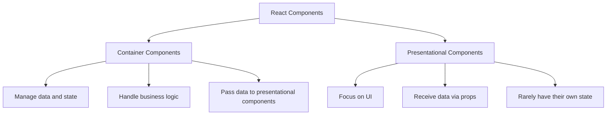

# React Component Organization

## Introduction

When building React applications, one of the most important aspects of creating maintainable and scalable code is how you organize your components. As your application grows, having a well-structured component hierarchy becomes essential. This guide will walk you through best practices for organizing React components, helping you create code that is easier to understand, maintain, and reuse.

Component organization isn't just about folder structure—it's about creating a logical separation of concerns, making your code more predictable, and enabling your team to work efficiently on different parts of the application simultaneously.

## Why Component Organization Matters

Before diving into specific strategies, let's understand why component organization is crucial:

- **Maintainability**: Well-organized code is easier to debug and update
- **Reusability**: Properly structured components can be reused throughout your application
- **Collaboration**: Clear organization helps team members understand where to find and place code
- **Scalability**: Good organization patterns make it easier to expand your application

## Component Classification

A useful first step in organizing React components is to classify them based on their responsibility. Here's a common pattern:

### 1. Presentational vs Container Components



#### Presentational Components

Presentational components (sometimes called "dumb" components) focus solely on the UI. They:

- Are concerned with how things look
- Receive data and callbacks via props
- Rarely have their own state (except for UI state)
- Are usually written as functional components

Example of a presentational component:

```jsx
// Button.jsx
import React from 'react';
import './Button.css';

const Button = ({ onClick, disabled, children }) => {
  return (
    <button 
      className="custom-button" 
      onClick={onClick}
      disabled={disabled}
    >
      {children}
    </button>
  );
};

export default Button;
```

#### Container Components

Container components (sometimes called "smart" components) focus on how things work. They:

- Are concerned with data fetching and state management
- Provide data and behavior to presentational or other container components
- Often contain side effects (API calls, etc.)
- Usually handle user interactions and state changes

Example of a container component:

```jsx
// UserProfileContainer.jsx
import React, { useState, useEffect } from 'react';
import UserProfile from './UserProfile';

const UserProfileContainer = ({ userId }) => {
  const [userData, setUserData] = useState(null);
  const [loading, setLoading] = useState(true);
  const [error, setError] = useState(null);

  useEffect(() => {
    const fetchUserData = async () => {
      try {
        setLoading(true);
        // In a real app, this would be an API call
        const response = await fetch(`/api/users/${userId}`);
        const data = await response.json();
        setUserData(data);
        setError(null);
      } catch (err) {
        setError('Failed to fetch user data');
        console.error(err);
      } finally {
        setLoading(false);
      }
    };

    fetchUserData();
  }, [userId]);

  if (loading) return <p>Loading user data...</p>;
  if (error) return <p>Error: {error}</p>;
  if (!userData) return null;

  return <UserProfile user={userData} />;
};

export default UserProfileContainer;
```

### 2. By Feature or Domain

Another effective approach is organizing components by feature or domain rather than by technical type:

```
src/
└── features/
    ├── authentication/
    │   ├── components/
    │   │   ├── LoginForm.jsx
    │   │   ├── SignupForm.jsx
    │   │   └── ResetPasswordForm.jsx
    │   ├── services/
    │   │   └── authService.js
    │   ├── hooks/
    │   │   └── useAuth.js
    │   └── AuthPage.jsx
    ├── products/
    │   ├── components/
    │   │   ├── ProductList.jsx
    │   │   ├── ProductCard.jsx
    │   │   └── ProductDetail.jsx
    │   ├── services/
    │   │   └── productService.js
    │   └── ProductsPage.jsx
    └── checkout/
        ├── components/
        │   ├── Cart.jsx
        │   ├── PaymentForm.jsx
        │   └── OrderSummary.jsx
        ├── services/
        │   └── checkoutService.js
        └── CheckoutPage.jsx
```

This approach has several benefits:
- Keeps related code together
- Makes it easier to understand the application's domains
- Simplifies onboarding for new developers who can focus on one feature at a time
- Makes it clearer where new code should be placed

## Component Folder Structure

There are several popular approaches to structuring your components. Here are some common ones:

### 1. Flat Structure (for smaller apps)

```
src/
├── components/
│   ├── Header.jsx
│   ├── Footer.jsx
│   ├── Button.jsx
│   └── Card.jsx
└── pages/
    ├── HomePage.jsx
    ├── AboutPage.jsx
    └── ContactPage.jsx
```

### 2. Grouped by Type (for medium-sized apps)

```
src/
├── components/
│   ├── common/
│   │   ├── Button.jsx
│   │   ├── Card.jsx
│   │   └── Modal.jsx
│   ├── layout/
│   │   ├── Header.jsx
│   │   ├── Footer.jsx
│   │   └── Sidebar.jsx
│   └── forms/
│       ├── TextField.jsx
│       ├── Checkbox.jsx
│       └── Select.jsx
└── pages/
    ├── HomePage.jsx
    ├── AboutPage.jsx
    └── ContactPage.jsx
```

### 3. Atomic Design Methodology

Based on Brad Frost's Atomic Design principles:

```
src/
├── components/
│   ├── atoms/
│   │   ├── Button.jsx
│   │   ├── Input.jsx
│   │   └── Typography.jsx
│   ├── molecules/
│   │   ├── SearchBar.jsx
│   │   ├── NavigationItem.jsx
│   │   └── FormField.jsx
│   ├── organisms/
│   │   ├── Header.jsx
│   │   ├── Footer.jsx
│   │   └── ProductCard.jsx
│   └── templates/
│       ├── HomeTemplate.jsx
│       └── DashboardTemplate.jsx
└── pages/
    ├── HomePage.jsx
    ├── AboutPage.jsx
    └── ContactPage.jsx
```

## Component Naming Conventions

Consistent component naming helps everyone understand your code better:

1. **Use PascalCase for component names**: `UserProfile` not `userProfile`
2. **Be descriptive**: `ProductDetailCard` is more descriptive than `Card`
3. **Add context to reusable components**: `ShoppingCartButton` vs `Button`
4. **Suffix container components**: `UserProfileContainer` contains the logic for `UserProfile`
5. **Use consistent prefixes**: `use` for hooks, `with` for HOCs

## Practical Example: Building a Dashboard

Let's build a simple dashboard application with proper component organization:

### 1. First, we'll define our folder structure:

```
src/
├── components/
│   ├── common/
│   │   ├── Button.jsx
│   │   ├── Card.jsx
│   │   └── Loading.jsx
│   └── dashboard/
│       ├── DashboardSummary.jsx
│       ├── RecentActivity.jsx
│       ├── StatisticsChart.jsx
│       └── UserWelcome.jsx
├── containers/
│   └── DashboardContainer.jsx
└── pages/
    └── DashboardPage.jsx
```

### 2. Creating our common components:

```jsx
// components/common/Card.jsx
import React from 'react';
import './Card.css';

const Card = ({ title, children, className = '' }) => {
  return (
    <div className={`card ${className}`}>
      {title && <div className="card-header">{title}</div>}
      <div className="card-body">
        {children}
      </div>
    </div>
  );
};

export default Card;
```

### 3. Creating our dashboard components:

```jsx
// components/dashboard/StatisticsChart.jsx
import React from 'react';
import './StatisticsChart.css';

const StatisticsChart = ({ data }) => {
  // In a real app, you'd use a charting library like Chart.js or Recharts
  return (
    <div className="statistics-chart">
      <h3>Statistics</h3>
      <div className="chart-container">
        {data.map((item, index) => (
          <div 
            key={index} 
            className="chart-bar" 
            style={{ height: `${item.value}%` }}
            title={`${item.label}: ${item.value}`}
          >
            <span className="label">{item.label}</span>
          </div>
        ))}
      </div>
    </div>
  );
};

export default StatisticsChart;
```

### 4. Creating our container component:

```jsx
// containers/DashboardContainer.jsx
import React, { useState, useEffect } from 'react';
import DashboardSummary from '../components/dashboard/DashboardSummary';
import RecentActivity from '../components/dashboard/RecentActivity';
import StatisticsChart from '../components/dashboard/StatisticsChart';
import UserWelcome from '../components/dashboard/UserWelcome';
import Loading from '../components/common/Loading';

const DashboardContainer = () => {
  const [dashboardData, setDashboardData] = useState(null);
  const [isLoading, setIsLoading] = useState(true);
  const [error, setError] = useState(null);

  useEffect(() => {
    const fetchDashboardData = async () => {
      try {
        setIsLoading(true);
        // Simulate API call
        await new Promise(resolve => setTimeout(resolve, 1000));
        
        // Mock data
        const data = {
          user: { name: 'Jane Doe', role: 'Admin' },
          summary: { 
            totalUsers: 1250,
            activeUsers: 842,
            totalRevenue: '$12,450'
          },
          activities: [
            { id: 1, user: 'John Smith', action: 'Created a new post', time: '5 minutes ago' },
            { id: 2, user: 'Sarah Johnson', action: 'Updated profile', time: '2 hours ago' },
            { id: 3, user: 'Mike Williams', action: 'Purchased Pro Plan', time: '1 day ago' }
          ],
          statistics: [
            { label: 'Jan', value: 65 },
            { label: 'Feb', value: 59 },
            { label: 'Mar', value: 80 },
            { label: 'Apr', value: 81 },
            { label: 'May', value: 56 },
            { label: 'Jun', value: 55 },
            { label: 'Jul', value: 40 }
          ]
        };
        
        setDashboardData(data);
        setError(null);
      } catch (err) {
        setError('Failed to fetch dashboard data');
        console.error(err);
      } finally {
        setIsLoading(false);
      }
    };

    fetchDashboardData();
  }, []);

  if (isLoading) return <Loading message="Loading dashboard..." />;
  if (error) return <p>Error: {error}</p>;
  if (!dashboardData) return null;

  return (
    <div className="dashboard-container">
      <UserWelcome user={dashboardData.user} />
      <DashboardSummary data={dashboardData.summary} />
      <div className="dashboard-grid">
        <StatisticsChart data={dashboardData.statistics} />
        <RecentActivity activities={dashboardData.activities} />
      </div>
    </div>
  );
};

export default DashboardContainer;
```

### 5. Creating our page component:

```jsx
// pages/DashboardPage.jsx
import React from 'react';
import DashboardContainer from '../containers/DashboardContainer';
import './DashboardPage.css';

const DashboardPage = () => {
  return (
    <div className="dashboard-page">
      <h1>Dashboard</h1>
      <DashboardContainer />
    </div>
  );
};

export default DashboardPage;
```

This example demonstrates how separating our code into presentational components, container components, and pages makes our application more maintainable and easier to understand.

## Best Practices for Component Organization

1. **Keep components small and focused**: Each component should do one thing well
2. **Use consistent file naming**: Decide on a convention (e.g., `UserProfile.jsx`) and stick with it
3. **Co-locate related files**: Keep CSS, tests, and components that are only used by one parent in the same folder
4. **Create an index.js file for complex components**: Export all components from a single file to simplify imports
5. **Avoid deeply nested component folders**: Aim for a maximum of 3-4 levels of nesting
6. **Document complex components**: Add comments or documentation for components with complex logic
7. **Extract reusable logic into custom hooks**: Move complex stateful logic out of components when possible

## Using Index Files for Cleaner Imports

For larger components with multiple subcomponents, using an index.js file can make your imports cleaner:

```jsx
// components/UserProfile/index.js
export { default } from './UserProfile';
export { default as UserAvatar } from './UserAvatar';
export { default as UserBio } from './UserBio';
export { default as UserStats } from './UserStats';
```

This allows you to import from the folder directly:

```jsx
import UserProfile, { UserAvatar, UserBio } from 'components/UserProfile';
```

## Common Pitfalls to Avoid

1. **Premature optimization**: Don't create complex folder structures for small applications
2. **Inconsistent organization**: Mixing different organization patterns can cause confusion
3. **Too generic naming**: Avoid names like `Component`, `Container`, or `Utils` without context
4. **Too specific naming**: Names like `RedRoundButtonWithBlueOutlineAndHoverEffect` are too verbose
5. **Ignoring co-location**: Keep related files together rather than separating by file type

## Summary

Properly organizing your React components is essential for creating maintainable, scalable applications. Key takeaways include:

- Separate components by concern (presentational vs. container) to improve reusability
- Consider organizing by feature/domain for larger applications
- Choose a folder structure that scales with your application size
- Use consistent naming conventions to improve readability
- Keep components focused on a single responsibility
- Co-locate related files to improve developer experience

Remember that component organization isn't just about aesthetics—it directly impacts how efficiently you and your team can develop and maintain your application over time.

## Exercises

1. Take an existing React application and identify components that could be refactored into presentational and container components
2. Create a new feature using the feature-based organization pattern
3. Refactor a large component into smaller, more focused components
4. Create an index.js file for a complex component with multiple subcomponents
5. Draw a component hierarchy diagram for a dashboard page, showing the relationships between components

## Additional Resources

- [React Official Documentation on Components](https://reactjs.org/docs/components-and-props.html)
- [Atomic Design Methodology](https://atomicdesign.bradfrost.com/chapter-2/)
- [Feature-Sliced Design](https://feature-sliced.design/) - A methodology for organizing code by features
- [Making Sense of React Hooks](https://medium.com/@dan_abramov/making-sense-of-react-hooks-fdbde8803889) - Understanding how to extract reusable logic

By following these guidelines for component organization, you'll be able to build React applications that are easier to understand, maintain, and extend over time.