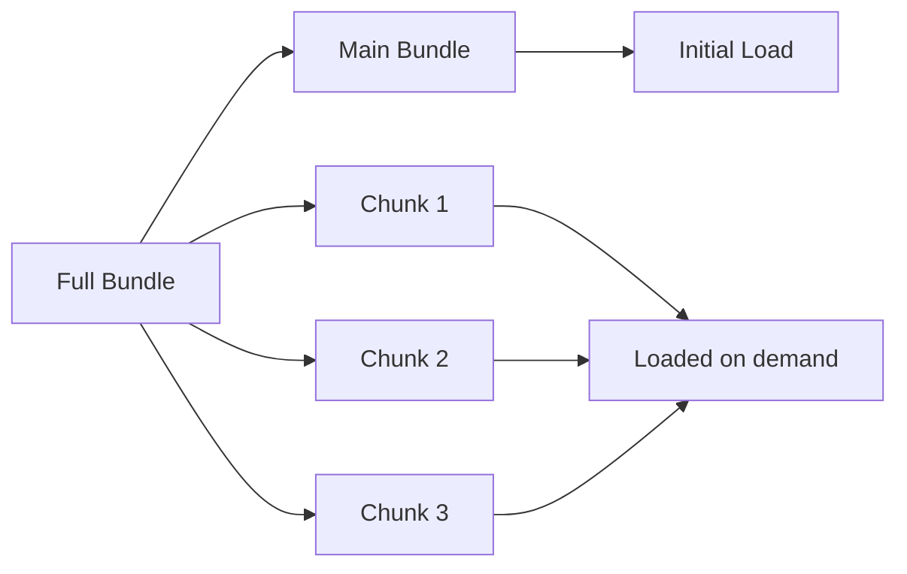

# React Code Splitting

## Introduction

When building a React application, especially a large one, you may encounter performance issues as your bundle size grows. The larger your JavaScript bundle, the longer it takes to download and execute, which directly impacts your application's initial load time. This is where **code splitting** comes to the rescue.

Code splitting is a technique that allows you to split your JavaScript bundle into smaller chunks that can be loaded on demand or in parallel. Instead of loading your entire application at once, you can load only the parts that are needed for the current page or functionality.

In this guide, we'll explore how to implement code splitting in React applications and understand the benefits it brings to your application performance.

## Why Do You Need Code Splitting?

Before diving into the implementation, let's understand why code splitting is essential:

1. **Faster Initial Load**: Only load the code necessary for the initial render
2. **Reduced Bundle Size**: Break down a large bundle into smaller ones
3. **Improved Performance**: Lower memory usage and faster parsing time
4. **Better User Experience**: Users don't wait for code they might not use

Here's a visual representation of how code splitting works:



## Basic Code Splitting with `import()`

The most simple way to implement code splitting in any JavaScript application is using dynamic `import()` syntax, which is a part of ECMAScript and is supported by webpack.

Here's a basic example:

```jsx
// Without code splitting
import { expensiveFunction } from './expensiveModule';

function App() {
  const handleClick = () => {
    const result = expensiveFunction();
    console.log(result);
  };

  return (
    <button onClick={handleClick}>Perform Calculation</button>
  );
}
```

With code splitting, you can load the module dynamically when it's needed:

```jsx
// With code splitting
function App() {
  const handleClick = async () => {
    // This module will be loaded only when the button is clicked
    const module = await import('./expensiveModule');
    const result = module.expensiveFunction();
    console.log(result);
  };

  return (
    <button onClick={handleClick}>Perform Calculation</button>
  );
}
```

In this example, `expensiveModule.js` will only be loaded when the user clicks the button, not during the initial page load.

## React.lazy and Suspense

React provides built-in support for code splitting through the `React.lazy` function and `Suspense` component. This approach is specifically designed for component-based code splitting in React applications.

### Using React.lazy

`React.lazy` takes a function that calls a dynamic `import()` and returns a Promise that resolves to a module with a default export containing a React component.

Here's how to use it:

```jsx
import React, { Suspense } from 'react';

// Instead of importing normally
// import ExpensiveComponent from './ExpensiveComponent';

// Use React.lazy to import the component
const ExpensiveComponent = React.lazy(() => import('./ExpensiveComponent'));

function App() {
  return (
    <div>
      <h1>My App</h1>
      <Suspense fallback={<div>Loading...</div>}>
        <ExpensiveComponent />
      </Suspense>
    </div>
  );
}
```

In this example:

1. `ExpensiveComponent` will be loaded only when it's rendered
2. The `Suspense` component displays a loading indicator while the component is being loaded
3. Once loaded, the component will be rendered as usual

### Error Boundaries with Lazy Loading

When loading components dynamically, things might go wrong (network issues, etc.). You can handle these errors using an Error Boundary:

```jsx
import React, { Suspense } from 'react';
import ErrorBoundary from './ErrorBoundary';

const LazyComponent = React.lazy(() => import('./LazyComponent'));

function App() {
  return (
    <ErrorBoundary>
      <Suspense fallback={<div>Loading...</div>}>
        <LazyComponent />
      </Suspense>
    </ErrorBoundary>
  );
}
```

Here's a simple Error Boundary implementation:

```jsx
class ErrorBoundary extends React.Component {
  constructor(props) {
    super(props);
    this.state = { hasError: false };
  }

  static getDerivedStateFromError(error) {
    return { hasError: true };
  }

  componentDidCatch(error, errorInfo) {
    console.error("Component failed to load:", error, errorInfo);
  }

  render() {
    if (this.state.hasError) {
      return <h2>Something went wrong. Please try again later.</h2>;
    }

    return this.props.children;
  }
}
```

## Route-Based Code Splitting

One of the most common and effective patterns for code splitting is to split by routes. This ensures that each page loads only the code it needs.

### With React Router

Here's how you can implement route-based code splitting with React Router:

```jsx
import React, { Suspense, lazy } from 'react';
import { BrowserRouter as Router, Routes, Route } from 'react-router-dom';

// Lazy load route components
const Home = lazy(() => import('./routes/Home'));
const About = lazy(() => import('./routes/About'));
const UserProfile = lazy(() => import('./routes/UserProfile'));

function App() {
  return (
    <Router>
      <Suspense fallback={<div>Loading page...</div>}>
        <Routes>
          <Route path="/" element={<Home />} />
          <Route path="/about" element={<About />} />
          <Route path="/user/:id" element={<UserProfile />} />
        </Routes>
      </Suspense>
    </Router>
  );
}
```

In this example, each route component will be loaded only when the user navigates to that route. The main bundle remains smaller, improving the initial load time.

## Component-Based Code Splitting

Sometimes, you might want to split your code at the component level, especially for components that are:

1. Large and complex
2. Not needed on the initial render
3. Only shown conditionally (modals, tabs, etc.)

Here's an example of a modal that's loaded only when needed:

```jsx
import React, { useState, lazy, Suspense } from 'react';

// Lazy load the heavy modal component
const HeavyModal = lazy(() => import('./HeavyModal'));

function App() {
  const [showModal, setShowModal] = useState(false);

  return (
    <div>
      <h1>My Application</h1>
      <button onClick={() => setShowModal(true)}>Open Modal</button>
      
      {showModal && (
        <Suspense fallback={<div>Loading modal...</div>}>
          <HeavyModal onClose={() => setShowModal(false)} />
        </Suspense>
      )}
    </div>
  );
}
```

## Advanced Patterns

### Preloading Components

Sometimes you might want to preload a component before it's actually rendered. For example, you might want to start loading a component when a user hovers over a button that will eventually render that component.

```jsx
import React, { useState, lazy, Suspense } from 'react';

// Define the lazy component
const HeavyComponent = lazy(() => import('./HeavyComponent'));

function App() {
  const [showComponent, setShowComponent] = useState(false);
  
  // Preload the component when the user hovers
  const handleMouseOver = () => {
    // This will start loading the component
    import('./HeavyComponent');
  };

  return (
    <div>
      <button 
        onMouseOver={handleMouseOver}
        onClick={() => setShowComponent(true)}
      >
        Show Heavy Component
      </button>
      
      {showComponent && (
        <Suspense fallback={<div>Loading...</div>}>
          <HeavyComponent />
        </Suspense>
      )}
    </div>
  );
}
```

### Named Exports with React.lazy

React.lazy only supports default exports, but you can work around this for named exports:

```jsx
// Instead of:
// const { NamedComponent } = React.lazy(() => import('./Components'));

// Use this pattern for named exports:
const NamedComponent = React.lazy(() => 
  import('./Components').then(module => ({ default: module.NamedComponent }))
);
```

## Real-World Example: Dashboard Application

Let's look at a more comprehensive example of a dashboard application that utilizes code splitting effectively:

```jsx
import React, { Suspense, lazy, useState } from 'react';
import { BrowserRouter as Router, Routes, Route, Link } from 'react-router-dom';
import './App.css';

// Common components loaded with the main bundle
import Header from './components/Header';
import Sidebar from './components/Sidebar';
import LoadingSpinner from './components/LoadingSpinner';

// Lazy-loaded route components
const Dashboard = lazy(() => import('./pages/Dashboard'));
const Analytics = lazy(() => import('./pages/Analytics'));
const Settings = lazy(() => import('./pages/Settings'));

// Lazy-loaded feature components
const UserProfile = lazy(() => import('./features/UserProfile'));
const Notifications = lazy(() => import('./features/Notifications'));

function App() {
  const [showProfile, setShowProfile] = useState(false);
  const [showNotifications, setShowNotifications] = useState(false);

  return (
    <Router>
      <div className="app-container">
        <Header 
          onProfileClick={() => setShowProfile(true)}
          onNotificationsClick={() => setShowNotifications(true)} 
        />
        
        <div className="main-content">
          <Sidebar />
          
          <div className="page-content">
            <Suspense fallback={<LoadingSpinner />}>
              <Routes>
                <Route path="/" element={<Dashboard />} />
                <Route path="/analytics" element={<Analytics />} />
                <Route path="/settings" element={<Settings />} />
              </Routes>
            </Suspense>
          </div>
        </div>
        
        {showProfile && (
          <Suspense fallback={<LoadingSpinner />}>
            <UserProfile onClose={() => setShowProfile(false)} />
          </Suspense>
        )}
        
        {showNotifications && (
          <Suspense fallback={<LoadingSpinner />}>
            <Notifications onClose={() => setShowNotifications(false)} />
          </Suspense>
        )}
      </div>
    </Router>
  );
}

export default App;
```

In this example:

1. Core components (Header, Sidebar) are loaded with the main bundle
2. Each page (Dashboard, Analytics, Settings) is loaded only when navigating to that route
3. Feature components (UserProfile, Notifications) are loaded only when the user triggers them
4. Each Suspense boundary has an appropriate loading indicator

## Best Practices

Here are some best practices for using code splitting effectively:

1. **Split at Natural Boundaries**: Routes, tabs, modals, and other logical boundaries make good split points
2. **Avoid Over-Splitting**: Don't split every component; focus on large components or rarely used features
3. **Group Related Components**: Sometimes it makes sense to bundle related components together
4. **Use Analytics**: Measure load times and user patterns to identify where code splitting would help most
5. **Consider User Experience**: Use meaningful loading states to improve perceived performance
6. **Test on Real Devices**: Test your code-split application on various devices and network conditions

## Common Pitfalls

Watch out for these common issues when implementing code splitting:

1. **Too Many Small Chunks**: Creating too many small chunks can actually degrade performance due to the overhead of multiple network requests
2. **Missing Suspense Boundaries**: Always wrap lazy-loaded components in a Suspense
3. **Forgetting Error Boundaries**: Network failures can happen; always handle possible errors
4. **Layout Shifts**: Large layout shifts during loading can disrupt user experience

## Tools and Analysis

To analyze your bundle and make informed code-splitting decisions, consider using:

1. **Webpack Bundle Analyzer**: Visualize the size of webpack output files
2. **Lighthouse**: Analyze page performance, including time to interactive
3. **React Developer Tools**: Profiler can help identify components that are slowing down rendering
4. **Chrome DevTools**: Network tab helps monitor chunk loading

## Summary

Code splitting is a powerful technique to improve the performance of your React applications by reducing the initial load time and only loading code when it's needed. We've covered:

1. Basic code splitting with dynamic `import()`
2. React's built-in support with `React.lazy` and `Suspense`
3. Route-based code splitting with React Router
4. Component-based code splitting for features like modals
5. Advanced patterns like preloading components
6. A real-world example of a dashboard application

By applying these techniques, you can significantly improve the performance and user experience of your React applications, especially for users on slower connections or less powerful devices.

## Additional Resources

- [React Documentation on Code Splitting](https://reactjs.org/docs/code-splitting.html)
- [Webpack Code Splitting Guide](https://webpack.js.org/guides/code-splitting/)
- [Suspense for Data Fetching (Experimental)](https://reactjs.org/docs/concurrent-mode-suspense.html)

## Exercises

1. Identify components in an existing project that would benefit from code splitting
2. Implement route-based code splitting in a small React application
3. Create a modal component that uses code splitting
4. Experiment with preloading components based on user interactions
5. Use the Webpack Bundle Analyzer to identify large dependencies in your application

By incorporating code splitting into your development workflow, you're taking an important step toward building more performant React applications.