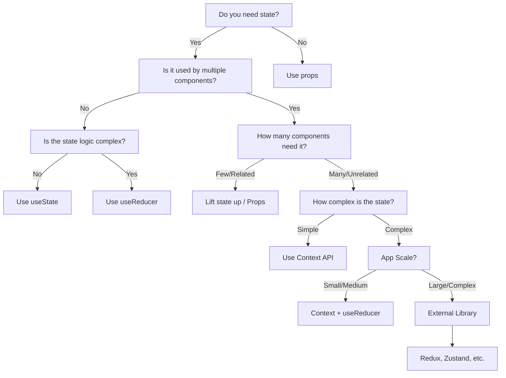

# React State Management Strategies

## Introduction

State management is a fundamental concept in React that allows your components to create and manage their own data. As your application grows, managing state effectively becomes increasingly important and potentially complex. This guide will walk you through various state management strategies in React, from built-in solutions to third-party libraries, helping you choose the right approach for your specific use case.

## Why State Management Matters

Before diving into specific strategies, let's understand why proper state management is crucial:

1. **Application Predictability**: Well-organized state makes your application behavior more predictable
2. **Debugging Efficiency**: Easier to track down issues when state changes are properly managed
3. **Performance Optimization**: Prevents unnecessary re-renders and improves application speed
4. **Code Maintenance**: Makes your codebase more maintainable as it scales

## Local State Management

### useState Hook

The `useState` hook is the simplest form of state management in React, perfect for component-specific state.

```jsx
import React, { useState } from 'react';

function Counter() {
  // Declare a state variable named "count" with initial value of 0
  const [count, setCount] = useState(0);
  
  return (
    <div>
      <p>You clicked {count} times</p>
      <button onClick={() => setCount(count + 1)}>
        Click me
      </button>
    </div>
  );
}
```

**When to use**: For simple component-local state that doesn't need to be shared across many components.

### useReducer Hook

For more complex state logic, `useReducer` provides a Redux-like approach but contained within a component.

```jsx
import React, { useReducer } from 'react';

// Reducer function
function counterReducer(state, action) {
  switch (action.type) {
    case 'INCREMENT':
      return { count: state.count + 1 };
    case 'DECREMENT':
      return { count: state.count - 1 };
    case 'RESET':
      return { count: 0 };
    default:
      throw new Error(`Unsupported action type: ${action.type}`);
  }
}

function CounterWithReducer() {
  // Initialize state with reducer
  const [state, dispatch] = useReducer(counterReducer, { count: 0 });
  
  return (
    <div>
      <p>Count: {state.count}</p>
      <button onClick={() => dispatch({ type: 'INCREMENT' })}>+</button>
      <button onClick={() => dispatch({ type: 'DECREMENT' })}>-</button>
      <button onClick={() => dispatch({ type: 'RESET' })}>Reset</button>
    </div>
  );
}
```

**When to use**: When state transitions are more complex or when the next state depends on the previous state.

## Sharing State Between Components

### Prop Drilling

The simplest approach to share state is passing it down through props:

```jsx
import React, { useState } from 'react';

function ParentComponent() {
  const [user, setUser] = useState({ name: 'John', age: 25 });
  
  return (
    <div>
      <h1>Parent Component</h1>
      <ChildComponent user={user} updateUser={setUser} />
    </div>
  );
}

function ChildComponent({ user, updateUser }) {
  return (
    <div>
      <h2>Child Component</h2>
      <GrandchildComponent user={user} updateUser={updateUser} />
    </div>
  );
}

function GrandchildComponent({ user, updateUser }) {
  return (
    <div>
      <h3>Grandchild Component</h3>
      <p>User: {user.name}, {user.age} years old</p>
      <button onClick={() => updateUser({ ...user, age: user.age + 1 })}>
        Increment Age
      </button>
    </div>
  );
}
```

**When to use**: For shallow component trees or when only a few components need the state.

**Drawbacks**: Gets unwieldy with deeply nested components (prop drilling).

### Context API

When state needs to be accessed by many components at different nesting levels, React's Context API becomes useful:

```jsx
import React, { createContext, useContext, useState } from 'react';

// Create context
const UserContext = createContext();

// Provider component
function UserProvider({ children }) {
  const [user, setUser] = useState({ name: 'John', age: 25 });
  
  const updateUser = (newUserData) => {
    setUser(newUserData);
  };
  
  return (
    <UserContext.Provider value={{ user, updateUser }}>
      {children}
    </UserContext.Provider>
  );
}

// Consumer components
function App() {
  return (
    <UserProvider>
      <Header />
      <MainContent />
    </UserProvider>
  );
}

function Header() {
  const { user } = useContext(UserContext);
  return <header>Welcome, {user.name}!</header>;
}

function MainContent() {
  return (
    <div>
      <h1>Main Content</h1>
      <UserProfile />
    </div>
  );
}

function UserProfile() {
  const { user, updateUser } = useContext(UserContext);
  
  return (
    <div>
      <h2>User Profile</h2>
      <p>Name: {user.name}</p>
      <p>Age: {user.age}</p>
      <button onClick={() => updateUser({ ...user, age: user.age + 1 })}>
        Increment Age
      </button>
    </div>
  );
}
```

**When to use**: When multiple components need access to the same state, but you don't want to pass props through many levels.

### Custom Hooks for Shared State

You can create custom hooks to encapsulate and share stateful logic across components:

```jsx
import { useState, useEffect } from 'react';

// Custom hook for managing user data
function useUser() {
  const [user, setUser] = useState(null);
  const [loading, setLoading] = useState(true);
  const [error, setError] = useState(null);
  
  useEffect(() => {
    async function fetchUser() {
      try {
        setLoading(true);
        // Simulating API call
        const response = await fetch('https://api.example.com/user');
        const data = await response.json();
        setUser(data);
        setError(null);
      } catch (err) {
        setError('Failed to fetch user');
        console.error(err);
      } finally {
        setLoading(false);
      }
    }
    
    fetchUser();
  }, []);
  
  const updateUserName = (newName) => {
    setUser(prevUser => ({ ...prevUser, name: newName }));
  };
  
  return { user, loading, error, updateUserName };
}

// Using the hook in components
function UserProfile() {
  const { user, loading, error, updateUserName } = useUser();
  
  if (loading) return <p>Loading...</p>;
  if (error) return <p>Error: {error}</p>;
  if (!user) return <p>No user data</p>;
  
  return (
    <div>
      <h2>User Profile</h2>
      <p>Name: {user.name}</p>
      <input 
        value={user.name}
        onChange={(e) => updateUserName(e.target.value)}
      />
    </div>
  );
}
```

**When to use**: When you need to share stateful logic across multiple components.

## External State Management Libraries

As applications grow, external state management libraries can provide more structured solutions.

### Redux

Redux is a predictable state container that follows a unidirectional data flow pattern.

```jsx
import React from 'react';
import { createStore } from 'redux';
import { Provider, useSelector, useDispatch } from 'react-redux';

// Define reducer
const counterReducer = (state = { count: 0 }, action) => {
  switch (action.type) {
    case 'INCREMENT':
      return { count: state.count + 1 };
    case 'DECREMENT':
      return { count: state.count - 1 };
    default:
      return state;
  }
};

// Create store
const store = createStore(counterReducer);

// Root component with Provider
function App() {
  return (
    <Provider store={store}>
      <Counter />
    </Provider>
  );
}

// Component using Redux state
function Counter() {
  // Extract data from store
  const count = useSelector(state => state.count);
  // Get dispatch function
  const dispatch = useDispatch();
  
  return (
    <div>
      <h1>Counter: {count}</h1>
      <button onClick={() => dispatch({ type: 'INCREMENT' })}>+</button>
      <button onClick={() => dispatch({ type: 'DECREMENT' })}>-</button>
    </div>
  );
}
```

**When to use**: For larger applications with complex state logic that's shared across many components.

### Zustand

Zustand is a lightweight state management solution that's simpler than Redux but still powerful:

```jsx
import React from 'react';
import create from 'zustand';

// Create store with Zustand
const useStore = create(set => ({
  count: 0,
  increment: () => set(state => ({ count: state.count + 1 })),
  decrement: () => set(state => ({ count: state.count - 1 })),
  reset: () => set({ count: 0 })
}));

// Component using Zustand store
function Counter() {
  const { count, increment, decrement, reset } = useStore();
  
  return (
    <div>
      <h1>Counter: {count}</h1>
      <button onClick={increment}>+</button>
      <button onClick={decrement}>-</button>
      <button onClick={reset}>Reset</button>
    </div>
  );
}
```

**When to use**: When you need global state management with minimal boilerplate.

## Choosing the Right State Management Strategy

Here's a decision flowchart to help you choose the right state management approach:



## Practical Example: Shopping Cart

Let's build a simple shopping cart to demonstrate multiple state management approaches working together:

```jsx
import React, { createContext, useContext, useReducer, useState } from 'react';

// Create context for our cart
const CartContext = createContext();

// Cart reducer
function cartReducer(state, action) {
  switch (action.type) {
    case 'ADD_ITEM':
      const existingItem = state.find(item => item.id === action.payload.id);
      if (existingItem) {
        return state.map(item => 
          item.id === action.payload.id 
            ? { ...item, quantity: item.quantity + 1 } 
            : item
        );
      }
      return [...state, { ...action.payload, quantity: 1 }];
      
    case 'REMOVE_ITEM':
      return state.filter(item => item.id !== action.payload);
      
    case 'UPDATE_QUANTITY':
      return state.map(item => 
        item.id === action.payload.id 
          ? { ...item, quantity: action.payload.quantity } 
          : item
      );
      
    case 'CLEAR_CART':
      return [];
      
    default:
      return state;
  }
}

// Cart Provider component
function CartProvider({ children }) {
  const [cart, dispatch] = useReducer(cartReducer, []);
  
  return (
    <CartContext.Provider value={{ cart, dispatch }}>
      {children}
    </CartContext.Provider>
  );
}

// Custom hook to use the cart
function useCart() {
  const context = useContext(CartContext);
  if (!context) {
    throw new Error('useCart must be used within a CartProvider');
  }
  return context;
}

// Product list component (using local state)
function ProductList() {
  const [products] = useState([
    { id: 1, name: 'Laptop', price: 999 },
    { id: 2, name: 'Headphones', price: 99 },
    { id: 3, name: 'Keyboard', price: 59 },
  ]);
  
  const { dispatch } = useCart();
  
  const addToCart = (product) => {
    dispatch({ type: 'ADD_ITEM', payload: product });
  };
  
  return (
    <div>
      <h2>Products</h2>
      <ul>
        {products.map(product => (
          <li key={product.id}>
            {product.name} - ${product.price}
            <button onClick={() => addToCart(product)}>Add to Cart</button>
          </li>
        ))}
      </ul>
    </div>
  );
}

// Cart component (using context)
function Cart() {
  const { cart, dispatch } = useCart();
  
  const removeItem = (id) => {
    dispatch({ type: 'REMOVE_ITEM', payload: id });
  };
  
  const updateQuantity = (id, quantity) => {
    if (quantity < 1) {
      removeItem(id);
      return;
    }
    dispatch({ type: 'UPDATE_QUANTITY', payload: { id, quantity } });
  };
  
  const clearCart = () => {
    dispatch({ type: 'CLEAR_CART' });
  };
  
  const totalPrice = cart.reduce((total, item) => 
    total + item.price * item.quantity, 0
  );
  
  return (
    <div>
      <h2>Shopping Cart</h2>
      {cart.length === 0 ? (
        <p>Your cart is empty</p>
      ) : (
        <>
          <ul>
            {cart.map(item => (
              <li key={item.id}>
                {item.name} - ${item.price} x 
                <input 
                  type="number" 
                  min="1" 
                  value={item.quantity}
                  onChange={(e) => updateQuantity(item.id, parseInt(e.target.value))}
                  style={{ width: '40px', marginLeft: '5px' }}
                />
                <button onClick={() => removeItem(item.id)}>Remove</button>
              </li>
            ))}
          </ul>
          <p><strong>Total: ${totalPrice.toFixed(2)}</strong></p>
          <button onClick={clearCart}>Clear Cart</button>
        </>
      )}
    </div>
  );
}

// App component combining everything
function ShoppingApp() {
  // This app uses multiple state management techniques:
  // 1. Local state (useState) for products
  // 2. Context API for sharing cart state
  // 3. useReducer for complex cart logic
  return (
    <CartProvider>
      <div className="shopping-app">
        <h1>Shopping Application</h1>
        <div style={{ display: 'flex', justifyContent: 'space-between' }}>
          <ProductList />
          <Cart />
        </div>
      </div>
    </CartProvider>
  );
}
```

In this example:
- We use Context API to make cart state available throughout the application
- We use useReducer to handle complex cart state logic
- We use local state (useState) for the product list
- We create a custom hook (useCart) to access cart state easily

## Best Practices

1. **Start Simple**: Begin with the simplest solution (useState, props) and scale up as needed.
2. **Colocation**: Keep state as close as possible to where it's used.
3. **Avoid Over-Engineering**: Don't use Redux or other complex libraries for small applications.
4. **Think About Performance**: Memoize expensive calculations with useMemo/useCallback.
5. **Single Source of Truth**: Avoid duplicating state across different stores or contexts.
6. **Custom Hooks**: Extract reusable stateful logic into custom hooks.
7. **Document Your Choices**: Make your state management decisions clear for other developers.

## Summary

React offers multiple ways to manage state, each with its own strengths and use cases:

- **Local Component State**: useState and useReducer
- **Cross-Component State**: Prop drilling, Context API, and custom hooks
- **Global State**: Context API with useReducer or external libraries like Redux and Zustand

The right approach depends on your application's size, complexity, and specific requirements. As your application grows, you might use multiple strategies together, keeping simple state local and sharing more complex state through contexts or global stores.

## Additional Resources

For further study, consider exploring:

1. [React Official Documentation on Hooks](https://reactjs.org/docs/hooks-intro.html)
2. [Redux Documentation](https://redux.js.org/)
3. [Zustand GitHub Repository](https://github.com/pmndrs/zustand)
4. [React Context API Documentation](https://reactjs.org/docs/context.html)

## Exercises

1. **Basic**: Create a counter app using three different state management approaches: useState, useReducer, and Context API.
2. **Intermediate**: Implement a to-do list with features like adding, editing, completing, and filtering tasks using the Context API and useReducer.
3. **Advanced**: Build a small e-commerce application with product listings, cart functionality, and a checkout process using Redux or Zustand.

By practicing these different approaches, you'll develop an intuitive sense of when to use each state management strategy in your React applications.