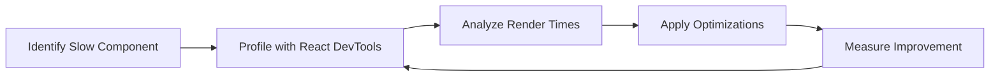

# React Performance Checklist

Performance optimization is a critical aspect of building production-grade React applications. When your app grows in complexity, it can become slow and unresponsive if not optimized properly. This guide provides a comprehensive checklist to help you identify and fix performance bottlenecks in your React applications.

## Why React Performance Matters

React is already quite fast out of the box. However, as your application grows, unnecessary re-renders, inefficient data fetching, and large bundle sizes can significantly degrade user experience. Optimizing your React application can lead to:

- Faster page load times
- Smoother user interactions
- Lower bounce rates
- Better SEO rankings
- Improved conversion rates

## Performance Optimization Checklist

### 1. Prevent Unnecessary Re-renders

React's virtual DOM helps minimize costly DOM operations, but each component render still requires computational resources. Here's how to prevent unnecessary re-renders:

#### Use React.memo for Function Components

`React.memo` is a higher-order component that memoizes your component, preventing re-renders if props haven't changed.

```jsx
import React from 'react';

// Without memoization - will re-render on every parent render
function UserProfile({ name, email }) {
  console.log('UserProfile rendered');
  return (
    <div className="profile">
      <h2>{name}</h2>
      <p>{email}</p>
    </div>
  );
}

// With memoization - only re-renders when props change
const MemoizedUserProfile = React.memo(UserProfile);

export default MemoizedUserProfile;
```

#### Use PureComponent for Class Components

`PureComponent` automatically implements `shouldComponentUpdate` with a shallow props and state comparison.

```jsx
import React, { PureComponent } from 'react';

// PureComponent only re-renders when props or state actually change
class UserProfile extends PureComponent {
  render() {
    console.log('UserProfile rendered');
    return (
      <div className="profile">
        <h2>{this.props.name}</h2>
        <p>{this.props.email}</p>
      </div>
    );
  }
}

export default UserProfile;
```

#### Implement shouldComponentUpdate

For complex components, implement your own comparison logic:

```jsx
import React, { Component } from 'react';

class ComplexList extends Component {
  shouldComponentUpdate(nextProps, nextState) {
    // Only re-render if the list items have changed
    return this.props.items.length !== nextProps.items.length || 
           JSON.stringify(this.props.items) !== JSON.stringify(nextProps.items);
  }
  
  render() {
    console.log('ComplexList rendered');
    return (
      <ul>
        {this.props.items.map(item => (
          <li key={item.id}>{item.name}</li>
        ))}
      </ul>
    );
  }
}
```

### 2. Optimize State Management

Poor state management can trigger unnecessary renders throughout your component tree.

#### Keep State as Local as Possible

State that only affects a specific component should be kept in that component, not in a global store:

```jsx
// Bad: Global state for component-specific data
function App() {
  const [isModalOpen, setIsModalOpen] = useState(false);
  
  return (
    <div>
      <Header />
      <Content />
      <Footer openModal={() => setIsModalOpen(true)} />
      <Modal isOpen={isModalOpen} onClose={() => setIsModalOpen(false)} />
    </div>
  );
}

// Good: Local state for component-specific data
function App() {
  return (
    <div>
      <Header />
      <Content />
      <Footer />
      <ModalWrapper />
    </div>
  );
}

function ModalWrapper() {
  const [isModalOpen, setIsModalOpen] = useState(false);
  
  return (
    <>
      <button onClick={() => setIsModalOpen(true)}>Open Modal</button>
      <Modal isOpen={isModalOpen} onClose={() => setIsModalOpen(false)} />
    </>
  );
}
```

#### Use Context API Wisely

Wrap context providers around only the components that need them:

```jsx
function App() {
  return (
    <div>
      <Header />
      {/* Only ContentSection needs ThemeContext */}
      <ThemeProvider>
        <ContentSection />
      </ThemeProvider>
      <Footer />
    </div>
  );
}
```

### 3. Memoize Expensive Calculations

Use `useMemo` to avoid recalculating expensive values on every render:

```jsx
import React, { useMemo, useState } from 'react';

function DataGrid({ items, filter }) {
  // This filtered list will only be recalculated when items or filter changes
  const filteredItems = useMemo(() => {
    console.log('Filtering items - expensive operation');
    return items.filter(item => item.name.includes(filter));
  }, [items, filter]);
  
  return (
    <ul>
      {filteredItems.map(item => (
        <li key={item.id}>{item.name}</li>
      ))}
    </ul>
  );
}
```

### 4. Optimize Event Handlers with useCallback

Memoize event handlers to prevent unnecessary renders in child components:

```jsx
import React, { useCallback, useState } from 'react';

function ParentComponent() {
  const [count, setCount] = useState(0);
  
  // Without useCallback, this function is recreated on every render
  // const handleClick = () => {
  //   console.log('Button clicked');
  // };
  
  // With useCallback, this function is memoized
  const handleClick = useCallback(() => {
    console.log('Button clicked');
    setCount(c => c + 1);
  }, []);
  
  return (
    <div>
      <p>Count: {count}</p>
      <ExpensiveChild onClick={handleClick} />
    </div>
  );
}

// This component uses React.memo to prevent unnecessary renders
const ExpensiveChild = React.memo(({ onClick }) => {
  console.log('ExpensiveChild rendered');
  return <button onClick={onClick}>Click me</button>;
});
```

### 5. Implement Code Splitting

Large bundle sizes can slow down your application's initial load time. Split your code into smaller chunks that load on demand:

#### Route-Based Code Splitting

```jsx
import React, { Suspense, lazy } from 'react';
import { BrowserRouter as Router, Routes, Route } from 'react-router-dom';

// Instead of importing components directly
// import Home from './pages/Home';
// import Dashboard from './pages/Dashboard';
// import Profile from './pages/Profile';

// Lazy load components
const Home = lazy(() => import('./pages/Home'));
const Dashboard = lazy(() => import('./pages/Dashboard'));
const Profile = lazy(() => import('./pages/Profile'));

function App() {
  return (
    <Router>
      <Suspense fallback={<div>Loading...</div>}>
        <Routes>
          <Route path="/" element={<Home />} />
          <Route path="/dashboard" element={<Dashboard />} />
          <Route path="/profile" element={<Profile />} />
        </Routes>
      </Suspense>
    </Router>
  );
}
```

#### Component-Based Code Splitting

```jsx
import React, { Suspense, lazy, useState } from 'react';

// Lazy load a complex component
const HeavyChart = lazy(() => import('./components/HeavyChart'));

function Dashboard() {
  const [showChart, setShowChart] = useState(false);
  
  return (
    <div>
      <h1>Dashboard</h1>
      <button onClick={() => setShowChart(true)}>Load Chart</button>
      
      {showChart && (
        <Suspense fallback={<div>Loading chart...</div>}>
          <HeavyChart />
        </Suspense>
      )}
    </div>
  );
}
```

### 6. Virtualize Long Lists

When rendering long lists, only render the items that are currently visible in the viewport:

```jsx
import React from 'react';
import { FixedSizeList } from 'react-window';

function VirtualizedList({ items }) {
  // Render function for each list item
  const Row = ({ index, style }) => (
    <div style={style} className="list-item">
      {items[index].name}
    </div>
  );
  
  return (
    <FixedSizeList
      height={400}
      width="100%"
      itemCount={items.length}
      itemSize={50}
    >
      {Row}
    </FixedSizeList>
  );
}

// Usage
function App() {
  const items = Array(10000).fill().map((_, i) => ({ id: i, name: `Item ${i}` }));
  
  return (
    <div className="app">
      <h1>Virtualized List Demo</h1>
      <VirtualizedList items={items} />
    </div>
  );
}
```

### 7. Optimize Images and Assets

Large images and assets can significantly impact your app's performance:

#### Use Next-Gen Image Formats

```jsx
function ProductCard({ product }) {
  return (
    <div className="card">
      <picture>
        <source srcSet={product.image.webp} type="image/webp" />
        <source srcSet={product.image.jpg} type="image/jpeg" />
        
      </picture>
      <h3>{product.name}</h3>
      <p>${product.price}</p>
    </div>
  );
}
```

### 8. Implement Caching for API Calls

Avoid unnecessary network requests by caching API results:

```jsx
import React, { useState, useEffect } from 'react';

// Simple cache implementation
const cache = new Map();

function UserProfile({ userId }) {
  const [user, setUser] = useState(null);
  const [loading, setLoading] = useState(true);
  
  useEffect(() => {
    const fetchUser = async () => {
      setLoading(true);
      
      // Check if data is in cache
      if (cache.has(userId)) {
        console.log('Using cached data');
        setUser(cache.get(userId));
        setLoading(false);
        return;
      }
      
      // Fetch data if not in cache
      try {
        const response = await fetch(`https://api.example.com/users/${userId}`);
        const userData = await response.json();
        
        // Store in cache
        cache.set(userId, userData);
        setUser(userData);
      } catch (error) {
        console.error('Error fetching user data:', error);
      } finally {
        setLoading(false);
      }
    };
    
    fetchUser();
  }, [userId]);
  
  if (loading) return <div>Loading...</div>;
  if (!user) return <div>Error loading user</div>;
  
  return (
    <div className="user-profile">
      <h2>{user.name}</h2>
      <p>{user.email}</p>
    </div>
  );
}
```

### 9. Use Web Workers for CPU-Intensive Tasks

Move CPU-intensive operations off the main thread:

```jsx
import React, { useState } from 'react';

// Assume we have a web worker file: worker.js
function DataProcessor() {
  const [result, setResult] = useState(null);
  const [processing, setProcessing] = useState(false);
  
  const processData = () => {
    setProcessing(true);
    
    // Create a web worker
    const worker = new Worker('/worker.js');
    
    // Listen for messages from the worker
    worker.onmessage = (event) => {
      setResult(event.data);
      setProcessing(false);
      worker.terminate(); // Clean up when done
    };
    
    // Send data to the worker
    worker.postMessage({
      action: 'PROCESS_DATA',
      payload: largeDataset
    });
  };
  
  return (
    <div>
      <button onClick={processData} disabled={processing}>
        {processing ? 'Processing...' : 'Process Data'}
      </button>
      {result && (
        <div>
          <h3>Result:</h3>
          <pre>{JSON.stringify(result, null, 2)}</pre>
        </div>
      )}
    </div>
  );
}
```

### 10. Use Performance Profiling Tools

React DevTools include a Profiler tab that helps identify performance issues:



## Real-World Optimization Example

Let's combine several techniques to optimize a product list page:

```jsx
import React, { useState, useCallback, useMemo, Suspense, lazy } from 'react';
import { FixedSizeList } from 'react-window';

// Lazy-loaded components
const ProductFilters = lazy(() => import('./ProductFilters'));
const ProductDetails = lazy(() => import('./ProductDetails'));

function ProductListPage({ products: initialProducts }) {
  const [filters, setFilters] = useState({
    minPrice: 0,
    maxPrice: 1000,
    category: 'all'
  });
  const [selectedProduct, setSelectedProduct] = useState(null);
  
  // Memoized filtering - expensive calculation
  const filteredProducts = useMemo(() => {
    console.log('Filtering products');
    return initialProducts.filter(product => {
      return (
        product.price >= filters.minPrice &&
        product.price <= filters.maxPrice &&
        (filters.category === 'all' || product.category === filters.category)
      );
    });
  }, [initialProducts, filters.minPrice, filters.maxPrice, filters.category]);
  
  // Memoized callback for filter changes
  const handleFilterChange = useCallback((newFilters) => {
    setFilters(prev => ({ ...prev, ...newFilters }));
  }, []);
  
  // Memoized callback for product selection
  const handleProductSelect = useCallback((product) => {
    setSelectedProduct(product);
  }, []);
  
  // Row renderer for virtualized list
  const Row = useCallback(({ index, style }) => {
    const product = filteredProducts[index];
    return (
      <div 
        style={style} 
        className="product-item"
        onClick={() => handleProductSelect(product)}
      >
        
        <div className="product-info">
          <h3>{product.name}</h3>
          <p>${product.price}</p>
        </div>
      </div>
    );
  }, [filteredProducts, handleProductSelect]);
  
  return (
    <div className="product-page">
      <h1>Products ({filteredProducts.length})</h1>
      
      {/* Lazy loaded filters */}
      <Suspense fallback={<div>Loading filters...</div>}>
        <ProductFilters 
          filters={filters}
          onFilterChange={handleFilterChange}
        />
      </Suspense>
      
      {/* Virtualized list of products */}
      <div className="product-list-container">
        <FixedSizeList
          height={600}
          width="100%"
          itemCount={filteredProducts.length}
          itemSize={80}
        >
          {Row}
        </FixedSizeList>
      </div>
      
      {/* Lazy loaded product details */}
      {selectedProduct && (
        <Suspense fallback={<div>Loading details...</div>}>
          <ProductDetails 
            product={selectedProduct}
            onClose={() => setSelectedProduct(null)}
          />
        </Suspense>
      )}
    </div>
  );
}

// Memoize the entire component to prevent unnecessary renders
export default React.memo(ProductListPage);
```

This example combines multiple performance optimization strategies:
- Code splitting with lazy loading
- Memoization with useMemo for expensive calculations
- Callback memoization with useCallback
- List virtualization with react-window
- Lazy loading for images
- Component memoization with React.memo

## Performance Testing Tools

To properly measure your application's performance, consider using these tools:

1. **React DevTools Profiler**: Visualize component render times
2. **Lighthouse**: Overall web performance metrics
3. **Chrome Performance tab**: In-depth performance analysis
4. **web-vitals library**: Measure Core Web Vitals in production
5. **Bundle analyzers**: Visualize your bundle size

## Summary

Optimizing React applications requires a multi-faceted approach:

1. **Prevent unnecessary re-renders** with React.memo, PureComponent, and shouldComponentUpdate
2. **Optimize state management** by keeping state local and using Context wisely
3. **Memoize expensive calculations** with useMemo
4. **Optimize event handlers** with useCallback
5. **Implement code splitting** for smaller bundle sizes
6. **Virtualize long lists** to reduce DOM nodes
7. **Optimize images and assets** for faster loading
8. **Implement caching** for API calls
9. **Use Web Workers** for CPU-intensive tasks
10. **Profile your application** to identify bottlenecks

Remember that premature optimization is the root of all evil. Start with a working application, identify performance issues, and then apply these techniques where needed.

## Additional Resources

- [React Documentation - Optimizing Performance](https://reactjs.org/docs/optimizing-performance.html)
- [Web Vitals](https://web.dev/vitals/)
- [React Profiler API](https://reactjs.org/docs/profiler.html)
- [JavaScript Performance Guide](https://developer.mozilla.org/en-US/docs/Web/Performance)

## Exercises

1. Profile a simple React application and identify components that are re-rendering unnecessarily
2. Implement memoization in a component with expensive calculations
3. Add code splitting to a React application using React.lazy and Suspense
4. Create a virtualized list with react-window for rendering large datasets
5. Measure the performance impact of your optimizations using React DevTools Profiler