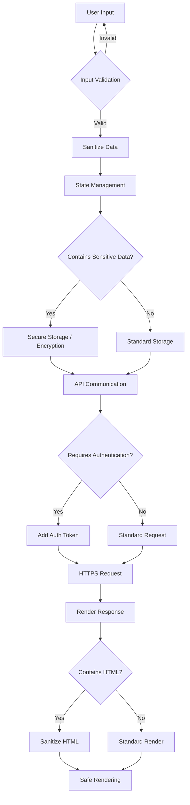

# React Security Best Practices

## Introduction

Security is a critical aspect of any web application, and React applications are no exception. As React becomes increasingly popular for building user interfaces, understanding how to secure your React applications is essential for protecting user data and maintaining application integrity.

In this guide, we'll explore common security vulnerabilities in React applications and provide practical best practices to mitigate these risks. Whether you're building a simple portfolio site or a complex enterprise application, these security measures will help safeguard your React projects against common threats.

## Why Security Matters in React Applications

React applications often handle sensitive user data, interact with APIs, and manage authentication flows. Without proper security measures, your application could be vulnerable to:

- Cross-Site Scripting (XSS) attacks
- Cross-Site Request Forgery (CSRF)
- API data exposure
- Authentication bypasses
- Sensitive data leaks
- Supply chain attacks

Let's explore how to protect your React applications from these threats.

## 1. Preventing Cross-Site Scripting (XSS)

### Understanding XSS

XSS attacks occur when malicious scripts are injected into web pages viewed by other users. In React applications, this can happen when user input is rendered without proper sanitization.

### React's Built-in XSS Protection

React has built-in XSS protection through its JSX syntax, which automatically escapes values before rendering:

```jsx
// Safe: React escapes user input automatically
function UserProfile({ username }) {
  return <div>Hello, {username}!</div>;
}

// Example usage:
// Even if username is "<script>alert('hacked')</script>"
// React will render it as text, not executable code
```

### Avoiding Dangerous JSX Practices

However, there are ways to bypass React's protection:

```jsx
// DANGEROUS: Never do this!
function Comment({ userComment }) {
  return <div dangerouslySetInnerHTML={{ __html: userComment }} />;
}
```

The `dangerouslySetInnerHTML` prop disables React's automatic escaping. Only use it when you absolutely need to render HTML content, and ensure the content is sanitized first.

### Safe Alternative: HTML Sanitization

When you need to render HTML content, use a sanitization library:

```jsx
import DOMPurify from 'dompurify';

function Comment({ userComment }) {
  const sanitizedComment = DOMPurify.sanitize(userComment);
  return <div dangerouslySetInnerHTML={{ __html: sanitizedComment }} />;
}
```

## 2. Secure State Management

### Avoid Storing Sensitive Data in State

React state is not designed to store sensitive information:

```jsx
// AVOID: Storing sensitive data in component state
function LoginForm() {
  const [password, setPassword] = useState('');
  // rest of the component
}
```

### Secure Storage Options

For sensitive data that must be stored client-side:

```jsx
// Session storage for temporary sensitive data
const storeSessionToken = (token) => {
  sessionStorage.setItem('sessionToken', token);
};

// For persistent but non-sensitive preferences
const storeUserPreference = (preference) => {
  localStorage.setItem('userPreference', preference);
}
```

Remember:
- `sessionStorage` persists only for the current session
- `localStorage` persists even after the browser is closed
- Neither should store highly sensitive data like credit card information

## 3. Secure API Communication

### Using HTTPS

Always use HTTPS endpoints for API communication:

```jsx
// GOOD: Using HTTPS for API calls
const fetchUserData = async (userId) => {
  const response = await fetch(`https://api.example.com/users/${userId}`);
  return response.json();
};
```

### Handling API Keys and Secrets

Never store API keys or secrets in your client-side code:

```jsx
// BAD: Exposing API keys in frontend code
const API_KEY = 'actual-api-key-123456'; // NEVER do this!

// GOOD: Use environment variables and server-side endpoints
const fetchData = async () => {
  // The API key remains on the server
  const response = await fetch('/api/protected-resource');
  return response.json();
};
```

For React applications, use environment variables with the `REACT_APP_` prefix:

```jsx
// Access environment variables safely
const apiBaseUrl = process.env.REACT_APP_API_BASE_URL;

// Still avoid putting actual secrets in environment variables visible to the client
```

## 4. Authentication and Authorization Best Practices

### Secure Token Storage

Store authentication tokens securely:

```jsx
// After successful login
const handleLoginSuccess = (token) => {
  // Store token in HttpOnly cookie (best done through your backend)
  // OR store in memory (not persistent across page refreshes)
  authService.setToken(token);
  
  // Don't store in localStorage
};
```

### Token Expiration and Refresh

Implement token expiration and refresh logic:

```jsx
const checkTokenExpiration = () => {
  const token = authService.getToken();
  if (token) {
    const decodedToken = decodeJwt(token); // Use a JWT decoding library
    const currentTime = Date.now() / 1000;
    
    // Check if token is about to expire (5 minutes before expiration)
    if (decodedToken.exp - currentTime < 300) {
      refreshToken();
    }
  }
};
```

### Protecting Routes

Use route protection for authenticated areas:

```jsx
import { Navigate } from 'react-router-dom';

function ProtectedRoute({ children }) {
  const isAuthenticated = authService.isAuthenticated();
  
  return isAuthenticated ? children : <Navigate to="/login" />;
}

// Usage in your routes configuration
function AppRoutes() {
  return (
    <Routes>
      <Route path="/login" element={<LoginPage />} />
      <Route 
        path="/dashboard" 
        element={
          <ProtectedRoute>
            <Dashboard />
          </ProtectedRoute>
        } 
      />
    </Routes>
  );
}
```

## 5. Content Security Policy (CSP)

### Implementing CSP

Content Security Policy helps prevent XSS and data injection attacks by specifying which resources can be loaded:

```html
<!-- In your HTML head section or server response headers -->
<meta http-equiv="Content-Security-Policy" content="default-src 'self'; script-src 'self' https://trusted-cdn.com; style-src 'self' https://trusted-styles.com; img-src 'self' data: https://trusted-images.com">
```

### React Implications

When using CSP with React:

1. Avoid inline styles when possible:

```jsx
// AVOID with strict CSP:
function Button() {
  return <button style={{ color: 'red' }}>Click Me</button>;
}

// BETTER with strict CSP:
function Button() {
  return <button className="red-button">Click Me</button>;
}
```

2. Avoid inline event handlers in strict CSP environments:

```jsx
// AVOID with strict CSP:
function Button() {
  return <button onClick={() => alert('Clicked!')}>Click Me</button>;
}

// BETTER solution: attach event listeners in useEffect
function Button() {
  const buttonRef = useRef(null);
  
  useEffect(() => {
    const currentButton = buttonRef.current;
    const handleClick = () => alert('Clicked!');
    
    currentButton.addEventListener('click', handleClick);
    
    return () => {
      currentButton.removeEventListener('click', handleClick);
    };
  }, []);
  
  return <button ref={buttonRef}>Click Me</button>;
}
```

## 6. Dependency Management

### Keeping Dependencies Updated

Outdated dependencies often contain security vulnerabilities:

```bash
# Check for vulnerable dependencies
npm audit

# Update packages
npm update

# Fix vulnerabilities
npm audit fix
```

### Using Lock Files

Always commit your lock files (`package-lock.json` or `yarn.lock`) to ensure consistent, secure installations across environments.

### Handling Third-Party Scripts

Be cautious with third-party scripts and components:

```jsx
// Consider security implications of third-party components
import ThirdPartyComponent from 'untrusted-package';

function MyApp() {
  // Could this component access sensitive data?
  return <ThirdPartyComponent userProfiles={sensitiveData} />;
}
```

## 7. Preventing Prototype Pollution

### Understanding the Risk

Prototype pollution attacks can occur when parsing untrusted JSON:

```jsx
// VULNERABLE: Direct assignment from user input
function UserSettings({ userPreferences }) {
  const settings = { ...defaultSettings, ...JSON.parse(userPreferences) };
  // settings could be polluted if userPreferences contains __proto__
}
```

### Safe Object Handling

Use techniques to prevent prototype pollution:

```jsx
// SAFER: Object creation without inheriting prototype
function UserSettings({ userPreferences }) {
  // Create a clean object with no prototype
  const parsedPreferences = JSON.parse(userPreferences);
  const settings = Object.assign(
    Object.create(null), // No prototype
    defaultSettings,
    parsedPreferences
  );
}
```

## 8. Form Security

### CSRF Protection

Cross-Site Request Forgery attacks trick users into submitting requests. Protect your forms:

```jsx
function SecureForm() {
  const [csrfToken, setCsrfToken] = useState('');
  
  useEffect(() => {
    // Fetch CSRF token from your backend
    async function fetchCsrfToken() {
      const response = await fetch('/api/csrf-token');
      const data = await response.json();
      setCsrfToken(data.csrfToken);
    }
    
    fetchCsrfToken();
  }, []);
  
  const handleSubmit = async (e) => {
    e.preventDefault();
    const formData = new FormData(e.target);
    
    await fetch('/api/submit', {
      method: 'POST',
      headers: {
        'X-CSRF-Token': csrfToken
      },
      body: formData
    });
  };
  
  return (
    <form onSubmit={handleSubmit}>
      <input type="hidden" name="_csrf" value={csrfToken} />
      {/* Form fields */}
      <button type="submit">Submit</button>
    </form>
  );
}
```

### Input Validation

Always validate user input:

```jsx
function ContactForm() {
  const [email, setEmail] = useState('');
  const [emailError, setEmailError] = useState('');
  
  const validateEmail = (email) => {
    const regex = /^[^\s@]+@[^\s@]+\.[^\s@]+$/;
    if (!regex.test(email)) {
      setEmailError('Please enter a valid email address');
      return false;
    }
    setEmailError('');
    return true;
  };
  
  const handleSubmit = (e) => {
    e.preventDefault();
    if (validateEmail(email)) {
      // Continue with form submission
    }
  };
  
  return (
    <form onSubmit={handleSubmit}>
      <div>
        <label htmlFor="email">Email:</label>
        <input
          id="email"
          type="email"
          value={email}
          onChange={(e) => setEmail(e.target.value)}
          onBlur={() => validateEmail(email)}
        />
        {emailError && <p className="error">{emailError}</p>}
      </div>
      <button type="submit">Submit</button>
    </form>
  );
}
```

## Security Workflow Visualization

Here's a visual representation of a secure React application workflow:



## Summary

Securing your React applications requires a multi-layered approach. Here's a quick checklist to review:

1. ✅ Avoid using `dangerouslySetInnerHTML` without sanitization
2. ✅ Use HTTPS for all API communication
3. ✅ Never store secrets in client-side code
4. ✅ Properly handle authentication tokens
5. ✅ Implement route protection for authenticated areas
6. ✅ Add Content Security Policy headers
7. ✅ Keep dependencies updated
8. ✅ Validate and sanitize all user inputs
9. ✅ Implement CSRF protection for forms
10. ✅ Be cautious with third-party libraries

By implementing these security best practices, you'll create more robust React applications that better protect your users' data and maintain the integrity of your application.

## Additional Resources

To further improve your understanding of React security:

- **OWASP (Open Web Application Security Project)**: Provides guidelines and resources for web application security
- **React Security Documentation**: Review the official React documentation for security advice
- **npm audit**: Regularly run security audits on your dependencies
- **Content Security Policy**: Learn more about implementing effective CSP

## Practice Exercises

1. **Security Audit**: Review one of your existing React projects and identify potential security vulnerabilities.
2. **Secure Form**: Create a contact form with proper validation, sanitization, and CSRF protection.
3. **Authentication System**: Implement a secure authentication system with token management and protected routes.
4. **CSP Implementation**: Add a Content Security Policy to your React application and resolve any issues that arise.

Remember that security is an ongoing process, not a one-time implementation. Regularly review and update your security measures to protect against emerging threats.