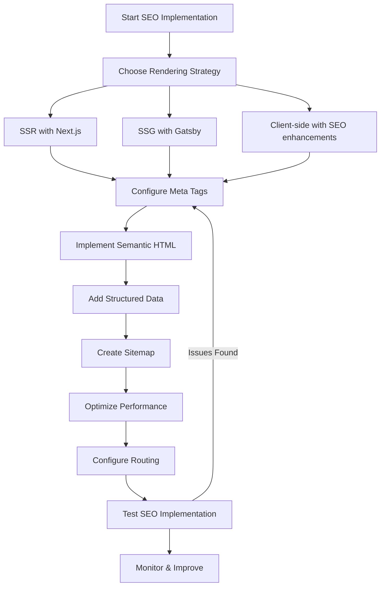

# React SEO Optimization

Search Engine Optimization (SEO) is crucial for ensuring your React application gets discovered by users through search engines. While React creates dynamic, interactive user interfaces, it can pose challenges for search engine crawlers if not properly optimized. This guide will help you implement SEO best practices in your React applications to improve visibility and ranking.

## Why SEO Matters for React Applications

React applications are single-page applications (SPAs) by default, which means they load a single HTML file and then dynamically update the content using JavaScript. This creates several SEO challenges:

1. Search engines primarily index HTML content
2. JavaScript rendering may delay content discovery
3. Dynamic routing can confuse crawlers
4. Meta tags need special handling in SPAs

Let's explore how to overcome these challenges and make your React applications SEO-friendly.

## Server-Side Rendering (SSR)

### Understanding SSR

Server-side rendering generates the full HTML for a page on the server before sending it to the client, making it immediately available to search engine crawlers.

### Implementation Options

#### Next.js

[Next.js](https://nextjs.org/) is a popular framework built on top of React that provides SSR out of the box.

```jsx
// pages/index.js in a Next.js application
function HomePage() {
  return (
    <div>
      <h1>Welcome to my SEO-friendly React site!</h1>
      <p>This page is server-rendered for better SEO.</p>
    </div>
  )
}

export default HomePage
```

#### React 18's Streaming SSR

React 18 introduced improved SSR capabilities with streaming:

```jsx
// server.js (using Express and React 18)
import { renderToPipeableStream } from 'react-dom/server';
import App from './App';

app.get('/', (req, res) => {
  const { pipe } = renderToPipeableStream(<App />, {
    bootstrapScripts: ['/client.js'],
    onShellReady() {
      res.setHeader('content-type', 'text/html');
      pipe(res);
    }
  });
});
```

## Static Site Generation (SSG)

Static site generation pre-builds all pages at build time, making them ready to serve as static HTML files.

### Using Gatsby

[Gatsby](https://www.gatsbyjs.com/) is a static site generator for React that creates pre-rendered HTML files.

```jsx
// gatsby-node.js - Creating pages programmatically
exports.createPages = async ({ graphql, actions }) => {
  const { createPage } = actions;
  const result = await graphql(`
    query {
      allMarkdownRemark {
        edges {
          node {
            frontmatter {
              slug
            }
          }
        }
      }
    }
  `);

  result.data.allMarkdownRemark.edges.forEach(({ node }) => {
    createPage({
      path: node.frontmatter.slug,
      component: require.resolve(`./src/templates/blogTemplate.js`),
      context: {
        slug: node.frontmatter.slug,
      },
    });
  });
};
```

## React Helmet for Meta Tags

React Helmet is a document head manager for React that allows you to control your document head (title, meta tags, etc.) from your components.

### Installation

```bash
npm install react-helmet
```

### Basic Usage

```jsx
import React from 'react';
import { Helmet } from 'react-helmet';

function ProductPage({ product }) {
  return (
    <div>
      <Helmet>
        <title>{product.name} - My Store</title>
        <meta name="description" content={product.description} />
        <meta property="og:title" content={product.name} />
        <meta property="og:description" content={product.description} />
        <meta property="og:image" content={product.image} />
        <link rel="canonical" href={`https://mystore.com/products/${product.slug}`} />
      </Helmet>
      
      <h1>{product.name}</h1>
      <p>{product.description}</p>
      {/* Rest of your component */}
    </div>
  );
}
```

## Dynamic Meta Tags with React Router

When using React Router, you can update meta tags based on the current route.

```jsx
import React from 'react';
import { Routes, Route } from 'react-router-dom';
import { Helmet } from 'react-helmet';
import HomePage from './pages/HomePage';
import AboutPage from './pages/AboutPage';
import ProductPage from './pages/ProductPage';

function App() {
  return (
    <>
      <Helmet>
        <html lang="en" />
        <meta charSet="utf-8" />
        <meta name="viewport" content="width=device-width, initial-scale=1" />
        {/* Default meta tags */}
        <title>My React Application</title>
        <meta name="description" content="A React application with SEO optimization" />
      </Helmet>
      
      <Routes>
        <Route path="/" element={<HomePage />} />
        <Route path="/about" element={<AboutPage />} />
        <Route path="/products/:id" element={<ProductPage />} />
      </Routes>
    </>
  );
}
```

## Implementing Semantic HTML

Using semantic HTML improves accessibility and helps search engines understand your content better.

```jsx
// Bad example
function Article() {
  return (
    <div>
      <div>My Article Title</div>
      <div>Posted on January 1, 2023</div>
      <div>
        This is the content of my article. It's very informative.
      </div>
    </div>
  );
}

// Good example with semantic HTML
function Article() {
  return (
    <article>
      <h1>My Article Title</h1>
      <time dateTime="2023-01-01">Posted on January 1, 2023</time>
      <p>
        This is the content of my article. It's very informative.
      </p>
    </article>
  );
}
```

## Adding Structured Data

Structured data helps search engines understand your content and can lead to rich search results.

```jsx
import React from 'react';
import { Helmet } from 'react-helmet';

function ProductPage({ product }) {
  const structuredData = {
    "@context": "https://schema.org/",
    "@type": "Product",
    "name": product.name,
    "description": product.description,
    "image": product.imageUrl,
    "brand": {
      "@type": "Brand",
      "name": product.brand
    },
    "offers": {
      "@type": "Offer",
      "url": `https://mystore.com/products/${product.slug}`,
      "priceCurrency": "USD",
      "price": product.price,
      "availability": product.inStock ? "https://schema.org/InStock" : "https://schema.org/OutOfStock"
    }
  };

  return (
    <div>
      <Helmet>
        <title>{product.name} - My Store</title>
        <meta name="description" content={product.description} />
        <script type="application/ld+json">
          {JSON.stringify(structuredData)}
        </script>
      </Helmet>
      
      <h1>{product.name}</h1>
      {/* Product details */}
    </div>
  );
}
```

## Creating a Sitemap

A sitemap helps search engines discover and index all your pages.

### Manual Creation

For smaller sites, you can create a static sitemap.xml file in your public directory.

```xml
<?xml version="1.0" encoding="UTF-8"?>
<urlset xmlns="http://www.sitemaps.org/schemas/sitemap/0.9">
  <url>
    <loc>https://myreactapp.com/</loc>
    <lastmod>2023-01-01</lastmod>
    <changefreq>weekly</changefreq>
    <priority>1.0</priority>
  </url>
  <url>
    <loc>https://myreactapp.com/about</loc>
    <lastmod>2023-01-01</lastmod>
    <changefreq>monthly</changefreq>
    <priority>0.8</priority>
  </url>
  <!-- More URLs -->
</urlset>
```

### Dynamic Generation

For larger applications, you can generate a sitemap programmatically:

```jsx
// sitemap-generator.js
const { SitemapStream, streamToPromise } = require('sitemap');
const { Readable } = require('stream');
const fs = require('fs');

// Define your routes
const routes = [
  { url: '/', changefreq: 'weekly', priority: 1 },
  { url: '/about', changefreq: 'monthly', priority: 0.8 },
  { url: '/products', changefreq: 'daily', priority: 0.9 },
  // Add all your routes
];

// Create a stream to write to
const stream = new SitemapStream({ hostname: 'https://myreactapp.com' });

// Return a promise that resolves with your XML string
return streamToPromise(Readable.from(routes).pipe(stream))
  .then((data) => {
    fs.writeFileSync('./public/sitemap.xml', data.toString());
    console.log('Sitemap generated!');
  })
  .catch((error) => console.error(error));
```

## Optimizing Loading Performance

Page speed is an important SEO ranking factor. Here are some techniques to improve your React app's performance:

### Code Splitting

Break your bundle into smaller chunks to reduce initial load time:

```jsx
import React, { lazy, Suspense } from 'react';
import { Routes, Route } from 'react-router-dom';

// Instead of importing directly
// import AboutPage from './pages/AboutPage';

// Use lazy loading
const HomePage = lazy(() => import('./pages/HomePage'));
const AboutPage = lazy(() => import('./pages/AboutPage'));
const ProductPage = lazy(() => import('./pages/ProductPage'));

function App() {
  return (
    <Suspense fallback={<div>Loading...</div>}>
      <Routes>
        <Route path="/" element={<HomePage />} />
        <Route path="/about" element={<AboutPage />} />
        <Route path="/products/:id" element={<ProductPage />} />
      </Routes>
    </Suspense>
  );
}
```

### Implementing Progressive Web App (PWA) Features

Create a manifest.json file in your public directory:

```json
{
  "short_name": "React App",
  "name": "My SEO-Friendly React Application",
  "icons": [
    {
      "src": "favicon.ico",
      "sizes": "64x64 32x32 24x24 16x16",
      "type": "image/x-icon"
    },
    {
      "src": "logo192.png",
      "type": "image/png",
      "sizes": "192x192"
    },
    {
      "src": "logo512.png",
      "type": "image/png",
      "sizes": "512x512"
    }
  ],
  "start_url": ".",
  "display": "standalone",
  "theme_color": "#000000",
  "background_color": "#ffffff"
}
```

## Handling Client-Side Routing for SEO

Client-side routing can lead to 404 errors when users directly access deep links. Here's how to handle it:

### Server Configuration

For Apache servers, add a .htaccess file to your public directory:

```apache
<IfModule mod_rewrite.c>
  RewriteEngine On
  RewriteBase /
  RewriteRule ^index\.html$ - [L]
  RewriteCond %{REQUEST_FILENAME} !-f
  RewriteCond %{REQUEST_FILENAME} !-d
  RewriteCond %{REQUEST_FILENAME} !-l
  RewriteRule . /index.html [L]
</IfModule>
```

For Nginx:

```nginx
location / {
  try_files $uri $uri/ /index.html;
}
```

## SEO Testing and Monitoring

### Using Google's Tools

1. Google Search Console: Register your site to monitor performance and issues
2. PageSpeed Insights: Test and improve page load times
3. Mobile-Friendly Test: Ensure your site works well on mobile devices

### Implementing Auditing Tools

Add Lighthouse to your development workflow:

```bash
npm install -g lighthouse
lighthouse https://myreactapp.com --view
```

## Real-World Example: SEO-Optimized Blog Post Component

Let's create a comprehensive blog post component that implements all the SEO best practices:

```jsx
import React from 'react';
import { Helmet } from 'react-helmet';
import { useParams } from 'react-router-dom';

function BlogPost({ posts }) {
  const { slug } = useParams();
  const post = posts.find(p => p.slug === slug);
  
  if (!post) {
    return <div>Post not found</div>;
  }
  
  const structuredData = {
    "@context": "https://schema.org",
    "@type": "BlogPosting",
    "headline": post.title,
    "datePublished": post.publishDate,
    "dateModified": post.lastUpdated,
    "author": {
      "@type": "Person",
      "name": post.author.name
    },
    "image": post.featuredImage,
    "description": post.excerpt,
    "articleBody": post.content,
    "publisher": {
      "@type": "Organization",
      "name": "My Tech Blog",
      "logo": {
        "@type": "ImageObject",
        "url": "https://mytechblog.com/logo.png"
      }
    }
  };

  return (
    <article>
      <Helmet>
        <title>{post.title} | My Tech Blog</title>
        <meta name="description" content={post.excerpt} />
        <meta property="og:type" content="article" />
        <meta property="og:title" content={post.title} />
        <meta property="og:description" content={post.excerpt} />
        <meta property="og:image" content={post.featuredImage} />
        <meta property="og:url" content={`https://mytechblog.com/blog/${post.slug}`} />
        <meta name="twitter:card" content="summary_large_image" />
        <meta name="twitter:title" content={post.title} />
        <meta name="twitter:description" content={post.excerpt} />
        <meta name="twitter:image" content={post.featuredImage} />
        <link rel="canonical" href={`https://mytechblog.com/blog/${post.slug}`} />
        <script type="application/ld+json">
          {JSON.stringify(structuredData)}
        </script>
      </Helmet>
      
      <header>
        <h1>{post.title}</h1>
        <div className="meta">
          <span className="author">By {post.author.name}</span>
          <time dateTime={post.publishDate}>
            Published on {new Date(post.publishDate).toLocaleDateString()}
          </time>
          {post.lastUpdated && (
            <time dateTime={post.lastUpdated}>
              (Updated: {new Date(post.lastUpdated).toLocaleDateString()})
            </time>
          )}
        </div>
      </header>
      
      <div className="featured-image">
        
      </div>
      
      <section className="content" dangerouslySetInnerHTML={{ __html: post.content }} />
      
      <footer>
        <div className="tags">
          {post.tags.map(tag => (
            <a href={`/tags/${tag}`} key={tag}>#{tag}</a>
          ))}
        </div>
        
        <div className="share">
          <h3>Share this post:</h3>
          <a href={`https://twitter.com/intent/tweet?url=https://mytechblog.com/blog/${post.slug}&text=${post.title}`}>
            Share on Twitter
          </a>
          <a href={`https://www.facebook.com/sharer/sharer.php?u=https://mytechblog.com/blog/${post.slug}`}>
            Share on Facebook
          </a>
          <a href={`https://www.linkedin.com/shareArticle?mini=true&url=https://mytechblog.com/blog/${post.slug}&title=${post.title}`}>
            Share on LinkedIn
          </a>
        </div>
      </footer>
    </article>
  );
}

export default BlogPost;
```

## SEO Implementation Process Flowchart



## Summary

Optimizing your React applications for search engines is critical for visibility and user acquisition. By implementing these best practices:

1. Choose an appropriate rendering strategy (SSR, SSG, or enhanced CSR)
2. Properly manage meta tags with React Helmet
3. Use semantic HTML to improve content structure
4. Implement structured data for rich results
5. Create comprehensive sitemaps
6. Optimize loading performance
7. Handle client-side routing issues
8. Test and monitor your SEO implementation

Your React applications will rank better in search engines while maintaining the interactive, dynamic user experience that React provides.

## Additional Resources

- [Google's SEO Starter Guide](https://developers.google.com/search/docs/beginner/seo-starter-guide)
- [Next.js Documentation](https://nextjs.org/docs/basic-features/pages)
- [Gatsby SEO Documentation](https://www.gatsbyjs.com/docs/how-to/adding-common-features/seo/)
- [React Helmet Documentation](https://github.com/nfl/react-helmet)
- [Web.dev Lighthouse Documentation](https://web.dev/lighthouse-seo/)

## Exercises

1. Implement React Helmet in an existing React application to manage meta tags for at least three different routes.
2. Create a basic Next.js application that leverages server-side rendering for improved SEO.
3. Add structured data to a product or article page using JSON-LD.
4. Generate a sitemap programmatically for your React application.
5. Perform a Lighthouse SEO audit on your React application and address any issues found.