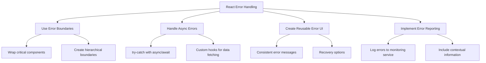

# React Error Handling

When developing React applications, things don't always go as planned. Network requests fail, props are missing, components crash, and users encounter unexpected errors. How you handle these scenarios can make the difference between a robust application that gracefully recovers from problems and one that leaves users frustrated with white screens or cryptic error messages.

In this guide, we'll explore comprehensive strategies for handling errors in React applications, from simple try-catch blocks to sophisticated error boundary components.

## Why Error Handling Matters

Before diving into implementation details, it's important to understand why proper error handling is a critical part of React best practices:

1. **Better User Experience**: Properly handled errors mean users aren't left wondering what happened
2. **Easier Debugging**: Well-structured error handling makes it easier to identify and fix issues
3. **Application Stability**: Good error handling prevents one component's failure from crashing the entire application
4. **Developer Sanity**: Clear error patterns reduce development stress and improve maintainability

## Basic JavaScript Error Handling

At the foundation of React error handling is JavaScript's built-in error handling mechanism: the `try-catch` statement.

### Using try-catch

```jsx
function fetchUserData() {
  try {
    // Code that might fail
    const response = JSON.parse(localStorage.getItem('userData'));
    return response;
  } catch (error) {
    // Handle the error
    console.error('Failed to fetch user data:', error);
    return null;
  }
}
```

This pattern is useful for synchronous operations that might throw exceptions, such as:

- Parsing JSON
- Accessing properties of potentially undefined objects
- Array operations that might fail

### Handling Async Errors

For asynchronous operations, you can use try-catch with async/await:

```jsx
async function fetchUserProfile(userId) {
  try {
    const response = await fetch(`https://api.example.com/users/${userId}`);
    
    if (!response.ok) {
      throw new Error(`HTTP error! Status: ${response.status}`);
    }
    
    const data = await response.json();
    return data;
  } catch (error) {
    console.error('Error fetching user profile:', error);
    return null;
  }
}
```

## React-Specific Error Handling

React provides specialized tools for handling errors within component trees.

### Error Boundaries

Error boundaries are React components that catch JavaScript errors anywhere in their child component tree and display a fallback UI instead of crashing the entire application.

Here's how to create a basic error boundary component:

```jsx
import React from 'react';

class ErrorBoundary extends React.Component {
  constructor(props) {
    super(props);
    this.state = { hasError: false };
  }

  static getDerivedStateFromError(error) {
    // Update state so the next render will show the fallback UI
    return { hasError: true };
  }

  componentDidCatch(error, errorInfo) {
    // You can log the error to an error reporting service
    console.error('Error caught by boundary:', error, errorInfo);
  }

  render() {
    if (this.state.hasError) {
      // You can render any custom fallback UI
      return <h2>Something went wrong. Please try again later.</h2>;
    }

    return this.props.children;
  }
}

export default ErrorBoundary;
```

Usage example:

```jsx
import ErrorBoundary from './ErrorBoundary';
import UserProfile from './UserProfile';

function App() {
  return (
    <div className="app">
      <h1>My Application</h1>
      
      {/* The error will be caught by the ErrorBoundary */}
      <ErrorBoundary>
        <UserProfile userId="123" />
      </ErrorBoundary>
      
      {/* Other parts of your application will continue to work */}
      <Footer />
    </div>
  );
}
```

#### Limitations of Error Boundaries

Error boundaries do not catch errors in:

- Event handlers
- Asynchronous code (like `setTimeout` or `requestAnimationFrame`)
- Server-side rendering
- Errors thrown in the error boundary itself

### Handling Events Errors

Since error boundaries don't catch errors in event handlers, you need to use try-catch directly:

```jsx
function ButtonWithErrorHandling() {
  const handleClick = () => {
    try {
      // Code that might fail
      someRiskyOperation();
    } catch (error) {
      console.error('Error in click handler:', error);
      // Handle the error appropriately
      alert('Something went wrong when processing your request.');
    }
  };

  return <button onClick={handleClick}>Click Me</button>;
}
```

## Advanced Error Handling Patterns

Now let's look at more sophisticated patterns for error handling in React applications.

### Creating Reusable Error Components

For a more consistent user experience, create reusable error components:

```jsx
function ErrorMessage({ message, onRetry }) {
  return (
    <div className="error-container">
      <div className="error-icon">⚠️</div>
      <h3>Oops! Something went wrong</h3>
      <p>{message || "We encountered an error. Please try again."}</p>
      {onRetry && (
        <button className="retry-button" onClick={onRetry}>
          Try Again
        </button>
      )}
    </div>
  );
}

// Usage
function UserData({ userId }) {
  const [data, setData] = useState(null);
  const [error, setError] = useState(null);
  const [loading, setLoading] = useState(true);

  const fetchData = async () => {
    try {
      setLoading(true);
      setError(null);
      const response = await fetch(`https://api.example.com/users/${userId}`);
      
      if (!response.ok) throw new Error('Failed to fetch user data');
      
      const userData = await response.json();
      setData(userData);
    } catch (err) {
      setError(err.message);
    } finally {
      setLoading(false);
    }
  };

  useEffect(() => {
    fetchData();
  }, [userId]);

  if (loading) return <div>Loading...</div>;
  if (error) return <ErrorMessage message={error} onRetry={fetchData} />;
  
  return <UserProfile data={data} />;
}
```

### Custom Hook for Async Operations

Create a custom hook to handle the common pattern of loading, error, and data states:

```jsx
function useAsyncOperation(asyncFn, dependencies = []) {
  const [data, setData] = useState(null);
  const [loading, setLoading] = useState(true);
  const [error, setError] = useState(null);

  useEffect(() => {
    let isMounted = true;
    
    const fetchData = async () => {
      setLoading(true);
      setError(null);
      
      try {
        const result = await asyncFn();
        if (isMounted) setData(result);
      } catch (err) {
        if (isMounted) setError(err.message || 'An error occurred');
      } finally {
        if (isMounted) setLoading(false);
      }
    };

    fetchData();
    
    return () => {
      isMounted = false;
    };
  }, dependencies);

  return { data, loading, error, refetch: () => { /* implementation */ } };
}

// Usage
function UserDetails({ userId }) {
  const fetchUserDetails = async () => {
    const response = await fetch(`https://api.example.com/users/${userId}`);
    if (!response.ok) throw new Error('Failed to fetch user details');
    return response.json();
  };

  const { data, loading, error } = useAsyncOperation(fetchUserDetails, [userId]);

  if (loading) return <Spinner />;
  if (error) return <ErrorMessage message={error} />;
  
  return <UserProfile userData={data} />;
}
```

### Error Boundary with React Router

Combine error boundaries with React Router to handle route-level errors:

```jsx
import { useRouteError } from 'react-router-dom';

function RouteErrorBoundary() {
  const error = useRouteError();
  
  return (
    <div className="error-page">
      <h1>Oops!</h1>
      <h2>Something went wrong with this page</h2>
      <p>
        {error?.message || 'An unexpected error occurred'}
      </p>
      <button onClick={() => window.history.back()}>
        Go Back
      </button>
    </div>
  );
}

// In your router configuration:
const router = createBrowserRouter([
  {
    path: "/",
    element: <RootLayout />,
    errorElement: <RouteErrorBoundary />,
    children: [
      {
        path: "users/:userId",
        element: <UserProfilePage />,
        // Each route can have its own error boundary
        errorElement: <UserProfileErrorBoundary />
      }
    ]
  }
]);
```

## Error Reporting and Monitoring

For production applications, it's important to collect error information to fix bugs and improve user experience.

### Using Error Monitoring Services

```jsx
class MonitoredErrorBoundary extends React.Component {
  constructor(props) {
    super(props);
    this.state = { hasError: false };
  }

  static getDerivedStateFromError(error) {
    return { hasError: true };
  }

  componentDidCatch(error, errorInfo) {
    // Send to error monitoring service
    logErrorToService(error, errorInfo);
  }

  render() {
    if (this.state.hasError) {
      return <h2>Something went wrong. Our team has been notified.</h2>;
    }

    return this.props.children;
  }
}

// Utility function to log errors
function logErrorToService(error, info) {
  // Replace with your actual error reporting service
  console.log('Sending to error service:', {
    message: error.toString(),
    stack: error.stack,
    componentStack: info.componentStack
  });
  
  // Example of sending to a service:
  // fetch('https://your-error-service.com/log', {
  //   method: 'POST',
  //   headers: { 'Content-Type': 'application/json' },
  //   body: JSON.stringify({
  //     message: error.toString(),
  //     stack: error.stack,
  //     componentStack: info.componentStack,
  //     url: window.location.href,
  //     timestamp: new Date().toISOString()
  //   })
  // }).catch(err => {
  //   // Even error logging can fail!
  //   console.error('Failed to send error report:', err);
  // });
}
```

## Best Practices for React Error Handling

To summarize, here are the best practices for error handling in React:



1. **Use Error Boundaries Strategically**
   - Place error boundaries at logical points in your component tree
   - Use different fallback UIs for different parts of your application

2. **Handle the Loading-Error-Success Pattern**
   - Create reusable patterns for data fetching components
   - Always provide feedback about loading, error, and success states

3. **Provide Recovery Options**
   - When possible, give users a way to recover from errors
   - Include retry buttons, navigation options, or contact support information

4. **Log Errors Effectively**
   - Include contextual information with error logs
   - Use error monitoring services in production

5. **Test Error Cases**
   - Write tests that explicitly trigger and verify error handling
   - Include both happy path and error path testing

## Real-World Example: A Robust User Dashboard

Let's put everything together with a real-world example of a user dashboard that incorporates best practices for error handling:

```jsx
import React, { useState, useEffect } from 'react';
import ErrorBoundary from './ErrorBoundary';

// Main dashboard component
function UserDashboard() {
  return (
    <div className="dashboard">
      <ErrorBoundary>
        <Header />
      </ErrorBoundary>
      
      <div className="dashboard-content">
        {/* Each widget has its own error boundary */}
        <ErrorBoundary>
          <UserProfile />
        </ErrorBoundary>
        
        <ErrorBoundary>
          <RecentActivity />
        </ErrorBoundary>
        
        <ErrorBoundary>
          <StatisticsWidget />
        </ErrorBoundary>
      </div>
    </div>
  );
}

// Example of a widget with data fetching and error handling
function UserProfile() {
  const [profile, setProfile] = useState(null);
  const [loading, setLoading] = useState(true);
  const [error, setError] = useState(null);

  const fetchProfile = async () => {
    try {
      setLoading(true);
      setError(null);
      
      // API call that might fail
      const response = await fetch('/api/user/profile');
      
      if (!response.ok) {
        throw new Error(`Failed to fetch profile: ${response.statusText}`);
      }
      
      const data = await response.json();
      setProfile(data);
    } catch (err) {
      setError(err.message);
      // Also log to monitoring service
      logErrorToService(err, { component: 'UserProfile' });
    } finally {
      setLoading(false);
    }
  };

  useEffect(() => {
    fetchProfile();
  }, []);

  if (loading) {
    return <div className="loading-spinner">Loading profile...</div>;
  }

  if (error) {
    return (
      <div className="error-container">
        <p>Failed to load your profile</p>
        <button onClick={fetchProfile}>Try Again</button>
      </div>
    );
  }

  return (
    <div className="profile-card">
      
      <h2>{profile.name}</h2>
      <p>{profile.bio}</p>
    </div>
  );
}

// Similar patterns would be applied to other components
```

## Summary

Effective error handling is a cornerstone of building robust React applications. By implementing the strategies covered in this guide, you can create apps that gracefully handle unexpected situations, recover from errors when possible, and provide users with a consistent experience even when things go wrong.

Remember these key points:

- Use Error Boundaries to prevent component errors from crashing your entire app
- Implement try-catch blocks for event handlers and async operations
- Create reusable error handling patterns using custom hooks and components
- Provide users with clear error messages and recovery options
- Log errors to monitoring services to identify and fix issues

By treating error handling as a first-class feature rather than an afterthought, you'll create more resilient applications and a better experience for your users.

## Further Learning and Resources

To deepen your understanding of error handling in React:

- Practice implementing error boundaries in different scenarios
- Explore error monitoring services like Sentry, LogRocket, or Rollbar
- Implement the retry pattern for network requests that fail
- Create a consistent error handling strategy across your entire application

## Exercise: Build a Robust Form

**Challenge:** Create a form component that:

1. Validates user input and displays appropriate error messages
2. Handles submission errors gracefully
3. Uses error boundaries for unexpected component errors
4. Provides clear feedback about the form's state (idle, submitting, success, error)
5. Allows for retrying the submission

This exercise will help you apply the error handling patterns covered in this guide to a common real-world scenario.