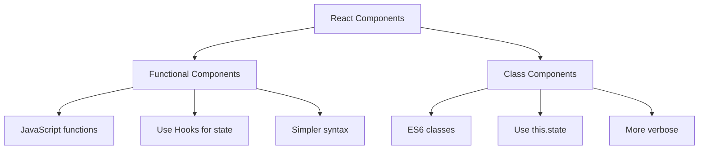

# React Functional Components

## Introduction

React functional components represent the modern approach to building user interfaces with React. Unlike class components (the traditional way), functional components are simpler, more concise, and now fully-featured thanks to React Hooks introduced in React 16.8.

In this guide, you'll learn what functional components are, how they differ from class components, and how to use them effectively in your React applications.

## What Are Functional Components?

Functional components are JavaScript functions that return React elements. They describe what should appear on the screen and accept data via props.

Here's the simplest functional component:

```jsx
function Greeting() {
  return <h1>Hello, World!</h1>;
}
```

This function returns a React element - an `h1` tag with "Hello, World!" inside. When included in a React application, this component renders this heading to the DOM.

## Functional vs Class Components

Before diving deeper, let's quickly compare functional components to class components:



### Key differences:

- **Syntax**: Functional components have simpler syntax
- **State Management**: Functional components use Hooks; class components use `this.state`
- **Lifecycle**: Functional components handle lifecycle with Hooks; class components use specific lifecycle methods
- **Performance**: Functional components can have slight performance advantages

## Creating Your First Functional Component

Let's create a simple functional component:

```jsx
// UserProfile.jsx
import React from 'react';

function UserProfile(props) {
  return (
    <div className="user-card">
      
      <h2>{props.name}</h2>
      <p>Role: {props.role}</p>
      <p>Email: {props.email}</p>
    </div>
  );
}

export default UserProfile;
```

### Using the component:

```jsx
// App.jsx
import React from 'react';
import UserProfile from './UserProfile';

function App() {
  return (
    <div className="app">
      <UserProfile 
        name="Jane Doe"
        role="Frontend Developer"
        email="jane@example.com"
        avatarUrl="https://placekitten.com/100/100"
      />
    </div>
  );
}
```

### Result:
When rendered, this displays a user card with Jane's information, including her name, role, email, and avatar image.

## Props in Functional Components

Props (short for properties) are how we pass data to components. They are read-only and help make components reusable.

### Passing and Accessing Props

```jsx
function Greeting(props) {
  return <h1>Hello, {props.name}!</h1>;
}

// Usage
<Greeting name="Sarah" />  // Renders: Hello, Sarah!
```

### Destructuring Props

A cleaner way to work with props is by destructuring them:

```jsx
function Greeting({ name, role = "Guest" }) {
  // Default value for role if not provided
  return (
    <div>
      <h1>Hello, {name}!</h1>
      <p>Role: {role}</p>
    </div>
  );
}

// Usage
<Greeting name="Alex" />  // Renders: Hello, Alex! Role: Guest
<Greeting name="Taylor" role="Admin" />  // Renders: Hello, Taylor! Role: Admin
```

## Adding State with Hooks

Before React 16.8, functional components couldn't have state. Now with Hooks, they can!

### Using the useState Hook

```jsx
import React, { useState } from 'react';

function Counter() {
  // useState returns a state value and a function to update it
  const [count, setCount] = useState(0);
  
  return (
    <div>
      <p>You clicked {count} times</p>
      <button onClick={() => setCount(count + 1)}>
        Click me
      </button>
    </div>
  );
}
```

In this example:
- `useState(0)` initializes `count` to 0
- `count` is the current state value
- `setCount` is a function to update the state
- When the button is clicked, `setCount` updates the state, causing a re-render

## Handling Side Effects with useEffect

Side effects might include data fetching, subscriptions, or manually changing the DOM.

### Basic useEffect Example

```jsx
import React, { useState, useEffect } from 'react';

function WindowWidthTracker() {
  const [windowWidth, setWindowWidth] = useState(window.innerWidth);
  
  useEffect(() => {
    // This function runs after render
    const handleResize = () => setWindowWidth(window.innerWidth);
    
    // Add event listener
    window.addEventListener('resize', handleResize);
    
    // Cleanup function (runs before component unmounts)
    return () => {
      window.removeEventListener('resize', handleResize);
    };
  }, []); // Empty dependency array means run once on mount
  
  return (
    <div>
      <p>Current window width: {windowWidth}px</p>
    </div>
  );
}
```

### useEffect with Dependencies

```jsx
import React, { useState, useEffect } from 'react';

function UserData({ userId }) {
  const [user, setUser] = useState(null);
  const [loading, setLoading] = useState(true);

  useEffect(() => {
    // Reset state when userId changes
    setLoading(true);
    
    // Fetch user data
    fetch(`https://api.example.com/users/${userId}`)
      .then(response => response.json())
      .then(data => {
        setUser(data);
        setLoading(false);
      });
  }, [userId]); // Re-run effect when userId changes
  
  if (loading) return <div>Loading...</div>;
  
  return (
    <div>
      <h1>{user.name}</h1>
      <p>Email: {user.email}</p>
    </div>
  );
}
```

## Real-world Application: Todo List

Let's build a simple todo list application using functional components and hooks:

```jsx
import React, { useState } from 'react';

function TodoList() {
  const [todos, setTodos] = useState([]);
  const [input, setInput] = useState('');

  const addTodo = () => {
    if (input.trim() !== '') {
      setTodos([...todos, { id: Date.now(), text: input, completed: false }]);
      setInput('');  // Clear input after adding
    }
  };

  const toggleTodo = (id) => {
    setTodos(
      todos.map(todo => 
        todo.id === id ? { ...todo, completed: !todo.completed } : todo
      )
    );
  };

  const deleteTodo = (id) => {
    setTodos(todos.filter(todo => todo.id !== id));
  };

  return (
    <div className="todo-app">
      <h1>Todo List</h1>
      
      <div className="add-todo">
        <input
          value={input}
          onChange={e => setInput(e.target.value)}
          placeholder="Add a new task..."
          onKeyPress={e => e.key === 'Enter' && addTodo()}
        />
        <button onClick={addTodo}>Add</button>
      </div>
      
      <ul className="todo-list">
        {todos.map(todo => (
          <li key={todo.id} className={todo.completed ? 'completed' : ''}>
            <span onClick={() => toggleTodo(todo.id)}>
              {todo.completed ? '✓ ' : '○ '}
              {todo.text}
            </span>
            <button onClick={() => deleteTodo(todo.id)}>Delete</button>
          </li>
        ))}
      </ul>
      
      <div className="todo-stats">
        <p>Total: {todos.length} | Completed: {todos.filter(t => t.completed).length}</p>
      </div>
    </div>
  );
}
```

This example demonstrates several key concepts:
- Multiple state variables with `useState`
- Event handling
- List rendering with `map`
- Conditional rendering
- State updates that depend on previous state
- Form handling

## Best Practices for Functional Components

### 1. Keep Components Small and Focused

```jsx
// Instead of one large component:
function UserDashboard() {
  // Lots of code here...
}

// Break it down:
function UserProfile({ user }) {
  return <div>{/* Profile details */}</div>;
}

function UserSettings({ settings, onUpdate }) {
  return <div>{/* Settings UI */}</div>;
}

function UserDashboard({ user }) {
  return (
    <>
      <UserProfile user={user} />
      <UserSettings settings={user.settings} onUpdate={updateSettings} />
    </>
  );
}
```

### 2. Use Custom Hooks for Reusable Logic

```jsx
// Custom hook for form handling
function useForm(initialValues) {
  const [values, setValues] = useState(initialValues);
  
  const handleChange = (e) => {
    const { name, value } = e.target;
    setValues({
      ...values,
      [name]: value
    });
  };
  
  const resetForm = () => setValues(initialValues);
  
  return { values, handleChange, resetForm };
}

// Usage
function SignUpForm() {
  const { values, handleChange, resetForm } = useForm({
    username: '',
    email: '',
    password: ''
  });
  
  const handleSubmit = (e) => {
    e.preventDefault();
    // Submit form data
    console.log('Form submitted with:', values);
    resetForm();
  };
  
  return (
    <form onSubmit={handleSubmit}>
      <input
        name="username"
        value={values.username}
        onChange={handleChange}
        placeholder="Username"
      />
      {/* Other fields */}
      <button type="submit">Sign Up</button>
    </form>
  );
}
```

### 3. Use Fragments to Avoid Unnecessary Divs

```jsx
import React, { Fragment } from 'react';

function UserInfo({ user }) {
  return (
    <>  {/* Short syntax for Fragment */}
      <h2>{user.name}</h2>
      <p>{user.bio}</p>
    </>
  );
}

// Or with the explicit Fragment syntax (needed if you want to use keys)
function List({ items }) {
  return (
    <dl>
      {items.map(item => (
        <Fragment key={item.id}>
          <dt>{item.term}</dt>
          <dd>{item.description}</dd>
        </Fragment>
      ))}
    </dl>
  );
}
```

## Advanced Patterns with Functional Components

### Component Composition

```jsx
function Card({ title, children }) {
  return (
    <div className="card">
      <div className="card-header">
        <h2>{title}</h2>
      </div>
      <div className="card-body">
        {children}
      </div>
    </div>
  );
}

function App() {
  return (
    <Card title="Welcome">
      <p>This is some content inside the card.</p>
      <button>Click Me</button>
    </Card>
  );
}
```

### Conditional Rendering

```jsx
function UserProfile({ user, isLoading }) {
  if (isLoading) {
    return <div>Loading...</div>;
  }
  
  if (!user) {
    return <div>No user found</div>;
  }
  
  return (
    <div>
      <h1>{user.name}</h1>
      {user.bio && <p>{user.bio}</p>}
      {user.isAdmin ? (
        <AdminPanel userId={user.id} />
      ) : (
        <RegularUserPanel userId={user.id} />
      )}
    </div>
  );
}
```

## Summary

React functional components are now the preferred way to write React components. They offer several advantages:

- **Simplicity**: Less boilerplate code
- **Hooks**: Powerful state and lifecycle management
- **Performance**: Generally better optimization
- **Reusability**: Easier to compose and reuse
- **Testing**: Simpler to test

In this guide, we've covered:
1. Creating basic functional components
2. Working with props
3. Managing state with useState
4. Handling side effects with useEffect
5. Building a real-world application (Todo List)
6. Best practices for component structure
7. Advanced patterns like composition and conditional rendering

## Additional Resources and Exercises

### Resources
- [React Hooks Documentation](https://reactjs.org/docs/hooks-intro.html)
- [React Function Components vs Class Components](https://reactjs.org/docs/components-and-props.html)

### Exercises

1. **Basic Component** - Create a `Button` component that accepts `text`, `onClick`, and `disabled` props and renders a styled button.

2. **State Practice** - Build a counter that can increment, decrement, and reset to zero.

3. **useEffect Practice** - Create a component that fetches and displays data from an API when it mounts.

4. **Component Composition** - Build a `Modal` component that can be opened and closed, and accepts children to display inside.

5. **Advanced Challenge** - Create a form with validation using custom hooks.

Happy coding!