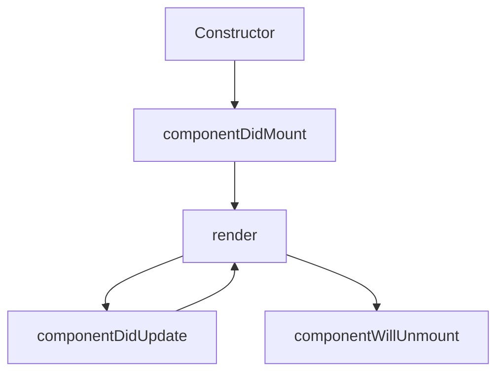

# React Class Components

## Introduction

Class components were the primary way to define components in React before the introduction of hooks in React 16.8. Even though functional components with hooks are now the recommended approach, understanding class components is still valuable for several reasons:

1. You might need to work with legacy codebases that use class components
2. Some advanced patterns are still easier to implement with class components
3. Understanding the component lifecycle provides deeper insights into React's rendering process

In this guide, we'll explore how to create and use React class components, manage state, work with lifecycle methods, and understand when you might choose class components over functional components.

## What are Class Components?

Class components are ES6 classes that extend from `React.Component` and implement a `render()` method that returns React elements.

Here's a simple class component:

```jsx
import React from 'react';

class Greeting extends React.Component {
  render() {
    return <h1>Hello, {this.props.name}!</h1>;
  }
}

export default Greeting;
```

And how you would use it:

```jsx
import Greeting from './Greeting';

function App() {
  return <Greeting name="React Developer" />;
}
```

Output:
```
Hello, React Developer!
```

## Class Components vs. Functional Components

Let's compare the same component written in both styles:

### Class Component

```jsx
import React from 'react';

class Welcome extends React.Component {
  render() {
    return <h1>Welcome, {this.props.name}!</h1>;
  }
}
```

### Functional Component

```jsx
import React from 'react';

function Welcome(props) {
  return <h1>Welcome, {props.name}!</h1>;
}
```

The key differences:
- Class components use `this.props` to access props, functional components receive `props` as an argument
- Class components have more built-in features like state and lifecycle methods
- Functional components are generally more concise and easier to understand

## State in Class Components

One of the main features of class components is the ability to have state.

```jsx
import React from 'react';

class Counter extends React.Component {
  constructor(props) {
    super(props);
    this.state = {
      count: 0
    };
  }
  
  increment = () => {
    this.setState({ count: this.state.count + 1 });
  }
  
  render() {
    return (
      <div>
        <h2>Counter: {this.state.count}</h2>
        <button onClick={this.increment}>Increment</button>
      </div>
    );
  }
}

export default Counter;
```

### Key points about state in class components:

1. State is initialized in the constructor
2. Always call `super(props)` first in the constructor
3. Use `this.setState()` to update state, never modify `this.state` directly
4. State updates may be asynchronous, so don't rely on `this.state` immediately after calling `setState()`

### When state depends on the previous state

```jsx
increment = () => {
  this.setState((prevState) => ({
    count: prevState.count + 1
  }));
}
```

## Lifecycle Methods

Class components have several lifecycle methods that are called at different points in a component's life.

Here's a diagram showing the most important lifecycle methods:



### Common lifecycle methods:

#### Mounting Phase

1. **constructor(props)** - Called when the component is initialized
2. **static getDerivedStateFromProps(props, state)** - Called before rendering when props or state changes
3. **render()** - Required method that returns React elements
4. **componentDidMount()** - Called after the component is mounted to the DOM

#### Updating Phase

1. **static getDerivedStateFromProps(props, state)** - Called when props or state change
2. **shouldComponentUpdate(nextProps, nextState)** - Controls whether the component should re-render
3. **render()** - Re-renders the component
4. **getSnapshotBeforeUpdate(prevProps, prevState)** - Called right before updates are committed to the DOM
5. **componentDidUpdate(prevProps, prevState, snapshot)** - Called after the component updates

#### Unmounting Phase

1. **componentWillUnmount()** - Called before the component is removed from the DOM

### Practical Example with Lifecycle Methods

Here's a component that demonstrates some of the common lifecycle methods:

```jsx
import React from 'react';

class LifecycleDemo extends React.Component {
  constructor(props) {
    super(props);
    this.state = { 
      count: 0,
      data: null,
      windowWidth: window.innerWidth
    };
    console.log('Constructor called');
  }

  componentDidMount() {
    console.log('Component did mount');
    // Perfect for API calls
    fetch('https://jsonplaceholder.typicode.com/todos/1')
      .then(response => response.json())
      .then(data => this.setState({ data }));
    
    // Adding event listeners
    window.addEventListener('resize', this.handleResize);
  }

  componentDidUpdate(prevProps, prevState) {
    console.log('Component did update');
    if (prevState.count !== this.state.count) {
      console.log('Count changed from', prevState.count, 'to', this.state.count);
    }
  }

  componentWillUnmount() {
    console.log('Component will unmount');
    // Cleanup to prevent memory leaks
    window.removeEventListener('resize', this.handleResize);
  }

  handleResize = () => {
    this.setState({ windowWidth: window.innerWidth });
  }

  incrementCount = () => {
    this.setState({ count: this.state.count + 1 });
  }

  render() {
    console.log('Render called');
    return (
      <div>
        <h2>Lifecycle Demo</h2>
        <p>Count: {this.state.count}</p>
        <button onClick={this.incrementCount}>Increment</button>
        <p>Window width: {this.state.windowWidth}px</p>
        {this.state.data ? (
          <p>Data loaded: {this.state.data.title}</p>
        ) : (
          <p>Loading data...</p>
        )}
      </div>
    );
  }
}

export default LifecycleDemo;
```

This component demonstrates:
- Initializing state in the constructor
- Making API calls in componentDidMount
- Adding event listeners and cleaning them up in componentWillUnmount
- Responding to state changes in componentDidUpdate

## Handling Events in Class Components

Event handling in class components differs from functional components in a few ways:

```jsx
import React from 'react';

class ToggleButton extends React.Component {
  constructor(props) {
    super(props);
    this.state = { isOn: false };
    
    // Method 1: Binding in constructor
    this.handleClickBound = this.handleClickBound.bind(this);
  }
  
  // Method 1: Requires binding
  handleClickBound() {
    this.setState(prevState => ({ isOn: !prevState.isOn }));
  }
  
  // Method 2: Arrow function (no binding required)
  handleClickArrow = () => {
    this.setState(prevState => ({ isOn: !prevState.isOn }));
  }
  
  render() {
    return (
      <div>
        <button onClick={this.handleClickBound}>
          {this.state.isOn ? 'ON' : 'OFF'} (Bound method)
        </button>
        
        <button onClick={this.handleClickArrow}>
          {this.state.isOn ? 'ON' : 'OFF'} (Arrow function)
        </button>
      </div>
    );
  }
}

export default ToggleButton;
```

### Things to remember about event handling:

1. Class methods are not bound by default, so you need to bind them in the constructor or use arrow functions
2. Arrow function properties automatically bind `this`
3. If you need to pass parameters to event handlers, you can use arrow functions in the JSX or `.bind()`

## Props and PropTypes

Class components receive props and can use PropTypes for type checking:

```jsx
import React from 'react';
import PropTypes from 'prop-types';

class UserProfile extends React.Component {
  render() {
    const { name, age, isAdmin } = this.props;
    
    return (
      <div className="user-profile">
        <h2>{name}</h2>
        <p>Age: {age}</p>
        {isAdmin && <p className="admin-badge">Administrator</p>}
      </div>
    );
  }
}

// Define prop types for type checking
UserProfile.propTypes = {
  name: PropTypes.string.isRequired,
  age: PropTypes.number,
  isAdmin: PropTypes.bool
};

// Default props
UserProfile.defaultProps = {
  age: 0,
  isAdmin: false
};

export default UserProfile;
```

## Real-world Example: A Form Component

Here's a practical example of a class component that manages a simple form:

```jsx
import React from 'react';

class UserForm extends React.Component {
  constructor(props) {
    super(props);
    this.state = {
      username: '',
      email: '',
      password: '',
      errors: {},
      isSubmitted: false
    };
  }
  
  handleChange = (e) => {
    const { name, value } = e.target;
    this.setState({ [name]: value });
  }
  
  validateForm = () => {
    const { username, email, password } = this.state;
    let errors = {};
    let isValid = true;
    
    if (username.trim().length < 3) {
      errors.username = 'Username must be at least 3 characters';
      isValid = false;
    }
    
    if (!email.includes('@')) {
      errors.email = 'Please enter a valid email';
      isValid = false;
    }
    
    if (password.length < 6) {
      errors.password = 'Password must be at least 6 characters';
      isValid = false;
    }
    
    this.setState({ errors });
    return isValid;
  }
  
  handleSubmit = (e) => {
    e.preventDefault();
    
    if (this.validateForm()) {
      // In a real app, you might send data to an API
      console.log('Form submitted with:', {
        username: this.state.username,
        email: this.state.email,
        password: this.state.password
      });
      
      this.setState({
        isSubmitted: true,
        username: '',
        email: '',
        password: ''
      });
    }
  }
  
  render() {
    const { username, email, password, errors, isSubmitted } = this.state;
    
    return (
      <div className="user-form">
        <h2>Create Account</h2>
        
        {isSubmitted && (
          <div className="success-message">
            Account created successfully!
          </div>
        )}
        
        <form onSubmit={this.handleSubmit}>
          <div className="form-group">
            <label>Username:</label>
            <input
              type="text"
              name="username"
              value={username}
              onChange={this.handleChange}
              className={errors.username ? 'error' : ''}
            />
            {errors.username && <span className="error-text">{errors.username}</span>}
          </div>
          
          <div className="form-group">
            <label>Email:</label>
            <input
              type="email"
              name="email"
              value={email}
              onChange={this.handleChange}
              className={errors.email ? 'error' : ''}
            />
            {errors.email && <span className="error-text">{errors.email}</span>}
          </div>
          
          <div className="form-group">
            <label>Password:</label>
            <input
              type="password"
              name="password"
              value={password}
              onChange={this.handleChange}
              className={errors.password ? 'error' : ''}
            />
            {errors.password && <span className="error-text">{errors.password}</span>}
          </div>
          
          <button type="submit" className="submit-button">
            Create Account
          </button>
        </form>
      </div>
    );
  }
}

export default UserForm;
```

This form component demonstrates:
- Managing multiple state values
- Form validation
- Conditional rendering
- Handling form submission
- Resetting form after submission

## Advanced Patterns with Class Components

### Error Boundaries

Error boundaries are a feature only available in class components. They catch JavaScript errors anywhere in their child component tree and display a fallback UI.

```jsx
import React from 'react';

class ErrorBoundary extends React.Component {
  constructor(props) {
    super(props);
    this.state = { hasError: false, error: null };
  }

  static getDerivedStateFromError(error) {
    // Update state so the next render will show the fallback UI
    return { hasError: true, error };
  }

  componentDidCatch(error, errorInfo) {
    // You can log the error to an error reporting service
    console.error("Error caught by boundary:", error, errorInfo);
  }

  render() {
    if (this.state.hasError) {
      return (
        <div className="error-boundary">
          <h2>Something went wrong.</h2>
          <p>We're sorry for the inconvenience. Please try again later.</p>
          <button onClick={() => this.setState({ hasError: false })}>
            Try again
          </button>
        </div>
      );
    }

    return this.props.children;
  }
}

export default ErrorBoundary;
```

Usage:

```jsx
<ErrorBoundary>
  <YourComponent />
</ErrorBoundary>
```

### Higher Order Components (HOCs)

Class components work well with Higher Order Components, which are functions that take a component and return a new enhanced component.

```jsx
import React from 'react';

// Higher Order Component
function withLoading(WrappedComponent) {
  return class extends React.Component {
    constructor(props) {
      super(props);
      this.state = {
        isLoading: true,
        data: null
      };
    }

    componentDidMount() {
      // Simulate API call
      setTimeout(() => {
        this.setState({
          isLoading: false,
          data: { message: "Data loaded successfully!" }
        });
      }, 2000);
    }

    render() {
      const { isLoading, data } = this.state;
      
      if (isLoading) {
        return <div>Loading...</div>;
      }
      
      return <WrappedComponent data={data} {...this.props} />;
    }
  };
}

// Usage:
class MyComponent extends React.Component {
  render() {
    return <div>{this.props.data.message}</div>;
  }
}

const MyComponentWithLoading = withLoading(MyComponent);

// Then use it like:
// <MyComponentWithLoading otherProps={...} />
```

## Modern Alternatives to Class Patterns

With hooks, many class component patterns now have functional equivalents:

| Class Pattern            | Hook Equivalent                            |
|--------------------------|--------------------------------------------|
| Constructor & this.state | `useState`                                 |
| componentDidMount        | `useEffect(() => {}, [])`                  |
| componentDidUpdate       | `useEffect(() => {})`                      |
| componentWillUnmount     | `useEffect(() => { return () => {} }, [])` |
| shouldComponentUpdate    | `React.memo & useMemo`                     |

## When to Use Class Components Today

While functional components with hooks are now preferred, there are still cases where class components might be used:

1. Error boundaries (currently no hook equivalent)
2. When working with legacy code
3. When you need certain lifecycle methods that don't have clean hook equivalents
4. When your team is more familiar with class components

## Summary

React class components provide a powerful way to create components with state and lifecycle methods. They were the standard for many years and are still found in many React applications. Understanding class components will help you:

- Work with legacy React code
- Comprehend React's component lifecycle
- Implement certain patterns like error boundaries
- Appreciate the simplicity that hooks brought to React

While functional components with hooks are now the recommended approach for new code, class components remain an essential part of the React ecosystem.

## Additional Resources

1. Practice creating a class component that fetches data from an API and displays it
2. Convert a functional component with hooks to a class component
3. Implement an error boundary to catch errors in your application
4. Create a form with validation using class components

## Exercises

1. Create a `Timer` class component that counts seconds and has pause/resume functionality
2. Build a `TodoList` class component that allows adding, removing, and marking tasks as complete
3. Implement a `Slideshow` class component that cycles through an array of images
4. Create a class component that uses localStorage to persist state between page refreshes
5. Build an error boundary and test it with a component that intentionally throws an error

Happy coding with React class components!