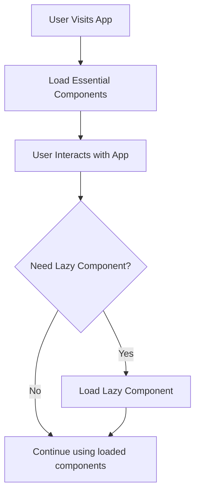

# React Lazy Loading

## Introduction

When building large React applications, you might notice that your bundle size grows significantly as you add more features and components. This can lead to longer loading times, especially for users with slower internet connections. **React Lazy Loading** is a technique that allows you to load components only when they are needed, rather than loading everything at once when the application starts.

In this guide, we'll explore how to implement lazy loading in React using `React.lazy()` and `Suspense`. We'll look at the benefits, implementation details, and best practices to optimize your React applications.

## What is Lazy Loading?

Lazy loading (also known as code splitting) is a performance optimization technique that delays the loading of non-critical resources at page load time. Instead, these resources are loaded only when needed.

In React, lazy loading means:

1. Breaking down your application into smaller chunks
2. Loading components only when they are required (like when a user navigates to a specific route)
3. Reducing the initial bundle size for faster page loads



## React.lazy() and Suspense

React provides two main features to implement lazy loading:

1. **React.lazy()**: A function that lets you render a dynamic import as a regular component.
2. **Suspense**: A component that lets you display a fallback UI while waiting for lazy components to load.

### Basic Syntax

```jsx
import React, { Suspense } from 'react';

// Using lazy to import a component
const LazyComponent = React.lazy(() => import('./LazyComponent'));

function App() {
  return (
    <div>
      <h1>My App</h1>
      
      {/* Suspense provides a fallback while LazyComponent is loading */}
      <Suspense fallback={<div>Loading...</div>}>
        <LazyComponent />
      </Suspense>
    </div>
  );
}
```

## Implementing Lazy Loading Step by Step

### Step 1: Identify Components to Lazy Load

Not all components need lazy loading. Good candidates include:

- Large components not needed on initial page load
- Components in different routes
- Components only visible after user interaction (like modals, tabs)
- Feature-rich components that aren't immediately needed

### Step 2: Convert Regular Imports to Lazy Imports

**Before lazy loading:**

```jsx
import HeavyComponent from './HeavyComponent';

function App() {
  return (
    <div>
      <HeavyComponent />
    </div>
  );
}
```

**After implementing lazy loading:**

```jsx
import React, { Suspense } from 'react';

const HeavyComponent = React.lazy(() => import('./HeavyComponent'));

function App() {
  return (
    <div>
      <Suspense fallback={<div>Loading...</div>}>
        <HeavyComponent />
      </Suspense>
    </div>
  );
}
```

### Step 3: Create Meaningful Loading States

Instead of a simple "Loading..." message, consider creating loader components that match your application's style:

```jsx
import React, { Suspense } from 'react';
import LoadingSpinner from './LoadingSpinner';

const HeavyComponent = React.lazy(() => import('./HeavyComponent'));

function App() {
  return (
    <div>
      <Suspense fallback={<LoadingSpinner />}>
        <HeavyComponent />
      </Suspense>
    </div>
  );
}
```

## Practical Example: Lazy Loading Routes

One of the most common use cases for lazy loading is with route-based code splitting. Here's how you can implement it with React Router:

```jsx
import React, { Suspense, lazy } from 'react';
import { BrowserRouter as Router, Routes, Route } from 'react-router-dom';
import NavBar from './components/NavBar';
import LoadingSpinner from './components/LoadingSpinner';

// Lazily load route components
const Home = lazy(() => import('./pages/Home'));
const About = lazy(() => import('./pages/About'));
const Dashboard = lazy(() => import('./pages/Dashboard'));
const Profile = lazy(() => import('./pages/Profile'));

function App() {
  return (
    <Router>
      <NavBar />
      
      <Suspense fallback={<LoadingSpinner />}>
        <Routes>
          <Route path="/" element={<Home />} />
          <Route path="/about" element={<About />} />
          <Route path="/dashboard" element={<Dashboard />} />
          <Route path="/profile" element={<Profile />} />
        </Routes>
      </Suspense>
    </Router>
  );
}

export default App;
```

In this example, the different page components will only be loaded when the user navigates to their respective routes.

## Handling Loading Errors

When lazy loading components, network issues or other errors might occur. React's `Suspense` doesn't handle these errors, so you'll need to use an Error Boundary:

```jsx
import React, { Component } from 'react';

class ErrorBoundary extends Component {
  constructor(props) {
    super(props);
    this.state = { hasError: false };
  }

  static getDerivedStateFromError(error) {
    // Update state so the next render shows the fallback UI
    return { hasError: true };
  }

  componentDidCatch(error, errorInfo) {
    // You can log the error to an error reporting service
    console.error("Component failed to load:", error, errorInfo);
  }

  render() {
    if (this.state.hasError) {
      // You can render any custom fallback UI
      return <h2>Sorry, there was a problem loading this component.</h2>;
    }

    return this.props.children;
  }
}
```

And use it with your lazy components:

```jsx
import React, { Suspense, lazy } from 'react';
import ErrorBoundary from './ErrorBoundary';

const LazyComponent = lazy(() => import('./LazyComponent'));

function App() {
  return (
    <div>
      <ErrorBoundary>
        <Suspense fallback={<div>Loading...</div>}>
          <LazyComponent />
        </Suspense>
      </ErrorBoundary>
    </div>
  );
}
```

## Advanced Pattern: Preloading Components

Sometimes you might want to preload components before they're actually needed. For example, you could start loading a component when a user hovers over a button that will reveal it:

```jsx
import React, { Suspense, useState } from 'react';

// Import but don't render yet
const HeavyModal = React.lazy(() => import('./HeavyModal'));

// Create a component that will handle preloading
const PreloadableModal = () => {
  const [showModal, setShowModal] = useState(false);
  
  const handleMouseOver = () => {
    // Start loading the modal when user hovers
    const modalComponent = import('./HeavyModal');
  };
  
  return (
    <>
      <button 
        onMouseOver={handleMouseOver}
        onClick={() => setShowModal(true)}
      >
        Open Modal
      </button>
      
      {showModal && (
        <Suspense fallback={<div>Loading modal...</div>}>
          <HeavyModal onClose={() => setShowModal(false)} />
        </Suspense>
      )}
    </>
  );
};
```

## Real-World Application Example

Let's create a simple dashboard application with lazy-loaded features:

```jsx
import React, { Suspense, lazy, useState } from 'react';
import Header from './components/Header';
import Sidebar from './components/Sidebar';
import ErrorBoundary from './components/ErrorBoundary';
import LoadingIndicator from './components/LoadingIndicator';
import './App.css';

// Lazy load various dashboard features
const AnalyticsPanel = lazy(() => import('./features/AnalyticsPanel'));
const UserManagement = lazy(() => import('./features/UserManagement'));
const Settings = lazy(() => import('./features/Settings'));
const Reports = lazy(() => import('./features/Reports'));

function Dashboard() {
  const [activeFeature, setActiveFeature] = useState('analytics');
  
  // Menu items for the sidebar
  const menuItems = [
    { id: 'analytics', label: 'Analytics' },
    { id: 'users', label: 'User Management' },
    { id: 'reports', label: 'Reports' },
    { id: 'settings', label: 'Settings' }
  ];
  
  // Render the appropriate component based on active feature
  const renderFeature = () => {
    switch(activeFeature) {
      case 'analytics':
        return <AnalyticsPanel />;
      case 'users':
        return <UserManagement />;
      case 'reports':
        return <Reports />;
      case 'settings':
        return <Settings />;
      default:
        return <AnalyticsPanel />;
    }
  };
  
  return (
    <div className="dashboard">
      <Header />
      <div className="dashboard-content">
        <Sidebar 
          items={menuItems} 
          activeItem={activeFeature}
          onItemClick={setActiveFeature}
        />
        <main className="feature-container">
          <ErrorBoundary>
            <Suspense fallback={<LoadingIndicator />}>
              {renderFeature()}
            </Suspense>
          </ErrorBoundary>
        </main>
      </div>
    </div>
  );
}

export default Dashboard;
```

In this example, each feature of the dashboard (Analytics, User Management, etc.) is loaded only when needed, improving the initial load time of the application.

## Best Practices for React Lazy Loading

1. **Choose Appropriate Splitting Points**: Don't split everything. Focus on larger components or features that aren't needed immediately.

2. **Meaningful Loading States**: Create loading indicators that match your application's design.

3. **Error Boundaries**: Always wrap lazy components in error boundaries to catch and handle loading failures.

4. **Preload When Appropriate**: Consider preloading components when you have strong indicators that a user will need them soon.

5. **Route-Based Splitting**: Always split your application by routes as a starting point.

6. **Monitor Bundle Sizes**: Use tools like `webpack-bundle-analyzer` to identify which components would benefit most from lazy loading.

7. **Test on Slow Networks**: Use your browser's developer tools to simulate slow network conditions and test the user experience.

## Summary

React Lazy Loading is a powerful technique to optimize your React applications by loading components only when they're needed. By implementing `React.lazy()` and `Suspense`, you can significantly improve the initial loading time of your application, especially for users on slower connections or mobile devices.

Remember that lazy loading is not always necessary for every component. Focus on larger features and routes that aren't immediately needed when the user first loads your application.

## Additional Resources and Exercises

### Resources
- [React Documentation on Code-Splitting](https://reactjs.org/docs/code-splitting.html)
- [React Router Documentation](https://reactrouter.com/docs/en/v6)
- [Webpack Code Splitting Guide](https://webpack.js.org/guides/code-splitting/)

### Exercises

1. **Basic Implementation**: Take an existing React application and implement lazy loading for at least two components.

2. **Route-Based Splitting**: Convert a multi-page React application to use lazy loading with React Router.

3. **Preloading Practice**: Implement a navigation menu that preloads page components when hovering over menu items.

4. **Dashboard Challenge**: Create a simple dashboard application with multiple tabs, where each tab's content is lazy loaded.

5. **Error Handling**: Add comprehensive error handling to lazy-loaded components using Error Boundaries.

By mastering React Lazy Loading, you'll be well-equipped to build fast and efficient React applications that provide a great user experience even as they grow in complexity.