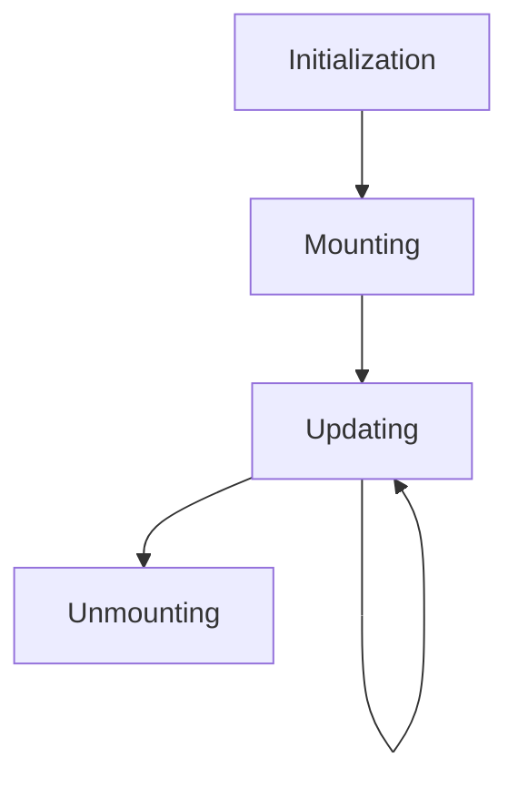

# React Component Lifecycle

## Introduction

Every React component goes through a series of phases during its existence in an application. This sequence of events is known as the **component lifecycle**. Understanding these lifecycle phases is crucial for writing efficient React applications, as it helps you control what happens at each stage of a component's life.

In this tutorial, we'll explore:
- The different phases of a React component's lifecycle
- Lifecycle methods in class components
- How hooks replace lifecycle methods in functional components
- Practical examples showing when and how to use lifecycle features

## Component Lifecycle Phases

A React component's lifecycle can be broken down into four main phases:

1. **Initialization** - Setting up the component before it's mounted
2. **Mounting** - Inserting the component into the DOM
3. **Updating** - Re-rendering the component when props or state change
4. **Unmounting** - Removing the component from the DOM

Let's visualize these phases:



## Class Component Lifecycle Methods

Class components provide specific methods that execute during each lifecycle phase. Let's explore these methods:

### Mounting Phase

1. **constructor()** - Initializes state and binds methods
2. **static getDerivedStateFromProps()** - Updates state based on props
3. **render()** - Creates the virtual DOM representation
4. **componentDidMount()** - Executes after the component is rendered to the DOM

### Updating Phase

1. **static getDerivedStateFromProps()** - Updates state based on changed props
2. **shouldComponentUpdate()** - Determines if the component should re-render
3. **render()** - Creates the updated virtual DOM representation
4. **getSnapshotBeforeUpdate()** - Captures information before DOM updates
5. **componentDidUpdate()** - Executes after the component updates in the DOM

### Unmounting Phase

1. **componentWillUnmount()** - Executes before the component is removed from the DOM

Let's look at a practical example of a class component using lifecycle methods:

```jsx
import React, { Component } from 'react';

class Clock extends Component {
  constructor(props) {
    super(props);
    this.state = {
      date: new Date()
    };
    console.log('1. Constructor: Initializing component');
  }

  componentDidMount() {
    console.log('3. ComponentDidMount: Component is now in the DOM');
    this.timerID = setInterval(
      () => this.tick(),
      1000
    );
  }

  componentDidUpdate() {
    console.log('4. ComponentDidUpdate: Component was updated');
  }

  componentWillUnmount() {
    console.log('5. ComponentWillUnmount: Component is about to be removed');
    clearInterval(this.timerID);
  }

  tick() {
    this.setState({
      date: new Date()
    });
  }

  render() {
    console.log('2. Render: Creating virtual DOM');
    return (
      <div>
        <h2>Current Time</h2>
        <p>{this.state.date.toLocaleTimeString()}</p>
      </div>
    );
  }
}

export default Clock;
```

### Console Output (for the Clock component):

```
1. Constructor: Initializing component
2. Render: Creating virtual DOM
3. ComponentDidMount: Component is now in the DOM
// After 1 second:
2. Render: Creating virtual DOM
4. ComponentDidUpdate: Component was updated
// This repeats every second
// When component is removed:
5. ComponentWillUnmount: Component is about to be removed
```

## Functional Components and Hooks

With the introduction of React Hooks in React 16.8, functional components can now handle lifecycle events through hooks rather than lifecycle methods.

Here's how hooks map to the lifecycle methods:

| Class Lifecycle Method | Hook Equivalent |
|------------------------|-----------------|
| constructor | useState |
| componentDidMount | useEffect with empty dependency array |
| componentDidUpdate | useEffect with dependency array |
| componentWillUnmount | useEffect cleanup function |
| shouldComponentUpdate | React.memo or useMemo |

Let's rewrite our Clock component using functional components and hooks:

```jsx
import React, { useState, useEffect } from 'react';

function Clock() {
  // Similar to constructor
  const [date, setDate] = useState(new Date());
  console.log('Rendering component');

  useEffect(() => {
    console.log('Component mounted - similar to componentDidMount');
    
    // Setting up the timer
    const timerID = setInterval(() => {
      setDate(new Date());
    }, 1000);
    
    // Cleanup function - similar to componentWillUnmount
    return () => {
      console.log('Component will unmount - cleanup');
      clearInterval(timerID);
    };
  }, []); // Empty dependency array means this runs once on mount
  
  useEffect(() => {
    console.log('Date updated - similar to componentDidUpdate');
    // This effect runs whenever date changes
  }, [date]); // This dependency means it runs when date changes
  
  return (
    <div>
      <h2>Current Time</h2>
      <p>{date.toLocaleTimeString()}</p>
    </div>
  );
}

export default Clock;
```

## Practical Use Cases

Let's explore some common scenarios where understanding the component lifecycle is crucial:

### 1. Data Fetching

Fetching data when a component mounts and cleaning up resources when it unmounts:

```jsx
function UserProfile({ userId }) {
  const [user, setUser] = useState(null);
  const [loading, setLoading] = useState(true);
  const [error, setError] = useState(null);

  useEffect(() => {
    // This effect runs when the component mounts or userId changes
    let isMounted = true;
    setLoading(true);
    
    fetch(`https://api.example.com/users/${userId}`)
      .then(response => response.json())
      .then(data => {
        if (isMounted) {
          setUser(data);
          setLoading(false);
        }
      })
      .catch(err => {
        if (isMounted) {
          setError(err);
          setLoading(false);
        }
      });
      
    // Cleanup function runs when component unmounts or before effect re-runs
    return () => {
      isMounted = false;
    };
  }, [userId]);

  if (loading) return <div>Loading...</div>;
  if (error) return <div>Error: {error.message}</div>;
  if (!user) return <div>No user found</div>;

  return (
    <div>
      <h2>{user.name}</h2>
      <p>Email: {user.email}</p>
      <p>Role: {user.role}</p>
    </div>
  );
}
```

### 2. Event Listeners

Adding and removing event listeners to prevent memory leaks:

```jsx
function WindowResizeTracker() {
  const [windowSize, setWindowSize] = useState({
    width: window.innerWidth,
    height: window.innerHeight
  });

  useEffect(() => {
    // Define the event handler function
    const handleResize = () => {
      setWindowSize({
        width: window.innerWidth,
        height: window.innerHeight
      });
    };
    
    // Add event listener when component mounts
    window.addEventListener('resize', handleResize);
    
    // Remove event listener when component unmounts
    return () => {
      window.removeEventListener('resize', handleResize);
    };
  }, []); // Empty dependency array means this runs once on mount

  return (
    <div>
      <h2>Window Dimensions</h2>
      <p>Width: {windowSize.width}px</p>
      <p>Height: {windowSize.height}px</p>
    </div>
  );
}
```

### 3. Animations

Implementing entrance and exit animations using lifecycle methods:

```jsx
function AnimatedComponent({ isVisible }) {
  const [animation, setAnimation] = useState('');
  
  useEffect(() => {
    if (isVisible) {
      // Start entrance animation when component becomes visible
      setAnimation('fade-in');
    } else {
      // Start exit animation when component is about to hide
      setAnimation('fade-out');
    }
  }, [isVisible]);

  return (
    <div className={`animated-box ${animation}`}>
      <p>I animate on mount and unmount!</p>
    </div>
  );
}
```

## Common Pitfalls and Best Practices

### Infinite Update Loops

One common mistake is creating an infinite update loop in `componentDidUpdate` or `useEffect`:

```jsx
// ❌ BAD: This creates an infinite loop
useEffect(() => {
  setCount(count + 1); // Changing state triggers another render which triggers this effect again
});

// ✅ GOOD: Add a dependency array to control when the effect runs
useEffect(() => {
  // Only runs when someValue changes
  setCount(count + 1);
}, [someValue]);
```

### Memory Leaks

Always clean up resources in the unmounting phase:

```jsx
// ❌ BAD: No cleanup
useEffect(() => {
  const subscription = someExternalAPI.subscribe();
});

// ✅ GOOD: With proper cleanup
useEffect(() => {
  const subscription = someExternalAPI.subscribe();
  return () => {
    subscription.unsubscribe();
  };
}, []);
```

### Data Fetching

Using async/await in useEffect requires careful handling:

```jsx
// ❌ BAD: Can't use async directly in useEffect
useEffect(async () => {
  const data = await fetchData();
  setData(data);
}, []);

// ✅ GOOD: Define async function inside useEffect
useEffect(() => {
  const fetchDataAsync = async () => {
    const data = await fetchData();
    setData(data);
  };
  
  fetchDataAsync();
}, []);
```

## Summary

Understanding React's component lifecycle is essential for building performant and bug-free applications. In this tutorial, we've covered:

1. The four main phases of a React component's lifecycle
2. Traditional lifecycle methods in class components
3. How hooks provide the same functionality in functional components
4. Practical use cases like data fetching, event listeners, and animations
5. Common pitfalls and best practices

By mastering component lifecycle concepts, you'll be able to control exactly when certain actions occur in your components, optimize performance, and ensure proper resource management.

## Additional Resources

- [React Official Documentation on Lifecycle Methods](https://reactjs.org/docs/react-component.html)
- [React Hooks API Reference](https://reactjs.org/docs/hooks-reference.html)
- [Diagrams of React Lifecycle Methods](https://projects.wojtekmaj.pl/react-lifecycle-methods-diagram/)

## Exercises

1. Create a component that fetches data from a public API (like JSONPlaceholder) when it mounts and displays loading, error, and success states.

2. Build a component that tracks and displays how much time a user spends on a page using lifecycle methods or hooks.

3. Implement a countdown timer component that cleans up its interval when unmounting.

4. Create a form component that saves input values to local storage on unmount and restores them on mount.

5. Build a component that changes its appearance based on the scroll position of the page, adding and removing scroll event listeners appropriately.