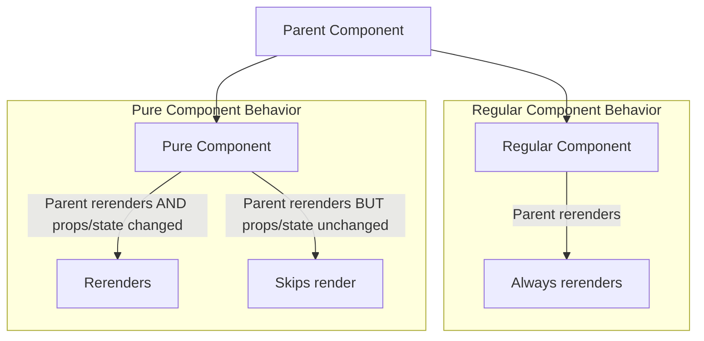

# React Pure Components

## Introduction

In React, rendering is one of the most critical operations that impacts your application's performance. Every time a component re-renders, React performs a series of calculations and DOM operations that consume computational resources. 

**Pure Components** are a special type of component in React that helps optimize performance by reducing unnecessary renders. They implement a shallow comparison on props and state to determine if a re-render is necessary, unlike regular components which re-render whenever their parent component re-renders.

In this tutorial, you'll learn:
- What Pure Components are and how they work
- The difference between Regular Components and Pure Components
- When and how to use Pure Components 
- Best practices and common pitfalls

## What are Pure Components?

A Pure Component in React is similar to a regular component but implements `shouldComponentUpdate()` with a shallow comparison on props and state by default. This means the component will only re-render if:

1. Its props have changed (based on a shallow comparison)
2. Its state has changed (based on a shallow comparison)
3. Its context has changed

Let's understand what "pure" really means in this context:

In functional programming, a function is considered **pure** if:
1. It returns the same result given the same inputs
2. It doesn't cause side effects

Similarly, Pure Components in React render the same output given the same props and state.

## Class-based Pure Components vs. Functional Components

### Class-based Pure Components

In class-based components, you can create a Pure Component by extending `React.PureComponent` instead of `React.Component`:

```jsx
import React from 'react';

class Counter extends React.PureComponent {
  constructor(props) {
    super(props);
    this.state = {
      count: 0
    };
  }

  incrementCount = () => {
    this.setState({ count: this.state.count + 1 });
  }

  render() {
    console.log('Counter component rendered');
    return (
      <div>
        <p>Count: {this.state.count}</p>
        <button onClick={this.incrementCount}>Increment</button>
      </div>
    );
  }
}

export default Counter;
```

### Functional Components with React.memo

For functional components, React provides the `React.memo` higher-order component that achieves the same behavior:

```jsx
import React from 'react';

const Counter = (props) => {
  const [count, setCount] = React.useState(0);
  
  const incrementCount = () => {
    setCount(count + 1);
  };
  
  console.log('Counter component rendered');
  
  return (
    <div>
      <p>Count: {count}</p>
      <button onClick={incrementCount}>Increment</button>
      <p>Name: {props.name}</p>
    </div>
  );
};

export default React.memo(Counter);
```

In this example, the `Counter` component wrapped with `React.memo` will only re-render if its `props` change or its internal state changes.

## How Shallow Comparison Works

Understanding shallow comparison is crucial for effectively using Pure Components. 

Shallow comparison means:

- For primitive types (strings, numbers, booleans), it checks if the values are equal.
- For complex types (objects, arrays), it only checks if the references are the same, not if the content is identical.

Let's see an example:

```jsx
import React from 'react';

class Parent extends React.Component {
  constructor(props) {
    super(props);
    this.state = {
      count: 0,
      user: { name: 'John', age: 25 }
    };
  }

  incrementCount = () => {
    this.setState({ count: this.state.count + 1 });
  }

  updateUser = () => {
    // This creates a new object with the same values
    this.setState({ user: { name: 'John', age: 25 } });
  }

  render() {
    console.log('Parent component rendered');
    return (
      <div>
        <p>Count: {this.state.count}</p>
        <button onClick={this.incrementCount}>Increment Count</button>
        <button onClick={this.updateUser}>Update User (Same Data)</button>
        <ChildComponent user={this.state.user} />
      </div>
    );
  }
}

class ChildComponent extends React.PureComponent {
  render() {
    console.log('Child component rendered');
    return <p>User: {this.props.user.name}, Age: {this.props.user.age}</p>;
  }
}
```

In this example:
- Clicking "Increment Count" updates the `count` state, causing the `Parent` to re-render, but the `ChildComponent` doesn't re-render because its props haven't changed.
- Clicking "Update User (Same Data)" creates a new object with the same values, which causes the `ChildComponent` to re-render, even though the content is identical, because the reference changed.

## When to Use Pure Components

Pure Components are especially useful in scenarios where:

1. **Your component renders often but with the same props**
   - Components in long lists
   - Components that receive frequently updated but irrelevant props

2. **Your component's render is computationally expensive**
   - Components with complex calculations
   - Components that render large DOM structures

3. **Your component doesn't rely on deep nested objects in props or state**
   - Pure Components work best with flat, simple data structures

## Practical Example: Optimizing a Todo List

Let's create a Todo application with pure components for better performance:

```jsx
import React, { useState } from 'react';

// Parent Component
function TodoApp() {
  const [todos, setTodos] = useState([]);
  const [newTodo, setNewTodo] = useState('');
  const [counter, setCounter] = useState(0);

  const addTodo = () => {
    if (newTodo.trim()) {
      setTodos([...todos, { id: Date.now(), text: newTodo, completed: false }]);
      setNewTodo('');
    }
  };

  const toggleTodo = (id) => {
    setTodos(
      todos.map(todo => 
        todo.id === id ? { ...todo, completed: !todo.completed } : todo
      )
    );
  };

  // This just forces re-renders to demonstrate our optimization
  const incrementCounter = () => {
    setCounter(counter + 1);
  };

  return (
    <div>
      <h2>Todo App</h2>
      <p>Counter (for testing re-renders): {counter}</p>
      <button onClick={incrementCounter}>Increment Counter</button>
      
      <div>
        <input 
          type="text" 
          value={newTodo} 
          onChange={(e) => setNewTodo(e.target.value)}
          placeholder="Add a new task"
        />
        <button onClick={addTodo}>Add</button>
      </div>
      
      <TodoList todos={todos} toggleTodo={toggleTodo} />
    </div>
  );
}

// Optimized with React.memo - Only re-renders if todos prop changes
const TodoList = React.memo(({ todos, toggleTodo }) => {
  console.log('TodoList rendered');
  return (
    <ul>
      {todos.map(todo => (
        <TodoItem 
          key={todo.id} 
          todo={todo} 
          toggleTodo={toggleTodo} 
        />
      ))}
    </ul>
  );
});

// Individual todo item, also optimized
const TodoItem = React.memo(({ todo, toggleTodo }) => {
  console.log(`TodoItem "${todo.text}" rendered`);
  return (
    <li 
      style={{ textDecoration: todo.completed ? 'line-through' : 'none' }}
      onClick={() => toggleTodo(todo.id)}
    >
      {todo.text}
    </li>
  );
});

export default TodoApp;
```

In this example:
- `TodoList` and `TodoItem` are wrapped with `React.memo` to prevent unnecessary re-renders
- When the counter in the parent increases, neither of the memoized components re-render
- The components only update when the relevant props change

## Common Pitfalls and Solutions

### 1. Passing New Object References

```jsx
// Problematic: Creates a new object reference each render
<UserProfile userInfo={{ name: user.name, age: user.age }} />

// Solution: Use a variable or useMemo to maintain reference
const userInfo = { name: user.name, age: user.age };
// OR
const userInfo = React.useMemo(() => ({ name: user.name, age: user.age }), [user.name, user.age]);

<UserProfile userInfo={userInfo} />
```

### 2. Passing Inline Functions

```jsx
// Problematic: Creates a new function reference each render
<Button onClick={() => handleClick(id)} />

// Solution: Use useCallback to maintain function reference
const handleButtonClick = React.useCallback(() => handleClick(id), [id]);

<Button onClick={handleButtonClick} />
```

### 3. Deep Nested Changes

Pure Components only perform shallow comparison, so deep changes in objects won't trigger re-renders:

```jsx
// This update might not cause a re-render in a PureComponent
this.setState(prevState => {
  const newItems = [...prevState.items];
  newItems[0].completed = true;
  return { items: newItems };
});

// Solution: Create new references for any changed objects
this.setState(prevState => {
  return {
    items: prevState.items.map((item, index) => 
      index === 0 ? { ...item, completed: true } : item
    )
  };
});
```

## When Not to Use Pure Components

Pure Components aren't always the best choice. You should avoid them when:

1. **Your component always needs to render when the parent renders**
2. **Your component relies heavily on complex nested data structures**
3. **Your components must respond to context changes**
4. **Your component's render is simple and fast**

## Visualizing Component Updates



## Performance Testing Pure Components

To verify the performance benefits, you can use React's built-in Profiler or Chrome's Performance panel:

```jsx
import React, { Profiler } from 'react';

function onRenderCallback(
  id,
  phase,
  actualDuration,
  baseDuration,
  startTime,
  commitTime
) {
  console.log(`Component ${id} rendered in ${actualDuration}ms`);
}

function App() {
  return (
    <div>
      <Profiler id="RegularComponent" onRender={onRenderCallback}>
        <RegularComponent />
      </Profiler>
      
      <Profiler id="OptimizedComponent" onRender={onRenderCallback}>
        <OptimizedComponent />
      </Profiler>
    </div>
  );
}
```

## Summary

React Pure Components provide a simple and effective way to optimize your React applications by preventing unnecessary re-renders. Here's what we've learned:

1. Pure Components implement `shouldComponentUpdate()` with a shallow comparison on props and state
2. Class components can extend `React.PureComponent`
3. Function components can be wrapped with `React.memo()`
4. They work best with simple, flat data structures
5. Be careful with object references, inline functions, and deep nested changes
6. They're ideal for performance-critical components that render often with the same data

By strategically implementing Pure Components in your React applications, you can significantly improve rendering performance, especially in larger applications with complex component trees.

## Additional Resources and Exercises

### Exercises

1. **Convert a Regular Component**: Take an existing regular React component from your project and convert it to a Pure Component. Observe any performance improvements.

2. **Todo List Optimization**: Extend the Todo application example by adding features like filtering, sorting, and categories. Make sure to optimize all components appropriately.

3. **Performance Testing**: Create a test application with both regular components and pure components. Use React's Profiler to measure and compare the rendering performance.

4. **Fix the Bug**: Debug the following component which uses `React.memo` but still re-renders unnecessarily:

```jsx
const ParentComponent = () => {
  const [count, setCount] = useState(0);
  
  // Try to identify why this would cause ChildComponent to re-render
  // despite React.memo
  const handleClick = () => {
    console.log("Button clicked");
  };
  
  return (
    <div>
      <button onClick={() => setCount(count + 1)}>Increment: {count}</button>
      <ChildComponent onClick={handleClick} name="React" />
    </div>
  );
};

const ChildComponent = React.memo(({ name, onClick }) => {
  console.log("Child rendered");
  return <div onClick={onClick}>Hello, {name}!</div>;
});
```

Happy coding!