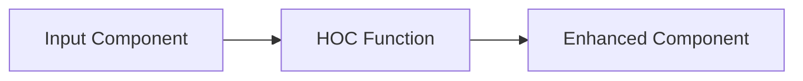

# React Higher-Order Components

## Introduction

Higher-Order Components (HOCs) are an advanced pattern in React that stems from React's compositional nature. Simply put, **a Higher-Order Component is a function that takes a component and returns a new enhanced component**. 

If you're familiar with higher-order functions in JavaScript (like `map` or `filter`), HOCs follow a similar concept: they transform one component into another, adding extra functionality along the way.

HOCs aren't part of the React API itself; they're a pattern that emerged from React's component structure. They allow you to reuse component logic, abstract complex state management, and add cross-cutting concerns without modifying the original components.

## Understanding Higher-Order Components

### What is a Higher-Order Component?

A HOC is a pure function with zero side-effects. It takes a component as an argument and returns a new component that wraps the original one:

```jsx
// This is the basic structure of a HOC
const withExtraFunctionality = (WrappedComponent) => {
  // Return a new component
  return (props) => {
    // Add extra functionality here
    return <WrappedComponent {...props} extraProp="value" />;
  };
};
```

The naming convention for HOCs is to use the `with` prefix (e.g., `withData`, `withLoading`, `withAuth`), which helps identify their purpose.

### How are HOCs Different from Regular Components?

Unlike regular components that transform props into UI, HOCs transform a component into another component. They don't modify the input component; instead, they compose a new component that wraps it.



## Creating Your First HOC

Let's create a simple HOC that adds a loading state to any component:

```jsx
// withLoading.js
import React, { useState, useEffect } from 'react';

const withLoading = (WrappedComponent) => {
  return function WithLoadingComponent(props) {
    const [isLoading, setIsLoading] = useState(true);
    
    useEffect(() => {
      // Simulate loading delay
      const timer = setTimeout(() => {
        setIsLoading(false);
      }, 2000);
      
      return () => clearTimeout(timer);
    }, []);
    
    if (isLoading) {
      return <div>Loading...</div>;
    }
    
    return <WrappedComponent {...props} />;
  };
};

export default withLoading;
```

Now, let's use this HOC to enhance a simple component:

```jsx
// UserList.js
import React from 'react';
import withLoading from './withLoading';

const UserList = ({ users }) => (
  <ul>
    {users.map(user => (
      <li key={user.id}>{user.name}</li>
    ))}
  </ul>
);

// Enhance UserList with loading functionality
export default withLoading(UserList);
```

When you use `UserList` in your application, it will display a "Loading..." message for 2 seconds before rendering the actual list.

## Common Use Cases for HOCs

### 1. Logic Reuse

HOCs excel at extracting common behavior into reusable functions:

```jsx
// withLogger.js
const withLogger = (WrappedComponent) => {
  return function WithLogger(props) {
    console.log(`Component props: ${JSON.stringify(props)}`);
    return <WrappedComponent {...props} />;
  };
};

// Usage
const EnhancedComponent = withLogger(MyComponent);
```

### 2. State Abstraction

HOCs can add state management to components:

```jsx
// withToggle.js
import React, { useState } from 'react';

const withToggle = (WrappedComponent) => {
  return function WithToggle(props) {
    const [isToggled, setToggled] = useState(false);
    
    const toggle = () => setToggled(!isToggled);
    
    return (
      <WrappedComponent 
        {...props} 
        isToggled={isToggled} 
        toggle={toggle} 
      />
    );
  };
};

// Usage
const ToggleButton = ({ isToggled, toggle, text }) => (
  <button onClick={toggle}>
    {text}: {isToggled ? 'ON' : 'OFF'}
  </button>
);

const EnhancedToggleButton = withToggle(ToggleButton);

// In your app
<EnhancedToggleButton text="Notifications" />
```

### 3. Props Manipulation

HOCs can modify, add, or remove props:

```jsx
// withStyles.js
const withStyles = (styles) => (WrappedComponent) => {
  return function WithStyles(props) {
    return <WrappedComponent {...props} style={styles} />;
  };
};

// Usage
const BlueButton = withStyles({ color: 'blue', padding: '10px' })(Button);
```

## Advanced HOC Patterns

### Composing Multiple HOCs

You can chain multiple HOCs to add layers of functionality:

```jsx
// Composition of HOCs
const EnhancedComponent = withAuth(withStyles(withLogger(MyComponent)));

// Using compose function from a utility library like lodash or recompose
import { compose } from 'lodash/fp';

const enhance = compose(
  withAuth,
  withStyles,
  withLogger
);
const EnhancedComponent = enhance(MyComponent);
```

### Passing Parameters to HOCs

HOCs can be configurable:

```jsx
// withFetch.js
const withFetch = (url) => (WrappedComponent) => {
  return function WithFetch(props) {
    const [data, setData] = useState(null);
    const [error, setError] = useState(null);
    const [loading, setLoading] = useState(true);
    
    useEffect(() => {
      fetch(url)
        .then(response => response.json())
        .then(data => {
          setData(data);
          setLoading(false);
        })
        .catch(error => {
          setError(error);
          setLoading(false);
        });
    }, []);
    
    if (loading) return <p>Loading...</p>;
    if (error) return <p>Error: {error.message}</p>;
    
    return <WrappedComponent data={data} {...props} />;
  };
};

// Usage
const UserDetails = withFetch('https://api.example.com/users/1')(UserComponent);
```

## Real-world Example: Authentication HOC

Let's build a more comprehensive example: an authentication HOC that redirects unauthenticated users to the login page:

```jsx
// withAuth.js
import React, { useEffect } from 'react';
import { useNavigate } from 'react-router-dom';

const withAuth = (WrappedComponent) => {
  return function WithAuth(props) {
    const navigate = useNavigate();
    const isAuthenticated = localStorage.getItem('authToken') !== null;
    
    useEffect(() => {
      if (!isAuthenticated) {
        navigate('/login', { state: { from: window.location.pathname } });
      }
    }, [isAuthenticated, navigate]);
    
    // Only render the component if authenticated
    return isAuthenticated ? <WrappedComponent {...props} /> : null;
  };
};

export default withAuth;

// Usage in a protected dashboard
const Dashboard = ({ userData }) => (
  <div>
    <h1>Welcome, {userData.name}!</h1>
    <p>Your role: {userData.role}</p>
    {/* Dashboard content */}
  </div>
);

const ProtectedDashboard = withAuth(Dashboard);
```

## Best Practices and Considerations

### 1. HOC Naming and Display Names

For better debugging, set a displayName that clearly shows the HOC wrapper:

```jsx
const withLogger = (WrappedComponent) => {
  function WithLogger(props) {
    console.log(props);
    return <WrappedComponent {...props} />;
  }
  
  WithLogger.displayName = `WithLogger(${WrappedComponent.displayName || WrappedComponent.name || 'Component'})`;
  
  return WithLogger;
};
```

### 2. Passing Ref to the Wrapped Component

In some cases, you might need to access the ref of the wrapped component:

```jsx
import React, { forwardRef } from 'react';

const withHOC = (WrappedComponent) => {
  function WithHOC(props, ref) {
    return <WrappedComponent ref={ref} {...props} />;
  }
  
  return forwardRef(WithHOC);
};
```

### 3. Don't Mutate the Original Component

Always create a new component rather than modifying the input component:

```jsx
// Wrong ❌
const enhance = (WrappedComponent) => {
  WrappedComponent.prototype.componentDidMount = function() {
    console.log('Modified lifecycle');
  };
  return WrappedComponent;
};

// Right ✅
const enhance = (WrappedComponent) => {
  return class extends React.Component {
    componentDidMount() {
      console.log('Added behavior without modifying original');
    }
    
    render() {
      return <WrappedComponent {...this.props} />;
    }
  };
};
```

### 4. Be Cautious with Props Naming

Avoid prop naming conflicts by using a specific namespace for your HOC's props:

```jsx
const withMousePosition = (WrappedComponent) => {
  return function WithMousePosition(props) {
    const [mousePosition, setMousePosition] = useState({ x: 0, y: 0 });
    
    useEffect(() => {
      const handleMouseMove = (e) => {
        setMousePosition({ x: e.clientX, y: e.clientY });
      };
      
      window.addEventListener('mousemove', handleMouseMove);
      return () => {
        window.removeEventListener('mousemove', handleMouseMove);
      };
    }, []);
    
    // Namespace the added props to avoid conflicts
    return (
      <WrappedComponent 
        {...props} 
        mouseData={{ position: mousePosition }} 
      />
    );
  };
};
```

## Alternatives to HOCs

While HOCs are powerful, React has introduced alternative patterns:

1. **Render props**: A component with a render prop takes a function as a prop that returns a React element.

2. **React Hooks**: With the introduction of Hooks, many use cases for HOCs can be handled with custom hooks.

Here's a comparison of the same functionality using these different patterns:

```jsx
// HOC pattern
const withMouse = (Component) => {
  return function WithMouse(props) {
    const [position, setPosition] = useState({ x: 0, y: 0 });
    
    useEffect(() => {
      const handleMouseMove = (e) => {
        setPosition({ x: e.clientX, y: e.clientY });
      };
      
      window.addEventListener('mousemove', handleMouseMove);
      return () => window.removeEventListener('mousemove', handleMouseMove);
    }, []);
    
    return <Component {...props} mouse={position} />;
  }
};

// Render props pattern
function Mouse({ render }) {
  const [position, setPosition] = useState({ x: 0, y: 0 });
  
  useEffect(() => {
    const handleMouseMove = (e) => {
      setPosition({ x: e.clientX, y: e.clientY });
    };
    
    window.addEventListener('mousemove', handleMouseMove);
    return () => window.removeEventListener('mousemove', handleMouseMove);
  }, []);
  
  return render(position);
}

// Hook pattern
function useMousePosition() {
  const [position, setPosition] = useState({ x: 0, y: 0 });
  
  useEffect(() => {
    const handleMouseMove = (e) => {
      setPosition({ x: e.clientX, y: e.clientY });
    };
    
    window.addEventListener('mousemove', handleMouseMove);
    return () => window.removeEventListener('mousemove', handleMouseMove);
  }, []);
  
  return position;
}
```

## Summary

Higher-Order Components provide a powerful way to reuse component logic in React applications. They follow functional programming principles by composing components with additional functionality without modifying their original structure.

Key points to remember:
- HOCs are functions that take a component and return a new enhanced component
- They follow the convention of naming with the `with` prefix
- They allow for cross-cutting concerns like logging, authentication, and data fetching
- They should be pure functions without side effects
- Alternative patterns include render props and hooks

With HOCs, you can keep your components focused on their core responsibilities while abstracting shared functionality into reusable enhancers.

## Exercises

1. Create a `withTheme` HOC that provides theme information to components.
2. Build a `withErrorBoundary` HOC that catches errors in components.
3. Convert an existing HOC to use React Hooks instead.
4. Create a `withLocalStorage` HOC that syncs component state with localStorage.
5. Implement a `withAnalytics` HOC that tracks component usage.

## Additional Resources

- [React Documentation on HOCs](https://reactjs.org/docs/higher-order-components.html)
- [Advanced React Patterns](https://reactjs.org/docs/higher-order-components.html)
- [When to use HOCs vs Hooks](https://reactjs.org/docs/hooks-intro.html)
- [HOCs vs. Render Props](https://reactjs.org/docs/render-props.html)

Remember that while HOCs are still a valid pattern, many of their use cases can now be addressed with hooks in functional components. Both approaches have their place in modern React development.