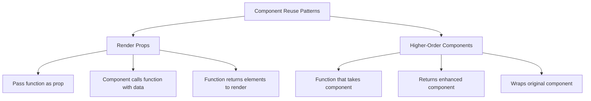

# React Render Props

## Introduction

Render props is a powerful and flexible pattern in React that allows you to share code between components. The term "render prop" refers to a technique where a component receives a function prop that returns a React element, giving the component the ability to call this function rather than implementing its own rendering logic.

This pattern solves one of the common challenges in React development: reusing component logic across multiple components. While React promotes composition for code reuse, sometimes you need to share behavior that involves state or lifecycle methods in ways that traditional composition doesn't easily solve.

## What is a Render Prop?

A render prop is a function prop that a component uses to know what to render. Instead of hard-coding a component's output or using traditional children, you provide a function that returns the elements you want rendered.

Here's the basic structure of a render prop:

```jsx
<DataProvider render={data => (
  <h1>Hello {data.name}</h1>
)}/>
```

In this example, `DataProvider` receives a function as its `render` prop. The component calls this function with some data, and the function returns the React elements to be rendered.

## Basic Example: Creating a Mouse Tracker

Let's create a simple component that tracks the mouse position and shares that information using render props:

```jsx
import React from 'react';

class MouseTracker extends React.Component {
  state = { x: 0, y: 0 };
  
  handleMouseMove = (event) => {
    this.setState({
      x: event.clientX,
      y: event.clientY
    });
  };
  
  render() {
    return (
      <div 
        style={{ height: '100vh' }} 
        onMouseMove={this.handleMouseMove}
      >
        {this.props.render(this.state)}
      </div>
    );
  }
}

// Usage
function App() {
  return (
    <MouseTracker
      render={mouse => (
        <div>
          <h1>Move your mouse around!</h1>
          <p>Current mouse position: {mouse.x}, {mouse.y}</p>
        </div>
      )}
    />
  );
}

export default App;
```

**What's happening here:**

1. The `MouseTracker` component tracks mouse position in its state
2. When the mouse moves, it updates the state
3. In the render method, it calls the function passed as the `render` prop, providing the current state
4. The App component provides this render function, which receives the mouse position and returns React elements to display

## Using the children Prop

The render prop pattern doesn't necessarily need to use a prop named "render". You can use the `children` prop to achieve the same result, which can make your code slightly more readable:

```jsx
class MouseTracker extends React.Component {
  state = { x: 0, y: 0 };
  
  handleMouseMove = (event) => {
    this.setState({
      x: event.clientX,
      y: event.clientY
    });
  };
  
  render() {
    return (
      <div 
        style={{ height: '100vh' }} 
        onMouseMove={this.handleMouseMove}
      >
        {this.props.children(this.state)}
      </div>
    );
  }
}

// Usage
function App() {
  return (
    <MouseTracker>
      {mouse => (
        <div>
          <h1>Move your mouse around!</h1>
          <p>Current mouse position: {mouse.x}, {mouse.y}</p>
        </div>
      )}
    </MouseTracker>
  );
}
```

This approach can feel more natural because it leverages React's composition model, but both patterns are functionally equivalent.

## Real-World Example: Creating a Reusable Toggle Component

Let's implement a practical example of a toggle component that can be reused across different UI elements:

```jsx
import React, { useState } from 'react';

function Toggle({ render }) {
  const [on, setOn] = useState(false);
  
  const toggle = () => {
    setOn(prevOn => !prevOn);
  };
  
  return render({ on, toggle });
}

// Usage examples
function App() {
  return (
    <div>
      <Toggle
        render={({ on, toggle }) => (
          <div>
            <h2>Example 1: Simple Button</h2>
            <button onClick={toggle}>
              {on ? 'Turn Off' : 'Turn On'}
            </button>
            <p>Status: {on ? 'ON' : 'OFF'}</p>
          </div>
        )}
      />
      
      <Toggle
        render={({ on, toggle }) => (
          <div>
            <h2>Example 2: Switch Component</h2>
            <div 
              onClick={toggle}
              style={{
                width: '50px',
                height: '25px',
                backgroundColor: on ? 'green' : 'gray',
                borderRadius: '15px',
                position: 'relative',
                cursor: 'pointer'
              }}
            >
              <div 
                style={{
                  position: 'absolute',
                  width: '21px',
                  height: '21px',
                  backgroundColor: 'white',
                  borderRadius: '50%',
                  margin: '2px',
                  transition: 'transform 0.2s',
                  transform: on ? 'translateX(25px)' : 'translateX(0)'
                }}
              />
            </div>
            <p>Switch is {on ? 'on' : 'off'}</p>
          </div>
        )}
      />
    </div>
  );
}
```

In this example, our `Toggle` component manages the toggle state and provides both the state value and a function to change it. The component itself doesn't know how it will be rendered - it just provides the necessary data and functionality through the render prop.

This shows the power of the pattern: the same core logic powers two completely different UI implementations.

## Render Props vs. Higher-Order Components

Render props and Higher-Order Components (HOCs) solve similar problems but in different ways. Here's how they compare:



Render props offer several advantages:

1. **Clearer data flow**: You can see exactly what data is being used where
2. **Avoids name collisions**: Unlike HOCs, props aren't automatically passed through
3. **Composition is more explicit**: The composition happens in the render method, not when components are defined

## Advanced Pattern: Prop Collection and Getters

We can enhance our render props components by providing collections of props that can be spread onto elements:

```jsx
function Toggle({ render }) {
  const [on, setOn] = useState(false);
  
  const toggle = () => setOn(prevOn => !prevOn);
  
  // Collection of props for the toggle button
  const getTogglerProps = (props = {}) => ({
    'aria-pressed': on,
    onClick: () => {
      toggle();
      if (props.onClick) {
        props.onClick();
      }
    },
    ...props,
  });
  
  return render({
    on,
    toggle,
    getTogglerProps
  });
}

// Usage
function App() {
  return (
    <Toggle
      render={({ on, getTogglerProps }) => (
        <div>
          <button
            {...getTogglerProps({
              id: 'custom-button',
              'aria-label': 'custom toggler',
              onClick: () => console.log('clicked'),
            })}
          >
            {on ? 'ON' : 'OFF'}
          </button>
        </div>
      )}
    />
  );
}
```

This pattern gives consumers of your component flexibility while ensuring critical props (like event handlers) are properly applied.

## Common Pitfalls and Performance Considerations

### Avoiding Inline Function Render Props

Be cautious about creating functions inside the render method:

```jsx
// Avoid this pattern in performance-critical code
<MouseTracker
  render={(mouse) => (
    <Cat mouse={mouse} />
  )}
/>
```

Each render creates a new function, which can cause unnecessary re-renders in child components. For performance-critical applications, consider defining the render function outside the render method:

```jsx
// Better for performance
const renderCat = (mouse) => <Cat mouse={mouse} />;

// In render:
<MouseTracker render={renderCat} />
```

### Using React.memo with Render Props

When using render props with functional components, you can use `React.memo` to prevent unnecessary re-rendering:

```jsx
const CatDisplay = React.memo(function CatDisplay({ mouse }) {
  return <div style={{ position: 'absolute', left: mouse.x, top: mouse.y }}>🐱</div>;
});

function renderCat(mouse) {
  return <CatDisplay mouse={mouse} />;
}

// In render:
<MouseTracker render={renderCat} />
```

## Summary

Render Props is a powerful pattern in React that enables flexible code sharing between components. By passing a function as a prop that returns what to render, components can share logic while allowing consumers to control the rendering output.

Key benefits of the render props pattern include:

- **Reuse of stateful logic** across multiple components
- **Flexibility** in what gets rendered
- **Clear separation** between data/behavior and presentation
- **Dynamic composition** that happens at render time

In modern React, this pattern remains useful even with the introduction of Hooks. While hooks like `useState` and `useEffect` can replace many use cases for render props, there are still scenarios where render props offer a more elegant solution, particularly for component library authors.

## Additional Resources and Exercises

### Resources
- [React Documentation on Render Props](https://reactjs.org/docs/render-props.html)
- [React Patterns](https://reactpatterns.com/)

### Exercises

1. **Basic Toggle**: Create a `Toggle` component that uses render props to manage showing/hiding content.

2. **Data Fetcher**: Build a `DataFetcher` component that accepts a URL and uses render props to provide loading state, error state, and the fetched data.

3. **Form Field**: Create a reusable form field component that handles validation and provides error messages using render props.

4. **Advanced**: Implement a `Draggable` component that tracks an element's position when dragged and uses render props to visualize the element in different ways.

Happy coding! The render props pattern might take a little time to master, but it's an incredibly powerful tool for creating flexible, reusable React components.