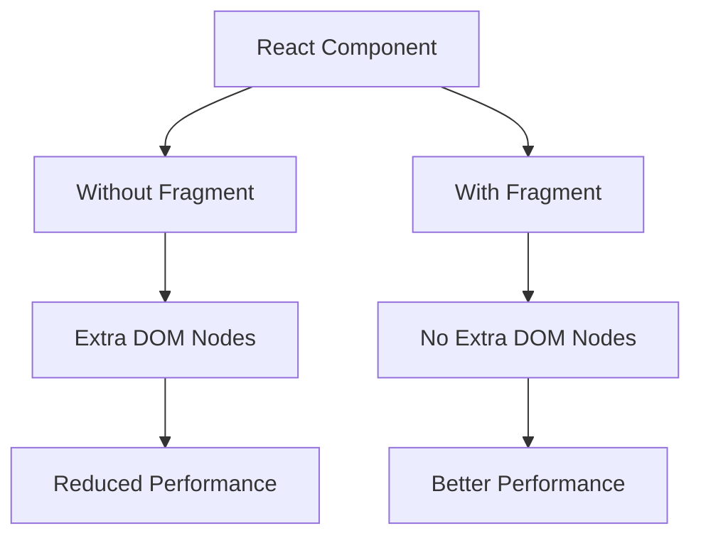

# React Fragments

## Introduction

When building React components, you'll often need to return multiple elements from a component's render method. However, JSX has a limitation - it requires all elements to be wrapped in a single parent element. This can lead to adding unnecessary wrapper `<div>` elements that can clutter your DOM structure and potentially break your CSS layouts.

React Fragments solve this problem by allowing you to group multiple elements without adding an extra node to the DOM. They're a cleaner solution that helps you maintain a more semantic HTML structure.

## Why Do We Need Fragments?

Before diving into fragments, let's understand the problem they solve:

```jsx
// Without Fragments - Problem
function ListItems() {
  return (
    <div> {/* Extra wrapper div */}
      <li>Item 1</li>
      <li>Item 2</li>
      <li>Item 3</li>
    </div>
  );
}

// Usage
function App() {
  return (
    <ul>
      <ListItems />
    </ul>
  );
}
```

In this example, the extra `<div>` inside the `<ul>` creates invalid HTML structure. The only direct children of `<ul>` elements should be `<li>` elements.

## Using React Fragments

React provides two ways to use fragments: the explicit `<React.Fragment>` syntax and the shorthand `<>...</>` syntax.

### The Long Syntax: `<React.Fragment>`

```jsx
import React from 'react';

function ListItems() {
  return (
    <React.Fragment>
      <li>Item 1</li>
      <li>Item 2</li>
      <li>Item 3</li>
    </React.Fragment>
  );
}
```

### The Short Syntax: `<>...</>`

```jsx
function ListItems() {
  return (
    <>
      <li>Item 1</li>
      <li>Item 2</li>
      <li>Item 3</li>
    </>
  );
}
```

Now the rendered HTML will be:

```html
<ul>
  <li>Item 1</li>
  <li>Item 2</li>
  <li>Item 3</li>
</ul>
```

No extra DOM nodes are created, resulting in cleaner HTML output!

## When to Use Fragments

Fragments are particularly useful in several scenarios:

### 1. Returning Multiple Elements

```jsx
function Header() {
  return (
    <>
      <h1>Welcome to My Website</h1>
      <p>This is a description of my site</p>
    </>
  );
}
```

### 2. Creating Tables

When working with tables, proper HTML structure is essential:

```jsx
function TableRows() {
  return (
    <>
      <tr>
        <td>Cell 1</td>
        <td>Cell 2</td>
      </tr>
      <tr>
        <td>Cell 3</td>
        <td>Cell 4</td>
      </tr>
    </>
  );
}

function Table() {
  return (
    <table>
      <tbody>
        <TableRows />
      </tbody>
    </table>
  );
}
```

### 3. Lists of Elements

```jsx
function TodoList({ todos }) {
  return (
    <ul>
      {todos.map(todo => (
        // Using Fragment with key prop
        <React.Fragment key={todo.id}>
          <li>{todo.task}</li>
          <li><small>Priority: {todo.priority}</small></li>
        </React.Fragment>
      ))}
    </ul>
  );
}
```

## Fragments with Keys

When you need to assign keys to fragments, like in a loop or a map, you must use the long `<React.Fragment>` syntax, as shown in the TodoList example above.

The short syntax `<>...</>` doesn't support the key attribute.

## Practical Example: Card Component

Let's create a simple card component that uses fragments to properly structure its content:

```jsx
function CardHeader({ title, subtitle }) {
  return (
    <>
      <h2>{title}</h2>
      {subtitle && <h3>{subtitle}</h3>}
    </>
  );
}

function CardBody({ children }) {
  return <>{children}</>;
}

function CardFooter({ actions }) {
  return (
    <>
      {actions.map((action, index) => (
        <button key={index} onClick={action.handler}>
          {action.label}
        </button>
      ))}
    </>
  );
}

function Card({ title, subtitle, children, actions }) {
  return (
    <div className="card">
      <div className="card-header">
        <CardHeader title={title} subtitle={subtitle} />
      </div>
      <div className="card-body">
        <CardBody>{children}</CardBody>
      </div>
      <div className="card-footer">
        <CardFooter actions={actions} />
      </div>
    </div>
  );
}
```

## Performance Benefits

Using fragments can slightly improve performance because React doesn't need to create and manage additional DOM nodes that aren't necessary for your app's structure. While the performance boost is minimal for small applications, it can become noticeable in larger applications with deeply nested components.



## Common Mistakes and How to Avoid Them

### Mistake 1: Using Fragments When a Container is Needed

Fragments don't render any HTML element, so they can't have styles or event handlers. If you need these, use a real DOM element:

```jsx
// Incorrect - trying to style a fragment
function StyledComponent() {
  return (
    <> {/* Can't add styles to fragments */}
      <h2>Title</h2>
      <p>Content</p>
    </>
  );
}

// Correct - using a container when styles are needed
function StyledComponent() {
  return (
    <div className="styled-component">
      <h2>Title</h2>
      <p>Content</p>
    </div>
  );
}
```

### Mistake 2: Forgetting to Use Keys with Fragments in Lists

When using fragments in a map or a list, remember to add keys to help React identify which items have changed:

```jsx
// Incorrect - No keys on fragments in a list
{items.map(item => (
  <>
    <span>{item.name}</span>
    <span>{item.value}</span>
  </>
))}

// Correct - Using keys with React.Fragment
{items.map(item => (
  <React.Fragment key={item.id}>
    <span>{item.name}</span>
    <span>{item.value}</span>
  </React.Fragment>
))}
```

## Summary

React Fragments are a simple but powerful feature that allow you to:

- Group multiple elements without adding extra nodes to the DOM
- Create more semantic HTML by avoiding unnecessary wrapper elements
- Slightly improve performance by reducing DOM nodes
- Use either the explicit `<React.Fragment>` syntax or the shorthand `<>...</>` syntax
- Include keys when using fragments in lists or maps (only with the explicit syntax)

Fragments are a small feature that demonstrates React's attention to the details of creating efficient and maintainable user interfaces. By using them appropriately, you can write cleaner and more semantic code.

## Exercises

1. Refactor a component that uses unnecessary wrapper divs to use fragments instead.
2. Create a table component that uses fragments to properly render rows.
3. Create a navigation bar component that returns multiple elements using fragments.
4. Build a form that splits its fields into logical groups using fragments.

## Additional Resources

- [React Official Documentation on Fragments](https://reactjs.org/docs/fragments.html)
- [React Patterns for writing cleaner components](https://reactpatterns.com/)
- [React Performance Optimization Techniques](https://reactjs.org/docs/optimizing-performance.html)

Now that you understand React Fragments, you'll be able to write cleaner, more semantic JSX code without unnecessary DOM nodes!