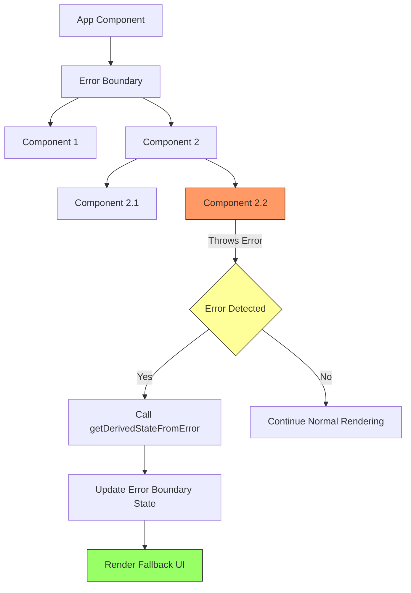

# React Error Boundaries

## Introduction

When developing React applications, errors are inevitable. Without proper error handling, a single runtime error in a component can break your entire application, resulting in a blank screen and confused users. This is where **Error Boundaries** come to the rescue.

Error Boundaries are special React components that:
- Catch JavaScript errors anywhere in their child component tree
- Log those errors
- Display a fallback UI instead of the component tree that crashed

They function similarly to try-catch blocks in JavaScript but specifically for React components.

## Why Error Boundaries?

Before Error Boundaries were introduced in React 16, errors inside components could corrupt React's internal state and cause cryptic errors on subsequent renders. Error Boundaries solve this problem by isolating errors to specific component trees rather than bringing down the entire application.

## How Error Boundaries Work

An Error Boundary is a class component that defines either (or both) of these lifecycle methods:
- `static getDerivedStateFromError()`
- `componentDidCatch()`

Let's start by creating a basic Error Boundary component:

```jsx
class ErrorBoundary extends React.Component {
  constructor(props) {
    super(props);
    this.state = { hasError: false };
  }

  static getDerivedStateFromError(error) {
    // Update state so the next render shows the fallback UI
    return { hasError: true };
  }

  componentDidCatch(error, errorInfo) {
    // You can log the error to an error reporting service
    console.error("Error caught by Error Boundary:", error, errorInfo);
  }

  render() {
    if (this.state.hasError) {
      // You can render any custom fallback UI
      return <h1>Something went wrong.</h1>;
    }

    return this.props.children;
  }
}
```

### Understanding the Lifecycle Methods

1. **`static getDerivedStateFromError(error)`**
   - Called during the render phase
   - Used to render a fallback UI after an error is thrown
   - Cannot perform side effects (like logging)

2. **`componentDidCatch(error, errorInfo)`**
   - Called during the commit phase
   - Used for side effects like logging errors
   - Receives additional information in `errorInfo` parameter

## Using Error Boundaries

To use an Error Boundary, simply wrap the components that might error with it:

```jsx
import React from 'react';

// Component that might throw an error
function BuggyCounter() {
  const [counter, setCounter] = React.useState(0);

  function handleClick() {
    setCounter(prevCounter => {
      // When counter reaches 5, we'll throw an error
      if (prevCounter === 4) {
        throw new Error("I crashed when reaching 5!");
      }
      return prevCounter + 1;
    });
  }

  return (
    <div>
      <p>Counter: {counter}</p>
      <button onClick={handleClick}>Increment</button>
    </div>
  );
}

// App component using the Error Boundary
function App() {
  return (
    <div>
      <h1>Error Boundary Example</h1>
      <ErrorBoundary>
        <BuggyCounter />
      </ErrorBoundary>
    </div>
  );
}
```

In the example above:
1. We have a `BuggyCounter` component that throws an error when the counter reaches 5
2. We wrap it with our `ErrorBoundary` component
3. When the error occurs, instead of crashing the whole application, the Error Boundary catches the error and displays "Something went wrong."

## Granular Error Handling

You can use multiple Error Boundaries to wrap different parts of your application for more granular error handling:

```jsx
function App() {
  return (
    <div>
      <h1>React Error Boundaries Demo</h1>
      
      <ErrorBoundary>
        <h2>Feature 1</h2>
        <BuggyComponent1 />
      </ErrorBoundary>
      
      <ErrorBoundary>
        <h2>Feature 2</h2>
        <BuggyComponent2 />
      </ErrorBoundary>
    </div>
  );
}
```

This way, if `BuggyComponent1` crashes, `BuggyComponent2` will still function normally, as they're wrapped in separate Error Boundaries.

## Creating a Reusable Error Boundary

Let's create a more advanced, reusable Error Boundary with customizable fallback UI and error reporting:

```jsx
class ErrorBoundary extends React.Component {
  constructor(props) {
    super(props);
    this.state = { 
      hasError: false,
      error: null,
      errorInfo: null
    };
  }

  static getDerivedStateFromError(error) {
    return { hasError: true };
  }

  componentDidCatch(error, errorInfo) {
    // Update state with error details
    this.setState({
      error: error,
      errorInfo: errorInfo
    });
    
    // Log error to console or service
    if (this.props.logErrors) {
      console.error("Error caught by Error Boundary:", error, errorInfo);
      // Here you could also send to an error reporting service
      // logErrorToService(error, errorInfo);
    }
  }

  render() {
    if (this.state.hasError) {
      // Use custom fallback if provided, otherwise use default
      if (this.props.fallback) {
        return this.props.fallback(this.state.error, this.state.errorInfo);
      }
      
      // Default fallback UI
      return (
        <div className="error-boundary-fallback">
          <h2>Something went wrong</h2>
          <details style={{ whiteSpace: 'pre-wrap' }}>
            <summary>Show error details</summary>
            {this.state.error && this.state.error.toString()}
            <br />
            {this.state.errorInfo && this.state.errorInfo.componentStack}
          </details>
        </div>
      );
    }

    return this.props.children;
  }
}
```

Now we can use this reusable Error Boundary with custom props:

```jsx
function App() {
  // Custom fallback UI
  const customFallback = (error, errorInfo) => (
    <div className="custom-error">
      <h3>Oops! Something's not right 🙁</h3>
      <p>We're working on fixing this issue.</p>
      <button onClick={() => window.location.reload()}>
        Refresh Page
      </button>
    </div>
  );

  return (
    <div>
      <h1>My React App</h1>
      
      {/* Basic usage */}
      <ErrorBoundary>
        <UserProfile />
      </ErrorBoundary>
      
      {/* With custom fallback */}
      <ErrorBoundary 
        fallback={customFallback}
        logErrors={true}
      >
        <ShoppingCart />
      </ErrorBoundary>
    </div>
  );
}
```

## Error Boundaries in React Hooks

Currently, Error Boundaries are only available as class components because the required lifecycle methods don't have Hook equivalents. However, you can still use them with functional components:

```jsx
// A functional component wrapped with an Error Boundary
function UserDashboard() {
  return (
    <ErrorBoundary>
      <ProfileSection />
      <ActivityFeed />
      <SettingsPanel />
    </ErrorBoundary>
  );
}
```

## What Error Boundaries Don't Catch

It's important to note that Error Boundaries do not catch errors in:

1. **Event handlers** - These don't happen during rendering, so React doesn't need to crash the UI
2. **Asynchronous code** - Like `setTimeout` or `requestAnimationFrame` callbacks
3. **Server-side rendering**
4. **Errors thrown in the Error Boundary itself** - It cannot catch its own errors

## Error Handling for Event Handlers

Since Error Boundaries don't catch errors in event handlers, you should use regular try-catch statements:

```jsx
function Button() {
  const handleClick = () => {
    try {
      // Code that might throw an error
      processSomething();
    } catch (error) {
      // Handle the error
      console.error("Error in click handler:", error);
      // Show a user-friendly message or take appropriate action
    }
  };

  return <button onClick={handleClick}>Process</button>;
}
```

## Error Handling in Async Code

For async operations, you can use try-catch with async/await:

```jsx
function UserData() {
  const [userData, setUserData] = React.useState(null);
  const [error, setError] = React.useState(null);

  React.useEffect(() => {
    async function fetchData() {
      try {
        const response = await fetch('https://api.example.com/user');
        if (!response.ok) {
          throw new Error('Failed to fetch');
        }
        const data = await response.json();
        setUserData(data);
      } catch (error) {
        console.error("Error fetching data:", error);
        setError("Failed to load user data");
      }
    }

    fetchData();
  }, []);

  if (error) {
    return <div className="error-message">{error}</div>;
  }

  if (!userData) {
    return <div>Loading...</div>;
  }

  return <UserProfile user={userData} />;
}
```

## Real-world Example: Form Submission

Here's a practical example showing how to use Error Boundaries in a form submission scenario:

```jsx
// FormErrorBoundary.js
class FormErrorBoundary extends React.Component {
  constructor(props) {
    super(props);
    this.state = { hasError: false };
  }

  static getDerivedStateFromError(error) {
    return { hasError: true };
  }

  componentDidCatch(error, errorInfo) {
    // Send error to your error tracking service
    console.error("Form error:", error, errorInfo);
  }

  render() {
    if (this.state.hasError) {
      return (
        <div className="form-error-container">
          <h3>Sorry! There was a problem with the form.</h3>
          <p>Our team has been notified. Please try again later.</p>
          <button 
            onClick={() => this.setState({ hasError: false })}
            className="retry-button"
          >
            Try Again
          </button>
        </div>
      );
    }

    return this.props.children;
  }
}

// ContactForm.js
function ContactForm() {
  const [formData, setFormData] = React.useState({
    name: '',
    email: '',
    message: ''
  });

  const handleChange = (e) => {
    setFormData({
      ...formData,
      [e.target.name]: e.target.value
    });
  };

  const handleSubmit = (e) => {
    e.preventDefault();
    
    // Some validation that might throw an error
    if (!formData.email.includes('@')) {
      throw new Error('Invalid email format');
    }
    
    // Form submission code
    console.log('Form submitted:', formData);
  };

  return (
    <form onSubmit={handleSubmit}>
      <div>
        <label htmlFor="name">Name:</label>
        <input
          type="text"
          id="name"
          name="name"
          value={formData.name}
          onChange={handleChange}
          required
        />
      </div>
      
      <div>
        <label htmlFor="email">Email:</label>
        <input
          type="email"
          id="email"
          name="email"
          value={formData.email}
          onChange={handleChange}
          required
        />
      </div>
      
      <div>
        <label htmlFor="message">Message:</label>
        <textarea
          id="message"
          name="message"
          value={formData.message}
          onChange={handleChange}
          required
        />
      </div>
      
      <button type="submit">Send Message</button>
    </form>
  );
}

// Usage in the app
function App() {
  return (
    <div className="contact-page">
      <h1>Contact Us</h1>
      <FormErrorBoundary>
        <ContactForm />
      </FormErrorBoundary>
    </div>
  );
}
```

## Error Boundary Workflow

This diagram illustrates how Error Boundaries work in a React component tree:



## Summary

Error Boundaries provide a robust way to handle errors in React applications:

1. They catch errors during rendering, in lifecycle methods, and in constructors
2. They allow you to display fallback UIs instead of component trees that crashed
3. They help prevent entire application crashes due to errors in specific components
4. They can be customized with different fallback UIs and error reporting mechanisms
5. They can be nested for granular error handling

Remember that Error Boundaries are a safety net, not a complete error handling solution. You still need to handle errors in event handlers, async code, and server-side rendering using traditional methods.

## Additional Resources

To deepen your understanding of Error Boundaries:

- [React Documentation on Error Boundaries](https://reactjs.org/docs/error-boundaries.html)
- [Error Handling in React 16+](https://reactjs.org/blog/2017/07/26/error-handling-in-react-16.html)
- [React Error Boundary npm package](https://www.npmjs.com/package/react-error-boundary) - A lightweight package for React error handling

## Exercise

1. Create a simple React application with an Error Boundary that wraps multiple components
2. Implement a counter component similar to our `BuggyCounter` that throws errors under specific conditions
3. Enhance your Error Boundary to display different fallback UIs based on the type of error
4. Add error logging to a console or a mock error reporting service
5. Create a button in your fallback UI that allows users to retry or reset the component that failed

By incorporating Error Boundaries into your React applications, you'll create more resilient user experiences that fail gracefully instead of completely breaking.