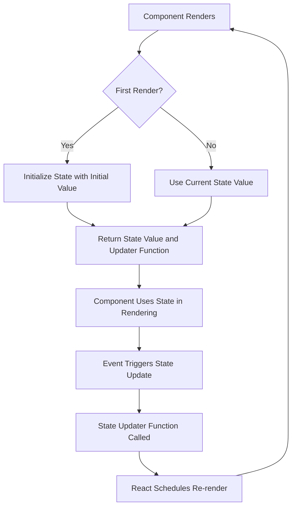

# React useState Hook

## Introduction

The `useState` hook is one of the most essential hooks in React. It allows you to add state to functional components, which was previously only possible in class components. State represents data that changes over time in your application, such as user input, toggled settings, or fetched data.

Before hooks were introduced in React 16.8, you needed to write a class component if you wanted to use state. With the `useState` hook, you can now add state to your functional components, leading to cleaner, more concise code.

## Basic Syntax

The `useState` hook is a function that takes an initial state value and returns an array with two elements:

1. The current state value
2. A function that lets you update the state

Here's the basic syntax:

```jsx
import React, { useState } from 'react';

function MyComponent() {
  // Declare a state variable named "count" with an initial value of 0
  const [count, setCount] = useState(0);
  
  // Now you can use count and setCount in your component
  return (
    <div>
      <p>You clicked {count} times</p>
      <button onClick={() => setCount(count + 1)}>
        Click me
      </button>
    </div>
  );
}
```

## How useState Works

When React renders a component that uses `useState`:

1. If it's the first render, React creates a new state variable with the provided initial value.
2. For subsequent renders, React provides the current state value.
3. When you call the state updater function (like `setCount`), React schedules a re-render of the component with the new value.

Let's break down the process with a flowchart:



## Multiple State Variables

You can use multiple `useState` hooks in a single component to manage different state values:

```jsx
function UserProfile() {
  const [name, setName] = useState('');
  const [age, setAge] = useState(0);
  const [isLoggedIn, setIsLoggedIn] = useState(false);
  
  return (
    <div>
      <input 
        value={name} 
        onChange={(e) => setName(e.target.value)} 
        placeholder="Name" 
      />
      <input 
        value={age} 
        onChange={(e) => setAge(parseInt(e.target.value) || 0)} 
        placeholder="Age"
        type="number" 
      />
      <button onClick={() => setIsLoggedIn(!isLoggedIn)}>
        {isLoggedIn ? 'Log out' : 'Log in'}
      </button>
      {isLoggedIn && <p>Welcome, {name}! You are {age} years old.</p>}
    </div>
  );
}
```

## Complex State with Objects

If your state is more complex, you can use objects:

```jsx
function ShoppingCart() {
  const [cart, setCart] = useState({
    items: [],
    total: 0,
  });
  
  const addItem = (item) => {
    // When updating an object, you need to create a new object
    // with all the previous properties (using the spread operator)
    // and then override the properties you want to change
    setCart(prevCart => ({
      ...prevCart,
      items: [...prevCart.items, item],
      total: prevCart.total + item.price
    }));
  };
  
  return (
    <div>
      <h2>Shopping Cart</h2>
      <p>Total: ${cart.total.toFixed(2)}</p>
      <button onClick={() => addItem({ id: Date.now(), name: 'Product', price: 9.99 })}>
        Add Item
      </button>
      <ul>
        {cart.items.map(item => (
          <li key={item.id}>{item.name} - ${item.price.toFixed(2)}</li>
        ))}
      </ul>
    </div>
  );
}
```

## Updating State Based on Previous State

When updating state based on the previous state value, you should use the functional form of the state updater:

```jsx
function Counter() {
  const [count, setCount] = useState(0);
  
  // Incorrect way - may lead to stale state issues
  const incorrectIncrement = () => {
    setCount(count + 1); // Using current count from closure
    setCount(count + 1); // Still using the same count value!
  };
  
  // Correct way - using functional update
  const correctIncrement = () => {
    setCount(prevCount => prevCount + 1); // Using previous state
    setCount(prevCount => prevCount + 1); // Using previous state again
  };
  
  return (
    <div>
      <p>Count: {count}</p>
      <button onClick={incorrectIncrement}>Increment by 1 (Incorrect)</button>
      <button onClick={correctIncrement}>Increment by 2 (Correct)</button>
    </div>
  );
}
```

In the example above, when clicking the "Incorrect" button, `count` will only increase by 1 because both `setCount` calls are using the same `count` value. However, with the "Correct" button, the count will increase by 2 because we're using the functional update form that guarantees we're working with the latest state.

## Lazy Initial State

If the initial state is expensive to compute, you can provide a function to `useState`:

```jsx
function ExpensiveInitialState() {
  // This function will only be executed during the first render
  const [data, setData] = useState(() => {
    console.log('Computing initial state...');
    // Expensive computation, like parsing a large JSON object
    const result = someExpensiveComputation();
    return result;
  });
  
  return (
    <div>
      <p>Data: {JSON.stringify(data)}</p>
      <button onClick={() => setData({...data, updated: true})}>
        Update Data
      </button>
    </div>
  );
}

function someExpensiveComputation() {
  // Simulate an expensive operation
  let result = { items: [] };
  for (let i = 0; i < 1000; i++) {
    result.items.push({ id: i, value: Math.random() });
  }
  return result;
}
```

## Real-World Example: Todo List

Let's build a simple Todo List application using `useState`:

```jsx
import React, { useState } from 'react';

function TodoList() {
  const [todos, setTodos] = useState([]);
  const [input, setInput] = useState('');

  const addTodo = () => {
    if (input.trim() !== '') {
      setTodos([...todos, { id: Date.now(), text: input, completed: false }]);
      setInput('');
    }
  };

  const toggleTodo = (id) => {
    setTodos(todos.map(todo => 
      todo.id === id ? { ...todo, completed: !todo.completed } : todo
    ));
  };

  const deleteTodo = (id) => {
    setTodos(todos.filter(todo => todo.id !== id));
  };

  return (
    <div className="todo-app">
      <h1>Todo List</h1>
      
      <div className="add-todo">
        <input 
          value={input} 
          onChange={(e) => setInput(e.target.value)}
          placeholder="Add a new task"
        />
        <button onClick={addTodo}>Add</button>
      </div>
      
      <ul className="todo-list">
        {todos.map(todo => (
          <li key={todo.id} className={todo.completed ? 'completed' : ''}>
            <span 
              onClick={() => toggleTodo(todo.id)}
              style={{ textDecoration: todo.completed ? 'line-through' : 'none' }}
            >
              {todo.text}
            </span>
            <button onClick={() => deleteTodo(todo.id)}>Delete</button>
          </li>
        ))}
      </ul>
      
      <div className="todo-stats">
        <p>Total: {todos.length}</p>
        <p>Completed: {todos.filter(todo => todo.completed).length}</p>
        <p>Remaining: {todos.filter(todo => !todo.completed).length}</p>
      </div>
    </div>
  );
}
```

This example demonstrates:
- Managing multiple pieces of state (`todos` array and `input` string)
- Adding items to an array state
- Updating complex state objects
- Filtering and mapping state arrays
- Building a functional user interface with state

## Best Practices

1. **Keep state minimal**: Only include values in state that your UI needs to render.

2. **Use multiple state variables**: Split state into multiple variables based on which values change together.

3. **Avoid redundant state**: Don't store values that can be computed from props or other state.

4. **Use the functional update form**: When updating state based on previous state, use the function form (`setCount(prevCount => prevCount + 1)`).

5. **Remember state updates are asynchronous**: React may batch state updates for performance reasons, so don't rely on state values being updated immediately after setting them.

6. **Group related state**: If multiple state variables always change together, consider combining them into an object.

## Common Pitfalls

### Mutating State Directly

React state should never be modified directly. Always use the setter function:

```jsx
// ❌ WRONG
const [user, setUser] = useState({ name: 'John', age: 25 });
user.age = 26; // Mutating state directly doesn't trigger re-renders

// ✅ CORRECT
setUser({ ...user, age: 26 }); // Create a new object with updated properties
```

### State Updates in Loops

Be careful with state updates in loops or rapid succession:

```jsx
// ❌ PROBLEMATIC
function problematicFunction() {
  for (let i = 0; i < 5; i++) {
    setTimeout(() => {
      setCount(count + 1); // Uses stale closure value of count
    }, 1000);
  }
}

// ✅ CORRECT
function correctFunction() {
  for (let i = 0; i < 5; i++) {
    setTimeout(() => {
      setCount(prevCount => prevCount + 1); // Uses the latest state value
    }, 1000);
  }
}
```

### State Updates from Props

If you need to synchronize state with props, consider using the `useEffect` hook:

```jsx
function ProfileCard({ user }) {
  // Initialize state based on props
  const [localUser, setLocalUser] = useState(user);
  
  // Keep local state in sync with prop changes
  useEffect(() => {
    setLocalUser(user);
  }, [user]);
  
  return <div>...</div>;
}
```

## Summary

The `useState` hook is a powerful tool in React that enables functional components to manage state. In this guide, we've covered:

- The basic syntax and usage of `useState`
- How to handle multiple state variables
- Working with complex state objects and arrays
- Updating state based on previous values
- Initializing state lazily for performance
- A real-world example of a Todo List application
- Best practices and common pitfalls

Understanding and using the `useState` hook properly is fundamental to building interactive React applications. As you become more comfortable with it, you'll be able to create more complex stateful behaviors in your functional components.

## Additional Resources

- [Official React Documentation on useState](https://reactjs.org/docs/hooks-state.html)
- [React Hooks FAQ](https://reactjs.org/docs/hooks-faq.html)

## Practice Exercises

1. **Counter App**: Create a counter with increment, decrement, and reset buttons.

2. **Form Handler**: Build a form with multiple input fields that updates state as the user types.

3. **Toggle Component**: Create a component that toggles between showing and hiding content when a button is clicked.

4. **Shopping List**: Build a shopping list application where users can add items, mark them as purchased, and remove them.

5. **Advanced Challenge**: Create a multi-step form where each step has different fields and the final submission combines all the data.

By working through these exercises, you'll gain practical experience using the `useState` hook in different scenarios and build a strong foundation for state management in React.