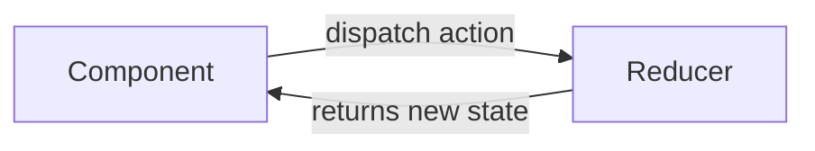

# React useReducer Hook

## Introduction

When managing state in React components becomes complex with multiple sub-values or when the next state depends on the previous state, `useState` might not be the most efficient solution. This is where the `useReducer` hook comes in - a powerful alternative that follows a pattern inspired by Redux.

The `useReducer` hook is particularly useful when you have:
- Complex state logic that involves multiple sub-values
- State transitions that depend on previous state
- Related pieces of state that should be updated together

## Understanding useReducer

### Basic Syntax

```jsx
const [state, dispatch] = useReducer(reducer, initialState, init);
```

Let's break down these parameters:

- **state**: The current state value
- **dispatch**: A function to dispatch actions to update the state
- **reducer**: A function that determines how the state should change in response to actions
- **initialState**: The initial state value
- **init** (optional): A function to lazily initialize the state

## How useReducer Works

The reducer pattern follows this simple flow:



1. Your component dispatches an action (usually an object with a "type" property)
2. The reducer function receives the current state and the action
3. The reducer returns a new state based on the action type
4. The component re-renders with the new state

### Basic Example

Let's create a simple counter using `useReducer`:

```jsx
import { useReducer } from 'react';

// Reducer function
const counterReducer = (state, action) => {
  switch (action.type) {
    case 'increment':
      return { count: state.count + 1 };
    case 'decrement':
      return { count: state.count - 1 };
    case 'reset':
      return { count: 0 };
    default:
      return state;
  }
};

function Counter() {
  // Initialize useReducer with the reducer function and initial state
  const [state, dispatch] = useReducer(counterReducer, { count: 0 });

  return (
    <div>
      <p>Count: {state.count}</p>
      <button onClick={() => dispatch({ type: 'increment' })}>
        Increment
      </button>
      <button onClick={() => dispatch({ type: 'decrement' })}>
        Decrement
      </button>
      <button onClick={() => dispatch({ type: 'reset' })}>
        Reset
      </button>
    </div>
  );
}
```

In this example:
- The `counterReducer` function handles three types of actions: 'increment', 'decrement', and 'reset'
- We initialize our state with `{ count: 0 }`
- The `dispatch` function is used to send actions to the reducer
- The component re-renders with the updated state after each action

## Comparing useState and useReducer

When should you use `useReducer` instead of `useState`? Here's a quick comparison:

| Feature | useState | useReducer |
|---------|----------|------------|
| Code size | Compact for simple state | Better for complex state logic |
| Predictability | Less predictable with complex updates | More predictable with explicit actions |
| Related state transitions | Requires multiple state updates | Single dispatch can update multiple values |
| Debugging | Harder to track state changes | Easier with explicit actions and reducers |
| Testing | More tightly coupled to component | Pure reducer functions are easy to test |

## Advanced Patterns with useReducer

### Using Action Payloads

You can pass additional data with your actions:

```jsx
import { useReducer } from 'react';

const todoReducer = (state, action) => {
  switch (action.type) {
    case 'add':
      return [...state, {
        id: Date.now(),
        text: action.payload,
        completed: false
      }];
    case 'toggle':
      return state.map(todo => 
        todo.id === action.payload 
          ? { ...todo, completed: !todo.completed } 
          : todo
      );
    case 'remove':
      return state.filter(todo => todo.id !== action.payload);
    default:
      return state;
  }
};

function TodoList() {
  const [todos, dispatch] = useReducer(todoReducer, []);
  const [text, setText] = useState('');

  const handleSubmit = (e) => {
    e.preventDefault();
    if (!text.trim()) return;
    dispatch({ type: 'add', payload: text });
    setText('');
  };

  return (
    <div>
      <form onSubmit={handleSubmit}>
        <input 
          value={text} 
          onChange={e => setText(e.target.value)} 
          placeholder="Add todo"
        />
        <button type="submit">Add</button>
      </form>
      <ul>
        {todos.map(todo => (
          <li key={todo.id}>
            <span 
              style={{ textDecoration: todo.completed ? 'line-through' : 'none' }}
              onClick={() => dispatch({ type: 'toggle', payload: todo.id })}
            >
              {todo.text}
            </span>
            <button onClick={() => dispatch({ type: 'remove', payload: todo.id })}>
              Delete
            </button>
          </li>
        ))}
      </ul>
    </div>
  );
}
```

### Lazy Initialization

For expensive initial state calculations, you can use the third parameter of `useReducer`:

```jsx
const init = (initialCount) => {
  // Perform expensive calculation here
  return { count: initialCount };
};

function Counter({ initialCount }) {
  const [state, dispatch] = useReducer(counterReducer, initialCount, init);
  
  // rest of component...
}
```

### Multiple Reducers

For large applications, you can split your state management into multiple reducers:

```jsx
function App() {
  const [userState, userDispatch] = useReducer(userReducer, initialUserState);
  const [todoState, todoDispatch] = useReducer(todoReducer, initialTodoState);
  
  return (
    <UserContext.Provider value={{ userState, userDispatch }}>
      <TodoContext.Provider value={{ todoState, todoDispatch }}>
        {/* Components */}
      </TodoContext.Provider>
    </UserContext.Provider>
  );
}
```

## Real-World Example: Form Management

Here's a practical example of using `useReducer` to manage a complex form:

```jsx
import { useReducer } from 'react';

// Define initial state
const initialState = {
  username: '',
  email: '',
  password: '',
  confirmPassword: '',
  touched: {
    username: false,
    email: false,
    password: false,
    confirmPassword: false
  },
  errors: {
    username: '',
    email: '',
    password: '',
    confirmPassword: ''
  },
  isSubmitting: false
};

// Define reducer function
const formReducer = (state, action) => {
  switch (action.type) {
    case 'field': {
      const { field, value } = action.payload;
      return {
        ...state,
        [field]: value
      };
    }
    case 'touch': {
      const { field } = action.payload;
      return {
        ...state,
        touched: {
          ...state.touched,
          [field]: true
        }
      };
    }
    case 'validate': {
      const errors = {};
      
      // Username validation
      if (!state.username) {
        errors.username = 'Username is required';
      }
      
      // Email validation
      if (!state.email) {
        errors.email = 'Email is required';
      } else if (!/\S+@\S+\.\S+/.test(state.email)) {
        errors.email = 'Email is invalid';
      }
      
      // Password validation
      if (!state.password) {
        errors.password = 'Password is required';
      } else if (state.password.length < 8) {
        errors.password = 'Password must be at least 8 characters';
      }
      
      // Confirm password validation
      if (state.password !== state.confirmPassword) {
        errors.confirmPassword = 'Passwords do not match';
      }
      
      return {
        ...state,
        errors
      };
    }
    case 'submit':
      return {
        ...state,
        isSubmitting: true
      };
    case 'success':
      return {
        ...initialState
      };
    case 'error':
      return {
        ...state,
        isSubmitting: false,
        errors: action.payload
      };
    default:
      return state;
  }
};

function SignupForm() {
  const [state, dispatch] = useReducer(formReducer, initialState);
  const { username, email, password, confirmPassword, touched, errors, isSubmitting } = state;
  
  const handleChange = (e) => {
    const { name, value } = e.target;
    dispatch({
      type: 'field',
      payload: { field: name, value }
    });
  };
  
  const handleBlur = (e) => {
    const { name } = e.target;
    dispatch({
      type: 'touch',
      payload: { field: name }
    });
    dispatch({ type: 'validate' });
  };
  
  const handleSubmit = async (e) => {
    e.preventDefault();
    dispatch({ type: 'validate' });
    
    // Check if there are any errors
    const hasErrors = Object.values(errors).some(error => error);
    if (!hasErrors) {
      dispatch({ type: 'submit' });
      
      try {
        // Simulate API call
        await new Promise(resolve => setTimeout(resolve, 1000));
        dispatch({ type: 'success' });
        alert('Form submitted successfully!');
      } catch (error) {
        dispatch({
          type: 'error',
          payload: { submit: 'Submission failed' }
        });
      }
    }
  };
  
  return (
    <form onSubmit={handleSubmit}>
      <div>
        <label htmlFor="username">Username</label>
        <input
          type="text"
          id="username"
          name="username"
          value={username}
          onChange={handleChange}
          onBlur={handleBlur}
        />
        {touched.username && errors.username && (
          <div className="error">{errors.username}</div>
        )}
      </div>
      
      <div>
        <label htmlFor="email">Email</label>
        <input
          type="email"
          id="email"
          name="email"
          value={email}
          onChange={handleChange}
          onBlur={handleBlur}
        />
        {touched.email && errors.email && (
          <div className="error">{errors.email}</div>
        )}
      </div>
      
      <div>
        <label htmlFor="password">Password</label>
        <input
          type="password"
          id="password"
          name="password"
          value={password}
          onChange={handleChange}
          onBlur={handleBlur}
        />
        {touched.password && errors.password && (
          <div className="error">{errors.password}</div>
        )}
      </div>
      
      <div>
        <label htmlFor="confirmPassword">Confirm Password</label>
        <input
          type="password"
          id="confirmPassword"
          name="confirmPassword"
          value={confirmPassword}
          onChange={handleChange}
          onBlur={handleBlur}
        />
        {touched.confirmPassword && errors.confirmPassword && (
          <div className="error">{errors.confirmPassword}</div>
        )}
      </div>
      
      <button type="submit" disabled={isSubmitting}>
        {isSubmitting ? 'Submitting...' : 'Sign Up'}
      </button>
    </form>
  );
}
```

This example demonstrates using `useReducer` to:
- Handle multiple form fields
- Track which fields have been touched
- Validate fields and store errors
- Manage form submission state

## Best Practices for useReducer

1. **Keep reducers pure**: Reducers should be pure functions without side effects.
2. **Use action constants**: Define action types as constants to avoid typos.
3. **Structure your actions**: Use a consistent pattern for actions, such as the [Flux Standard Action](https://github.com/redux-utilities/flux-standard-action).
4. **Split complex reducers**: Break down complex reducers into smaller functions.
5. **Choose the right state shape**: Plan your state structure carefully for ease of updates.
6. **Combine with Context API**: For global state management, combine `useReducer` with React's Context API.

## Summary

The `useReducer` hook provides a powerful way to manage complex state in React applications. It follows a predictable pattern inspired by Redux, making your state transitions more explicit and easier to understand.

Key benefits of using `useReducer`:
- Centralized state logic
- Predictable updates through actions
- Easier testing with pure reducer functions
- Simplified handling of complex state

When your component's state logic becomes complex, consider reaching for `useReducer` as a more structured alternative to `useState`.

## Further Learning Resources

- [React Official Documentation on useReducer](https://reactjs.org/docs/hooks-reference.html#usereducer)
- [Kent C. Dodds' article on useReducer vs useState](https://kentcdodds.com/blog/should-i-usestate-or-usereducer)
- [Understanding the Reducer Pattern](https://css-tricks.com/understanding-the-almighty-reducer/)

## Exercises

1. Convert an existing component that uses multiple `useState` hooks to use `useReducer` instead.
2. Build a shopping cart with `useReducer` that allows adding, removing, and updating quantities of items.
3. Create a form with multiple fields and validations using `useReducer`.
4. Implement a task management application with features like adding, completing, and filtering tasks.
5. Combine `useReducer` with the Context API to create a global state management solution for a small application.