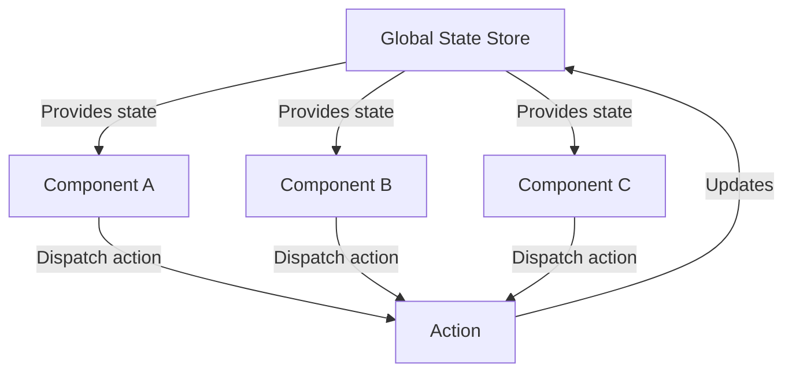

# React Global State

## Introduction

In React applications, managing state that needs to be accessed by multiple components can become challenging with just local component state. When data needs to be shared across components that aren't directly connected in the component tree, we need a global state management solution.

Global state management allows you to:

- Share data across components without prop drilling
- Maintain a single source of truth for your application data
- Efficiently update multiple components when shared data changes
- Create more maintainable and scalable applications

In this guide, we'll explore different approaches to managing global state in React, starting with built-in solutions and progressing to more advanced patterns.

## The Problem with Local State

Let's start by understanding the limitations of local component state:

```jsx
function ParentComponent() {
  const [user, setUser] = useState({ name: "John", role: "Admin" });
  
  return (
    <div>
      <Header user={user} />
      <Main user={user} setUser={setUser} />
      <Footer user={user} />
    </div>
  );
}
```

This approach works for simple cases, but what if:
- The component tree is deep and you need to pass props through many layers?
- Multiple components need to update the same data?
- Components in different branches need access to the same state?

This is where global state management becomes necessary.

## Using React Context API

The Context API is React's built-in solution for sharing state across components without explicitly passing props through every level.

### Creating a Context

```jsx
// UserContext.js
import { createContext, useState } from 'react';

// Create the context
export const UserContext = createContext();

// Create a provider component
export function UserProvider({ children }) {
  const [user, setUser] = useState({ name: "John", role: "Admin" });

  return (
    <UserContext.Provider value={{ user, setUser }}>
      {children}
    </UserContext.Provider>
  );
}
```

### Wrapping the App with the Provider

```jsx
// App.js
import { UserProvider } from './UserContext';
import Dashboard from './Dashboard';

function App() {
  return (
    <UserProvider>
      <Dashboard />
    </UserProvider>
  );
}
```

### Consuming the Context

```jsx
// UserProfile.js
import { useContext } from 'react';
import { UserContext } from './UserContext';

function UserProfile() {
  const { user, setUser } = useContext(UserContext);
  
  const updateUsername = () => {
    setUser({ ...user, name: "Jane" });
  };
  
  return (
    <div>
      <h2>User Profile</h2>
      <p>Name: {user.name}</p>
      <p>Role: {user.role}</p>
      <button onClick={updateUsername}>Change Name</button>
    </div>
  );
}
```

### Creating Custom Context Hooks

To improve the developer experience, we can create custom hooks for our contexts:

```jsx
// UserContext.js (extended)
import { createContext, useState, useContext } from 'react';

const UserContext = createContext();

export function UserProvider({ children }) {
  const [user, setUser] = useState({ name: "John", role: "Admin" });

  return (
    <UserContext.Provider value={{ user, setUser }}>
      {children}
    </UserContext.Provider>
  );
}

// Custom hook for using user context
export function useUser() {
  const context = useContext(UserContext);
  if (context === undefined) {
    throw new Error('useUser must be used within a UserProvider');
  }
  return context;
}
```

Now components can simply use:

```jsx
// UserProfile.js (simplified)
import { useUser } from './UserContext';

function UserProfile() {
  const { user, setUser } = useUser();
  
  // Component code using user state
}
```

## Building a Global State Hook

For simpler applications, we can create a custom global state hook:

```jsx
// useGlobalState.js
import { useState, createContext, useContext } from 'react';

const GlobalStateContext = createContext();

export function GlobalStateProvider({ children, initialState = {} }) {
  const [state, setState] = useState(initialState);

  const setGlobalState = (key, value) => {
    setState(prevState => ({
      ...prevState,
      [key]: value
    }));
  };

  return (
    <GlobalStateContext.Provider value={{ state, setGlobalState }}>
      {children}
    </GlobalStateContext.Provider>
  );
}

export function useGlobalState() {
  const context = useContext(GlobalStateContext);
  if (!context) {
    throw new Error('useGlobalState must be used within a GlobalStateProvider');
  }
  return context;
}
```

### Using the Global State Hook

```jsx
// App.js
import { GlobalStateProvider } from './useGlobalState';
import Dashboard from './Dashboard';

function App() {
  const initialState = {
    user: { name: 'John', role: 'Admin' },
    theme: 'light',
    notifications: []
  };

  return (
    <GlobalStateProvider initialState={initialState}>
      <Dashboard />
    </GlobalStateProvider>
  );
}

// Component.js
import { useGlobalState } from './useGlobalState';

function ThemeToggler() {
  const { state, setGlobalState } = useGlobalState();
  
  const toggleTheme = () => {
    setGlobalState('theme', state.theme === 'light' ? 'dark' : 'light');
  };
  
  return (
    <button onClick={toggleTheme}>
      Switch to {state.theme === 'light' ? 'dark' : 'light'} mode
    </button>
  );
}
```

## Managing Complex State with Reducers

For more complex state logic, we can combine Context API with reducers:

```jsx
// AppState.js
import { createContext, useContext, useReducer } from 'react';

// Define initial state
const initialState = {
  user: null,
  theme: 'light',
  isAuthenticated: false,
  notifications: []
};

// Define reducer
function appReducer(state, action) {
  switch (action.type) {
    case 'LOGIN':
      return {
        ...state,
        user: action.payload,
        isAuthenticated: true
      };
    case 'LOGOUT':
      return {
        ...state,
        user: null,
        isAuthenticated: false
      };
    case 'TOGGLE_THEME':
      return {
        ...state,
        theme: state.theme === 'light' ? 'dark' : 'light'
      };
    case 'ADD_NOTIFICATION':
      return {
        ...state,
        notifications: [...state.notifications, action.payload]
      };
    default:
      return state;
  }
}

// Create context
const AppStateContext = createContext();

// Create provider
export function AppStateProvider({ children }) {
  const [state, dispatch] = useReducer(appReducer, initialState);
  
  return (
    <AppStateContext.Provider value={{ state, dispatch }}>
      {children}
    </AppStateContext.Provider>
  );
}

// Custom hook for using the app state
export function useAppState() {
  const context = useContext(AppStateContext);
  if (context === undefined) {
    throw new Error('useAppState must be used within an AppStateProvider');
  }
  return context;
}
```

### Using the Reducer-Based State

```jsx
// LoginComponent.js
import { useAppState } from './AppState';

function LoginComponent() {
  const { dispatch } = useAppState();
  
  const handleLogin = (userData) => {
    // Imagine this comes from a form or API
    dispatch({
      type: 'LOGIN',
      payload: { id: 1, name: 'John Doe', email: 'john@example.com' }
    });
  };
  
  return (
    <button onClick={handleLogin}>Log In</button>
  );
}

// Header.js
import { useAppState } from './AppState';

function Header() {
  const { state, dispatch } = useAppState();
  
  return (
    <header className={`header-${state.theme}`}>
      {state.isAuthenticated ? (
        <>
          <span>Welcome, {state.user.name}</span>
          <button onClick={() => dispatch({ type: 'LOGOUT' })}>
            Log Out
          </button>
        </>
      ) : (
        <LoginButton />
      )}
      <button onClick={() => dispatch({ type: 'TOGGLE_THEME' })}>
        Switch to {state.theme === 'light' ? 'dark' : 'light'} theme
      </button>
    </header>
  );
}
```

## Real-World Example: Shopping Cart

Let's implement a simple shopping cart using global state:

```jsx
// CartContext.js
import { createContext, useContext, useReducer } from 'react';

const CartContext = createContext();

const initialState = {
  items: [],
  total: 0
};

function cartReducer(state, action) {
  switch (action.type) {
    case 'ADD_ITEM': {
      const existingItemIndex = state.items.findIndex(
        item => item.id === action.payload.id
      );
      
      let newItems;
      
      if (existingItemIndex >= 0) {
        newItems = [...state.items];
        newItems[existingItemIndex] = {
          ...newItems[existingItemIndex],
          quantity: newItems[existingItemIndex].quantity + 1
        };
      } else {
        newItems = [...state.items, { ...action.payload, quantity: 1 }];
      }
      
      const total = newItems.reduce(
        (sum, item) => sum + item.price * item.quantity,
        0
      );
      
      return { items: newItems, total };
    }
    
    case 'REMOVE_ITEM': {
      const newItems = state.items.filter(item => item.id !== action.payload);
      const total = newItems.reduce(
        (sum, item) => sum + item.price * item.quantity,
        0
      );
      return { items: newItems, total };
    }
    
    case 'CLEAR_CART':
      return initialState;
      
    default:
      return state;
  }
}

export function CartProvider({ children }) {
  const [state, dispatch] = useReducer(cartReducer, initialState);
  
  return (
    <CartContext.Provider value={{ state, dispatch }}>
      {children}
    </CartContext.Provider>
  );
}

export function useCart() {
  const context = useContext(CartContext);
  if (context === undefined) {
    throw new Error('useCart must be used within a CartProvider');
  }
  return context;
}
```

### Using the Cart Context

```jsx
// App.js
import { CartProvider } from './CartContext';
import ProductList from './ProductList';
import Cart from './Cart';

function App() {
  return (
    <CartProvider>
      <div className="app">
        <h1>Online Store</h1>
        <div className="container">
          <ProductList />
          <Cart />
        </div>
      </div>
    </CartProvider>
  );
}

// ProductList.js
import { useCart } from './CartContext';

function ProductList() {
  const { dispatch } = useCart();
  
  const products = [
    { id: 1, name: 'Keyboard', price: 59.99 },
    { id: 2, name: 'Mouse', price: 29.99 },
    { id: 3, name: 'Monitor', price: 199.99 }
  ];
  
  const addToCart = (product) => {
    dispatch({
      type: 'ADD_ITEM',
      payload: product
    });
  };
  
  return (
    <div className="product-list">
      <h2>Products</h2>
      <ul>
        {products.map(product => (
          <li key={product.id}>
            <span>{product.name} - ${product.price}</span>
            <button onClick={() => addToCart(product)}>
              Add to Cart
            </button>
          </li>
        ))}
      </ul>
    </div>
  );
}

// Cart.js
import { useCart } from './CartContext';

function Cart() {
  const { state, dispatch } = useCart();
  
  const removeItem = (itemId) => {
    dispatch({
      type: 'REMOVE_ITEM',
      payload: itemId
    });
  };
  
  const clearCart = () => {
    dispatch({ type: 'CLEAR_CART' });
  };
  
  return (
    <div className="cart">
      <h2>Shopping Cart</h2>
      {state.items.length === 0 ? (
        <p>Your cart is empty</p>
      ) : (
        <>
          <ul>
            {state.items.map(item => (
              <li key={item.id}>
                {item.name} - ${item.price} × {item.quantity}
                <button onClick={() => removeItem(item.id)}>
                  Remove
                </button>
              </li>
            ))}
          </ul>
          <p>Total: ${state.total.toFixed(2)}</p>
          <button onClick={clearCart}>Clear Cart</button>
        </>
      )}
    </div>
  );
}
```

## State Management Flow

To visualize how global state management works in React applications:



## Best Practices for Global State Management

1. **Don't overuse global state**
   - Not everything needs to be in global state
   - Keep component-specific state local when possible

2. **Organize by feature**
   - Create separate contexts for different domains (user, cart, settings)
   - This makes your application more maintainable

3. **Separate reads from writes**
   - Consider using separate hooks for reading and writing state
   - This follows the principle of least privilege

4. **Optimize renders**
   - Split your context to prevent unnecessary re-renders
   - Use `useMemo` and `useCallback` for complex derived state

5. **Document your state shape**
   - Add TypeScript interfaces or PropTypes
   - Include comments explaining state structure and update patterns

## When to Use External Libraries

While React's built-in Context API works well for many applications, larger projects may benefit from specialized state management libraries:

- **Redux**: For complex applications with many state interactions
- **Zustand**: Simpler alternative to Redux with a more modern API
- **Jotai/Recoil**: Atomic state management with fine-grained updates
- **MobX**: For reactive state management with less boilerplate

Consider using these libraries when:
- Your application state becomes very complex
- You need advanced features like middleware, time-travel debugging
- Performance becomes an issue with Context API
- Your team is already familiar with a particular library

## Summary

Global state management in React allows you to share data across components without prop drilling. We've explored several approaches:

- **React Context API**: Built-in solution for sharing state
- **Custom hooks**: Simplifies access to shared state
- **Context + Reducers**: For more complex state logic with predictable updates
- **Feature-specific context**: Dividing global state by domain

By understanding these patterns, you can choose the right approach for your specific needs, creating more maintainable React applications with efficient state management.

## Exercises

1. Create a theme context that provides light/dark mode functionality
2. Implement a notification system using global state
3. Build a user authentication flow with protected routes using Context API
4. Refactor the shopping cart example to use multiple contexts for different features
5. Add persistence to global state using localStorage and useEffect

## Additional Resources

- [React Context API Documentation](https://reactjs.org/docs/context.html)
- [Using the useReducer Hook](https://reactjs.org/docs/hooks-reference.html#usereducer)
- [You Might Not Need Redux](https://medium.com/@dan_abramov/you-might-not-need-redux-be46360cf367)
- [Kent C. Dodds: Application State Management](https://kentcdodds.com/blog/application-state-management-with-react)