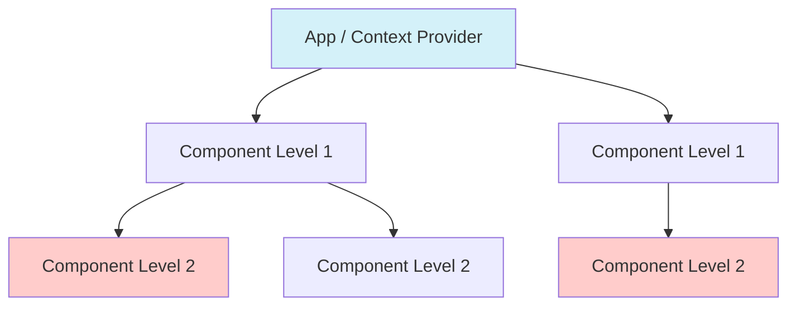

# React Context API

## Introduction

Managing state in React applications becomes increasingly challenging as your application grows. Passing props down through multiple component layers (commonly known as "prop drilling") can make your code verbose and difficult to maintain. The React Context API provides an elegant solution to this problem by allowing you to share state across your component tree without explicitly passing props.

In this guide, you'll learn:
- What the Context API is and when to use it
- How to create and use Context in React
- Advanced patterns with Context
- Best practices and common pitfalls

## What is React Context API?

React Context API is a built-in feature that enables you to share data (like themes, user authentication, language preferences) between components without having to explicitly pass props through every level of the component tree.



Without Context, data flows from parent to child through props. With Context, any component in the tree can access the context data directly.

## When to Use Context API

Context is ideal for:
- Theming (dark/light mode)
- User authentication state
- Localization/language preferences
- Feature flags
- Any data that is considered "global" for a tree of React components

Context should **not** be used for every state in your application. For local component state, stick with `useState` or `useReducer`.

## Creating and Using Context

Let's go through a simple example of using Context API to manage a theme.

### Step 1: Create the Context

First, we need to create a context:

```jsx
// ThemeContext.js
import { createContext, useState } from 'react';

// Create the context
export const ThemeContext = createContext();

// Create a provider component
export const ThemeProvider = ({ children }) => {
  const [theme, setTheme] = useState('light');
  
  const toggleTheme = () => {
    setTheme(prevTheme => prevTheme === 'light' ? 'dark' : 'light');
  };
  
  // The value that will be provided to consumers
  const value = {
    theme,
    toggleTheme
  };
  
  return (
    <ThemeContext.Provider value={value}>
      {children}
    </ThemeContext.Provider>
  );
};
```

### Step 2: Provide the Context

Now, wrap your component tree with the provider:

```jsx
// App.js
import { ThemeProvider } from './ThemeContext';
import MainContent from './MainContent';

function App() {
  return (
    <ThemeProvider>
      <div className="App">
        <h1>Context API Example</h1>
        <MainContent />
      </div>
    </ThemeProvider>
  );
}

export default App;
```

### Step 3: Consume the Context

There are two ways to consume context:

#### Using useContext Hook (Recommended)

```jsx
// MainContent.js
import { useContext } from 'react';
import { ThemeContext } from './ThemeContext';

function MainContent() {
  // Use the context
  const { theme, toggleTheme } = useContext(ThemeContext);
  
  return (
    <div className={`content ${theme}`}>
      <h2>Current theme: {theme}</h2>
      <button onClick={toggleTheme}>Toggle Theme</button>
      <p>This content changes based on the theme!</p>
    </div>
  );
}

export default MainContent;
```

#### Using Consumer Component (Class Components)

```jsx
// ClassComponentExample.js
import { Component } from 'react';
import { ThemeContext } from './ThemeContext';

class ClassComponentExample extends Component {
  render() {
    return (
      <ThemeContext.Consumer>
        {({ theme, toggleTheme }) => (
          <div className={`content ${theme}`}>
            <h2>Class Component - Theme: {theme}</h2>
            <button onClick={toggleTheme}>Toggle Theme</button>
          </div>
        )}
      </ThemeContext.Consumer>
    );
  }
}

export default ClassComponentExample;
```

## Advanced Context Patterns

### Creating a Custom Hook for Context

Creating a custom hook can improve developer experience and enforce proper context usage:

```jsx
// useTheme.js
import { useContext } from 'react';
import { ThemeContext } from './ThemeContext';

export const useTheme = () => {
  const context = useContext(ThemeContext);
  
  // Throw an error if context is undefined (component is used outside provider)
  if (context === undefined) {
    throw new Error('useTheme must be used within a ThemeProvider');
  }
  
  return context;
};
```

Now you can use it in your components:

```jsx
// AnotherComponent.js
import { useTheme } from './useTheme';

function AnotherComponent() {
  const { theme, toggleTheme } = useTheme();
  
  return (
    <div>
      <p>Using custom context hook - Theme: {theme}</p>
      <button onClick={toggleTheme}>Toggle Theme</button>
    </div>
  );
}
```

### Multiple Contexts

For complex applications, you might need multiple contexts:

```jsx
// Multiple contexts in action
import { ThemeProvider } from './ThemeContext';
import { AuthProvider } from './AuthContext';
import { LanguageProvider } from './LanguageContext';

function App() {
  return (
    <AuthProvider>
      <ThemeProvider>
        <LanguageProvider>
          <MainApp />
        </LanguageProvider>
      </ThemeProvider>
    </AuthProvider>
  );
}
```

### Using Context with useReducer

For more complex state management, you can combine Context with `useReducer`:

```jsx
// UserContext.js
import { createContext, useReducer, useContext } from 'react';

// Define initial state
const initialState = {
  user: null,
  isAuthenticated: false,
  loading: false,
  error: null
};

// Create reducer function
function userReducer(state, action) {
  switch (action.type) {
    case 'LOGIN_START':
      return { ...state, loading: true, error: null };
    case 'LOGIN_SUCCESS':
      return {
        ...state,
        user: action.payload,
        isAuthenticated: true,
        loading: false
      };
    case 'LOGIN_FAILURE':
      return {
        ...state,
        error: action.payload,
        loading: false
      };
    case 'LOGOUT':
      return initialState;
    default:
      throw new Error(`Unhandled action type: ${action.type}`);
  }
}

// Create the context
const UserContext = createContext();

// Create provider component
export function UserProvider({ children }) {
  const [state, dispatch] = useReducer(userReducer, initialState);
  
  // Actions
  const login = async (credentials) => {
    dispatch({ type: 'LOGIN_START' });
    try {
      // Simulate API call
      const user = { id: 1, name: 'John Doe', email: 'john@example.com' };
      dispatch({ type: 'LOGIN_SUCCESS', payload: user });
    } catch (error) {
      dispatch({ type: 'LOGIN_FAILURE', payload: error.message });
    }
  };
  
  const logout = () => {
    dispatch({ type: 'LOGOUT' });
  };
  
  // Value provided to consumers
  const value = {
    ...state,
    login,
    logout
  };
  
  return (
    <UserContext.Provider value={value}>
      {children}
    </UserContext.Provider>
  );
}

// Custom hook for using this context
export function useUser() {
  const context = useContext(UserContext);
  if (context === undefined) {
    throw new Error('useUser must be used within a UserProvider');
  }
  return context;
}
```

Now you can use this more powerful context in your components:

```jsx
// LoginComponent.js
import { useUser } from './UserContext';

function LoginComponent() {
  const { user, isAuthenticated, loading, error, login, logout } = useUser();
  
  const handleLogin = () => {
    login({ username: 'john', password: 'secret' });
  };
  
  if (loading) {
    return <p>Loading...</p>;
  }
  
  return (
    <div>
      {isAuthenticated ? (
        <>
          <h3>Welcome, {user.name}!</h3>
          <button onClick={logout}>Logout</button>
        </>
      ) : (
        <>
          <h3>Please login</h3>
          {error && <p className="error">{error}</p>}
          <button onClick={handleLogin}>Login</button>
        </>
      )}
    </div>
  );
}
```

## Real-World Application: Shopping Cart

Let's build a simple shopping cart using Context:

```jsx
// CartContext.js
import { createContext, useContext, useReducer } from 'react';

const CartContext = createContext();

const initialState = {
  items: [],
  totalItems: 0,
  totalPrice: 0
};

function cartReducer(state, action) {
  switch (action.type) {
    case 'ADD_ITEM': {
      const existingItemIndex = state.items.findIndex(item => item.id === action.payload.id);
      
      if (existingItemIndex > -1) {
        // Item exists, update quantity
        const updatedItems = [...state.items];
        updatedItems[existingItemIndex].quantity += 1;
        
        return {
          ...state,
          items: updatedItems,
          totalItems: state.totalItems + 1,
          totalPrice: state.totalPrice + action.payload.price
        };
      } else {
        // New item, add to cart
        const newItem = { ...action.payload, quantity: 1 };
        
        return {
          ...state,
          items: [...state.items, newItem],
          totalItems: state.totalItems + 1,
          totalPrice: state.totalPrice + action.payload.price
        };
      }
    }
    case 'REMOVE_ITEM': {
      const existingItem = state.items.find(item => item.id === action.payload.id);
      
      if (existingItem.quantity === 1) {
        // Remove item completely
        return {
          ...state,
          items: state.items.filter(item => item.id !== action.payload.id),
          totalItems: state.totalItems - 1,
          totalPrice: state.totalPrice - action.payload.price
        };
      } else {
        // Decrease quantity
        return {
          ...state,
          items: state.items.map(item => 
            item.id === action.payload.id 
            ? { ...item, quantity: item.quantity - 1 } 
            : item
          ),
          totalItems: state.totalItems - 1,
          totalPrice: state.totalPrice - action.payload.price
        };
      }
    }
    case 'CLEAR_CART':
      return initialState;
    default:
      throw new Error(`Unknown action: ${action.type}`);
  }
}

export function CartProvider({ children }) {
  const [state, dispatch] = useReducer(cartReducer, initialState);
  
  const addToCart = (product) => {
    dispatch({ type: 'ADD_ITEM', payload: product });
  };
  
  const removeFromCart = (product) => {
    dispatch({ type: 'REMOVE_ITEM', payload: product });
  };
  
  const clearCart = () => {
    dispatch({ type: 'CLEAR_CART' });
  };
  
  const value = {
    cart: state.items,
    totalItems: state.totalItems,
    totalPrice: state.totalPrice,
    addToCart,
    removeFromCart,
    clearCart
  };
  
  return (
    <CartContext.Provider value={value}>
      {children}
    </CartContext.Provider>
  );
}

export const useCart = () => {
  const context = useContext(CartContext);
  if (context === undefined) {
    throw new Error('useCart must be used within a CartProvider');
  }
  return context;
};
```

Now let's implement the components:

```jsx
// ShopApp.js
import { CartProvider } from './CartContext';
import ProductList from './ProductList';
import Cart from './Cart';

function ShopApp() {
  return (
    <CartProvider>
      <div className="shop-container">
        <h1>My Online Shop</h1>
        <div className="shop-layout">
          <ProductList />
          <Cart />
        </div>
      </div>
    </CartProvider>
  );
}
```

```jsx
// ProductList.js
import { useCart } from './CartContext';

const products = [
  { id: 1, name: 'Keyboard', price: 49.99 },
  { id: 2, name: 'Mouse', price: 29.99 },
  { id: 3, name: 'Monitor', price: 199.99 }
];

function ProductList() {
  const { addToCart } = useCart();
  
  return (
    <div className="product-list">
      <h2>Products</h2>
      {products.map(product => (
        <div key={product.id} className="product-card">
          <h3>{product.name}</h3>
          <p>${product.price.toFixed(2)}</p>
          <button onClick={() => addToCart(product)}>
            Add to Cart
          </button>
        </div>
      ))}
    </div>
  );
}
```

```jsx
// Cart.js
import { useCart } from './CartContext';

function Cart() {
  const { cart, totalItems, totalPrice, addToCart, removeFromCart, clearCart } = useCart();
  
  return (
    <div className="cart">
      <h2>Shopping Cart ({totalItems} items)</h2>
      
      {cart.length === 0 ? (
        <p>Your cart is empty</p>
      ) : (
        <>
          {cart.map(item => (
            <div key={item.id} className="cart-item">
              <span>{item.name} × {item.quantity}</span>
              <span>${(item.price * item.quantity).toFixed(2)}</span>
              <div className="quantity-controls">
                <button onClick={() => removeFromCart(item)}>−</button>
                <button onClick={() => addToCart(item)}>+</button>
              </div>
            </div>
          ))}
          
          <div className="cart-total">
            <strong>Total: ${totalPrice.toFixed(2)}</strong>
          </div>
          
          <button onClick={clearCart} className="clear-cart">
            Clear Cart
          </button>
        </>
      )}
    </div>
  );
}
```

## Best Practices and Pitfalls

### Best Practices

1. **Don't overuse Context**: Use Context for truly global state. For local state or state shared between just a few components, props or component composition are often better.

2. **Split contexts by domain**: Instead of one massive context with all application state, split them by domain (auth, theme, cart, etc.).

3. **Memoize context values**: Prevent unnecessary re-renders by memoizing your context value:

```jsx
const MyProvider = ({ children }) => {
  const [state, setState] = useState(initialState);
  
  // Memoize value to prevent unnecessary re-renders
  const value = useMemo(() => {
    return { state, setState };
  }, [state]);
  
  return (
    <MyContext.Provider value={value}>
      {children}
    </MyContext.Provider>
  );
};
```

4. **Create custom hooks**: Wrap context usage in custom hooks to improve DX and handle errors.

### Common Pitfalls

1. **Re-rendering all consumers**: Without proper memoization, changing a context value re-renders all consuming components.

2. **Context Hell**: Nesting too many providers can lead to "wrapper hell" and decreased code readability.

3. **Using context for everything**: Context is not a replacement for all state management solutions. For complex applications, you might still need Redux or other state management libraries.

4. **Not handling undefined values**: Always check for undefined context when using `useContext` outside providers.

## When to Use Context vs. Other Solutions

| Solution | When to Use |
|----------|-------------|
| **Props** | For shallow component trees or direct parent-child relationships |
| **Context API** | For "global" state shared across many components |
| **Redux** | For complex state logic, middleware requirements, or when you need powerful debugging tools |
| **MobX** | When you prefer observable patterns and want to reduce boilerplate |
| **React Query / SWR** | For server state (data fetching, caching, synchronization) |

## Summary

The React Context API provides an elegant solution for sharing state between components without prop drilling. Key takeaways:

- Context is ideal for global application state like themes, user authentication, or language preferences
- The basic flow involves creating a context, providing it at a high level, and consuming it in nested components
- For more complex state logic, combine Context with useReducer
- Create custom hooks to improve developer experience
- Remember to memoize context values to prevent unnecessary re-renders

By mastering the Context API, you'll have a powerful tool in your React development arsenal that helps you create cleaner, more maintainable applications.

## Exercises

1. Create a simple language switcher context that toggles between different languages in your application
2. Build a notification system using Context API that can display success, error, and warning messages
3. Refactor an existing component that uses prop drilling to use Context instead
4. Implement a theme switcher with Context that changes not just colors but also font sizes and spacing
5. Create a feature flag context that can enable/disable certain features in your app

## Additional Resources

- [React Context Official Documentation](https://reactjs.org/docs/context.html)
- [React Hooks API Reference: useContext](https://reactjs.org/docs/hooks-reference.html#usecontext)
- [Kent C. Dodds: How to use React Context effectively](https://kentcdodds.com/blog/how-to-use-react-context-effectively)