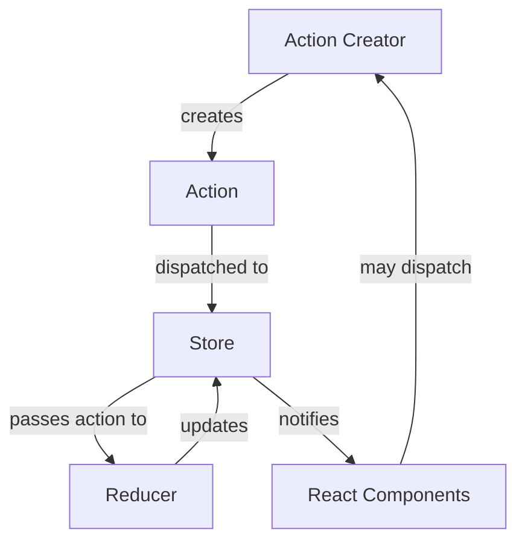

# React Redux Integration

## Introduction

Redux is a powerful state management library that helps you manage global application state in a predictable way. When combined with React, Redux provides a robust solution for handling complex state logic, especially in larger applications where state is shared across many components.

In this guide, we'll learn how to integrate Redux with React applications, exploring the fundamental concepts, setting up a Redux store, connecting components to the store, and implementing common patterns for effective state management.

## Why Use Redux with React?

React's built-in state management (like useState and useContext) works well for simpler applications, but larger applications often benefit from Redux for several reasons:

- **Centralized State**: Redux stores all application state in a single place, making it easier to track and debug
- **Predictable State Updates**: State changes follow a unidirectional flow and happen through pure functions (reducers)
- **Powerful Developer Tools**: Time-travel debugging and state inspection
- **Middleware Support**: Easy integration with async operations, logging, and more
- **Performance Optimization**: Fine-grained control over component re-rendering

## Core Concepts of Redux

Before we dive into implementation, let's understand the key concepts:



- **Store**: A single source of truth that holds the entire application state
- **Actions**: Plain JavaScript objects that describe what happened (e.g., `{ type: 'ADD_TODO', payload: 'Learn Redux' }`)
- **Reducers**: Pure functions that specify how state changes in response to actions
- **Dispatch**: The method used to send actions to the store
- **Selectors**: Functions that extract specific pieces of data from the store

## Setting Up Redux with React

### Step 1: Install Required Packages

First, we need to install Redux, React Redux, and Redux Toolkit (the official, recommended way to use Redux):

```bash
npm install @reduxjs/toolkit react-redux
```

### Step 2: Create a Redux Store

Next, let's create a Redux store using Redux Toolkit's `configureStore` function:

```jsx
// src/store/index.js
import { configureStore } from '@reduxjs/toolkit';
import counterReducer from './counterSlice';
import todosReducer from './todosSlice';

export const store = configureStore({
  reducer: {
    counter: counterReducer,
    todos: todosReducer,
  },
});
```

### Step 3: Create a Redux Slice

Redux Toolkit uses the concept of "slices" to organize related state, reducers, and actions:

```jsx
// src/store/counterSlice.js
import { createSlice } from '@reduxjs/toolkit';

const counterSlice = createSlice({
  name: 'counter',
  initialState: {
    value: 0,
  },
  reducers: {
    increment: (state) => {
      state.value += 1;
    },
    decrement: (state) => {
      state.value -= 1;
    },
    incrementByAmount: (state, action) => {
      state.value += action.payload;
    },
  },
});

export const { increment, decrement, incrementByAmount } = counterSlice.actions;
export default counterSlice.reducer;
```

### Step 4: Provide the Redux Store to React

Now we need to make the Redux store available to our React components using the `Provider` component:

```jsx
// src/index.js
import React from 'react';
import ReactDOM from 'react-dom';
import { Provider } from 'react-redux';
import { store } from './store';
import App from './App';

ReactDOM.render(
  <Provider store={store}>
    <App />
  </Provider>,
  document.getElementById('root')
);
```

### Step 5: Connect Components to Redux

Now we can use hooks provided by React Redux to connect our components to the Redux store:

```jsx
// src/components/Counter.js
import React from 'react';
import { useSelector, useDispatch } from 'react-redux';
import { increment, decrement, incrementByAmount } from '../store/counterSlice';

function Counter() {
  const count = useSelector((state) => state.counter.value);
  const dispatch = useDispatch();

  return (
    <div>
      <h2>Counter: {count}</h2>
      <div>
        <button onClick={() => dispatch(increment())}>
          Increment
        </button>
        <button onClick={() => dispatch(decrement())}>
          Decrement
        </button>
        <button onClick={() => dispatch(incrementByAmount(5))}>
          Add 5
        </button>
      </div>
    </div>
  );
}

export default Counter;
```

## Real-World Example: Todo Application

Let's build a more complete example of a Todo application using Redux:

### Todo Slice

```jsx
// src/store/todosSlice.js
import { createSlice } from '@reduxjs/toolkit';

const todosSlice = createSlice({
  name: 'todos',
  initialState: {
    items: [],
    filter: 'all', // all, active, completed
  },
  reducers: {
    addTodo: (state, action) => {
      state.items.push({
        id: Date.now(),
        text: action.payload,
        completed: false,
      });
    },
    toggleTodo: (state, action) => {
      const todo = state.items.find((item) => item.id === action.payload);
      if (todo) {
        todo.completed = !todo.completed;
      }
    },
    removeTodo: (state, action) => {
      state.items = state.items.filter((item) => item.id !== action.payload);
    },
    setFilter: (state, action) => {
      state.filter = action.payload;
    },
  },
});

export const { addTodo, toggleTodo, removeTodo, setFilter } = todosSlice.actions;

// We can also create selectors right in our slice file
export const selectFilteredTodos = (state) => {
  const { items, filter } = state.todos;
  switch (filter) {
    case 'completed':
      return items.filter((item) => item.completed);
    case 'active':
      return items.filter((item) => !item.completed);
    default:
      return items;
  }
};

export default todosSlice.reducer;
```

### Todo Components

```jsx
// src/components/TodoApp.js
import React, { useState } from 'react';
import { useSelector, useDispatch } from 'react-redux';
import { addTodo, toggleTodo, removeTodo, setFilter, selectFilteredTodos } from '../store/todosSlice';

function TodoApp() {
  const [newTodo, setNewTodo] = useState('');
  const todos = useSelector(selectFilteredTodos);
  const filter = useSelector((state) => state.todos.filter);
  const dispatch = useDispatch();

  const handleSubmit = (e) => {
    e.preventDefault();
    if (newTodo.trim()) {
      dispatch(addTodo(newTodo));
      setNewTodo('');
    }
  };

  return (
    <div className="todo-app">
      <h1>Todo App with Redux</h1>
      
      <form onSubmit={handleSubmit}>
        <input
          type="text"
          value={newTodo}
          onChange={(e) => setNewTodo(e.target.value)}
          placeholder="What needs to be done?"
        />
        <button type="submit">Add Todo</button>
      </form>
      
      <div className="filters">
        <button 
          onClick={() => dispatch(setFilter('all'))}
          className={filter === 'all' ? 'active' : ''}
        >
          All
        </button>
        <button 
          onClick={() => dispatch(setFilter('active'))}
          className={filter === 'active' ? 'active' : ''}
        >
          Active
        </button>
        <button 
          onClick={() => dispatch(setFilter('completed'))}
          className={filter === 'completed' ? 'active' : ''}
        >
          Completed
        </button>
      </div>
      
      <ul className="todo-list">
        {todos.map((todo) => (
          <li key={todo.id} className={todo.completed ? 'completed' : ''}>
            <span onClick={() => dispatch(toggleTodo(todo.id))}>
              {todo.text}
            </span>
            <button onClick={() => dispatch(removeTodo(todo.id))}>
              Delete
            </button>
          </li>
        ))}
      </ul>
      
      <div className="todo-count">
        {todos.length} items
      </div>
    </div>
  );
}

export default TodoApp;
```

## Handling Asynchronous Operations

Redux is synchronous by default, but many applications need to work with asynchronous operations like API calls. Redux Toolkit provides a solution with its `createAsyncThunk` function:

```jsx
// src/store/usersSlice.js
import { createSlice, createAsyncThunk } from '@reduxjs/toolkit';

// Create the async thunk
export const fetchUsers = createAsyncThunk(
  'users/fetchUsers',
  async () => {
    const response = await fetch('https://jsonplaceholder.typicode.com/users');
    return await response.json();
  }
);

const usersSlice = createSlice({
  name: 'users',
  initialState: {
    data: [],
    status: 'idle', // 'idle' | 'loading' | 'succeeded' | 'failed'
    error: null
  },
  reducers: {},
  extraReducers: (builder) => {
    builder
      .addCase(fetchUsers.pending, (state) => {
        state.status = 'loading';
      })
      .addCase(fetchUsers.fulfilled, (state, action) => {
        state.status = 'succeeded';
        // Add fetched users to the state array
        state.data = action.payload;
      })
      .addCase(fetchUsers.rejected, (state, action) => {
        state.status = 'failed';
        state.error = action.error.message;
      });
  }
});

export default usersSlice.reducer;
```

Using the async thunk in a component:

```jsx
// src/components/UsersList.js
import React, { useEffect } from 'react';
import { useSelector, useDispatch } from 'react-redux';
import { fetchUsers } from '../store/usersSlice';

function UsersList() {
  const dispatch = useDispatch();
  const { data: users, status, error } = useSelector((state) => state.users);

  useEffect(() => {
    // Only fetch users if we haven't already
    if (status === 'idle') {
      dispatch(fetchUsers());
    }
  }, [status, dispatch]);

  if (status === 'loading') {
    return <div>Loading...</div>;
  }

  if (status === 'failed') {
    return <div>Error: {error}</div>;
  }

  return (
    <div>
      <h2>Users</h2>
      <ul>
        {users.map((user) => (
          <li key={user.id}>{user.name}</li>
        ))}
      </ul>
    </div>
  );
}

export default UsersList;
```

## Redux DevTools

One of the best features of Redux is its powerful developer tools. Install the [Redux DevTools browser extension](https://github.com/reduxjs/redux-devtools) to inspect your Redux state, track actions, and even use time-travel debugging.

Redux Toolkit's `configureStore` function automatically sets up the DevTools extension, so you don't need any additional configuration.

## Best Practices for Redux

Here are some best practices to follow when using Redux:

1. **Use Redux Toolkit**: It simplifies common Redux tasks and follows best practices
2. **Keep state minimal**: Only store what you need in Redux
3. **Normalize complex state**: For relational data, use a normalized structure
4. **Use selectors**: Create reusable functions to extract data from the store
5. **Keep logic in reducers**: Business logic should live in reducers, not in components
6. **Prefer action creators**: Use them instead of dispatching plain action objects
7. **Think about state structure**: Design your state shape carefully before implementation

## Summary

In this guide, we learned how to integrate Redux with React applications using Redux Toolkit. We covered:

- The core concepts of Redux and why it's useful for React apps
- Setting up a Redux store and providing it to a React application
- Creating slices with reducers and actions
- Connecting React components to Redux using hooks
- Handling asynchronous operations with Redux Toolkit
- Best practices for Redux

Redux provides a powerful solution for managing complex state in React applications, especially as they grow in size and complexity. By following a unidirectional data flow and keeping state changes predictable, Redux helps maintain code organization and makes debugging easier.

## Additional Resources

To deepen your understanding of Redux, consider exploring these resources:

- [Official Redux Documentation](https://redux.js.org/)
- [Redux Toolkit Documentation](https://redux-toolkit.js.org/)
- [React Redux Documentation](https://react-redux.js.org/)

## Exercises

1. Extend the Todo application to include local storage persistence
2. Add a feature to mark all todos as completed/active with a single button
3. Implement user authentication with Redux, storing the auth state in the Redux store
4. Create a shopping cart feature using Redux
5. Add filtering and sorting capabilities to the users list example

By working through these exercises, you'll gain practical experience with Redux and solidify your understanding of state management in React applications.