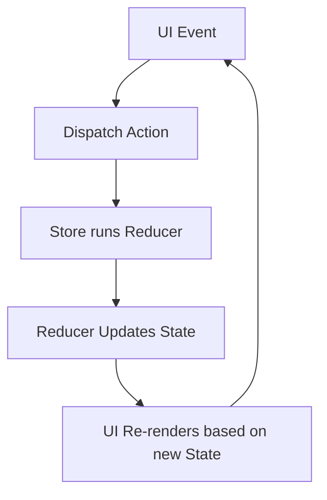

# React Redux Toolkit

## Introduction

Redux is a powerful state management library for JavaScript applications, particularly popular with React. However, traditional Redux implementation can involve considerable boilerplate code and a steep learning curve. This is where **Redux Toolkit** (RTK) comes in - it's the official, opinionated, batteries-included toolset for efficient Redux development.

Redux Toolkit was created to address three common concerns about Redux:

1. "Configuring Redux is too complicated"
2. "I have to add a lot of packages to make Redux do anything useful"
3. "Redux requires too much boilerplate code"

By the end of this guide, you'll understand how to implement Redux Toolkit in your React applications, making state management more maintainable and efficient.

## Prerequisites

Before diving into Redux Toolkit, you should have:

- Basic knowledge of React and React Hooks
- Understanding of Redux fundamentals (actions, reducers, store)
- Node.js and npm installed on your computer

## Setting Up Redux Toolkit

### Installation

First, let's install the necessary packages:

```bash
npm install @reduxjs/toolkit react-redux
```

or using yarn:

```bash
yarn add @reduxjs/toolkit react-redux
```

### Creating the Store

Redux Toolkit provides a `configureStore` function that simplifies store setup:

```jsx
// src/app/store.js
import { configureStore } from '@reduxjs/toolkit';
import counterReducer from '../features/counter/counterSlice';

export const store = configureStore({
  reducer: {
    counter: counterReducer,
    // Add other reducers here
  },
});
```

The `configureStore` function automatically:
- Combines your slice reducers
- Adds the redux-thunk middleware
- Includes Redux DevTools integration
- Sets up some default middleware that catch common mistakes

### Providing the Store to React

Next, wrap your React application with the Redux Provider:

```jsx
// src/index.js
import React from 'react';
import ReactDOM from 'react-dom';
import { Provider } from 'react-redux';
import { store } from './app/store';
import App from './App';

ReactDOM.render(
  <Provider store={store}>
    <App />
  </Provider>,
  document.getElementById('root')
);
```

## Core Concepts of Redux Toolkit

### 1. CreateSlice

`createSlice` is a function that generates action creators and action types based on the reducer logic you supply. It significantly reduces the boilerplate code needed in traditional Redux.

Here's an example of a counter slice:

```jsx
// src/features/counter/counterSlice.js
import { createSlice } from '@reduxjs/toolkit';

const initialState = {
  value: 0,
};

export const counterSlice = createSlice({
  name: 'counter',
  initialState,
  reducers: {
    increment: (state) => {
      // Redux Toolkit allows us to write "mutating" logic in reducers.
      // It doesn't actually mutate the state because it uses the Immer library,
      // which detects changes to a "draft state" and produces a brand new
      // immutable state based on those changes.
      state.value += 1;
    },
    decrement: (state) => {
      state.value -= 1;
    },
    incrementByAmount: (state, action) => {
      state.value += action.payload;
    },
  },
});

// Action creators are generated for each case reducer function
export const { increment, decrement, incrementByAmount } = counterSlice.actions;

// The reducer function to be used in the store
export default counterSlice.reducer;
```

### 2. Using Slices in Components

Now, let's use our counter slice in a React component:

```jsx
// src/features/counter/Counter.js
import React, { useState } from 'react';
import { useSelector, useDispatch } from 'react-redux';
import { increment, decrement, incrementByAmount } from './counterSlice';

export function Counter() {
  const count = useSelector((state) => state.counter.value);
  const dispatch = useDispatch();
  const [incrementAmount, setIncrementAmount] = useState('2');

  return (
    <div>
      <div>
        <button
          aria-label="Decrement value"
          onClick={() => dispatch(decrement())}
        >
          -
        </button>
        <span>{count}</span>
        <button
          aria-label="Increment value"
          onClick={() => dispatch(increment())}
        >
          +
        </button>
      </div>
      <div>
        <input
          aria-label="Set increment amount"
          value={incrementAmount}
          onChange={e => setIncrementAmount(e.target.value)}
        />
        <button
          onClick={() =>
            dispatch(incrementByAmount(Number(incrementAmount) || 0))
          }
        >
          Add Amount
        </button>
      </div>
    </div>
  );
}
```

In this component:
- `useSelector` retrieves the counter value from the Redux store
- `useDispatch` gets the dispatch function to dispatch actions
- When buttons are clicked, the appropriate actions are dispatched

### 3. Redux Thunks with RTK

Redux Toolkit includes the ability to create "thunk" functions which allow for asynchronous operations.

Here's how to add an asynchronous action to our counter slice:

```jsx
// src/features/counter/counterSlice.js
import { createSlice, createAsyncThunk } from '@reduxjs/toolkit';

// First, create the thunk
export const fetchCountValue = createAsyncThunk(
  'counter/fetchCountValue',
  async (userId, thunkAPI) => {
    const response = await fetch('https://api.example.com/counter');
    return await response.json();
  }
);

const initialState = {
  value: 0,
  status: 'idle',
  error: null
};

export const counterSlice = createSlice({
  name: 'counter',
  initialState,
  reducers: {
    // Previous reducers here...
  },
  // The `extraReducers` field lets the slice handle actions defined elsewhere,
  // including actions generated by createAsyncThunk or in other slices.
  extraReducers: (builder) => {
    builder
      .addCase(fetchCountValue.pending, (state) => {
        state.status = 'loading';
      })
      .addCase(fetchCountValue.fulfilled, (state, action) => {
        state.status = 'succeeded';
        state.value = action.payload;
      })
      .addCase(fetchCountValue.rejected, (state, action) => {
        state.status = 'failed';
        state.error = action.error.message;
      });
  },
});

export default counterSlice.reducer;
```

Using the async thunk in a component:

```jsx
import React, { useEffect } from 'react';
import { useSelector, useDispatch } from 'react-redux';
import { fetchCountValue } from './counterSlice';

export function Counter() {
  const count = useSelector((state) => state.counter.value);
  const status = useSelector((state) => state.counter.status);
  const error = useSelector((state) => state.counter.error);
  const dispatch = useDispatch();

  useEffect(() => {
    if (status === 'idle') {
      dispatch(fetchCountValue());
    }
  }, [status, dispatch]);

  let content;
  
  if (status === 'loading') {
    content = <div>Loading...</div>;
  } else if (status === 'succeeded') {
    content = <div>Count: {count}</div>;
  } else if (status === 'failed') {
    content = <div>Error: {error}</div>;
  }

  return <div>{content}</div>;
}
```

## Advanced Features of Redux Toolkit

### Entity Adapters

For collections of data, Redux Toolkit provides `createEntityAdapter` to help normalize your store:

```jsx
// src/features/users/usersSlice.js
import { createSlice, createEntityAdapter } from '@reduxjs/toolkit';

const usersAdapter = createEntityAdapter();

// The adapter provides initialized state structure and selectors
const initialState = usersAdapter.getInitialState({
  loading: false,
  error: null
});

const usersSlice = createSlice({
  name: 'users',
  initialState,
  reducers: {
    // Use the adapter's CRUD methods
    userAdded: usersAdapter.addOne,
    usersReceived(state, action) {
      usersAdapter.setAll(state, action.payload);
      state.loading = false;
    },
    userUpdated: usersAdapter.updateOne,
    userRemoved: usersAdapter.removeOne,
  },
  extraReducers: (builder) => {
    builder.addCase('users/fetchUsers/pending', (state) => {
      state.loading = true;
    });
  }
});

export const { userAdded, usersReceived, userUpdated, userRemoved } = usersSlice.actions;

// The adapter also provides standard selectors
export const {
  selectAll: selectAllUsers,
  selectById: selectUserById,
  selectIds: selectUserIds
} = usersAdapter.getSelectors(state => state.users);

export default usersSlice.reducer;
```

### RTK Query

RTK Query is a powerful data fetching and caching tool included in Redux Toolkit. Here's a basic example:

```jsx
// src/features/api/apiSlice.js
import { createApi, fetchBaseQuery } from '@reduxjs/toolkit/query/react';

export const apiSlice = createApi({
  reducerPath: 'api',
  baseQuery: fetchBaseQuery({ baseUrl: 'https://api.example.com' }),
  endpoints: (builder) => ({
    getUsers: builder.query({
      query: () => '/users',
    }),
    getUserById: builder.query({
      query: (id) => `/users/${id}`,
    }),
    addNewUser: builder.mutation({
      query: (newUser) => ({
        url: '/users',
        method: 'POST',
        body: newUser,
      }),
    }),
  }),
});

// Export hooks for usage in components
export const { 
  useGetUsersQuery, 
  useGetUserByIdQuery,
  useAddNewUserMutation 
} = apiSlice;
```

Using RTK Query in a component:

```jsx
import React from 'react';
import { useGetUsersQuery, useAddNewUserMutation } from './api/apiSlice';

export function UsersList() {
  const {
    data: users,
    isLoading,
    isSuccess,
    isError,
    error
  } = useGetUsersQuery();
  
  const [addNewUser] = useAddNewUserMutation();
  
  const handleAddUser = async () => {
    try {
      await addNewUser({ name: 'New User', email: 'user@example.com' }).unwrap();
    } catch (err) {
      console.error('Failed to add user: ', err);
    }
  };

  let content;
  
  if (isLoading) {
    content = <div>Loading...</div>;
  } else if (isSuccess) {
    content = (
      <ul>
        {users.map(user => (
          <li key={user.id}>{user.name}</li>
        ))}
      </ul>
    );
  } else if (isError) {
    content = <div>{error.toString()}</div>;
  }

  return (
    <div>
      <h2>Users List</h2>
      {content}
      <button onClick={handleAddUser}>Add User</button>
    </div>
  );
}
```

## Real-world Example: Todo Application

Let's build a simple Todo application using Redux Toolkit:

```jsx
// src/features/todos/todosSlice.js
import { createSlice, nanoid, createAsyncThunk } from '@reduxjs/toolkit';

export const fetchTodos = createAsyncThunk('todos/fetchTodos', async () => {
  const response = await fetch('https://jsonplaceholder.typicode.com/todos?_limit=5');
  return await response.json();
});

const todosSlice = createSlice({
  name: 'todos',
  initialState: {
    entities: [],
    status: 'idle',
    error: null
  },
  reducers: {
    todoAdded: {
      reducer(state, action) {
        state.entities.push(action.payload);
      },
      prepare(text) {
        return {
          payload: {
            id: nanoid(),
            text,
            completed: false
          }
        };
      }
    },
    todoToggled(state, action) {
      const todo = state.entities.find(todo => todo.id === action.payload);
      if (todo) {
        todo.completed = !todo.completed;
      }
    },
    todoDeleted(state, action) {
      const index = state.entities.findIndex(todo => todo.id === action.payload);
      if (index !== -1) {
        state.entities.splice(index, 1);
      }
    }
  },
  extraReducers: (builder) => {
    builder
      .addCase(fetchTodos.pending, (state) => {
        state.status = 'loading';
      })
      .addCase(fetchTodos.fulfilled, (state, action) => {
        state.status = 'succeeded';
        // Add fetched todos to the array
        state.entities = state.entities.concat(action.payload);
      })
      .addCase(fetchTodos.rejected, (state, action) => {
        state.status = 'failed';
        state.error = action.error.message;
      });
  }
});

export const { todoAdded, todoToggled, todoDeleted } = todosSlice.actions;
export default todosSlice.reducer;
```

Creating the Todo List component:

```jsx
// src/features/todos/TodoList.js
import React, { useState, useEffect } from 'react';
import { useSelector, useDispatch } from 'react-redux';
import { todoAdded, todoToggled, todoDeleted, fetchTodos } from './todosSlice';

export const TodoList = () => {
  const [newTodo, setNewTodo] = useState('');
  const dispatch = useDispatch();
  
  const todos = useSelector(state => state.todos.entities);
  const todosStatus = useSelector(state => state.todos.status);
  const error = useSelector(state => state.todos.error);

  useEffect(() => {
    if (todosStatus === 'idle') {
      dispatch(fetchTodos());
    }
  }, [todosStatus, dispatch]);

  const handleSubmit = (e) => {
    e.preventDefault();
    if (newTodo.trim()) {
      dispatch(todoAdded(newTodo));
      setNewTodo('');
    }
  };

  let content;

  if (todosStatus === 'loading') {
    content = <div>Loading...</div>;
  } else if (todosStatus === 'succeeded') {
    content = (
      <ul>
        {todos.map(todo => (
          <li key={todo.id}>
            <input
              type="checkbox"
              checked={todo.completed}
              onChange={() => dispatch(todoToggled(todo.id))}
            />
            <span style={{ textDecoration: todo.completed ? 'line-through' : 'none' }}>
              {todo.text || todo.title}
            </span>
            <button onClick={() => dispatch(todoDeleted(todo.id))}>
              Delete
            </button>
          </li>
        ))}
      </ul>
    );
  } else if (todosStatus === 'failed') {
    content = <div>{error}</div>;
  }

  return (
    <div>
      <form onSubmit={handleSubmit}>
        <input
          value={newTodo}
          onChange={(e) => setNewTodo(e.target.value)}
          placeholder="Add a new todo"
        />
        <button type="submit">Add Todo</button>
      </form>
      {content}
    </div>
  );
};
```

Setting up the store:

```jsx
// src/app/store.js
import { configureStore } from '@reduxjs/toolkit';
import todosReducer from '../features/todos/todosSlice';

export const store = configureStore({
  reducer: {
    todos: todosReducer,
  },
});
```

## Redux Toolkit vs. Traditional Redux

Let's compare the traditional Redux approach with Redux Toolkit for a simple counter:

### Traditional Redux

```jsx
// Action Types
const INCREMENT = 'INCREMENT';
const DECREMENT = 'DECREMENT';

// Action Creators
const increment = () => ({ type: INCREMENT });
const decrement = () => ({ type: DECREMENT });

// Reducer
const initialState = { value: 0 };

function counterReducer(state = initialState, action) {
  switch (action.type) {
    case INCREMENT:
      return { ...state, value: state.value + 1 };
    case DECREMENT:
      return { ...state, value: state.value - 1 };
    default:
      return state;
  }
}
```

### Redux Toolkit

```jsx
import { createSlice } from '@reduxjs/toolkit';

const counterSlice = createSlice({
  name: 'counter',
  initialState: { value: 0 },
  reducers: {
    increment: state => {
      state.value += 1;
    },
    decrement: state => {
      state.value -= 1;
    }
  }
});

export const { increment, decrement } = counterSlice.actions;
export default counterSlice.reducer;
```

The Redux Toolkit version:
- Requires less code
- Doesn't need separate action type constants
- Allows "mutating" logic in reducers (thanks to Immer)
- Automatically generates action creators
- Is less error-prone

## Redux Data Flow with Redux Toolkit

Redux Toolkit follows the same data flow principles as traditional Redux:



## Best Practices for Redux Toolkit

1. **Use the Redux Toolkit for all new Redux code**
   - It's the official recommendation from the Redux team

2. **Organize by feature, not by type**
   - Group all related files (slice, components, tests) in the same folder

3. **Use createSlice for all reducers**
   - Avoid writing traditional action types and creators

4. **Keep state minimal and derive data where possible**
   - Not everything needs to be in the Redux store

5. **Use the Redux DevTools Extension for debugging**
   - Redux Toolkit configures it automatically

6. **Take advantage of RTK Query for data fetching**
   - It handles loading states, caching, and more

7. **Use createAsyncThunk for async operations**
   - Provides a standardized approach for handling API calls

## Summary

Redux Toolkit significantly simplifies Redux development by providing utilities to reduce boilerplate code and enforce best practices. Key features include:

- `configureStore`: Simplifies store setup with good defaults
- `createSlice`: Combines reducer logic and actions into a single function
- `createAsyncThunk`: Handles asynchronous logic and dispatches lifecycle actions
- `createEntityAdapter`: Provides standardized methods for CRUD operations
- RTK Query: Powerful data fetching and caching solution

By adopting Redux Toolkit, you can focus more on your application logic rather than Redux setup and configuration.

## Further Learning Resources

1. [Official Redux Toolkit documentation](https://redux-toolkit.js.org/)
2. [Redux Toolkit Quick Start guide](https://redux-toolkit.js.org/introduction/quick-start)
3. [Redux Essentials tutorial](https://redux.js.org/tutorials/essentials/part-1-overview-concepts)

## Exercises

1. **Basic Counter**: Create a counter application with increment, decrement, and reset buttons using Redux Toolkit.

2. **Todo App**: Build a todo application that allows adding, toggling, and deleting todos.

3. **API Integration**: Enhance the todo app to load initial todos from an API using `createAsyncThunk`.

4. **Shopping Cart**: Build a shopping cart application with product listing and cart functionality using Redux Toolkit.

5. **RTK Query Example**: Create an application that fetches and displays posts from the JSONPlaceholder API using RTK Query, allowing for creating new posts and editing existing ones.

Happy coding with Redux Toolkit!