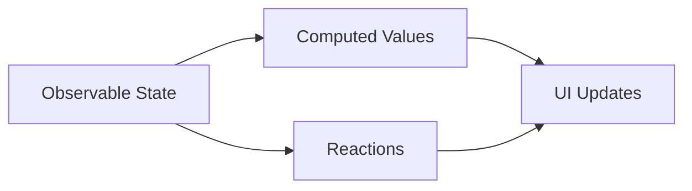

# React MobX Integration

## Introduction

MobX is a battle-tested state management library that makes it simple to connect the reactive data of your application with the UI. When combined with React, MobX provides a straightforward and efficient way to handle your application state with minimal boilerplate code.

In this guide, you'll learn:
- What MobX is and its core concepts
- How to integrate MobX with React applications
- Building reactive components that automatically update
- Best practices for structuring MobX stores in React applications

## What is MobX?

MobX is a state management solution that uses observable patterns to track changes to your application state. It follows three core principles:

1. **Observable State**: Any data structure can be made observable
2. **Computed Values**: Values that automatically derive from your state
3. **Reactions**: Side effects that automatically run when relevant state changes



## Setting Up MobX in a React Project

Let's start by installing the necessary packages:

```bash
npm install mobx mobx-react
```

For TypeScript projects (optional):

```bash
npm install --save-dev @types/mobx @types/mobx-react
```

## Core MobX Concepts

Before diving into integration with React, let's understand the key MobX concepts:

### 1. Observables

Observables represent the reactive state in your application:

```javascript
import { makeObservable, observable, action } from 'mobx';

class CounterStore {
  count = 0;

  constructor() {
    makeObservable(this, {
      count: observable,
      increment: action,
      decrement: action
    });
  }

  increment() {
    this.count++;
  }

  decrement() {
    this.count--;
  }
}
```

### 2. Computed Values

Computed values are derived automatically from your state:

```javascript
import { makeObservable, observable, computed, action } from 'mobx';

class CounterStore {
  count = 0;

  constructor() {
    makeObservable(this, {
      count: observable,
      doubleCount: computed,
      increment: action
    });
  }

  get doubleCount() {
    return this.count * 2;
  }

  increment() {
    this.count++;
  }
}
```

### 3. Actions

Actions are methods that modify state:

```javascript
import { makeObservable, observable, action } from 'mobx';

class CounterStore {
  count = 0;

  constructor() {
    makeObservable(this, {
      count: observable,
      increment: action,
      reset: action
    });
  }

  increment() {
    this.count++;
  }

  reset() {
    this.count = 0;
  }
}
```

## Integrating MobX with React

Now let's see how to connect MobX stores with React components:

### Creating a Store

First, let's create a simple counter store:

```javascript
// src/stores/CounterStore.js
import { makeObservable, observable, computed, action } from 'mobx';

class CounterStore {
  count = 0;

  constructor() {
    makeObservable(this, {
      count: observable,
      doubleCount: computed,
      increment: action,
      decrement: action,
      reset: action
    });
  }

  get doubleCount() {
    return this.count * 2;
  }

  increment() {
    this.count++;
  }

  decrement() {
    this.count--;
  }

  reset() {
    this.count = 0;
  }
}

export default new CounterStore();
```

### Using the Store in React Components

There are two main ways to use MobX with React:

#### 1. Using the `observer` HOC (Higher Order Component)

```jsx
// src/components/Counter.jsx
import React from 'react';
import { observer } from 'mobx-react';
import counterStore from '../stores/CounterStore';

const Counter = observer(() => {
  return (
    <div className="counter">
      <h2>Counter: {counterStore.count}</h2>
      <p>Double count: {counterStore.doubleCount}</p>
      <button onClick={() => counterStore.increment()}>Increment</button>
      <button onClick={() => counterStore.decrement()}>Decrement</button>
      <button onClick={() => counterStore.reset()}>Reset</button>
    </div>
  );
});

export default Counter;
```

When you run this component:
- The `observer` HOC makes the component react to changes in any observable data accessed during rendering
- When `counterStore.count` changes, the component will automatically re-render
- Only components that actually use the data will re-render

#### 2. Using the `useObserver` Hook (with Functional Components)

```jsx
// src/components/CounterWithHook.jsx
import React from 'react';
import { useObserver } from 'mobx-react';
import counterStore from '../stores/CounterStore';

const CounterWithHook = () => {
  return useObserver(() => (
    <div className="counter">
      <h2>Counter: {counterStore.count}</h2>
      <p>Double count: {counterStore.doubleCount}</p>
      <button onClick={() => counterStore.increment()}>Increment</button>
      <button onClick={() => counterStore.decrement()}>Decrement</button>
      <button onClick={() => counterStore.reset()}>Reset</button>
    </div>
  ));
};

export default CounterWithHook;
```

## Creating a Root Store

For more complex applications, it's common to have multiple stores. A root store pattern helps organize these stores:

```javascript
// src/stores/RootStore.js
import CounterStore from './CounterStore';
import TodoStore from './TodoStore';

class RootStore {
  constructor() {
    this.counterStore = new CounterStore(this);
    this.todoStore = new TodoStore(this);
  }
}

export default new RootStore();
```

## Using Context for Store Access

To avoid prop drilling, we can use React Context to provide stores throughout the application:

```jsx
// src/contexts/StoreContext.jsx
import React, { createContext, useContext } from 'react';
import rootStore from '../stores/RootStore';

const StoreContext = createContext(rootStore);

export const StoreProvider = ({ children }) => {
  return (
    <StoreContext.Provider value={rootStore}>
      {children}
    </StoreContext.Provider>
  );
};

export const useStore = () => useContext(StoreContext);
```

Wrap your application with the provider:

```jsx
// src/App.jsx
import React from 'react';
import { StoreProvider } from './contexts/StoreContext';
import Counter from './components/Counter';
import TodoList from './components/TodoList';

function App() {
  return (
    <StoreProvider>
      <div className="app">
        <h1>MobX React Demo</h1>
        <Counter />
        <TodoList />
      </div>
    </StoreProvider>
  );
}

export default App;
```

Then consume the stores in components:

```jsx
// src/components/Counter.jsx
import React from 'react';
import { observer } from 'mobx-react';
import { useStore } from '../contexts/StoreContext';

const Counter = observer(() => {
  const { counterStore } = useStore();
  
  return (
    <div className="counter">
      <h2>Counter: {counterStore.count}</h2>
      <p>Double count: {counterStore.doubleCount}</p>
      <button onClick={() => counterStore.increment()}>Increment</button>
      <button onClick={() => counterStore.decrement()}>Decrement</button>
      <button onClick={() => counterStore.reset()}>Reset</button>
    </div>
  );
});

export default Counter;
```

## Real-world Example: Todo Application

Let's create a more practical example with a todo application:

### Todo Store

```javascript
// src/stores/TodoStore.js
import { makeObservable, observable, computed, action } from 'mobx';

class TodoStore {
  todos = [];
  
  constructor(rootStore) {
    this.rootStore = rootStore;
    
    makeObservable(this, {
      todos: observable,
      completedTodosCount: computed,
      addTodo: action,
      toggleTodo: action,
      removeTodo: action
    });
  }
  
  get completedTodosCount() {
    return this.todos.filter(todo => todo.completed).length;
  }
  
  addTodo(text) {
    this.todos.push({
      id: Date.now(),
      text,
      completed: false
    });
  }
  
  toggleTodo(id) {
    const todo = this.todos.find(todo => todo.id === id);
    if (todo) {
      todo.completed = !todo.completed;
    }
  }
  
  removeTodo(id) {
    const index = this.todos.findIndex(todo => todo.id === id);
    if (index !== -1) {
      this.todos.splice(index, 1);
    }
  }
}

export default TodoStore;
```

### Todo List Component

```jsx
// src/components/TodoList.jsx
import React, { useState } from 'react';
import { observer } from 'mobx-react';
import { useStore } from '../contexts/StoreContext';

const TodoList = observer(() => {
  const { todoStore } = useStore();
  const [newTodoText, setNewTodoText] = useState('');
  
  const handleAddTodo = (e) => {
    e.preventDefault();
    if (newTodoText.trim()) {
      todoStore.addTodo(newTodoText);
      setNewTodoText('');
    }
  };
  
  return (
    <div className="todo-list">
      <h2>Todo List</h2>
      <p>Completed: {todoStore.completedTodosCount} / {todoStore.todos.length}</p>
      
      <form onSubmit={handleAddTodo}>
        <input
          type="text"
          value={newTodoText}
          onChange={(e) => setNewTodoText(e.target.value)}
          placeholder="Add new todo"
        />
        <button type="submit">Add</button>
      </form>
      
      <ul>
        {todoStore.todos.map(todo => (
          <li key={todo.id}>
            <input
              type="checkbox"
              checked={todo.completed}
              onChange={() => todoStore.toggleTodo(todo.id)}
            />
            <span style={{ textDecoration: todo.completed ? 'line-through' : 'none' }}>
              {todo.text}
            </span>
            <button onClick={() => todoStore.removeTodo(todo.id)}>Delete</button>
          </li>
        ))}
      </ul>
    </div>
  );
});

export default TodoList;
```

## Best Practices for MobX with React

### 1. Keep Stores Focused

Each store should be responsible for a specific domain of your application:

```javascript
// UserStore.js - handles user authentication and profile
// ProductStore.js - handles product data and operations
// CartStore.js - handles shopping cart functionality
```

### 2. Use Computed Values

Leverage computed values for derived data rather than calculating in components:

```javascript
class CartStore {
  items = [];

  get total() {
    return this.items.reduce((sum, item) => sum + item.price * item.quantity, 0);
  }
  
  get itemCount() {
    return this.items.reduce((count, item) => count + item.quantity, 0);
  }
}
```

### 3. Keep Components Minimal

Components should only observe the data they need:

```jsx
// Good practice
const CartTotal = observer(() => {
  const { cartStore } = useStore();
  return <div>Total: ${cartStore.total}</div>;
});

const CartItems = observer(() => {
  const { cartStore } = useStore();
  return (
    <ul>
      {cartStore.items.map(item => (
        <CartItem key={item.id} item={item} />
      ))}
    </ul>
  );
});
```

### 4. Use Actions for State Mutations

Always use actions to change state:

```javascript
class UserStore {
  user = null;
  isLoading = false;
  error = null;

  login = async (username, password) => {
    this.isLoading = true;
    this.error = null;
    
    try {
      const user = await authService.login(username, password);
      this.user = user;
    } catch (error) {
      this.error = error.message;
    } finally {
      this.isLoading = false;
    }
  }
}
```

## Debugging MobX Applications

MobX has excellent developer tools for debugging:

```bash
npm install --save-dev mobx-react-devtools
```

Then add to your development environment:

```jsx
import React from 'react';
import ReactDOM from 'react-dom';
import App from './App';
import { MobXDevTools } from 'mobx-react-devtools';

const Root = () => (
  <>
    <App />
    {process.env.NODE_ENV === 'development' && <MobXDevTools />}
  </>
);

ReactDOM.render(<Root />, document.getElementById('root'));
```

## Summary

MobX provides a simple yet powerful approach to manage state in React applications:

- Observables track your application state
- Computed values derive information from that state
- Actions modify the state
- The `observer` HOC makes components reactive to state changes

The combination of React and MobX creates an efficient reactive programming model where your UI automatically stays in sync with your state with minimal boilerplate code.

MobX's flexibility allows it to scale well from small to large applications, making it a great choice for projects of any size.

## Additional Resources

- [MobX Official Documentation](https://mobx.js.org)
- [mobx-react Documentation](https://github.com/mobxjs/mobx-react)
- Practice exercises:
  1. Create a theme switcher using MobX
  2. Build a shopping cart with products, cart management, and order functionality
  3. Implement a user authentication system with login/logout states

By mastering MobX with React, you'll have a powerful tool for managing state in your applications with minimal overhead and excellent performance.