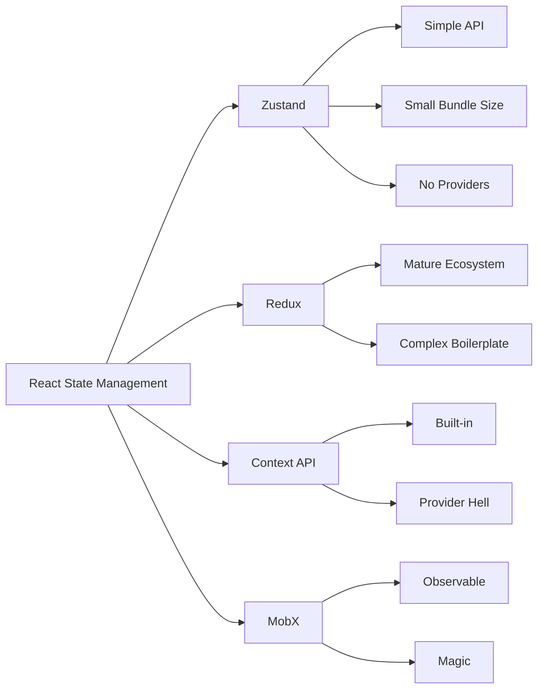

# React Zustand

## Introduction

Have you been struggling with complex state management in React? You're not alone. While React's built-in state management works well for simple components, as your application grows, managing state across components becomes challenging. This is where **Zustand** comes in.

Zustand (German for "state") is a small, fast, and scalable state management solution for React. Created by the same team behind React Spring, Zustand provides a minimalistic API that makes state management intuitive and straightforward.

In this guide, we'll explore how Zustand works, why it's gaining popularity, and how to implement it in your React applications.

## Why Choose Zustand?

Before diving into implementation, let's understand why you might want to use Zustand over other state management solutions:

- **Simplicity**: Zustand has a minimal API that's easy to learn
- **No Provider required**: Unlike Redux or Context API, no wrapper components needed
- **Hooks-based**: Works naturally with React's hooks pattern
- **Tiny package**: Only ~1KB in size (minified and gzipped)
- **DevTools support**: Integrates with Redux DevTools for debugging
- **TypeScript friendly**: Excellent TypeScript support out of the box

## Getting Started with Zustand

### Installation

First, let's install Zustand in your React project:

```bash
# Using npm
npm install zustand

# Using yarn
yarn add zustand

# Using pnpm
pnpm add zustand
```

### Creating Your First Store

Let's create a basic counter store to understand Zustand's fundamentals:

```jsx
import create from 'zustand'

// Create a store
const useCounterStore = create((set) => ({
  count: 0,
  increment: () => set((state) => ({ count: state.count + 1 })),
  decrement: () => set((state) => ({ count: state.count - 1 })),
  reset: () => set({ count: 0 }),
}))

// In your component
function Counter() {
  const { count, increment, decrement, reset } = useCounterStore()
  
  return (
    <div>
      <h2>Count: {count}</h2>
      <button onClick={increment}>Increment</button>
      <button onClick={decrement}>Decrement</button>
      <button onClick={reset}>Reset</button>
    </div>
  )
}
```

In this example:
1. We create a store using Zustand's `create` function
2. The store contains state (`count`) and actions (`increment`, `decrement`, `reset`)
3. We access the store in our component using the custom hook `useCounterStore`
4. Components automatically update when the store changes

## Understanding the Core Concepts

### The `set` Function

The `set` function is the main way to update state in Zustand. It can be used in two ways:

```jsx
// 1. Passing a partial state object
set({ count: 10 })

// 2. Passing a function that receives the current state
set((state) => ({ count: state.count + 1 }))
```

The second approach is recommended when you need to update state based on the previous state.

### The `get` Function

Sometimes you need to access the current state when updating it, especially in async functions. Zustand provides a `get` function for this:

```jsx
const useUserStore = create((set, get) => ({
  user: null,
  fetchUser: async (id) => {
    const response = await fetch(`/api/users/${id}`)
    const user = await response.json()
    set({ user })
    
    // You can access other state or actions using get()
    console.log('Current user:', get().user)
  }
}))
```

## Advanced Usage

### Selective Subscriptions

One of Zustand's advantages is that it allows components to subscribe only to the parts of the state they need:

```jsx
function UserProfile() {
  // This component will only re-render when user.name changes
  const userName = useUserStore((state) => state.user?.name)
  
  return <div>Hello, {userName || 'Guest'}</div>
}
```

### Using with TypeScript

Zustand has excellent TypeScript support:

```tsx
import create from 'zustand'

interface CounterState {
  count: number
  increment: () => void
  decrement: () => void
  reset: () => void
}

const useCounterStore = create<CounterState>((set) => ({
  count: 0,
  increment: () => set((state) => ({ count: state.count + 1 })),
  decrement: () => set((state) => ({ count: state.count - 1 })),
  reset: () => set({ count: 0 }),
}))
```

### Middleware

Zustand supports middleware for extending functionality. The most common middleware is `devtools` for Redux DevTools integration:

```jsx
import create from 'zustand'
import { devtools } from 'zustand/middleware'

const useStore = create(devtools((set) => ({
  bears: 0,
  increasePopulation: () => set((state) => ({ bears: state.bears + 1 })),
})))
```

With this middleware, you can inspect and time-travel through state changes in Redux DevTools.

## Practical Example: Todo Application

Let's build a more complete example to demonstrate Zustand in action:

```jsx
import React, { useState } from 'react'
import create from 'zustand'

// Define the store
const useTodoStore = create((set) => ({
  todos: [],
  addTodo: (text) => 
    set((state) => ({ 
      todos: [...state.todos, { id: Date.now(), text, completed: false }] 
    })),
  toggleTodo: (id) =>
    set((state) => ({
      todos: state.todos.map(todo => 
        todo.id === id ? { ...todo, completed: !todo.completed } : todo
      )
    })),
  removeTodo: (id) =>
    set((state) => ({
      todos: state.todos.filter(todo => todo.id !== id)
    }))
}))

// Todo input component
function TodoInput() {
  const [text, setText] = useState('')
  const addTodo = useTodoStore(state => state.addTodo)
  
  const handleSubmit = (e) => {
    e.preventDefault()
    if (!text.trim()) return
    addTodo(text)
    setText('')
  }
  
  return (
    <form onSubmit={handleSubmit}>
      <input 
        value={text}
        onChange={(e) => setText(e.target.value)}
        placeholder="Add a new todo..."
      />
      <button type="submit">Add</button>
    </form>
  )
}

// Todo list component
function TodoList() {
  const { todos, toggleTodo, removeTodo } = useTodoStore()
  
  return (
    <ul>
      {todos.map(todo => (
        <li key={todo.id} style={{ textDecoration: todo.completed ? 'line-through' : 'none' }}>
          <span onClick={() => toggleTodo(todo.id)}>{todo.text}</span>
          <button onClick={() => removeTodo(todo.id)}>Delete</button>
        </li>
      ))}
    </ul>
  )
}

// App component that brings it all together
function TodoApp() {
  return (
    <div>
      <h1>Zustand Todo App</h1>
      <TodoInput />
      <TodoList />
    </div>
  )
}
```

In this example:

1. We create a todo store with state and actions
2. `TodoInput` component accesses only the `addTodo` action
3. `TodoList` component subscribes to the todos array and related actions
4. Each component re-renders only when the specific parts of state it uses change

## Comparison with Other State Management Solutions



| Feature | Zustand | Redux | Context API | MobX |
|---------|---------|-------|------------|------|
| Bundle Size | ~1KB | ~4KB+ | 0 (built-in) | ~6KB |
| Boilerplate | Minimal | Substantial | Moderate | Minimal |
| Learning Curve | Low | High | Medium | Medium |
| DevTools | Yes | Yes | No | Yes |
| Provider Required | No | Yes | Yes | No |

## Best Practices

1. **Keep stores small and focused**: Create multiple stores for different domains rather than one giant store
2. **Leverage selective subscriptions**: Subscribe only to the specific state values your component needs
3. **Extract frequently updated state**: If a part of your state updates very frequently, consider keeping it separate
4. **Use TypeScript**: The type safety will help catch errors early

## Common Pitfalls and Solutions

### Problem: Selector Functions Causing Rerenders

```jsx
// ❌ This will cause rerenders even when bears doesn't change
const { bears, fish } = useStore()

// ✅ This will only rerender when bears changes
const bears = useStore(state => state.bears)
```

### Problem: Object Comparisons

```jsx
// ❌ This will always create a new object, causing rerenders
const user = useStore(state => ({ name: state.name, age: state.age }))

// ✅ Use a stable selector or multiple selectors
const name = useStore(state => state.name)
const age = useStore(state => state.age)
// OR use shallow comparison
import { shallow } from 'zustand/shallow'
const user = useStore(state => ({ name: state.name, age: state.age }), shallow)
```

## Summary

Zustand is a lightweight, powerful state management library that simplifies global state management in React applications. Its minimalist API, performance-focused design, and flexibility make it an excellent choice for both beginners and experienced developers.

Through this guide, we've covered:

- Basic store creation and usage
- Accessing and updating state
- Advanced features like middleware and TypeScript integration
- Building a practical todo application
- Comparisons with other state management libraries

Zustand's simplicity doesn't sacrifice power, making it an excellent choice for projects of all sizes. As you build more complex applications, you'll appreciate how Zustand scales with your needs without adding unnecessary complexity.

## Additional Resources

- [Zustand GitHub Repository](https://github.com/pmndrs/zustand)
- [Zustand Documentation](https://github.com/pmndrs/zustand/blob/main/readme.md)
- [React Hooks Documentation](https://reactjs.org/docs/hooks-intro.html)

## Exercises

1. Extend the todo app to include categories for todos
2. Create a shopping cart store with products, quantities, and a checkout function
3. Build a theme switcher using Zustand and local storage to persist the theme
4. Implement authentication state management with Zustand
5. Create a multi-step form with Zustand to manage the form state across steps

By practicing these exercises, you'll gain confidence in using Zustand for different state management scenarios in your applications.