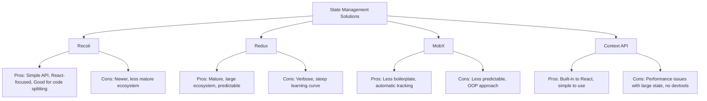

# React Recoil

## Introduction

Managing state in large React applications can quickly become complex. As your application grows, passing props down through multiple component levels (prop drilling) becomes cumbersome and inefficient. Facebook's Recoil provides a refreshing approach to state management in React applications.

Recoil introduces a new concept of "atoms" as the primary unit of state, and "selectors" for derived state. It works with React's component model rather than against it, making it intuitive for React developers while solving some of the challenges that come with larger applications.

In this tutorial, we'll explore how Recoil works, its core concepts, and how to implement it in your React applications.

## Why Recoil?

Before diving into Recoil, let's understand why you might consider it:

- **Simplicity**: Simpler API compared to other state management solutions
- **Atomic Model**: State is broken down into atoms, which are small pieces of state
- **Performance**: Efficient updates that minimize re-renders
- **React Integration**: Designed specifically for React, using hooks
- **Code Splitting**: Better support for code splitting
- **Derived Data**: Elegant handling of derived state through selectors

## Getting Started with Recoil

### Installation

First, let's install Recoil in your React project:

```bash
# Using npm
npm install recoil

# Using yarn
yarn add recoil
```

### Setting Up Recoil in Your Application

To use Recoil, you need to wrap your React application with a `RecoilRoot` component:

```jsx
import React from 'react';
import { RecoilRoot } from 'recoil';
import TodoList from './TodoList';

function App() {
  return (
    <RecoilRoot>
      <TodoList />
    </RecoilRoot>
  );
}

export default App;
```

The `RecoilRoot` acts as a context provider for all the Recoil state within your application. It should typically be placed at the root of your component tree.

## Core Concepts

### Atoms

Atoms are the basic units of state in Recoil. They're similar to React's useState but can be shared across components.

```jsx
import { atom } from 'recoil';

// Creating an atom
const counterState = atom({
  key: 'counterState', // unique ID (required)
  default: 0, // default value (required)
});
```

Each atom needs a unique `key` for identification and a `default` value. The key should be unique across your entire application.

### Using an Atom in a Component

To use an atom in a component, Recoil provides the `useRecoilState` hook, which works similarly to React's `useState`:

```jsx
import React from 'react';
import { useRecoilState } from 'recoil';
import { counterState } from './atoms';

function Counter() {
  const [count, setCount] = useRecoilState(counterState);

  return (
    <div>
      <h1>Count: {count}</h1>
      <button onClick={() => setCount(count + 1)}>Increment</button>
      <button onClick={() => setCount(count - 1)}>Decrement</button>
    </div>
  );
}
```

### Reading and Writing Atoms

Recoil provides three main hooks for interacting with atoms:

1. `useRecoilState`: Similar to React's `useState`, returns a tuple of the state value and a setter function.
2. `useRecoilValue`: Returns only the state value (read-only).
3. `useSetRecoilState`: Returns only the setter function (write-only).

```jsx
import { useRecoilState, useRecoilValue, useSetRecoilState } from 'recoil';

// Reading and writing state
function Component1() {
  const [count, setCount] = useRecoilState(counterState);
  return <button onClick={() => setCount(count + 1)}>Count is {count}</button>;
}

// Reading state only
function Component2() {
  const count = useRecoilValue(counterState);
  return <div>The count is {count}</div>;
}

// Writing state only
function Component3() {
  const setCount = useSetRecoilState(counterState);
  return <button onClick={() => setCount(c => c + 1)}>Increment</button>;
}
```

### Selectors

Selectors are pure functions that compute derived data based on atoms or other selectors. They efficiently recompute and update only when their dependencies change.

```jsx
import { atom, selector } from 'recoil';

const todoListState = atom({
  key: 'todoListState',
  default: [],
});

const todoListStatsState = selector({
  key: 'todoListStatsState',
  get: ({get}) => {
    const todoList = get(todoListState);
    const totalNum = todoList.length;
    const totalCompletedNum = todoList.filter(item => item.isComplete).length;
    const totalUncompletedNum = totalNum - totalCompletedNum;
    const percentCompleted = totalNum === 0 ? 0 : totalCompletedNum / totalNum * 100;

    return {
      totalNum,
      totalCompletedNum,
      totalUncompletedNum,
      percentCompleted,
    };
  },
});
```

You can use the `useRecoilValue` hook to read selector values:

```jsx
function TodoListStats() {
  const {
    totalNum,
    totalCompletedNum,
    totalUncompletedNum,
    percentCompleted,
  } = useRecoilValue(todoListStatsState);

  return (
    <ul>
      <li>Total items: {totalNum}</li>
      <li>Items completed: {totalCompletedNum}</li>
      <li>Items not completed: {totalUncompletedNum}</li>
      <li>Percent completed: {percentCompleted.toFixed(1)}%</li>
    </ul>
  );
}
```

### Writable Selectors

Selectors can also be writable by specifying a `set` function:

```jsx
const filteredTodoListState = selector({
  key: 'filteredTodoListState',
  get: ({get}) => {
    const filter = get(todoListFilterState);
    const list = get(todoListState);

    switch (filter) {
      case 'Completed':
        return list.filter((item) => item.isComplete);
      case 'Uncompleted':
        return list.filter((item) => !item.isComplete);
      default:
        return list;
    }
  },
  set: ({set}, newList) => {
    set(todoListState, newList);
  },
});
```

## Practical Example: Todo Application

Let's build a simple todo application using Recoil:

```jsx
// atoms.js
import { atom, selector } from 'recoil';

export const todoListState = atom({
  key: 'todoListState',
  default: [],
});

export const todoListFilterState = atom({
  key: 'todoListFilterState',
  default: 'All',
});

export const filteredTodoListState = selector({
  key: 'filteredTodoListState',
  get: ({get}) => {
    const filter = get(todoListFilterState);
    const list = get(todoListState);

    switch (filter) {
      case 'Completed':
        return list.filter((item) => item.isComplete);
      case 'Uncompleted':
        return list.filter((item) => !item.isComplete);
      default:
        return list;
    }
  },
});

export const todoListStatsState = selector({
  key: 'todoListStatsState',
  get: ({get}) => {
    const todoList = get(todoListState);
    const totalNum = todoList.length;
    const totalCompletedNum = todoList.filter(item => item.isComplete).length;
    const totalUncompletedNum = totalNum - totalCompletedNum;
    const percentCompleted = totalNum === 0 ? 0 : totalCompletedNum / totalNum * 100;

    return {
      totalNum,
      totalCompletedNum,
      totalUncompletedNum,
      percentCompleted,
    };
  },
});
```

```jsx
// TodoList.js
import React from 'react';
import { useRecoilValue } from 'recoil';
import { filteredTodoListState } from './atoms';
import TodoItemCreator from './TodoItemCreator';
import TodoItem from './TodoItem';
import TodoListStats from './TodoListStats';
import TodoListFilters from './TodoListFilters';

function TodoList() {
  const todoList = useRecoilValue(filteredTodoListState);

  return (
    <div>
      <h1>Todo List</h1>
      <TodoListStats />
      <TodoListFilters />
      <TodoItemCreator />
      {todoList.map(todoItem => (
        <TodoItem key={todoItem.id} item={todoItem} />
      ))}
    </div>
  );
}

export default TodoList;
```

```jsx
// TodoItemCreator.js
import React, { useState } from 'react';
import { useSetRecoilState } from 'recoil';
import { todoListState } from './atoms';

function TodoItemCreator() {
  const [inputValue, setInputValue] = useState('');
  const setTodoList = useSetRecoilState(todoListState);

  function addItem() {
    setTodoList(oldTodoList => [
      ...oldTodoList,
      {
        id: getId(),
        text: inputValue,
        isComplete: false,
      },
    ]);
    setInputValue('');
  }

  function onChange(event) {
    setInputValue(event.target.value);
  }

  return (
    <div>
      <input type="text" value={inputValue} onChange={onChange} />
      <button onClick={addItem}>Add</button>
    </div>
  );
}

// Utility for creating unique IDs
let id = 0;
function getId() {
  return id++;
}

export default TodoItemCreator;
```

```jsx
// TodoItem.js
import React from 'react';
import { useRecoilState } from 'recoil';
import { todoListState } from './atoms';

function TodoItem({ item }) {
  const [todoList, setTodoList] = useRecoilState(todoListState);
  const index = todoList.findIndex(listItem => listItem.id === item.id);

  const editItemText = (event) => {
    const newList = replaceItemAtIndex(todoList, index, {
      ...item,
      text: event.target.value,
    });
    setTodoList(newList);
  };

  const toggleItemCompletion = () => {
    const newList = replaceItemAtIndex(todoList, index, {
      ...item,
      isComplete: !item.isComplete,
    });
    setTodoList(newList);
  };

  const deleteItem = () => {
    const newList = removeItemAtIndex(todoList, index);
    setTodoList(newList);
  };

  return (
    <div>
      <input type="text" value={item.text} onChange={editItemText} />
      <input
        type="checkbox"
        checked={item.isComplete}
        onChange={toggleItemCompletion}
      />
      <button onClick={deleteItem}>X</button>
    </div>
  );
}

// Utility functions
function replaceItemAtIndex(arr, index, newValue) {
  return [...arr.slice(0, index), newValue, ...arr.slice(index + 1)];
}

function removeItemAtIndex(arr, index) {
  return [...arr.slice(0, index), ...arr.slice(index + 1)];
}

export default TodoItem;
```

```jsx
// TodoListFilters.js
import React from 'react';
import { useRecoilState } from 'recoil';
import { todoListFilterState } from './atoms';

function TodoListFilters() {
  const [filter, setFilter] = useRecoilState(todoListFilterState);

  const updateFilter = ({target: {value}}) => {
    setFilter(value);
  };

  return (
    <div>
      Filter:
      <select value={filter} onChange={updateFilter}>
        <option value="All">All</option>
        <option value="Completed">Completed</option>
        <option value="Uncompleted">Uncompleted</option>
      </select>
    </div>
  );
}

export default TodoListFilters;
```

```jsx
// TodoListStats.js
import React from 'react';
import { useRecoilValue } from 'recoil';
import { todoListStatsState } from './atoms';

function TodoListStats() {
  const {
    totalNum,
    totalCompletedNum,
    totalUncompletedNum,
    percentCompleted,
  } = useRecoilValue(todoListStatsState);

  return (
    <div>
      <ul>
        <li>Total items: {totalNum}</li>
        <li>Items completed: {totalCompletedNum}</li>
        <li>Items not completed: {totalUncompletedNum}</li>
        <li>Percent completed: {percentCompleted.toFixed(1)}%</li>
      </ul>
    </div>
  );
}

export default TodoListStats;
```

## Advanced Recoil Features

### Async Selectors

Recoil selectors can handle asynchronous data:

```jsx
const userNameQuery = selector({
  key: 'userNameQuery',
  get: async ({get}) => {
    const userId = get(currentUserIDState);
    const response = await fetch(`/api/user/${userId}`);
    return await response.json();
  },
});
```

Components can use this selector just like any other:

```jsx
function UserInfo() {
  const userName = useRecoilValue(userNameQuery);
  return <div>{userName}</div>;
}
```

### Atom Family and Selector Family

For managing collections of similar atoms or selectors:

```jsx
const todoItemState = atomFamily({
  key: 'todoItem',
  default: id => ({
    id,
    text: '',
    isComplete: false,
  }),
});

// Usage
function TodoItem({id}) {
  const [item, setItem] = useRecoilState(todoItemState(id));
  
  return (
    <div>
      <input
        value={item.text}
        onChange={(e) => setItem({...item, text: e.target.value})}
      />
      <input
        type="checkbox"
        checked={item.isComplete}
        onChange={() => setItem({...item, isComplete: !item.isComplete})}
      />
    </div>
  );
}
```

### Atom Effects

Recoil allows you to add side effects to your atoms using effects:

```jsx
const persistentCounterState = atom({
  key: 'persistentCounter',
  default: 0,
  effects: [
    ({setSelf, onSet}) => {
      // Load persistent data
      const savedValue = localStorage.getItem('counter');
      if (savedValue != null) {
        setSelf(JSON.parse(savedValue));
      }
      
      // Subscribe to state changes and save to localStorage
      onSet(newValue => {
        localStorage.setItem('counter', JSON.stringify(newValue));
      });
    }
  ]
});
```

## Recoil vs Other State Management Solutions

Here's how Recoil compares with other popular state management solutions:



## Best Practices

1. **Atom Keys**: Always use unique keys for atoms and selectors.
2. **Atom Organization**: Group related atoms in separate files.
3. **Granular Atoms**: Create small, focused atoms rather than large state objects.
4. **Use Selectors for Derived State**: Don't duplicate state that can be derived.
5. **Async Operations**: Use async selectors for data fetching.
6. **Persistence**: Use atom effects for persistence.

## Summary

Recoil provides a powerful yet straightforward approach to state management in React applications. Its key concepts include:

- **Atoms**: Basic units of state that can be shared across components
- **Selectors**: Derived state based on atoms or other selectors
- **Hooks-based API**: `useRecoilState`, `useRecoilValue`, and `useSetRecoilState`
- **Advanced Features**: Async selectors, atom families, and atom effects

What makes Recoil stand out is how it embraces React's component model and hooks while providing powerful state management capabilities.

## Additional Resources

- [Official Recoil Documentation](https://recoiljs.org/)
- [Recoil GitHub Repository](https://github.com/facebookexperimental/Recoil)
- [Thinking in Recoil: A Tutorial](https://recoiljs.org/docs/introduction/motivation)

## Exercises

1. Create a simple counter application with increment, decrement, and reset buttons using Recoil.
2. Build a theme switcher that changes between light and dark themes using Recoil atoms.
3. Extend the todo application by adding categories and filtering by categories.
4. Create a shopping cart feature using Recoil with the ability to add items, remove items, and calculate the total price.
5. Implement data persistence in your Recoil state using localStorage and atom effects.

Try these exercises to strengthen your understanding of Recoil and state management in React applications.