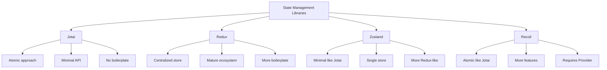

# React Jotai

## Introduction

Jotai is a state management library for React that takes an atomic approach to global state management. The word "jotai" (状態) means "state" in Japanese, which perfectly describes its purpose. Created as a minimal alternative to libraries like Redux and Recoil, Jotai focuses on simplicity and ease of use while still providing powerful capabilities for managing application state.

Unlike traditional state management solutions that use a centralized store, Jotai uses a primitive called an "atom" as its core building block. Atoms are tiny pieces of state that can be composed together to build complex data structures while maintaining optimal re-rendering.

## Why Use Jotai?

Jotai has several advantages that make it a compelling choice for React state management:

1. **Minimal API**: Simple and easy to learn with a small footprint
2. **No boilerplate**: Less code to write compared to Redux
3. **TypeScript friendly**: Built with TypeScript from the ground up
4. **No context providers needed**: No wrapper hell
5. **Optimal rendering**: Only components that use an atom's value re-render when it changes
6. **Derived state**: Create atoms that depend on other atoms

## Getting Started with Jotai

### Installation

First, install Jotai in your React project:

```bash
# Using npm
npm install jotai

# Using yarn
yarn add jotai

# Using pnpm
pnpm add jotai
```

### Basic Usage

Let's start with a basic counter example to understand how Jotai works:

```jsx
import { atom, useAtom } from 'jotai'

// Create an atom (piece of state)
const countAtom = atom(0)

function Counter() {
  // Use the atom in your component (similar to useState)
  const [count, setCount] = useAtom(countAtom)

  return (
    <div>
      <h1>Count: {count}</h1>
      <button onClick={() => setCount(count + 1)}>Increment</button>
      <button onClick={() => setCount(count - 1)}>Decrement</button>
    </div>
  )
}
```

In this example:
1. We create an atom with an initial value of `0` using `atom(0)`
2. We use the `useAtom` hook to read and update the atom's value, similar to React's `useState`
3. The component re-renders when the atom's value changes

### Sharing State Between Components

The real power of Jotai comes when sharing state between components:

```jsx
import { atom, useAtom } from 'jotai'

// Create a shared atom
const countAtom = atom(0)

function CounterDisplay() {
  // This component only reads the value
  const [count] = useAtom(countAtom)
  return <div>Current count: {count}</div>
}

function CounterButtons() {
  // This component only updates the value
  const [, setCount] = useAtom(countAtom)
  return (
    <div>
      <button onClick={() => setCount(c => c + 1)}>Increment</button>
      <button onClick={() => setCount(c => c - 1)}>Decrement</button>
    </div>
  )
}

function CounterApp() {
  return (
    <div>
      <CounterDisplay />
      <CounterButtons />
    </div>
  )
}
```

Both components access the same `countAtom`, allowing them to share state without prop drilling or context providers.

## Advanced Concepts

### Derived Atoms

One of Jotai's powerful features is the ability to create atoms that derive their value from other atoms:

```jsx
import { atom, useAtom } from 'jotai'

// Base atom
const countAtom = atom(0)

// Derived atom (read-only)
const doubledCountAtom = atom(get => get(countAtom) * 2)

function DerivedCounter() {
  const [count, setCount] = useAtom(countAtom)
  const [doubledCount] = useAtom(doubledCountAtom)
  
  return (
    <div>
      <h2>Original count: {count}</h2>
      <h2>Doubled count: {doubledCount}</h2>
      <button onClick={() => setCount(count + 1)}>Increment</button>
    </div>
  )
}
```

In this example, `doubledCountAtom` derives its value from `countAtom`. Whenever `countAtom` changes, `doubledCountAtom` automatically updates.

### Writable Derived Atoms

You can also create derived atoms that can be written to:

```jsx
import { atom, useAtom } from 'jotai'

const countAtom = atom(0)

// Derived atom that can be read and written
const doubledCountAtom = atom(
  // Read function
  get => get(countAtom) * 2,
  // Write function
  (get, set, newDoubledValue) => {
    set(countAtom, newDoubledValue / 2)
  }
)

function WriteableDerivedCounter() {
  const [count] = useAtom(countAtom)
  const [doubledCount, setDoubledCount] = useAtom(doubledCountAtom)
  
  return (
    <div>
      <h2>Original count: {count}</h2>
      <h2>Doubled count: {doubledCount}</h2>
      <button onClick={() => setDoubledCount(doubledCount + 2)}>
        Add 2 to doubled count
      </button>
    </div>
  )
}
```

When you update `doubledCountAtom`, it updates `countAtom` according to the write function.

### Async Atoms

Jotai supports async atoms for handling asynchronous data:

```jsx
import { atom, useAtom } from 'jotai'

// Async atom that fetches data
const userAtom = atom(async () => {
  const response = await fetch('https://jsonplaceholder.typicode.com/users/1')
  const user = await response.json()
  return user
})

function UserProfile() {
  const [user] = useAtom(userAtom)
  
  if (!user) {
    return <div>Loading...</div>
  }
  
  return (
    <div>
      <h2>{user.name}</h2>
      <p>Email: {user.email}</p>
      <p>Website: {user.website}</p>
    </div>
  )
}
```

When using async atoms, the initial value is `undefined` until the promise resolves.

## Real-World Example: Todo List

Let's build a simple todo list application using Jotai to demonstrate its real-world application:

```jsx
import { atom, useAtom } from 'jotai'
import { nanoid } from 'nanoid'
import { useState } from 'react'

// Define the Todo type
// type Todo = { id: string; text: string; completed: boolean }

// Create atoms
const todosAtom = atom([
  { id: '1', text: 'Learn React', completed: true },
  { id: '2', text: 'Learn Jotai', completed: false }
])

const filteredTodosAtom = atom(get => get(todosAtom))

function TodoApp() {
  const [todos, setTodos] = useAtom(todosAtom)
  const [filteredTodos] = useAtom(filteredTodosAtom)
  const [newTodoText, setNewTodoText] = useState('')

  const addTodo = () => {
    if (newTodoText.trim()) {
      setTodos([
        ...todos, 
        { id: nanoid(), text: newTodoText, completed: false }
      ])
      setNewTodoText('')
    }
  }

  const toggleTodo = (id) => {
    setTodos(todos.map(todo => 
      todo.id === id ? { ...todo, completed: !todo.completed } : todo
    ))
  }

  const deleteTodo = (id) => {
    setTodos(todos.filter(todo => todo.id !== id))
  }

  return (
    <div>
      <h1>Todo List with Jotai</h1>
      
      <div>
        <input
          type="text"
          value={newTodoText}
          onChange={e => setNewTodoText(e.target.value)}
          placeholder="Add new todo"
        />
        <button onClick={addTodo}>Add</button>
      </div>
      
      <ul>
        {filteredTodos.map(todo => (
          <li key={todo.id}>
            <input
              type="checkbox"
              checked={todo.completed}
              onChange={() => toggleTodo(todo.id)}
            />
            <span style={{ 
              textDecoration: todo.completed ? 'line-through' : 'none' 
            }}>
              {todo.text}
            </span>
            <button onClick={() => deleteTodo(todo.id)}>Delete</button>
          </li>
        ))}
      </ul>
    </div>
  )
}
```

Now, let's enhance this example by adding filter functionality:

```jsx
import { atom, useAtom } from 'jotai'

// ... previous code

// Create a filter atom
const filterAtom = atom('all') // 'all', 'active', 'completed'

// Create a filtered todos atom that depends on todos and filter
const filteredTodosAtom = atom(get => {
  const todos = get(todosAtom)
  const filter = get(filterAtom)
  
  switch (filter) {
    case 'active':
      return todos.filter(todo => !todo.completed)
    case 'completed':
      return todos.filter(todo => todo.completed)
    default:
      return todos
  }
})

function TodoFilters() {
  const [filter, setFilter] = useAtom(filterAtom)
  
  return (
    <div>
      <button 
        onClick={() => setFilter('all')} 
        disabled={filter === 'all'}
      >
        All
      </button>
      <button 
        onClick={() => setFilter('active')} 
        disabled={filter === 'active'}
      >
        Active
      </button>
      <button 
        onClick={() => setFilter('completed')} 
        disabled={filter === 'completed'}
      >
        Completed
      </button>
    </div>
  )
}

function TodoApp() {
  // ... previous code

  return (
    <div>
      <h1>Todo List with Jotai</h1>
      
      {/* ... previous JSX */}
      
      <TodoFilters />
      
      <ul>
        {filteredTodos.map(todo => (
          // ... todo item
        ))}
      </ul>
    </div>
  )
}
```

## Using DevTools with Jotai

Jotai has developer tools that help you debug your application state:

```jsx
import { useAtomsDevtools } from 'jotai/devtools'

function DevToolsWrapper({ children }) {
  useAtomsDevtools('Todo App')
  return children
}

function App() {
  return (
    <DevToolsWrapper>
      <TodoApp />
    </DevToolsWrapper>
  )
}
```

## Jotai vs Other State Management Libraries

Here's a quick comparison of Jotai with other popular state management libraries:



## Best Practices

1. **Keep atoms focused**: Create atoms that represent logical pieces of state.
2. **Derive when possible**: Use derived atoms instead of duplicating state.
3. **Separate concerns**: Split read and write operations into different components when appropriate.
4. **Use selectors**: For large objects, use selectors to prevent unnecessary re-renders.
5. **Organize atoms**: Keep related atoms in separate files for better organization.

## Summary

Jotai offers a refreshingly simple approach to state management in React applications. By using atomic state pieces that can be composed together, it provides a flexible way to share and update state across your application without the complexity of other state management solutions.

Key takeaways:
- Jotai uses atoms as its core building block for state
- Atoms can be primitive values or derived from other atoms
- The `useAtom` hook provides a familiar API similar to React's `useState`
- Jotai handles complex scenarios like async state and derived values
- No provider components or context setup is needed

## Additional Resources

- [Jotai Official Documentation](https://jotai.org/)
- [GitHub Repository](https://github.com/pmndrs/jotai)
- [Comparison with other libraries](https://jotai.org/docs/basics/comparison)

## Exercises

1. Create a simple counter application with increment, decrement, and reset functionality using Jotai.
2. Build a theme switcher that toggles between light and dark modes using Jotai atoms.
3. Create a shopping cart where items can be added, removed, and quantities adjusted.
4. Implement a user authentication flow using async atoms to handle login/logout states.
5. Extend the todo list example to include categories and due dates for each task.