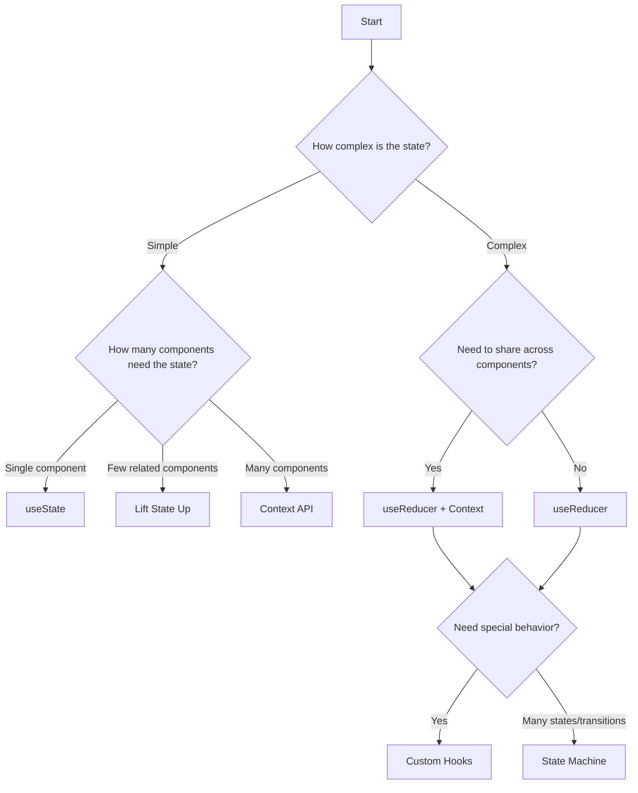

# React State Management Patterns

## Introduction

State management is one of the most critical aspects of building React applications. As your applications grow in complexity, having the right patterns for managing state becomes essential for maintaining code quality and developer sanity.

In this guide, we'll explore various state management patterns in React, starting from the simplest approaches to more advanced techniques. You'll learn when to use each pattern and how to implement them effectively.

## Basic State Management Patterns

### Local Component State

The most basic pattern for state management in React is using the `useState` hook within a component.

```jsx
import React, { useState } from 'react';

function Counter() {
  const [count, setCount] = useState(0);
  
  return (
    <div>
      <p>Count: {count}</p>
      <button onClick={() => setCount(count + 1)}>Increment</button>
    </div>
  );
}
```

This pattern works well for:
- Simple components with minimal state
- State that doesn't need to be shared with other components
- UI state that's specific to a single component

### Lifting State Up

When multiple components need to share state, a common pattern is "lifting state up" to the closest common ancestor.

```jsx
import React, { useState } from 'react';

function ParentComponent() {
  const [count, setCount] = useState(0);
  
  return (
    <div>
      <DisplayCount count={count} />
      <IncrementButton onIncrement={() => setCount(count + 1)} />
    </div>
  );
}

function DisplayCount({ count }) {
  return <p>Count: {count}</p>;
}

function IncrementButton({ onIncrement }) {
  return <button onClick={onIncrement}>Increment</button>;
}
```

This pattern is appropriate when:
- A small number of components need to share state
- The component hierarchy is relatively shallow
- The state updates are simple

## Intermediate State Management Patterns

### State Reducer Pattern

For more complex state logic, the reducer pattern using `useReducer` provides a more structured approach.

```jsx
import React, { useReducer } from 'react';

// Define actions
const INCREMENT = 'INCREMENT';
const DECREMENT = 'DECREMENT';
const RESET = 'RESET';

// Reducer function
function counterReducer(state, action) {
  switch (action.type) {
    case INCREMENT:
      return { count: state.count + 1 };
    case DECREMENT:
      return { count: state.count - 1 };
    case RESET:
      return { count: 0 };
    default:
      return state;
  }
}

function CounterWithReducer() {
  const [state, dispatch] = useReducer(counterReducer, { count: 0 });
  
  return (
    <div>
      <p>Count: {state.count}</p>
      <button onClick={() => dispatch({ type: INCREMENT })}>Increment</button>
      <button onClick={() => dispatch({ type: DECREMENT })}>Decrement</button>
      <button onClick={() => dispatch({ type: RESET })}>Reset</button>
    </div>
  );
}
```

The reducer pattern shines when:
- State logic becomes complex with multiple related pieces of state
- State transitions need to be well-defined and predictable
- Multiple actions can affect the same state in different ways

### Context + useReducer Pattern

For sharing state across many components, you can combine the Context API with useReducer.

```jsx
import React, { createContext, useContext, useReducer } from 'react';

// Create context
const CounterContext = createContext();

// Reducer function
function counterReducer(state, action) {
  switch (action.type) {
    case 'INCREMENT':
      return { count: state.count + 1 };
    case 'DECREMENT':
      return { count: state.count - 1 };
    default:
      return state;
  }
}

// Provider component
function CounterProvider({ children }) {
  const [state, dispatch] = useReducer(counterReducer, { count: 0 });
  
  return (
    <CounterContext.Provider value={{ state, dispatch }}>
      {children}
    </CounterContext.Provider>
  );
}

// Custom hook for using the counter context
function useCounter() {
  const context = useContext(CounterContext);
  if (!context) {
    throw new Error('useCounter must be used within a CounterProvider');
  }
  return context;
}

// Components that use the counter
function CountDisplay() {
  const { state } = useCounter();
  return <p>Count: {state.count}</p>;
}

function CountButtons() {
  const { dispatch } = useCounter();
  return (
    <div>
      <button onClick={() => dispatch({ type: 'INCREMENT' })}>Increment</button>
      <button onClick={() => dispatch({ type: 'DECREMENT' })}>Decrement</button>
    </div>
  );
}

// App component
function CounterApp() {
  return (
    <CounterProvider>
      <CountDisplay />
      <CountButtons />
    </CounterProvider>
  );
}
```

This pattern works well when:
- State needs to be accessed by many components at different levels of the component tree
- You want to avoid prop-drilling
- You need organized state management without adding external libraries

## Advanced State Management Patterns

### Custom State Hook Pattern

Creating custom hooks for specific state management needs can help encapsulate and reuse logic.

```jsx
import { useState, useEffect } from 'react';

function useLocalStorage(key, initialValue) {
  // State to store our value
  const [storedValue, setStoredValue] = useState(() => {
    try {
      // Get from local storage by key
      const item = window.localStorage.getItem(key);
      // Parse stored json or return initialValue
      return item ? JSON.parse(item) : initialValue;
    } catch (error) {
      console.log(error);
      return initialValue;
    }
  });
  
  // Return a wrapped version of useState's setter function that
  // persists the new value to localStorage.
  const setValue = (value) => {
    try {
      // Allow value to be a function so we have same API as useState
      const valueToStore =
        value instanceof Function ? value(storedValue) : value;
      // Save state
      setStoredValue(valueToStore);
      // Save to local storage
      window.localStorage.setItem(key, JSON.stringify(valueToStore));
    } catch (error) {
      console.log(error);
    }
  };
  
  return [storedValue, setValue];
}

// Usage
function PersistentCounter() {
  const [count, setCount] = useLocalStorage('count', 0);
  
  return (
    <div>
      <p>Count: {count}</p>
      <button onClick={() => setCount(count + 1)}>Increment</button>
    </div>
  );
}
```

Custom hooks are great for:
- Reusing state logic across multiple components
- Abstracting complex state handling
- Creating specialized state behaviors (like localStorage persistence)

### State Machine Pattern

For complex UIs with many states, the state machine pattern can help manage transitions.

```jsx
import React, { useReducer } from 'react';

// Define states
const STATES = {
  IDLE: 'IDLE',
  LOADING: 'LOADING',
  SUCCESS: 'SUCCESS',
  ERROR: 'ERROR'
};

// Define state machine transitions
const stateChart = {
  [STATES.IDLE]: {
    FETCH: STATES.LOADING
  },
  [STATES.LOADING]: {
    RESOLVE: STATES.SUCCESS,
    REJECT: STATES.ERROR
  },
  [STATES.SUCCESS]: {
    FETCH: STATES.LOADING,
    RESET: STATES.IDLE
  },
  [STATES.ERROR]: {
    FETCH: STATES.LOADING,
    RESET: STATES.IDLE
  }
};

function fetchMachineReducer(state, event) {
  const nextState = stateChart[state.status]?.[event.type];
  
  if (!nextState) {
    return state;
  }
  
  return {
    ...state,
    status: nextState,
    data: event.data,
    error: event.error
  };
}

function useFetchMachine(fetchFn) {
  const [state, dispatch] = useReducer(fetchMachineReducer, {
    status: STATES.IDLE,
    data: null,
    error: null
  });
  
  const { status, data, error } = state;
  
  async function fetch() {
    dispatch({ type: 'FETCH' });
    try {
      const result = await fetchFn();
      dispatch({ type: 'RESOLVE', data: result });
    } catch (err) {
      dispatch({ type: 'REJECT', error: err.message });
    }
  }
  
  function reset() {
    dispatch({ type: 'RESET' });
  }
  
  return {
    status,
    data,
    error,
    isIdle: status === STATES.IDLE,
    isLoading: status === STATES.LOADING,
    isSuccess: status === STATES.SUCCESS,
    isError: status === STATES.ERROR,
    fetch,
    reset
  };
}

// Usage example
function UserProfile() {
  const { 
    data: user,
    isLoading,
    isError,
    error,
    fetch: fetchUser
  } = useFetchMachine(() => {
    return new Promise((resolve) => {
      setTimeout(() => {
        resolve({ name: 'John Doe', email: 'john@example.com' });
      }, 1000);
    });
  });
  
  React.useEffect(() => {
    fetchUser();
  }, []);
  
  if (isLoading) return <p>Loading user...</p>;
  if (isError) return <p>Error: {error}</p>;
  if (!user) return <p>No user data</p>;
  
  return (
    <div>
      <h2>{user.name}</h2>
      <p>{user.email}</p>
      <button onClick={fetchUser}>Reload</button>
    </div>
  );
}
```

The state machine pattern is powerful for:
- UIs with complex, multi-state workflows
- Ensuring valid state transitions
- Making state management more predictable and bug-resistant

## Choosing the Right Pattern

Let's visualize when to use each pattern:



## Real-World Example: Shopping Cart

Let's implement a shopping cart using the Context + useReducer pattern:

```jsx
import React, { createContext, useContext, useReducer } from 'react';

// Create context for the shopping cart
const CartContext = createContext();

// Action types
const ADD_ITEM = 'ADD_ITEM';
const REMOVE_ITEM = 'REMOVE_ITEM';
const UPDATE_QUANTITY = 'UPDATE_QUANTITY';
const CLEAR_CART = 'CLEAR_CART';

// Reducer function
function cartReducer(state, action) {
  switch (action.type) {
    case ADD_ITEM: {
      const { item } = action.payload;
      const existingItem = state.items.find(i => i.id === item.id);
      
      if (existingItem) {
        // Item exists, increase quantity
        return {
          ...state,
          items: state.items.map(i =>
            i.id === item.id
              ? { ...i, quantity: i.quantity + 1 }
              : i
          ),
        };
      } else {
        // Add new item
        return {
          ...state,
          items: [...state.items, { ...item, quantity: 1 }],
        };
      }
    }
    
    case REMOVE_ITEM: {
      const { itemId } = action.payload;
      return {
        ...state,
        items: state.items.filter(item => item.id !== itemId),
      };
    }
    
    case UPDATE_QUANTITY: {
      const { itemId, quantity } = action.payload;
      if (quantity <= 0) {
        // If quantity is 0 or negative, remove item
        return {
          ...state,
          items: state.items.filter(item => item.id !== itemId),
        };
      }
      
      return {
        ...state,
        items: state.items.map(item =>
          item.id === itemId ? { ...item, quantity } : item
        ),
      };
    }
    
    case CLEAR_CART:
      return {
        ...state,
        items: [],
      };
      
    default:
      return state;
  }
}

// Provider component
function CartProvider({ children }) {
  const [state, dispatch] = useReducer(cartReducer, {
    items: [],
  });
  
  // Calculate total
  const total = state.items.reduce(
    (sum, item) => sum + item.price * item.quantity,
    0
  );
  
  // Actions
  const addItem = (item) => {
    dispatch({ type: ADD_ITEM, payload: { item } });
  };
  
  const removeItem = (itemId) => {
    dispatch({ type: REMOVE_ITEM, payload: { itemId } });
  };
  
  const updateQuantity = (itemId, quantity) => {
    dispatch({ type: UPDATE_QUANTITY, payload: { itemId, quantity } });
  };
  
  const clearCart = () => {
    dispatch({ type: CLEAR_CART });
  };
  
  return (
    <CartContext.Provider
      value={{
        items: state.items,
        total,
        addItem,
        removeItem,
        updateQuantity,
        clearCart,
      }}
    >
      {children}
    </CartContext.Provider>
  );
}

// Custom hook
function useCart() {
  const context = useContext(CartContext);
  if (!context) {
    throw new Error('useCart must be used within a CartProvider');
  }
  return context;
}

// Usage example
function Product({ product }) {
  const { addItem } = useCart();
  
  return (
    <div className="product">
      <h3>{product.name}</h3>
      <p>${product.price.toFixed(2)}</p>
      <button onClick={() => addItem(product)}>Add to Cart</button>
    </div>
  );
}

function CartSummary() {
  const { items, total, removeItem, updateQuantity } = useCart();
  
  if (items.length === 0) {
    return <p>Your cart is empty</p>;
  }
  
  return (
    <div className="cart-summary">
      <h2>Shopping Cart</h2>
      <ul>
        {items.map(item => (
          <li key={item.id}>
            <div>{item.name} - ${item.price.toFixed(2)}</div>
            <div>
              <button 
                onClick={() => updateQuantity(item.id, item.quantity - 1)}
              >
                -
              </button>
              <span>{item.quantity}</span>
              <button 
                onClick={() => updateQuantity(item.id, item.quantity + 1)}
              >
                +
              </button>
              <button onClick={() => removeItem(item.id)}>Remove</button>
            </div>
          </li>
        ))}
      </ul>
      <div className="total">
        <strong>Total: ${total.toFixed(2)}</strong>
      </div>
    </div>
  );
}

// App with shopping cart
function ShoppingApp() {
  const products = [
    { id: 1, name: "Headphones", price: 79.99 },
    { id: 2, name: "Keyboard", price: 49.99 },
    { id: 3, name: "Mouse", price: 29.99 }
  ];
  
  return (
    <CartProvider>
      <div className="shop">
        <h1>Electronics Shop</h1>
        <div className="products">
          {products.map(product => (
            <Product key={product.id} product={product} />
          ))}
        </div>
        <CartSummary />
      </div>
    </CartProvider>
  );
}
```

This shopping cart example demonstrates:
1. Structured state management with useReducer
2. State sharing across components with Context API
3. Encapsulated logic with custom hooks
4. Action creators for standardized updates
5. Complex state transitions (adding, removing, updating items)

## Summary

We've explored various state management patterns in React, from simple to complex:

1. **Local Component State**: Using `useState` for simple component-specific state
2. **Lifting State Up**: Moving state to a common ancestor for sharing between related components
3. **Reducer Pattern**: Using `useReducer` for complex state logic with predictable transitions
4. **Context + useReducer**: Combining Context API with useReducer for app-wide state management
5. **Custom State Hooks**: Encapsulating state logic in reusable hooks
6. **State Machine Pattern**: Managing complex state transitions with formal state machines

Remember that there's no one-size-fits-all solution. The best approach depends on your specific needs:

- Start simple with `useState` and lift state as needed
- Use `useReducer` when state logic becomes complex
- Add Context when state needs to be shared widely
- Consider custom hooks to encapsulate and reuse logic
- Adopt state machines for complex UI workflows with many states

## Exercises

1. Convert a simple counter from `useState` to `useReducer`.
2. Create a theme switcher using the Context API.
3. Implement a form with multiple fields using the reducer pattern.
4. Build a custom hook that syncs state with URL parameters.
5. Implement a multi-step wizard using the state machine pattern.

## Additional Resources

- [React's Official Documentation on Hooks](https://reactjs.org/docs/hooks-intro.html)
- [XState Library](https://xstate.js.org/) for robust state machines
- [Redux Docs](https://redux.js.org/) for learning about the reducer pattern in depth
- [useContext + useReducer as a Redux alternative](https://kentcdodds.com/blog/how-to-use-react-context-effectively)
- [React Query](https://react-query.tanstack.com/) for server state management

Understanding these patterns will help you build React applications that are easier to maintain, test, and extend as they grow in complexity.