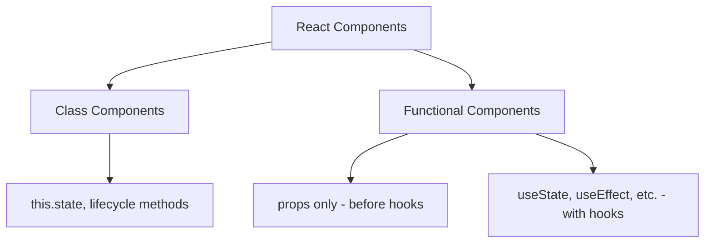

# React Hooks Introduction

## What Are React Hooks?

React Hooks are functions that let you "hook into" React state and lifecycle features from functional components. They were introduced in React 16.8 and have revolutionized the way we write React applications by enabling the use of state and other React features without writing a class.

Before hooks, if you needed state or lifecycle methods in a component, you had to use a class component. With hooks, you can add state and other React features to functional components, making your code more concise, easier to understand, and easier to test.

## Why Were Hooks Introduced?

Hooks were introduced to solve several problems that existed in React:

1. **Complex Components Become Hard to Understand**: Components often grew from simple to complex over time, with related logic scattered across different lifecycle methods.

2. **Classes Can Be Confusing**: Classes can be a barrier to learning React, requiring understanding of `this` in JavaScript which behaves differently than in most languages.

3. **Reusing Stateful Logic**: Before hooks, patterns like render props and higher-order components were used to reuse stateful logic, which made code harder to follow.

Let's visualize the difference between class and functional components:



## The Basic Hooks

React provides a few built-in hooks. The most common ones are:

- **useState**: Allows functional components to have state
- **useEffect**: Handles side effects in your components
- **useContext**: Helps functional components use React context

Let's explore each of these in more detail with examples.

### The useState Hook

The `useState` hook allows you to add state to functional components. Here's a simple counter example:

```jsx
import React, { useState } from 'react';

function Counter() {
  // Declare a state variable named "count" with initial value 0
  const [count, setCount] = useState(0);

  return (
    <div>
      <p>You clicked {count} times</p>
      <button onClick={() => setCount(count + 1)}>
        Click me
      </button>
    </div>
  );
}
```

Let's break down what's happening:

1. We import the `useState` hook from React
2. Inside our functional component, we call `useState` with an initial state value (0)
3. `useState` returns an array with two elements: the current state value and a function to update it
4. We use array destructuring to assign names to these elements: `count` and `setCount`
5. When the button is clicked, `setCount` is called with the new count value

### The useEffect Hook

The `useEffect` hook lets you perform side effects in function components. It serves the same purpose as `componentDidMount`, `componentDidUpdate`, and `componentWillUnmount` in class components, but unified into a single API.

Here's an example that updates the document title when the count changes:

```jsx
import React, { useState, useEffect } from 'react';

function DocumentTitleUpdater() {
  const [count, setCount] = useState(0);

  // Similar to componentDidMount and componentDidUpdate
  useEffect(() => {
    // Update the document title using the browser API
    document.title = `You clicked ${count} times`;
  });

  return (
    <div>
      <p>You clicked {count} times</p>
      <button onClick={() => setCount(count + 1)}>
        Click me
      </button>
    </div>
  );
}
```

In this example, `useEffect` runs after every render, including the first render. It updates the document title to reflect the current count.

You can also control when the effect runs by providing a dependency array:

```jsx
useEffect(() => {
  document.title = `You clicked ${count} times`;
}, [count]); // Only re-run the effect if count changes
```

With an empty dependency array, the effect runs only once after the initial render:

```jsx
useEffect(() => {
  console.log('Component mounted');
  
  // Optional cleanup function
  return () => {
    console.log('Component will unmount');
  };
}, []); // Empty dependency array means "run once"
```

## Real-World Example: A Todo List with Hooks

Let's create a simple todo list application using hooks:

```jsx
import React, { useState } from 'react';

function TodoList() {
  const [todos, setTodos] = useState([]);
  const [input, setInput] = useState('');

  const addTodo = () => {
    if (input.trim() !== '') {
      setTodos([...todos, { text: input, completed: false }]);
      setInput(''); // Clear the input field
    }
  };

  const toggleTodo = (index) => {
    const newTodos = [...todos];
    newTodos[index].completed = !newTodos[index].completed;
    setTodos(newTodos);
  };

  return (
    <div>
      <h1>Todo List</h1>
      
      <div>
        <input 
          type="text" 
          value={input} 
          onChange={e => setInput(e.target.value)}
          placeholder="Add a todo"
        />
        <button onClick={addTodo}>Add</button>
      </div>
      
      <ul>
        {todos.map((todo, index) => (
          <li 
            key={index} 
            style={{ 
              textDecoration: todo.completed ? 'line-through' : 'none',
              cursor: 'pointer' 
            }}
            onClick={() => toggleTodo(index)}
          >
            {todo.text}
          </li>
        ))}
      </ul>
      
      <div>
        <p>Total todos: {todos.length}</p>
        <p>Completed: {todos.filter(todo => todo.completed).length}</p>
      </div>
    </div>
  );
}
```

In this example:
1. We use `useState` to manage the list of todos and the input field
2. We define functions to add and toggle todos
3. We render the list of todos with styling based on their completed status
4. We display statistics about the todos

## Combining Multiple Hooks

One of the powerful aspects of hooks is how they can be combined. Let's enhance our todo list to save todos to `localStorage`:

```jsx
import React, { useState, useEffect } from 'react';

function PersistentTodoList() {
  // Initialize state from localStorage or empty array
  const [todos, setTodos] = useState(() => {
    const savedTodos = localStorage.getItem('todos');
    if (savedTodos) {
      return JSON.parse(savedTodos);
    }
    return [];
  });
  
  const [input, setInput] = useState('');

  // Save to localStorage whenever todos change
  useEffect(() => {
    localStorage.setItem('todos', JSON.stringify(todos));
  }, [todos]);

  const addTodo = () => {
    if (input.trim() !== '') {
      setTodos([...todos, { text: input, completed: false }]);
      setInput('');
    }
  };

  const toggleTodo = (index) => {
    const newTodos = [...todos];
    newTodos[index].completed = !newTodos[index].completed;
    setTodos(newTodos);
  };

  return (
    <div>
      <h1>Persistent Todo List</h1>
      
      <div>
        <input 
          type="text" 
          value={input} 
          onChange={e => setInput(e.target.value)}
          placeholder="Add a todo"
        />
        <button onClick={addTodo}>Add</button>
      </div>
      
      <ul>
        {todos.map((todo, index) => (
          <li 
            key={index} 
            style={{ 
              textDecoration: todo.completed ? 'line-through' : 'none',
              cursor: 'pointer' 
            }}
            onClick={() => toggleTodo(index)}
          >
            {todo.text}
          </li>
        ))}
      </ul>
      
      <div>
        <p>Total todos: {todos.length}</p>
        <p>Completed: {todos.filter(todo => todo.completed).length}</p>
      </div>
    </div>
  );
}
```

In this enhanced example:

1. We initialize our state with todos from `localStorage` if they exist
2. We use the `useEffect` hook to save todos to `localStorage` whenever they change
3. We're using a function in the `useState` initial value to avoid expensive operations on every render

## Rules of Hooks

There are two important rules you must follow when using hooks:

1. **Only Call Hooks at the Top Level**  
   Don't call hooks inside loops, conditions, or nested functions. Always use hooks at the top level of your React function.

2. **Only Call Hooks from React Functions**  
   Call hooks from React functional components or custom hooks, not regular JavaScript functions.

Following these rules ensures that hooks work correctly across multiple `useState` and `useEffect` calls in a component.

```jsx
// ❌ Don't do this - hook inside a condition
function BadComponent() {
  const [count, setCount] = useState(0);
  
  if (count > 0) {
    // This breaks the rules of hooks!
    const [name, setName] = useState('');
  }
  
  // ...rest of component
}

// ✅ Do this instead
function GoodComponent() {
  const [count, setCount] = useState(0);
  const [name, setName] = useState('');
  
  // Use the state conditionally, not the hook itself
  if (count > 0) {
    // do something with name
  }
  
  // ...rest of component
}
```

## Summary

React Hooks provide a powerful way to use state and other React features without writing classes. In this introduction, we've covered:

- What hooks are and why they were introduced
- The basic hooks: `useState` and `useEffect`
- How to build a real-world application using hooks
- The rules of hooks that you need to follow

Hooks make functional components more powerful and promote code reuse through custom hooks, which we'll explore in future lessons.

## Additional Resources and Exercises

### Exercises

1. **Counter with Increment/Decrement**  
   Extend the counter example to include buttons for both incrementing and decrementing the count.

2. **Form with Multiple Fields**  
   Create a form with multiple input fields (name, email, message) using hooks to manage the state.

3. **Timer Application**  
   Build a simple timer that counts seconds and has start, pause, and reset functionality using hooks.

### Resources for Further Learning

- [React Official Hooks Documentation](https://reactjs.org/docs/hooks-intro.html)
- [Thinking in React Hooks](https://wattenberger.com/blog/react-hooks)
- [useHooks](https://usehooks.com/) - A collection of easy-to-understand custom React hooks

In the next section, we'll dive deeper into the `useState` hook and explore its advanced features.