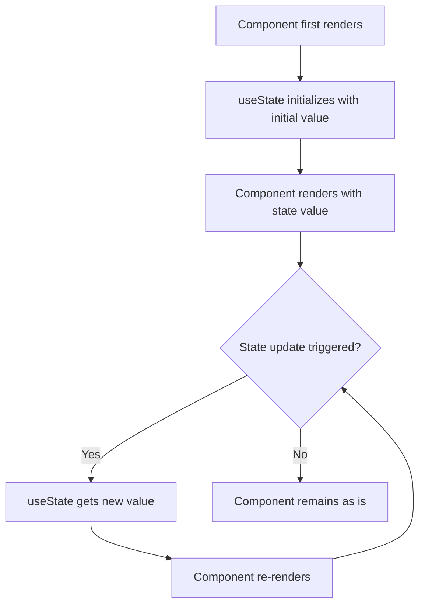

# React useState Hook

## Introduction

In React, the `useState` hook is one of the most fundamental hooks introduced in React 16.8. It allows you to add state management to functional components, which was previously only possible in class components. Before hooks, if you needed to maintain state in a component, you had to use a class component. Now, with the `useState` hook, functional components can be just as powerful while being more concise and easier to understand.

The `useState` hook enables you to:

- Store and update state values in functional components
- Trigger re-renders when state changes
- Maintain component-specific data between renders

## Basic Syntax

The `useState` hook has a simple syntax:

```jsx
const [state, setState] = useState(initialValue);
```

Let's break this down:

1. `initialValue`: The value you want the state to start with
2. `state`: The current state value
3. `setState`: A function that updates the state value and triggers a re-render

The square brackets `[]` represent [array destructuring](https://developer.mozilla.org/en-US/docs/Web/JavaScript/Reference/Operators/Destructuring_assignment), which allows us to give custom names to our state variable and its setter function.

## Your First useState Example

Let's create a simple counter component:

```jsx
import React, { useState } from 'react';

function Counter() {
  // Declare a state variable named "count" with initial value of 0
  const [count, setCount] = useState(0);

  return (
    <div>
      <p>You clicked {count} times</p>
      <button onClick={() => setCount(count + 1)}>
        Click me
      </button>
    </div>
  );
}
```

When you click the button:
- The `setCount` function is called with the new value (`count + 1`)
- React updates the `count` state
- The component re-renders, showing the updated count

## Multiple State Variables

You can use `useState` multiple times in a single component:

```jsx
import React, { useState } from 'react';

function UserForm() {
  const [name, setName] = useState('');
  const [age, setAge] = useState(0);
  const [isSubscribed, setIsSubscribed] = useState(false);

  return (
    <div>
      <input 
        type="text" 
        value={name} 
        onChange={(e) => setName(e.target.value)} 
        placeholder="Enter your name" 
      />
      <input 
        type="number" 
        value={age} 
        onChange={(e) => setAge(Number(e.target.value))} 
        placeholder="Enter your age" 
      />
      <label>
        <input 
          type="checkbox" 
          checked={isSubscribed} 
          onChange={(e) => setIsSubscribed(e.target.checked)} 
        />
        Subscribe to newsletter
      </label>
      <p>Preview: {name}, {age} years old, {isSubscribed ? 'subscribed' : 'not subscribed'}</p>
    </div>
  );
}
```

This approach keeps your state variables separate and focused on specific pieces of data.

## Using Objects with useState

For related state values, you might want to use an object:

```jsx
import React, { useState } from 'react';

function ProfileForm() {
  const [profile, setProfile] = useState({
    firstName: '',
    lastName: '',
    email: '',
    bio: ''
  });

  const handleChange = (e) => {
    // Important: Spread the previous state to maintain other field values
    setProfile({
      ...profile,
      [e.target.name]: e.target.value
    });
  };

  return (
    <form>
      <input
        type="text"
        name="firstName"
        value={profile.firstName}
        onChange={handleChange}
        placeholder="First Name"
      />
      <input
        type="text"
        name="lastName"
        value={profile.lastName}
        onChange={handleChange}
        placeholder="Last Name"
      />
      <input
        type="email"
        name="email"
        value={profile.email}
        onChange={handleChange}
        placeholder="Email"
      />
      <textarea
        name="bio"
        value={profile.bio}
        onChange={handleChange}
        placeholder="Tell us about yourself"
      />
      
      <div>
        <h3>Profile Preview:</h3>
        <p>Name: {profile.firstName} {profile.lastName}</p>
        <p>Email: {profile.email}</p>
        <p>Bio: {profile.bio}</p>
      </div>
    </form>
  );
}
```

:::caution Important
When updating an object or array with `useState`, you must create a new object or array (using the spread operator `...` or other methods). React uses reference equality to determine if the state has changed and if it should re-render.
:::

## Using Previous State

When updating state based on the previous state, always use the functional form of the setter function:

```jsx
import React, { useState } from 'react';

function Counter() {
  const [count, setCount] = useState(0);

  // Wrong way (may lead to stale state issues)
  const incrementWrong = () => {
    setCount(count + 1);
    setCount(count + 1); // This will not increment twice as expected
  };

  // Correct way using previous state
  const incrementCorrect = () => {
    setCount(prevCount => prevCount + 1);
    setCount(prevCount => prevCount + 1); // This will increment twice
  };

  return (
    <div>
      <p>Count: {count}</p>
      <button onClick={incrementWrong}>Increment Wrong</button>
      <button onClick={incrementCorrect}>Increment Correct</button>
    </div>
  );
}
```

The wrong approach doesn't work as expected because both `setCount` calls reference the same value of `count` from the render when they were called. The correct approach uses a callback that receives the most up-to-date state.

## Lazy Initial State

If your initial state is expensive to compute, you can pass a function to `useState`:

```jsx
import React, { useState } from 'react';

function ExpensiveInitialState() {
  // This function will only run once during the initial render
  const [data, setData] = useState(() => {
    console.log("Computing initial state...");
    // Imagine this is an expensive calculation
    const result = [];
    for (let i = 0; i < 1000; i++) {
      result.push({ id: i, value: Math.random() });
    }
    return result;
  });

  return (
    <div>
      <p>Data length: {data.length}</p>
      <button onClick={() => setData([])}>Clear data</button>
      <button onClick={() => setData(prev => [...prev, { id: prev.length, value: Math.random() }])}>
        Add item
      </button>
    </div>
  );
}
```

By passing a function to `useState`, the expensive computation only runs during the initial render, not on every render.

## Real-World Example: Todo List

Let's build a simple todo list application using `useState`:

```jsx
import React, { useState } from 'react';

function TodoList() {
  const [todos, setTodos] = useState([]);
  const [input, setInput] = useState('');

  const addTodo = () => {
    if (input.trim() === '') return;
    
    setTodos([
      ...todos,
      {
        id: Date.now(),
        text: input,
        completed: false
      }
    ]);
    setInput('');
  };

  const toggleTodo = (id) => {
    setTodos(
      todos.map(todo => 
        todo.id === id ? { ...todo, completed: !todo.completed } : todo
      )
    );
  };

  const deleteTodo = (id) => {
    setTodos(todos.filter(todo => todo.id !== id));
  };

  return (
    <div>
      <h2>Todo List</h2>
      <div>
        <input
          type="text"
          value={input}
          onChange={(e) => setInput(e.target.value)}
          placeholder="Add a new task"
        />
        <button onClick={addTodo}>Add</button>
      </div>
      <ul>
        {todos.map(todo => (
          <li key={todo.id} style={{ textDecoration: todo.completed ? 'line-through' : 'none' }}>
            <span onClick={() => toggleTodo(todo.id)}>
              {todo.text}
            </span>
            <button onClick={() => deleteTodo(todo.id)}>Delete</button>
          </li>
        ))}
      </ul>
      <div>
        <p>Total tasks: {todos.length}</p>
        <p>Completed: {todos.filter(todo => todo.completed).length}</p>
      </div>
    </div>
  );
}
```

This example demonstrates:
1. Using `useState` with arrays
2. Adding items to state
3. Updating specific items in an array
4. Removing items from state
5. Managing multiple state variables that interact with each other

## useState Lifecycle

Let's visualize the lifecycle of `useState` to better understand how it works:



## Best Practices

1. **Keep state minimal**: Only store values in state that actually need to trigger re-renders when they change.

2. **Use multiple `useState` calls for unrelated data**: This makes your code more readable and maintainable.

3. **Use objects for related data**: If multiple state variables always change together or represent related data, use an object.

4. **Always use the functional update form when updating based on previous state**: This ensures you're working with the most recent state.

5. **Don't call hooks inside conditions, loops, or nested functions**: Hooks must be called in the same order on every render.

```jsx
// ❌ Wrong: useState in a condition
function BadComponent() {
  if (someCondition) {
    const [state, setState] = useState(initialValue); // This will break React's hooks
  }
}

// ✅ Correct: useState at the top level
function GoodComponent() {
  const [state, setState] = useState(initialValue);
  
  if (someCondition) {
    // Use state here
  }
}
```

## Common Pitfalls

### Forgetting to Create New References

When updating objects or arrays, make sure to create new references:

```jsx
// ❌ Wrong: Mutating state directly
const handleClick = () => {
  user.name = "New Name"; // This modifies the existing object
  setUser(user); // React won't detect this change!
};

// ✅ Correct: Creating a new object
const handleClick = () => {
  setUser({ ...user, name: "New Name" }); // Creates a new object
};
```

### Updating State Multiple Times in One Event

Remember that state updates are batched in React, and the state variable itself is not immediately updated after calling the setter function:

```jsx
// This only increments once because both calls use the same value of count
const handleClick = () => {
  setCount(count + 1);
  setCount(count + 1);
};

// This correctly increments twice
const handleClick = () => {
  setCount(prevCount => prevCount + 1);
  setCount(prevCount => prevCount + 1);
};
```

## Summary

The `useState` hook is a fundamental building block for adding state to functional components in React. It provides:

1. A way to declare state variables in functional components
2. A mechanism to update state and trigger re-renders
3. The ability to maintain values between renders

By using `useState` effectively, you can build complex, interactive React applications with cleaner, more maintainable code than was possible with class components.

## Practice Exercises

1. Create a form with multiple fields that uses a single state object to manage all form data.
2. Build a counter with increment, decrement, and reset buttons that uses the functional update form.
3. Implement a todo list that allows adding, removing, editing, and marking todos as complete.
4. Create a custom form input component that maintains its own state but also reports changes to a parent component.

## Additional Resources

- [React Hooks Documentation](https://reactjs.org/docs/hooks-state.html)
- [A Complete Guide to useEffect](https://overreacted.io/a-complete-guide-to-useeffect/) - by Dan Abramov
- [Thinking in React Hooks](https://wattenberger.com/blog/react-hooks) - by Amelia Wattenberger
- [When to useMemo and useCallback](https://kentcdodds.com/blog/usememo-and-usecallback) - by Kent C. Dodds

Happy coding with React Hooks!