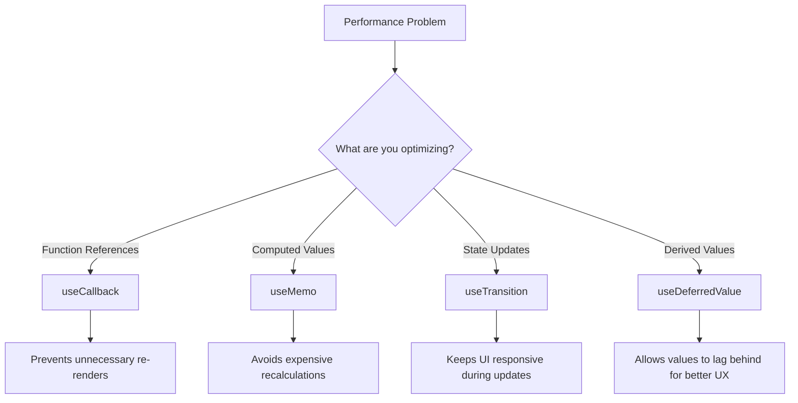

# React Performance Hooks

React provides several specialized hooks designed to optimize your application's performance. These hooks allow you to avoid unnecessary re-renders, memoize expensive calculations, and improve the overall responsiveness of your application.

## Introduction

As your React applications grow in size and complexity, performance optimization becomes increasingly important. Unnecessary re-renders, expensive calculations, and blocking operations can degrade user experience. React's performance hooks provide elegant solutions to these common problems.

In this guide, we'll explore the following performance-focused hooks:

1. `useCallback` - For memoizing functions
2. `useMemo` - For memoizing computed values
3. `useTransition` - For handling non-urgent state updates
4. `useDeferredValue` - For deferring updates to a value

## useCallback Hook

The `useCallback` hook allows you to memoize a function definition between re-renders. This is particularly useful when passing callbacks to optimized child components that rely on reference equality to prevent unnecessary renders.

### Syntax

```jsx
const memoizedCallback = useCallback(
  () => {
    doSomething(a, b);
  },
  [a, b],
);
```

### When to Use useCallback

- When passing callbacks to optimized child components using `React.memo`
- When a function is a dependency for other hooks like `useEffect`

### Example: Without useCallback

```jsx
function ParentComponent() {
  const [count, setCount] = useState(0);
  const [name, setName] = useState('');
  
  // This function gets recreated on every render
  const handleClick = () => {
    console.log(`Button clicked, count: ${count}`);
  };
  
  return (
    <>
      <input 
        value={name}
        onChange={(e) => setName(e.target.value)}
        placeholder="Enter your name"
      />
      <button onClick={() => setCount(count + 1)}>
        Increment Count: {count}
      </button>
      {/* ExpensiveChild will re-render on every parent render */}
      <ExpensiveChild onClick={handleClick} />
    </>
  );
}

const ExpensiveChild = React.memo(({ onClick }) => {
  console.log("ExpensiveChild rendered");
  return <button onClick={onClick}>Click me</button>;
});
```

### Example: With useCallback

```jsx
function ParentComponent() {
  const [count, setCount] = useState(0);
  const [name, setName] = useState('');
  
  // handleClick is now memoized and only changes when count changes
  const handleClick = useCallback(() => {
    console.log(`Button clicked, count: ${count}`);
  }, [count]); // Dependency array
  
  return (
    <>
      <input 
        value={name}
        onChange={(e) => setName(e.target.value)}
        placeholder="Enter your name"
      />
      <button onClick={() => setCount(count + 1)}>
        Increment Count: {count}
      </button>
      {/* ExpensiveChild will only re-render when handleClick changes */}
      <ExpensiveChild onClick={handleClick} />
    </>
  );
}

const ExpensiveChild = React.memo(({ onClick }) => {
  console.log("ExpensiveChild rendered");
  return <button onClick={onClick}>Click me</button>;
});
```

In the second example, `ExpensiveChild` only re-renders when the `count` changes (because it affects `handleClick`), not when `name` changes.

## useMemo Hook

The `useMemo` hook memoizes the result of a computation, recalculating only when dependencies change. This helps avoid expensive calculations on every render.

### Syntax

```jsx
const memoizedValue = useMemo(
  () => computeExpensiveValue(a, b),
  [a, b]
);
```

### When to Use useMemo

- When performing expensive calculations during render
- When you need to maintain reference equality for objects
- When creating objects that are dependencies for other hooks

### Example: Without useMemo

```jsx
function ProductList({ products, filterText }) {
  // This filtering runs on every render
  const filteredProducts = products.filter(product => 
    product.name.toLowerCase().includes(filterText.toLowerCase())
  );
  
  return (
    <>
      <p>Found {filteredProducts.length} matching products</p>
      <ul>
        {filteredProducts.map(product => (
          <li key={product.id}>{product.name}</li>
        ))}
      </ul>
    </>
  );
}
```

### Example: With useMemo

```jsx
function ProductList({ products, filterText }) {
  // Filtering only runs when products or filterText changes
  const filteredProducts = useMemo(() => {
    console.log("Filtering products...");
    return products.filter(product => 
      product.name.toLowerCase().includes(filterText.toLowerCase())
    );
  }, [products, filterText]);
  
  return (
    <>
      <p>Found {filteredProducts.length} matching products</p>
      <ul>
        {filteredProducts.map(product => (
          <li key={product.id}>{product.name}</li>
        ))}
      </ul>
    </>
  );
}
```

## useTransition Hook

The `useTransition` hook lets you mark state updates as non-urgent, allowing the browser to prioritize more critical updates like user input.

### Syntax

```jsx
const [isPending, startTransition] = useTransition();
```

### When to Use useTransition

- When updating state that may cause a slow rendering operation
- When you want to keep the UI responsive during large updates
- When you want to show a pending indicator during a long update

### Example: Without useTransition

```jsx
function SearchResults() {
  const [query, setQuery] = useState('');
  const [results, setResults] = useState([]);
  
  // This search might be slow for large data sets
  function handleChange(e) {
    const newQuery = e.target.value;
    setQuery(newQuery);
    
    const searchResults = performExpensiveSearch(newQuery);
    setResults(searchResults);
  }
  
  return (
    <>
      <input value={query} onChange={handleChange} placeholder="Search..." />
      <ul>
        {results.map(item => <li key={item.id}>{item.name}</li>)}
      </ul>
    </>
  );
}
```

### Example: With useTransition

```jsx
function SearchResults() {
  const [query, setQuery] = useState('');
  const [results, setResults] = useState([]);
  const [isPending, startTransition] = useTransition();
  
  function handleChange(e) {
    // Update the query immediately for responsive UI
    const newQuery = e.target.value;
    setQuery(newQuery);
    
    // Mark the search results update as non-urgent
    startTransition(() => {
      const searchResults = performExpensiveSearch(newQuery);
      setResults(searchResults);
    });
  }
  
  return (
    <>
      <input value={query} onChange={handleChange} placeholder="Search..." />
      {isPending ? <p>Loading results...</p> : (
        <ul>
          {results.map(item => <li key={item.id}>{item.name}</li>)}
        </ul>
      )}
    </>
  );
}
```

In this example, the input stays responsive even when the search operation is slow, and we show a loading indicator during the transition.

## useDeferredValue Hook

The `useDeferredValue` hook creates a deferred version of a value that can lag behind the original for better performance.

### Syntax

```jsx
const deferredValue = useDeferredValue(value);
```

### When to Use useDeferredValue

- When dealing with frequently changing values that drive expensive rendering
- When you can't directly modify the component that uses the expensive value
- As an alternative to debouncing or throttling input

### Example: Using useDeferredValue

```jsx
function SearchPage() {
  const [query, setQuery] = useState('');
  // Create a deferred version of query that can "lag behind"
  const deferredQuery = useDeferredValue(query);
  
  // This tells React if we're showing stale content
  const isStale = query !== deferredQuery;
  
  return (
    <div>
      <input 
        value={query}
        onChange={(e) => setQuery(e.target.value)}
        placeholder="Search..."
      />
      <div style={{ opacity: isStale ? 0.7 : 1 }}>
        <SearchResults query={deferredQuery} />
      </div>
    </div>
  );
}

// This component performs an expensive render operation
function SearchResults({ query }) {
  // Imagine this is an expensive operation
  const results = performExpensiveSearch(query);
  
  return (
    <ul>
      {results.map(item => (
        <li key={item.id}>{item.name}</li>
      ))}
    </ul>
  );
}
```

In this example, the input remains responsive while the expensive search results can lag behind, showing slightly stale data temporarily.

## Real-World Example: Data Grid with Filtering and Sorting

Let's combine these performance hooks in a real-world example of a data grid component with filtering and sorting capabilities:

```jsx
function DataGrid({ data }) {
  const [sortConfig, setSortConfig] = useState({ key: null, direction: 'asc' });
  const [filterText, setFilterText] = useState('');
  const [isPending, startTransition] = useTransition();
  
  // Memoize the sorting function
  const sortData = useCallback((data, key, direction) => {
    return [...data].sort((a, b) => {
      if (a[key] < b[key]) return direction === 'asc' ? -1 : 1;
      if (a[key] > b[key]) return direction === 'asc' ? 1 : -1;
      return 0;
    });
  }, []);
  
  // Apply sorting and filtering with memoization
  const processedData = useMemo(() => {
    console.log("Processing data...");
    let result = data;
    
    // Filter data
    if (filterText) {
      result = result.filter(item => 
        Object.values(item).some(val => 
          val.toString().toLowerCase().includes(filterText.toLowerCase())
        )
      );
    }
    
    // Sort data
    if (sortConfig.key) {
      result = sortData(result, sortConfig.key, sortConfig.direction);
    }
    
    return result;
  }, [data, filterText, sortConfig, sortData]);
  
  // Handle filter changes with useTransition
  const handleFilterChange = (e) => {
    const newFilterText = e.target.value;
    setFilterText(newFilterText);
    
    // Mark data processing as non-urgent
    startTransition(() => {
      setFilterText(newFilterText);
    });
  };
  
  // Handle column sorting
  const handleSort = useCallback((key) => {
    startTransition(() => {
      setSortConfig(prevConfig => {
        if (prevConfig.key === key) {
          return {
            key,
            direction: prevConfig.direction === 'asc' ? 'desc' : 'asc'
          };
        }
        return { key, direction: 'asc' };
      });
    });
  }, []);
  
  // Extract column headers from the first data item
  const columns = data.length > 0 ? Object.keys(data[0]) : [];
  
  return (
    <div className="data-grid">
      <div className="filters">
        <input
          value={filterText}
          onChange={handleFilterChange}
          placeholder="Filter data..."
        />
        {isPending && <span className="loading">Processing...</span>}
      </div>
      
      <table>
        <thead>
          <tr>
            {columns.map(column => (
              <th key={column} onClick={() => handleSort(column)}>
                {column}
                {sortConfig.key === column && (
                  <span>{sortConfig.direction === 'asc' ? ' ▲' : ' ▼'}</span>
                )}
              </th>
            ))}
          </tr>
        </thead>
        <tbody className={isPending ? 'updating' : ''}>
          {processedData.map((row, i) => (
            <tr key={i}>
              {columns.map(column => (
                <td key={column}>{row[column]}</td>
              ))}
            </tr>
          ))}
        </tbody>
      </table>
      
      <div className="summary">
        Showing {processedData.length} of {data.length} rows
      </div>
    </div>
  );
}
```

In this comprehensive example:

1. `useCallback` memoizes the sorting function
2. `useMemo` avoids re-computing the filtered and sorted data
3. `useTransition` keeps the UI responsive during filtering and sorting operations
4. We show appropriate loading indicators during transitions

## React Performance Hooks at a Glance

Here's a summary of when to use each performance hook:



## Summary

React's performance hooks are powerful tools for optimizing your application:

- **useCallback** - Memoizes function definitions to prevent unnecessary re-renders of child components
- **useMemo** - Memoizes calculated values to avoid expensive recalculations
- **useTransition** - Marks state updates as non-urgent to keep the UI responsive
- **useDeferredValue** - Creates a deferred version of a value that can lag behind for better performance

These hooks should be used strategically rather than by default. Start with standard React patterns, then add performance hooks when you identify specific performance issues.

## Additional Resources

To deepen your understanding of React performance optimization:

- Practice analyzing component render behavior with the React DevTools Profiler
- Learn about the React.memo HOC for component memoization
- Explore the experimental React Concurrent Mode for more advanced patterns
- Study how to use the browser Performance tab to identify bottlenecks

## Exercises

1. Take an existing component with performance issues and optimize it using `useCallback` and `useMemo`
2. Build a search component with a large dataset that stays responsive using `useTransition`
3. Create a data visualization that updates smoothly with `useDeferredValue`
4. Compare the performance of a component before and after optimization using React DevTools Profiler

By mastering these performance hooks, you'll be able to build React applications that remain fast and responsive even as they grow in complexity.