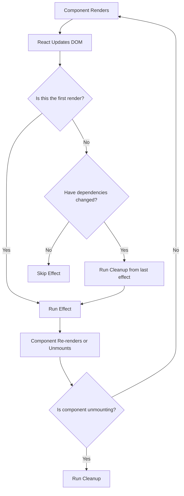

# React useEffect Hook

## Introduction

The `useEffect` hook is one of the most important hooks in React's arsenal. It allows you to perform side effects in your functional components. Side effects include data fetching, subscriptions, manual DOM manipulations, logging, and more - essentially anything that affects something outside of the component.

Before hooks were introduced, these side effects were handled in lifecycle methods like `componentDidMount`, `componentDidUpdate`, and `componentWillUnmount`. The `useEffect` hook combines the functionality of all these lifecycle methods into a single API, making your code cleaner and more maintainable.

## Basic Syntax

```jsx
import React, { useEffect } from 'react';

function MyComponent() {
  useEffect(() => {
    // Your effect code goes here
    
    // Optional cleanup function
    return () => {
      // Cleanup code goes here
    };
  }, [/* dependency array */]);
  
  return <div>My Component</div>;
}
```

The `useEffect` hook takes two arguments:

1. A function that contains your effect logic
2. A dependency array (optional) that determines when the effect should run

## How useEffect Works

Every time your component renders, React will:

1. Run your component code, updating the DOM
2. Execute any cleanup functions from the previous render (if any)
3. Run the effects from the current render

This sequence ensures that your effects always reflect the current state of your component.

## The Dependency Array

The second argument to `useEffect` is an array of dependencies. This array controls when your effect runs:

- **Omitting the dependency array**: The effect runs after every render
- **Empty dependency array `[]`**: The effect runs only once after the initial render
- **Array with dependencies**: The effect runs after the initial render and whenever any dependency changes

Let's look at examples of each:

### Example 1: Effect runs after every render

```jsx
function Counter() {
  const [count, setCount] = useState(0);
  
  useEffect(() => {
    document.title = `You clicked ${count} times`;
  }); // No dependency array
  
  return (
    <div>
      <p>You clicked {count} times</p>
      <button onClick={() => setCount(count + 1)}>Click me</button>
    </div>
  );
}
```

In this example, the document title will update every time the component renders.

### Example 2: Effect runs only once (on mount)

```jsx
function DataFetcher() {
  const [data, setData] = useState(null);
  
  useEffect(() => {
    fetch('https://api.example.com/data')
      .then(response => response.json())
      .then(data => setData(data));
  }, []); // Empty dependency array
  
  if (!data) return <div>Loading...</div>;
  return <div>{JSON.stringify(data)}</div>;
}
```

This effect runs only once when the component first mounts, making it perfect for initial data fetching.

### Example 3: Effect runs on dependency changes

```jsx
function FilteredList({ query }) {
  const [items, setItems] = useState([]);
  
  useEffect(() => {
    fetch(`https://api.example.com/search?q=${query}`)
      .then(response => response.json())
      .then(data => setItems(data));
  }, [query]); // Dependency array with query
  
  return (
    <ul>
      {items.map(item => (
        <li key={item.id}>{item.name}</li>
      ))}
    </ul>
  );
}
```

This effect reruns whenever the `query` prop changes, updating the filtered items.

## Cleanup Function

Some effects need to be cleaned up to prevent memory leaks. For example, if you subscribe to an external data source, you should unsubscribe when the component unmounts or when the dependencies change.

```jsx
function ChatRoom({ roomId }) {
  const [messages, setMessages] = useState([]);
  
  useEffect(() => {
    const connection = createConnection(roomId);
    connection.on('message', (message) => {
      setMessages(prevMessages => [...prevMessages, message]);
    });
    
    // Cleanup function
    return () => {
      connection.disconnect();
    };
  }, [roomId]);
  
  return (
    <div>
      <h3>Chat Room: {roomId}</h3>
      <ul>
        {messages.map(message => (
          <li key={message.id}>{message.text}</li>
        ))}
      </ul>
    </div>
  );
}
```

In this example:
- When the component mounts, it connects to a chat room
- When the `roomId` changes, it disconnects from the old room and connects to the new one
- When the component unmounts, it disconnects from the current room

## Common Use Cases for useEffect

### 1. Data Fetching

```jsx
function UserProfile({ userId }) {
  const [user, setUser] = useState(null);
  const [loading, setLoading] = useState(true);
  const [error, setError] = useState(null);
  
  useEffect(() => {
    setLoading(true);
    setError(null);
    
    async function fetchUser() {
      try {
        const response = await fetch(`https://api.example.com/users/${userId}`);
        if (!response.ok) throw new Error('Failed to fetch');
        const userData = await response.json();
        setUser(userData);
      } catch (err) {
        setError(err.message);
      } finally {
        setLoading(false);
      }
    }
    
    fetchUser();
  }, [userId]);
  
  if (loading) return <div>Loading...</div>;
  if (error) return <div>Error: {error}</div>;
  if (!user) return null;
  
  return (
    <div>
      <h2>{user.name}</h2>
      <p>Email: {user.email}</p>
      <p>Bio: {user.bio}</p>
    </div>
  );
}
```

### 2. Event Listeners

```jsx
function WindowSizeTracker() {
  const [windowSize, setWindowSize] = useState({
    width: window.innerWidth,
    height: window.innerHeight
  });
  
  useEffect(() => {
    function handleResize() {
      setWindowSize({
        width: window.innerWidth,
        height: window.innerHeight
      });
    }
    
    window.addEventListener('resize', handleResize);
    
    // Cleanup: remove the event listener
    return () => {
      window.removeEventListener('resize', handleResize);
    };
  }, []);
  
  return (
    <div>
      <p>Window width: {windowSize.width}px</p>
      <p>Window height: {windowSize.height}px</p>
    </div>
  );
}
```

### 3. Animations or Timers

```jsx
function CountdownTimer({ seconds }) {
  const [timeLeft, setTimeLeft] = useState(seconds);
  
  useEffect(() => {
    if (timeLeft <= 0) return;
    
    const timer = setTimeout(() => {
      setTimeLeft(timeLeft - 1);
    }, 1000);
    
    // Cleanup: clear the timer
    return () => clearTimeout(timer);
  }, [timeLeft]);
  
  return <div>Time remaining: {timeLeft} seconds</div>;
}
```

### 4. Managing Subscriptions

```jsx
function NotificationListener({ userId }) {
  const [notifications, setNotifications] = useState([]);
  
  useEffect(() => {
    const socket = new WebSocket('wss://notifications.example.com');
    
    socket.onopen = () => {
      socket.send(JSON.stringify({ subscribe: userId }));
    };
    
    socket.onmessage = (event) => {
      const newNotification = JSON.parse(event.data);
      setNotifications(prev => [...prev, newNotification]);
    };
    
    return () => {
      socket.close();
    };
  }, [userId]);
  
  return (
    <div>
      <h3>Notifications</h3>
      {notifications.length === 0 ? (
        <p>No new notifications</p>
      ) : (
        <ul>
          {notifications.map(notification => (
            <li key={notification.id}>{notification.message}</li>
          ))}
        </ul>
      )}
    </div>
  );
}
```

## Common Pitfalls and Best Practices

### 1. The Infinite Loop Problem

A common mistake is creating an infinite render loop by updating state in an effect without a dependency array:

```jsx
// 🔴 Incorrect: This causes an infinite loop
function BadComponent() {
  const [count, setCount] = useState(0);
  
  useEffect(() => {
    setCount(count + 1); // Triggers re-render, which runs the effect again
  }); // No dependency array
  
  return <div>{count}</div>;
}
```

### 2. Missing Dependencies

```jsx
// 🔴 Incorrect: Missing dependency
function SearchComponent({ query }) {
  const [results, setResults] = useState([]);
  
  useEffect(() => {
    fetchResults(query).then(data => setResults(data));
  }, []); // Should include query
  
  return <ResultsList results={results} />;
}
```

### 3. Object and Array Dependencies

Objects and arrays are compared by reference, not value:

```jsx
// 🔴 Problematic: New object created every render
function FilterList({ filters }) {
  const options = { sortBy: filters.sortBy };
  
  useEffect(() => {
    fetchData(options);
  }, [options]); // options is a new object every render
}
```

Better approach:

```jsx
// ✅ Correct: Depend on primitive values
function FilterList({ filters }) {
  const { sortBy } = filters;
  
  useEffect(() => {
    const options = { sortBy };
    fetchData(options);
  }, [sortBy]); // Now depends on the actual changing value
}
```

### 4. Using the Function Form of setState

When updating state based on previous state within an effect:

```jsx
// ✅ Correct: Using function form of setState
function Counter() {
  const [count, setCount] = useState(0);
  
  useEffect(() => {
    const timer = setInterval(() => {
      setCount(prevCount => prevCount + 1); // Using function form
    }, 1000);
    
    return () => clearInterval(timer);
  }, []); // Empty dependency array is fine here
  
  return <div>{count}</div>;
}
```

## Visualizing useEffect Flow



## Real-World Example: Building a Custom Hook

We can use `useEffect` to build a custom hook that fetches data:

```jsx
function useFetch(url) {
  const [data, setData] = useState(null);
  const [loading, setLoading] = useState(true);
  const [error, setError] = useState(null);
  
  useEffect(() => {
    let isMounted = true;
    setLoading(true);
    
    async function fetchData() {
      try {
        const response = await fetch(url);
        
        if (!response.ok) {
          throw new Error(`HTTP error! Status: ${response.status}`);
        }
        
        const result = await response.json();
        
        if (isMounted) {
          setData(result);
          setError(null);
        }
      } catch (err) {
        if (isMounted) {
          setError(err.message);
          setData(null);
        }
      } finally {
        if (isMounted) {
          setLoading(false);
        }
      }
    }
    
    fetchData();
    
    return () => {
      isMounted = false;
    };
  }, [url]);
  
  return { data, loading, error };
}

// Using the custom hook
function ProductPage({ productId }) {
  const { data, loading, error } = useFetch(`https://api.example.com/products/${productId}`);
  
  if (loading) return <div>Loading product...</div>;
  if (error) return <div>Error: {error}</div>;
  if (!data) return null;
  
  return (
    <div>
      <h1>{data.name}</h1>
      <p>{data.description}</p>
      <p>Price: ${data.price}</p>
    </div>
  );
}
```

## Summary

The `useEffect` hook is a powerful tool for managing side effects in React functional components. It allows you to:

- Execute code after rendering
- Control when effects run using the dependency array
- Clean up effects to prevent memory leaks
- Handle data fetching, subscriptions, DOM manipulations, and more

By mastering `useEffect`, you can write cleaner, more maintainable React components that properly handle side effects and lifecycle events without class components.

## Practice Exercises

1. Create a component that uses `useEffect` to fetch data from an API when the component mounts.
2. Build a component that tracks and displays how much time a user spends on a page.
3. Create a form component that saves draft content to localStorage whenever the input changes.
4. Build a custom hook called `useDebounce` that delays executing a function until after a certain amount of time has passed.
5. Create a component that subscribes to a WebSocket and displays real-time updates.

## Additional Resources

- [React Docs: Using the Effect Hook](https://reactjs.org/docs/hooks-effect.html)
- [React Docs: Rules of Hooks](https://reactjs.org/docs/hooks-rules.html)
- [A Complete Guide to useEffect](https://overreacted.io/a-complete-guide-to-useeffect/) by Dan Abramov
- [How to Fetch Data with React Hooks](https://www.robinwieruch.de/react-hooks-fetch-data/)

Remember that understanding `useEffect` takes practice. Start with simple use cases and gradually tackle more complex scenarios as you become more comfortable with the concept.