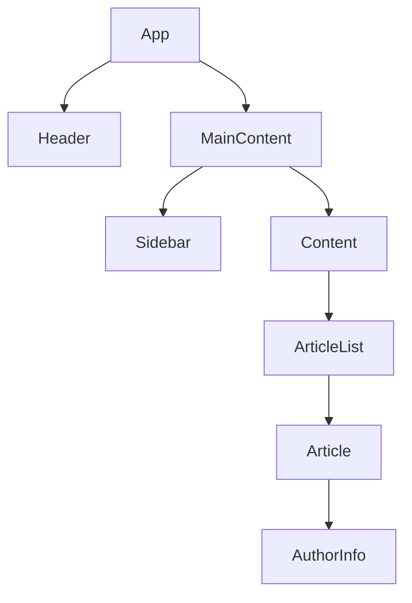

# React useContext Hook

## Introduction

When building React applications, passing data through components can become challenging as your application grows. Props need to be manually passed through intermediate components even when they don't need that data, resulting in what's known as "prop drilling."

The `useContext` hook provides a solution to this problem by allowing you to create global state that can be accessed by any component without having to explicitly pass props through the component tree.

In this guide, you'll learn:
- What the Context API is and why it exists
- How to use the `useContext` hook
- When to use Context versus other state management solutions
- Best practices for implementing context in your applications

## Understanding Context in React

Context provides a way to pass data through the component tree without having to pass props down manually at every level.

### The Problem: Prop Drilling

Consider this component structure:



If user information is stored in the `App` component but needed in `AuthorInfo`, you would have to pass it down through `MainContent`, `Content`, `ArticleList`, and `Article` components, even if these components don't need the data themselves.

## Creating and Using Context

Using the Context API with the `useContext` hook involves three main steps:

1. **Create a context** using `React.createContext()`
2. **Provide the context** value at a higher level using `Context.Provider`
3. **Consume the context** in any child component using the `useContext` hook

### Step 1: Creating a Context

First, create a context in a separate file:

```jsx
// UserContext.js
import { createContext } from 'react';

// Create a context with a default value (optional)
const UserContext = createContext(null);

export default UserContext;
```

### Step 2: Providing the Context

Wrap your component tree with a Provider to make the context available to all child components:

```jsx
// App.js
import React, { useState } from 'react';
import UserContext from './UserContext';
import MainContent from './MainContent';

function App() {
  const [user, setUser] = useState({
    name: "John Doe",
    email: "john@example.com",
    isLoggedIn: true
  });

  return (
    <UserContext.Provider value={{ user, setUser }}>
      <div className="app">
        <h1>My App</h1>
        <MainContent />
      </div>
    </UserContext.Provider>
  );
}
```

### Step 3: Consuming Context with useContext

Now, any component inside the Provider tree can access the context values:

```jsx
// UserProfile.js (a deeply nested component)
import React, { useContext } from 'react';
import UserContext from './UserContext';

function UserProfile() {
  const { user, setUser } = useContext(UserContext);

  const handleLogout = () => {
    setUser({ ...user, isLoggedIn: false });
  };

  return (
    <div className="user-profile">
      {user.isLoggedIn ? (
        <>
          <h3>Welcome, {user.name}!</h3>
          <p>Email: {user.email}</p>
          <button onClick={handleLogout}>Log Out</button>
        </>
      ) : (
        <p>Please log in to view your profile.</p>
      )}
    </div>
  );
}

export default UserProfile;
```

## Real-world Example: Theme Switcher

A common use case for `useContext` is to implement a theme switcher that affects your entire application. Let's build a simple theme toggle system:

### Step 1: Create a Theme Context

```jsx
// ThemeContext.js
import React, { createContext, useState, useContext } from 'react';

const ThemeContext = createContext();

export function ThemeProvider({ children }) {
  const [theme, setTheme] = useState('light');
  
  const toggleTheme = () => {
    setTheme(prevTheme => prevTheme === 'light' ? 'dark' : 'light');
  };

  return (
    <ThemeContext.Provider value={{ theme, toggleTheme }}>
      {children}
    </ThemeContext.Provider>
  );
}

export function useTheme() {
  return useContext(ThemeContext);
}
```

### Step 2: Wrap Your App with ThemeProvider

```jsx
// App.js
import React from 'react';
import { ThemeProvider } from './ThemeContext';
import Layout from './Layout';

function App() {
  return (
    <ThemeProvider>
      <Layout />
    </ThemeProvider>
  );
}

export default App;
```

### Step 3: Use the Theme in Components

```jsx
// Layout.js
import React from 'react';
import { useTheme } from './ThemeContext';
import Navbar from './Navbar';
import MainContent from './MainContent';

function Layout() {
  const { theme } = useTheme();
  
  return (
    <div className={`layout ${theme}-theme`}>
      <Navbar />
      <MainContent />
    </div>
  );
}

export default Layout;
```

```jsx
// ThemeToggle.js
import React from 'react';
import { useTheme } from './ThemeContext';

function ThemeToggle() {
  const { theme, toggleTheme } = useTheme();
  
  return (
    <button onClick={toggleTheme}>
      Switch to {theme === 'light' ? 'Dark' : 'Light'} Theme
    </button>
  );
}

export default ThemeToggle;
```

## Multiple Contexts

You can use multiple contexts in your application for different concerns:

```jsx
import React from 'react';
import { ThemeProvider } from './ThemeContext';
import { UserProvider } from './UserContext';
import { CartProvider } from './CartContext';
import App from './App';

function Root() {
  return (
    <ThemeProvider>
      <UserProvider>
        <CartProvider>
          <App />
        </CartProvider>
      </UserProvider>
    </ThemeProvider>
  );
}
```

Your components can then consume multiple contexts as needed:

```jsx
import React, { useContext } from 'react';
import { useTheme } from './ThemeContext';
import UserContext from './UserContext';
import CartContext from './CartContext';

function ShoppingCartSummary() {
  const { theme } = useTheme();
  const { user } = useContext(UserContext);
  const { cart, totalItems } = useContext(CartContext);
  
  return (
    <div className={`cart-summary ${theme}`}>
      <h3>{user.name}'s Shopping Cart</h3>
      <p>Total Items: {totalItems}</p>
      {/* ... more cart details */}
    </div>
  );
}
```

## When to Use useContext

The Context API with `useContext` is great for:

- **Theme data** (light/dark mode)
- **User authentication state** (logged in user, permissions)
- **Localization/language preferences**
- **Feature flags**
- **Any global state needed by many components**

However, Context is not always the best solution for every state management need.

### Context vs. Other State Management Solutions

- **Use Local State (`useState`)**: For component-specific state that doesn't need to be shared
- **Use Context**: For state that needs to be accessed by many components at different nesting levels
- **Use Redux/Zustand/Jotai**: For complex state logic, middleware requirements, or performance-critical applications

## Performance Considerations

Context triggers a re-render for all components that consume it when its value changes. To optimize performance:

1. **Split contexts by concern** - Create separate contexts for different types of data
2. **Memoize context values** - Use `useMemo` to prevent unnecessary re-renders

```jsx
// Optimized Provider
function UserProvider({ children }) {
  const [user, setUser] = useState(null);
  const [preferences, setPreferences] = useState({});
  
  // Memoize the value to prevent unnecessary re-renders
  const userValue = useMemo(() => ({ user, setUser }), [user]);
  const prefValue = useMemo(() => ({ preferences, setPreferences }), [preferences]);
  
  return (
    <UserContext.Provider value={userValue}>
      <PreferencesContext.Provider value={prefValue}>
        {children}
      </PreferencesContext.Provider>
    </UserContext.Provider>
  );
}
```

## Pitfalls and Best Practices

### Do's:
- ✅ Split contexts based on which data changes together
- ✅ Memoize context values to prevent unnecessary re-renders
- ✅ Create custom hooks to consume context for cleaner code
- ✅ Use default values that make sense for your context

### Don'ts:
- ❌ Don't put everything in a single context
- ❌ Don't use context for data that only a few components need
- ❌ Don't recreate context values unnecessarily on each render
- ❌ Don't nest too many context providers (can lead to "wrapper hell")

## Summary

The `useContext` hook provides an elegant solution for sharing state between components without prop drilling. By creating a context, providing it at a higher level, and consuming it in child components, you can maintain cleaner code and component architecture.

Key takeaways:

1. Context solves the prop drilling problem
2. The `useContext` hook makes consuming context simple and intuitive
3. Context is ideal for global app state like themes, authentication, etc.
4. Performance can be optimized by splitting contexts and memoizing values

## Practice Exercises

1. **Basic Exercise**: Create a simple counter context that provides a count value and increment/decrement functions to any component in your app.

2. **Intermediate Exercise**: Implement a shopping cart context that allows products to be added from one component and displayed in another component.

3. **Advanced Exercise**: Build a multi-step form where form data is stored in context and persists between different form steps/pages.

## Additional Resources

- [React Context Official Documentation](https://reactjs.org/docs/context.html)
- [useContext Hook Documentation](https://reactjs.org/docs/hooks-reference.html#usecontext)
- [Kent C. Dodds - How to use React Context effectively](https://kentcdodds.com/blog/how-to-use-react-context-effectively)

Remember that like any tool, context is powerful but should be used judiciously. As your application grows, you might want to consider more robust state management solutions like Redux, Zustand, or Jotai for complex state requirements.