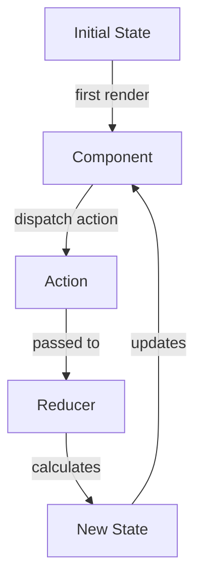

# useReducer Hook

## Introduction

When working with React components, managing state is a crucial aspect of creating interactive applications. While `useState` is perfect for simple state management, more complex state logic often requires a more structured approach. This is where `useReducer` comes in.

The `useReducer` hook is a powerful state management tool inspired by Redux. It provides a way to handle complex state transitions in a more predictable and maintainable way by centralizing the update logic.

## What is useReducer?

`useReducer` is a React hook that accepts a reducer function and an initial state. It returns the current state and a dispatch function that allows you to trigger state updates by dispatching actions.

```jsx
const [state, dispatch] = useReducer(reducer, initialState);
```

### Key Components

1. **Reducer Function**: A pure function that takes the current state and an action, and returns a new state
2. **Initial State**: The starting state value
3. **Dispatch Function**: Used to send actions to the reducer
4. **Actions**: Objects that describe what changes should happen to the state

## Basic Syntax and Usage

Let's look at the basic syntax of `useReducer`:

```jsx
import { useReducer } from 'react';

// Reducer function
function reducer(state, action) {
  switch (action.type) {
    case 'increment':
      return { count: state.count + 1 };
    case 'decrement':
      return { count: state.count - 1 };
    default:
      throw new Error('Unknown action type');
  }
}

function Counter() {
  // Initialize useReducer with reducer function and initial state
  const [state, dispatch] = useReducer(reducer, { count: 0 });

  return (
    <div>
      <p>Count: {state.count}</p>
      <button onClick={() => dispatch({ type: 'increment' })}>
        Increment
      </button>
      <button onClick={() => dispatch({ type: 'decrement' })}>
        Decrement
      </button>
    </div>
  );
}
```

In this example, we've created a simple counter component using `useReducer`. The reducer function specifies how the state should change in response to different actions.

## When to Use useReducer vs. useState

Here's a quick guide on when to choose `useReducer` over `useState`:

| Use `useReducer` when... | Use `useState` when... |
|--------------------------|------------------------|
| State logic is complex | State is simple |
| Next state depends on previous state | State updates are independent |
| State has multiple sub-values | You have a single state value |
| You need predictable state transitions | You need quick, simple state updates |
| You want to centralize update logic | Component has minimal state logic |

## Advanced useReducer Patterns

### Using Action Payloads

Actions can contain additional data called a "payload" that provides necessary information for state updates:

```jsx
function reducer(state, action) {
  switch (action.type) {
    case 'add_todo':
      return { 
        ...state,
        todos: [...state.todos, {
          id: Date.now(),
          text: action.payload.text,
          completed: false
        }]
      };
    case 'toggle_todo':
      return {
        ...state,
        todos: state.todos.map(todo =>
          todo.id === action.payload.id
            ? { ...todo, completed: !todo.completed }
            : todo
        )
      };
    default:
      return state;
  }
}

function TodoApp() {
  const [state, dispatch] = useReducer(reducer, { todos: [] });
  const [text, setText] = useState('');

  const handleSubmit = (e) => {
    e.preventDefault();
    dispatch({ type: 'add_todo', payload: { text } });
    setText('');
  };

  return (
    <div>
      <form onSubmit={handleSubmit}>
        <input value={text} onChange={e => setText(e.target.value)} />
        <button type="submit">Add Todo</button>
      </form>
      <ul>
        {state.todos.map(todo => (
          <li 
            key={todo.id}
            onClick={() => dispatch({
              type: 'toggle_todo',
              payload: { id: todo.id }
            })}
            style={{ textDecoration: todo.completed ? 'line-through' : 'none' }}
          >
            {todo.text}
          </li>
        ))}
      </ul>
    </div>
  );
}
```

### Using an Action Creator

For more complex applications, you can create action creators to abstract away the action creation logic:

```jsx
// Action creators
const addTodo = (text) => ({
  type: 'add_todo',
  payload: { text }
});

const toggleTodo = (id) => ({
  type: 'toggle_todo',
  payload: { id }
});

function TodoApp() {
  const [state, dispatch] = useReducer(reducer, { todos: [] });
  const [text, setText] = useState('');

  const handleSubmit = (e) => {
    e.preventDefault();
    dispatch(addTodo(text));
    setText('');
  };

  return (
    <div>
      {/* Form code */}
      <ul>
        {state.todos.map(todo => (
          <li 
            key={todo.id}
            onClick={() => dispatch(toggleTodo(todo.id))}
            style={{ textDecoration: todo.completed ? 'line-through' : 'none' }}
          >
            {todo.text}
          </li>
        ))}
      </ul>
    </div>
  );
}
```

### Using Initial State Lazy Initialization

If your initial state is expensive to create, you can pass a function as the third argument to `useReducer`:

```jsx
function init(initialCount) {
  return { count: initialCount };
}

function reducer(state, action) {
  switch (action.type) {
    case 'increment':
      return { count: state.count + 1 };
    case 'decrement':
      return { count: state.count - 1 };
    case 'reset':
      return init(action.payload);
    default:
      return state;
  }
}

function Counter({ initialCount }) {
  const [state, dispatch] = useReducer(reducer, initialCount, init);

  return (
    <div>
      Count: {state.count}
      <button onClick={() => dispatch({ type: 'reset', payload: initialCount })}>
        Reset
      </button>
      <button onClick={() => dispatch({ type: 'increment' })}>+</button>
      <button onClick={() => dispatch({ type: 'decrement' })}>-</button>
    </div>
  );
}
```

## Real-World Example: Shopping Cart

Let's implement a simple shopping cart using `useReducer`:

```jsx
import { useReducer } from 'react';

// Initial state
const initialState = {
  items: [],
  total: 0,
};

// Reducer function
function cartReducer(state, action) {
  switch (action.type) {
    case 'ADD_ITEM':
      const existingItemIndex = state.items.findIndex(
        item => item.id === action.payload.id
      );

      if (existingItemIndex >= 0) {
        // Item already exists, increase quantity
        const updatedItems = [...state.items];
        updatedItems[existingItemIndex] = {
          ...updatedItems[existingItemIndex],
          quantity: updatedItems[existingItemIndex].quantity + 1
        };

        return {
          ...state,
          items: updatedItems,
          total: state.total + action.payload.price
        };
      } else {
        // New item, add to cart
        return {
          ...state,
          items: [...state.items, { ...action.payload, quantity: 1 }],
          total: state.total + action.payload.price
        };
      }

    case 'REMOVE_ITEM':
      const itemToRemove = state.items.find(item => item.id === action.payload.id);
      
      if (!itemToRemove) return state;
      
      // If quantity is 1, remove the item completely
      if (itemToRemove.quantity === 1) {
        return {
          ...state,
          items: state.items.filter(item => item.id !== action.payload.id),
          total: state.total - itemToRemove.price
        };
      }
      
      // Otherwise decrease the quantity
      return {
        ...state,
        items: state.items.map(item =>
          item.id === action.payload.id
            ? { ...item, quantity: item.quantity - 1 }
            : item
        ),
        total: state.total - itemToRemove.price
      };

    case 'CLEAR_CART':
      return initialState;

    default:
      return state;
  }
}

function ShoppingCart() {
  const [cart, dispatch] = useReducer(cartReducer, initialState);

  // Sample products
  const products = [
    { id: 1, name: 'Laptop', price: 999.99 },
    { id: 2, name: 'Headphones', price: 99.99 },
    { id: 3, name: 'Mouse', price: 29.99 },
  ];

  const addToCart = (product) => {
    dispatch({ type: 'ADD_ITEM', payload: product });
  };

  const removeFromCart = (productId) => {
    dispatch({ type: 'REMOVE_ITEM', payload: { id: productId } });
  };

  const clearCart = () => {
    dispatch({ type: 'CLEAR_CART' });
  };

  return (
    <div className="shopping-cart">
      <h2>Products</h2>
      <div className="product-list">
        {products.map(product => (
          <div key={product.id} className="product">
            <h3>{product.name}</h3>
            <p>${product.price.toFixed(2)}</p>
            <button onClick={() => addToCart(product)}>
              Add to Cart
            </button>
          </div>
        ))}
      </div>

      <h2>Your Cart</h2>
      {cart.items.length === 0 ? (
        <p>Your cart is empty</p>
      ) : (
        <div className="cart">
          {cart.items.map(item => (
            <div key={item.id} className="cart-item">
              <span>{item.name} x {item.quantity}</span>
              <span>${(item.price * item.quantity).toFixed(2)}</span>
              <button onClick={() => removeFromCart(item.id)}>
                Remove
              </button>
            </div>
          ))}
          <div className="cart-total">
            <strong>Total: ${cart.total.toFixed(2)}</strong>
          </div>
          <button onClick={clearCart}>Clear Cart</button>
        </div>
      )}
    </div>
  );
}
```

This shopping cart example demonstrates how `useReducer` can help manage complex state logic with multiple operations in a clear and organized way.

## The Flow of useReducer

Here's a visual representation of how `useReducer` works:



## useReducer vs. Redux

While `useReducer` and Redux share similar concepts, they serve different purposes:

1. **Scope**: `useReducer` is component-level state management, while Redux is application-level
2. **Setup**: `useReducer` has minimal setup, Redux requires more boilerplate
3. **Middleware**: Redux has a rich middleware ecosystem, `useReducer` doesn't
4. **DevTools**: Redux has powerful developer tools, `useReducer` has limited debugging

For small to medium applications, `useReducer` combined with Context API might be sufficient. For larger applications with complex state requirements, Redux might be more appropriate.

## Best Practices

1. **Keep reducers pure**: Don't perform side effects inside reducers
2. **Use action types as constants**: To avoid typos and make maintenance easier
3. **Structure your state well**: Design your state shape thoughtfully
4. **Use action creators**: To encapsulate action creation logic
5. **Split large reducers**: Break complex reducers into smaller sub-reducers

## Summary

The `useReducer` hook is a powerful tool for managing complex state logic in React components. It provides a structured way to handle state transitions, making your code more predictable and easier to maintain.

Key points to remember:
- `useReducer` is ideal for complex state logic
- It follows a reducer pattern: state + action = new state
- Actions describe what happened, reducers determine how the state changes
- It can be combined with Context API for broader state management

By mastering `useReducer`, you'll be able to handle more complex state management scenarios in your React applications while keeping your code organized and maintainable.

## Exercises

1. Create a form with multiple fields managed by `useReducer` that validates each field
2. Implement a task management app with features to add, edit, delete, and mark tasks as complete
3. Build a multi-step wizard form where each step's data is stored in a `useReducer` state
4. Convert an existing component using multiple `useState` calls to use `useReducer` instead
5. Create a simple financial app that tracks income and expenses using `useReducer`

## Additional Resources

- [React Documentation on useReducer](https://reactjs.org/docs/hooks-reference.html#usereducer)
- [Thinking in React Hooks](https://wattenberger.com/blog/react-hooks)
- [Kent C. Dodds: How to use React Context effectively](https://kentcdodds.com/blog/how-to-use-react-context-effectively)
- [Redux documentation](https://redux.js.org/) - To learn more about the reducer pattern