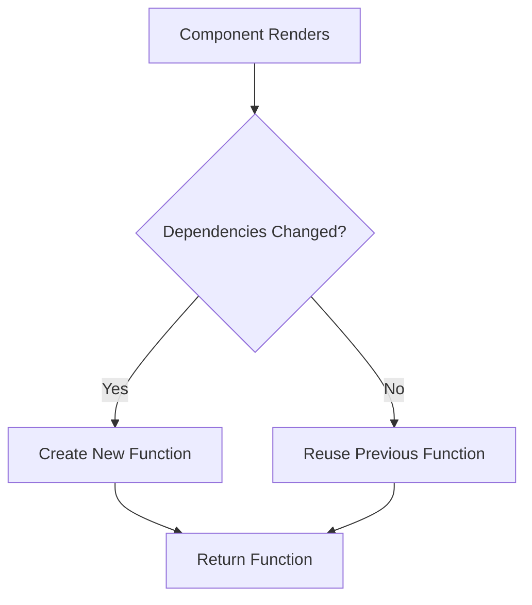

# useCallback Hook

## Introduction

The `useCallback` hook is one of React's performance optimization hooks that helps you control when functions are recreated. In React, when a component re-renders, any functions defined inside that component are recreated, even if nothing about them has changed. This can lead to unnecessary re-renders in child components that receive these functions as props.

The `useCallback` hook solves this problem by "memoizing" a function, which means it will return the same function instance between renders unless the dependencies have changed.

## Basic Syntax

```jsx
const memoizedCallback = useCallback(
  () => {
    // Your function logic here
    doSomething(a, b);
  },
  [a, b] // dependency array
);
```

The `useCallback` hook takes two arguments:
1. A function that you want to memoize
2. A dependency array that determines when the function should be recreated

## How useCallback Works

When your component renders:

1. If the dependencies haven't changed since the last render, `useCallback` returns the same function instance it returned during the previous render.
2. If any dependency has changed, `useCallback` returns a new function instance with the updated closure.



## When to Use useCallback

You should consider using `useCallback` when:

1. Passing functions to optimized child components that rely on reference equality to prevent unnecessary renders
2. Functions that are dependencies of other hooks like `useEffect`
3. Creating expensive functions that shouldn't be recreated on every render

## Basic Example

Let's see a simple example of using `useCallback`:

```jsx
import React, { useState, useCallback } from 'react';

function Counter() {
  const [count, setCount] = useState(0);
  const [otherState, setOtherState] = useState('Hello');
  
  // Without useCallback - this function is recreated on every render
  const incrementWithoutCallback = () => {
    setCount(count + 1);
  };
  
  // With useCallback - this function is only recreated when count changes
  const incrementWithCallback = useCallback(() => {
    setCount(count + 1);
  }, [count]);
  
  console.log("Counter component rendered");
  
  return (
    <div>
      <h2>Count: {count}</h2>
      <button onClick={incrementWithCallback}>Increment</button>
      <button onClick={() => setOtherState('Hello again')}>
        Update Other State
      </button>
    </div>
  );
}
```

In this example, `incrementWithCallback` is only recreated when `count` changes. If the component re-renders because `otherState` changed, the function won't be recreated.

## Preventing Child Component Re-renders

One of the most common use cases for `useCallback` is to prevent unnecessary re-renders of child components that receive functions as props, especially when those child components are wrapped in `React.memo()`.

Let's look at an example:

```jsx
import React, { useState, useCallback, memo } from 'react';

// Child component wrapped in memo to prevent unnecessary re-renders
const Button = memo(({ onClick, children }) => {
  console.log(`${children} button rendered`);
  return <button onClick={onClick}>{children}</button>;
});

function ParentComponent() {
  const [count1, setCount1] = useState(0);
  const [count2, setCount2] = useState(0);
  
  // Without useCallback - this causes Button to re-render even when count2 changes
  const handleClick1 = () => {
    setCount1(count1 + 1);
  };
  
  // With useCallback - Button only re-renders when count1 changes
  const handleClick2 = useCallback(() => {
    setCount2(count2 + 1);
  }, [count2]);
  
  console.log("Parent component rendered");
  
  return (
    <div>
      <div>
        <h3>Count 1: {count1}</h3>
        <Button onClick={handleClick1}>Increment Count 1</Button>
      </div>
      <div>
        <h3>Count 2: {count2}</h3>
        <Button onClick={handleClick2}>Increment Count 2</Button>
      </div>
    </div>
  );
}
```

In this example:
- When `count1` changes, both the parent component and "Increment Count 1" button re-render
- When `count2` changes, the parent component and "Increment Count 2" button re-render
- Without `useCallback`, both buttons would re-render whenever either counter changes

## useCallback with useEffect

Another common use case for `useCallback` is when functions are used as dependencies in other hooks like `useEffect`.

```jsx
import React, { useState, useCallback, useEffect } from 'react';

function SearchComponent() {
  const [query, setQuery] = useState('');
  const [results, setResults] = useState([]);
  
  // Without useCallback, this function would cause the effect to run on every render
  const fetchResults = useCallback(() => {
    console.log(`Fetching results for: ${query}`);
    // Simulating API call
    fetch(`https://api.example.com/search?q=${query}`)
      .then(response => response.json())
      .then(data => setResults(data));
  }, [query]);
  
  // Using the memoized function in useEffect
  useEffect(() => {
    if (query.length > 2) {
      fetchResults();
    }
  }, [fetchResults, query]);
  
  return (
    <div>
      <input
        value={query}
        onChange={(e) => setQuery(e.target.value)}
        placeholder="Type to search"
      />
      <ul>
        {results.map((item, index) => (
          <li key={index}>{item.name}</li>
        ))}
      </ul>
    </div>
  );
}
```

In this example, `fetchResults` is only recreated when the `query` changes. This prevents the `useEffect` from running unnecessarily.

## useCallback with Custom Hooks

`useCallback` is particularly useful when creating custom hooks that return functions:

```jsx
import { useState, useCallback } from 'react';

function useCounter(initialValue = 0) {
  const [count, setCount] = useState(initialValue);
  
  // These functions will remain stable across renders
  const increment = useCallback(() => {
    setCount(prev => prev + 1);
  }, []);
  
  const decrement = useCallback(() => {
    setCount(prev => prev - 1);
  }, []);
  
  const reset = useCallback(() => {
    setCount(initialValue);
  }, [initialValue]);
  
  return { count, increment, decrement, reset };
}

// Usage in component
function CounterComponent() {
  const { count, increment, decrement, reset } = useCounter(10);
  
  return (
    <div>
      <p>Count: {count}</p>
      <button onClick={increment}>Increment</button>
      <button onClick={decrement}>Decrement</button>
      <button onClick={reset}>Reset</button>
    </div>
  );
}
```

Notice that in this example we use the functional form of `setCount` (`prev => prev + 1`). This allows us to have empty dependency arrays since we don't need to include `count` as a dependency.

## Using Functional Updates with useCallback

When you need to update state based on previous state, use the functional update pattern to minimize dependencies:

```jsx
function Counter() {
  const [count, setCount] = useState(0);
  
  // This callback doesn't need to include count in dependencies
  const increment = useCallback(() => {
    setCount(prevCount => prevCount + 1);
  }, []); // Empty dependency array
  
  // This callback needs count in dependencies
  const incrementByTen = useCallback(() => {
    setCount(count + 10);
  }, [count]);
  
  return (
    <div>
      <p>Count: {count}</p>
      <button onClick={increment}>Increment</button>
      <button onClick={incrementByTen}>Add 10</button>
    </div>
  );
}
```

## Common Mistakes

### Missing Dependencies

Forgetting to include all the necessary dependencies can lead to bugs where the function uses stale values:

```jsx
// ❌ Bug: count will be stale
const increment = useCallback(() => {
  setCount(count + 1);
}, []); // Missing dependency: count

// ✅ Correct: includes count as dependency
const increment = useCallback(() => {
  setCount(count + 1);
}, [count]);

// ✅ Alternative: use functional update to avoid dependency
const increment = useCallback(() => {
  setCount(prevCount => prevCount + 1);
}, []);
```

### Overusing useCallback

Adding `useCallback` everywhere can make your code harder to read and might even hurt performance since `useCallback` itself has a cost:

```jsx
function MyComponent() {
  // ❌ Unnecessary for simple components that don't pass functions down
  const handleClick = useCallback(() => {
    console.log('Clicked');
  }, []);
  
  return <button onClick={handleClick}>Click Me</button>;
}
```

## useCallback vs. useMemo

Both `useCallback` and `useMemo` are for memoization, but they're used for different purposes:

- `useCallback` memoizes functions
- `useMemo` memoizes values

```jsx
// Memoizing a function with useCallback
const memoizedFunction = useCallback(() => {
  return someExpensiveComputation(a, b);
}, [a, b]);

// Memoizing a value with useMemo
const memoizedValue = useMemo(() => {
  return someExpensiveComputation(a, b);
}, [a, b]);
```

The key difference:
- `useCallback(fn, deps)` returns the function
- `useMemo(() => fn, deps)` returns the result of calling the function

## Real-world Example: Data Fetching Component

Here's a more complex example showing how `useCallback` can be used in a real-world scenario:

```jsx
import React, { useState, useCallback, useEffect } from 'react';

function DataFetchingComponent() {
  const [page, setPage] = useState(1);
  const [data, setData] = useState([]);
  const [isLoading, setIsLoading] = useState(false);
  const [error, setError] = useState(null);
  const [filter, setFilter] = useState('');
  
  const fetchData = useCallback(async () => {
    setIsLoading(true);
    setError(null);
    
    try {
      const response = await fetch(
        `https://api.example.com/data?page=${page}&filter=${filter}`
      );
      
      if (!response.ok) {
        throw new Error('Failed to fetch data');
      }
      
      const result = await response.json();
      setData(result.items);
    } catch (err) {
      setError(err.message);
    } finally {
      setIsLoading(false);
    }
  }, [page, filter]);
  
  // Fetch data when page or filter changes
  useEffect(() => {
    fetchData();
  }, [fetchData]);
  
  // These handlers are passed to child components
  const handleNextPage = useCallback(() => {
    setPage(prevPage => prevPage + 1);
  }, []);
  
  const handlePrevPage = useCallback(() => {
    setPage(prevPage => Math.max(prevPage - 1, 1));
  }, []);
  
  const handleFilterChange = useCallback((e) => {
    setFilter(e.target.value);
    setPage(1); // Reset to first page when filter changes
  }, []);
  
  return (
    <div>
      <div className="controls">
        <input 
          type="text"
          value={filter}
          onChange={handleFilterChange}
          placeholder="Filter results..."
        />
        <div>
          <button 
            onClick={handlePrevPage} 
            disabled={page === 1 || isLoading}
          >
            Previous
          </button>
          <span>Page {page}</span>
          <button 
            onClick={handleNextPage} 
            disabled={isLoading}
          >
            Next
          </button>
        </div>
      </div>
      
      {isLoading && <div>Loading...</div>}
      {error && <div className="error">{error}</div>}
      
      <ul>
        {data.map(item => (
          <li key={item.id}>{item.name}</li>
        ))}
      </ul>
    </div>
  );
}
```

In this example, we use `useCallback` to optimize:
1. The `fetchData` function, which is used as a dependency in `useEffect`
2. Event handlers that are passed to child components
3. Functions that manage pagination and filtering

## Summary

The `useCallback` hook is an important tool for performance optimization in React. It helps prevent unnecessary function recreations and component re-renders by memoizing functions.

Key takeaways:

1. Use `useCallback` when passing functions to optimized child components that rely on reference equality.
2. Use it for functions that are dependencies of other hooks like `useEffect`.
3. Use the functional update pattern (`setState(prev => prev + 1)`) to minimize dependencies.
4. Always include all values from the component scope that change over time in the dependency array.
5. Don't overuse `useCallback` for simple components or functions that aren't passed down.

## Additional Resources

Here are some exercises to help you practice using `useCallback`:

1. Create a todo list application where adding/removing/toggling todos uses optimized callbacks.
2. Implement a search feature with debouncing that uses `useCallback` to prevent unnecessary API calls.
3. Build a complex form with multiple input fields, where each field's change handler is optimized.

To learn more about `useCallback`, check out:

- [React Official Documentation on useCallback](https://reactjs.org/docs/hooks-reference.html#usecallback)
- [When to useMemo and useCallback](https://kentcdodds.com/blog/usememo-and-usecallback)
- [A Complete Guide to useEffect](https://overreacted.io/a-complete-guide-to-useeffect/) by Dan Abramov

By mastering `useCallback`, you'll be able to write React applications that are both performant and maintainable.