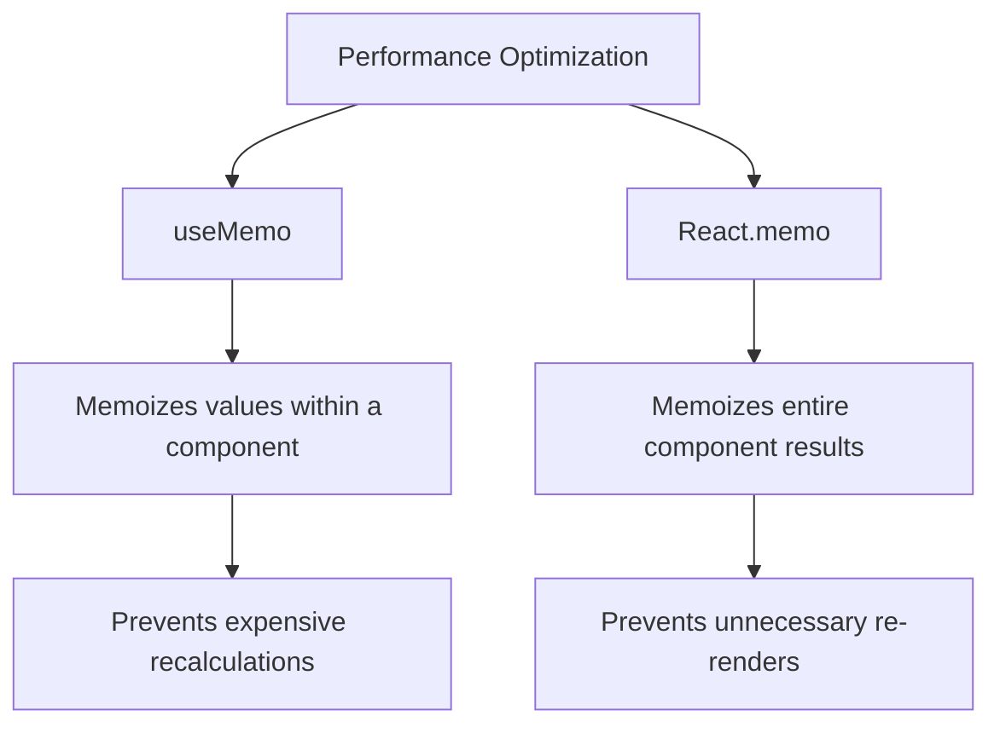

# useMemo Hook

## Introduction

In React applications, performance optimization is crucial for delivering a smooth user experience. One common performance issue is unnecessary recalculations of values when components re-render. The `useMemo` hook addresses this problem by memoizing expensive computations.

`useMemo` is a built-in React Hook that lets you cache the result of a calculation between re-renders until certain dependencies change. This memoization technique can significantly improve your application's performance by avoiding repetitive, resource-intensive calculations.

## Basic Syntax

```jsx
const memoizedValue = useMemo(() => computeExpensiveValue(a, b), [a, b]);
```

The `useMemo` hook takes two arguments:

1. A **function** that computes a value
2. A **dependency array** that includes all variables the function depends on

When the component renders, React will only recompute the memoized value if one of the dependencies has changed since the last render.

## When to Use useMemo

You should consider using `useMemo` when:

1. You have computationally expensive calculations
2. You want to prevent re-renders caused by reference changes
3. You need to optimize renders in a component with frequent updates

## Basic Example

Let's start with a simple example that demonstrates how `useMemo` works:

```jsx
import React, { useState, useMemo } from 'react';

function FactorialCalculator() {
  const [number, setNumber] = useState(1);
  const [count, setCount] = useState(0);
  
  // Without useMemo, this calculation would run on every render
  const factorial = useMemo(() => {
    console.log('Calculating factorial...');
    let result = 1;
    for (let i = 1; i <= number; i++) {
      result *= i;
    }
    return result;
  }, [number]); // Only recalculate when number changes
  
  return (
    <div>
      <h2>Factorial Calculator</h2>
      <input 
        type="number" 
        value={number}
        onChange={(e) => setNumber(parseInt(e.target.value))}
      />
      <p>Factorial of {number} is: {factorial}</p>
      
      <button onClick={() => setCount(count + 1)}>
        Click me: {count}
      </button>
      <p>
        The button updates state, causing a re-render, 
        but factorial is not recalculated.
      </p>
    </div>
  );
}
```

In this example:
- We calculate the factorial of a number, which can be computationally expensive for large numbers
- The calculation is wrapped in `useMemo` with `[number]` as the dependency
- When the user clicks the button and updates `count`, the component re-renders, but the factorial is not recalculated
- The factorial only recalculates when the `number` state changes

## Understanding Dependency Arrays

The dependency array works similarly to `useEffect`. React will memoize the calculated value and only recalculate it when one of the dependencies changes:

```jsx
// Recalculates only when `a` or `b` changes
const result = useMemo(() => compute(a, b), [a, b]);

// Recalculates on every render (not recommended)
const result = useMemo(() => compute(a, b), []);

// Never recalculates (only calculated once, during initial render)
const result = useMemo(() => computeConstantValue(), []);
```

## Memoizing Objects and Arrays

One of the most practical uses of `useMemo` is to maintain reference equality for objects and arrays. In React, a new object or array created during render has a new reference, which can cause unnecessary re-renders of child components that rely on those values.

```jsx
import React, { useState, useMemo } from 'react';

function UserList() {
  const [users, setUsers] = useState([
    { id: 1, name: 'Alice' },
    { id: 2, name: 'Bob' }
  ]);
  const [filter, setFilter] = useState('');
  
  // Without useMemo, a new filtered array would be created on every render
  const filteredUsers = useMemo(() => {
    console.log('Filtering users...');
    return users.filter(user => 
      user.name.toLowerCase().includes(filter.toLowerCase())
    );
  }, [users, filter]); // Only recalculate when users or filter changes
  
  return (
    <div>
      <input
        type="text"
        placeholder="Filter users..."
        value={filter}
        onChange={(e) => setFilter(e.target.value)}
      />
      <ul>
        {filteredUsers.map(user => (
          <li key={user.id}>{user.name}</li>
        ))}
      </ul>
    </div>
  );
}
```

## Real-World Example: Data Visualization

Let's look at a more complex example involving data processing for visualization:

```jsx
import React, { useState, useMemo } from 'react';
import { LineChart, Line, XAxis, YAxis, CartesianGrid, Tooltip } from 'recharts';

function SalesChart({ salesData }) {
  const [timeRange, setTimeRange] = useState('month');
  
  // Process data for visualization based on selected time range
  const processedData = useMemo(() => {
    console.log('Processing chart data...');
    
    if (timeRange === 'day') {
      // Group by day logic
      return salesData.reduce((acc, sale) => {
        // Complex data aggregation by day
        // ...
        return acc;
      }, []);
    } else if (timeRange === 'week') {
      // Group by week logic
      // ...
    } else {
      // Group by month logic
      // ...
    }
  }, [salesData, timeRange]);
  
  return (
    <div>
      <div>
        <button onClick={() => setTimeRange('day')}>Daily</button>
        <button onClick={() => setTimeRange('week')}>Weekly</button>
        <button onClick={() => setTimeRange('month')}>Monthly</button>
      </div>
      
      <LineChart width={600} height={300} data={processedData}>
        <CartesianGrid strokeDasharray="3 3" />
        <XAxis dataKey="name" />
        <YAxis />
        <Tooltip />
        <Line type="monotone" dataKey="sales" stroke="#8884d8" />
      </LineChart>
    </div>
  );
}
```

In this example, data processing for visualization could be intensive, especially with large datasets. Using `useMemo` prevents unnecessary recalculations when the component re-renders for reasons unrelated to the chart data or time range.

## useMemo vs. React.memo

It's important to understand the difference between `useMemo` and `React.memo`:



- `useMemo` is a hook that memoizes a calculated value within a component
- `React.memo` is a higher-order component (HOC) that memoizes the entire component

## Common Patterns and Best Practices

### Derived State with useMemo

When you need to derive state from props or other state:

```jsx
function ProductPage({ products, selectedCategory }) {
  // Derived state: filter products by category
  const filteredProducts = useMemo(() => {
    return selectedCategory 
      ? products.filter(product => product.category === selectedCategory)
      : products;
  }, [products, selectedCategory]);
  
  // Rest of component...
}
```

### Avoiding useMemo Overuse

Don't use `useMemo` for simple calculations:

```jsx
// ❌ Unnecessary use of useMemo
const doubledValue = useMemo(() => value * 2, [value]);

// ✅ Simple calculations don't need useMemo
const doubledValue = value * 2;
```

### Memoizing Callbacks with useMemo vs. useCallback

You can use `useMemo` to memoize a function:

```jsx
// Using useMemo to memoize a function
const memoizedCallback = useMemo(() => {
  return () => {
    doSomething(a, b);
  };
}, [a, b]);

// But useCallback is more suitable for this
const memoizedCallback = useCallback(() => {
  doSomething(a, b);
}, [a, b]);
```

`useCallback(fn, deps)` is equivalent to `useMemo(() => fn, deps)`.

## Performance Considerations

### Measuring Performance

Before optimizing with `useMemo`, measure to confirm there's a performance issue:

```jsx
function ExpensiveComponent({ data }) {
  console.time('calculation');
  const processedData = useMemo(() => {
    const result = performExpensiveOperation(data);
    console.timeEnd('calculation');
    return result;
  }, [data]);
  
  // Component rendering...
}
```

### Cost of Memoization

Remember that memoization itself has a cost. For very simple calculations, the overhead of memoization might be more expensive than just recalculating:

```jsx
// Might be overkill for simple calculations
const sum = useMemo(() => a + b, [a, b]);

// For complex calculations, memoization makes sense
const expensiveResult = useMemo(() => {
  // Complex calculation that takes significant CPU time
  return complexAlgorithm(data);
}, [data]);
```

## Summary

The `useMemo` hook is a powerful optimization tool in React that helps:

1. Avoid expensive recalculations by caching computed values
2. Maintain referential equality for objects and arrays
3. Improve performance in components with expensive computations
4. Prevent unnecessary re-renders of child components

When used correctly, `useMemo` can significantly improve your application's performance. However, it's important to use it judiciously and only for computations that are genuinely expensive or when reference equality matters.

## Exercises

1. Create a component that calculates and displays the Fibonacci sequence up to n terms, using `useMemo` to optimize the calculation.
2. Implement a search filter for a large list of items using `useMemo` to optimize the filtering process.
3. Build a data visualization component that processes and transforms large datasets with `useMemo`.
4. Create a component that maintains referential equality for a complex object across renders.

## Additional Resources

- [React Official Documentation on useMemo](https://reactjs.org/docs/hooks-reference.html#usememo)
- [When to useMemo and useCallback](https://kentcdodds.com/blog/usememo-and-usecallback)
- [Understanding React's useCallback and useMemo](https://www.joshwcomeau.com/react/usememo-and-usecallback/)
- [Performance Optimization with React](https://reactjs.org/docs/optimizing-performance.html)