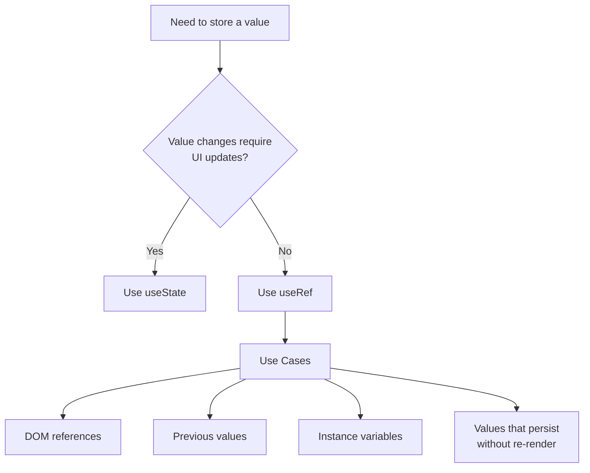

# React useRef Hook

## Introduction

The `useRef` hook is one of React's built-in hooks that gives you a way to persist values between renders without causing the component to re-render when the value changes. Unlike state variables, updating a ref doesn't trigger a re-render, making it perfect for storing values that don't influence the visual output directly.

The most common use case for `useRef` is to access and interact with DOM elements directly, but it can also be used to store any mutable value that needs to persist for the component's lifetime.

## Basic Syntax

Here's the basic syntax for using the `useRef` hook:

```jsx
import { useRef } from 'react';

function MyComponent() {
  // Create a ref with an initial value
  const myRef = useRef(initialValue);
  
  // Access the current value using myRef.current
  console.log(myRef.current);
  
  // Update the ref value (doesn't cause re-render)
  myRef.current = newValue;
  
  // ...
}
```

The `useRef` hook returns a mutable ref object with a `.current` property initialized to the passed argument (`initialValue`). The returned object will persist for the full lifetime of the component.

## Accessing DOM Elements with useRef

One of the primary use cases for `useRef` is to access DOM elements directly. Here's how it works:

```jsx
import { useRef, useEffect } from 'react';

function TextInputWithFocusButton() {
  // Create a ref
  const inputRef = useRef(null);
  
  // Click handler that uses the ref to focus the input
  const focusInput = () => {
    // Access the input DOM element through current
    inputRef.current.focus();
  };
  
  return (
    <div>
      {/* Attach the ref to the DOM element */}
      <input ref={inputRef} type="text" />
      <button onClick={focusInput}>Focus the input</button>
    </div>
  );
}
```

When this component renders:
1. The `inputRef` is created with an initial value of `null`.
2. The `ref={inputRef}` attribute connects our ref to the input DOM element.
3. When the button is clicked, `focusInput()` is called, which uses `inputRef.current` to access the actual input element and call its `focus()` method.

## Persisting Values Between Renders

Another powerful use of `useRef` is to store values that need to persist between renders without triggering re-renders when they change.

```jsx
import { useRef, useEffect, useState } from 'react';

function IntervalCounter() {
  const [count, setCount] = useState(0);
  
  // Use useRef to track interval ID
  const intervalIdRef = useRef(null);
  
  // Use useRef to track previous count
  const prevCountRef = useRef();
  
  useEffect(() => {
    // Log the previous and current count
    console.log('Previous count:', prevCountRef.current);
    console.log('Current count:', count);
    
    // Update the ref to store current count for next render
    prevCountRef.current = count;
  });
  
  const startCounter = () => {
    if (intervalIdRef.current !== null) return;
    
    intervalIdRef.current = setInterval(() => {
      setCount(c => c + 1);
    }, 1000);
  };
  
  const stopCounter = () => {
    clearInterval(intervalIdRef.current);
    intervalIdRef.current = null;
  };
  
  return (
    <div>
      <p>Count: {count}</p>
      <p>Previous count: {prevCountRef.current}</p>
      <button onClick={startCounter}>Start</button>
      <button onClick={stopCounter}>Stop</button>
    </div>
  );
}
```

In this example:
1. `intervalIdRef` stores the interval ID, allowing us to clear it later.
2. `prevCountRef` tracks the previous count value.
3. When `count` changes (causing a re-render), we log both the previous and current count.
4. We then update `prevCountRef.current` to the current count for the next render.

## When to Use useRef vs. useState

Understanding when to use `useRef` versus `useState` is important:



Use `useRef` when:
- You need to access DOM elements directly
- You need to store a value that doesn't affect rendering
- You need to keep track of values between renders without causing re-renders
- You need to store interval/timeout IDs

Use `useState` when:
- The value change should trigger a re-render
- The value is part of your component's visible state

## Real-World Examples

### 1. Form with Auto-Focus on Error

```jsx
import { useState, useRef, useEffect } from 'react';

function FormWithErrorFocus() {
  const [formData, setFormData] = useState({
    name: '',
    email: '',
    message: ''
  });
  
  const [errors, setErrors] = useState({});
  const inputRefs = {
    name: useRef(null),
    email: useRef(null),
    message: useRef(null)
  };
  
  const handleChange = (e) => {
    const { name, value } = e.target;
    setFormData(prev => ({
      ...prev,
      [name]: value
    }));
  };
  
  const validate = () => {
    const newErrors = {};
    
    if (!formData.name.trim()) newErrors.name = 'Name is required';
    if (!formData.email.trim()) newErrors.email = 'Email is required';
    if (!formData.message.trim()) newErrors.message = 'Message is required';
    
    setErrors(newErrors);
    return Object.keys(newErrors).length === 0;
  };
  
  const handleSubmit = (e) => {
    e.preventDefault();
    
    if (validate()) {
      alert('Form submitted successfully!');
      // Submit form data...
    }
  };
  
  // Focus the first field with an error
  useEffect(() => {
    const errorFields = Object.keys(errors);
    if (errorFields.length > 0) {
      inputRefs[errorFields[0]].current.focus();
    }
  }, [errors]);
  
  return (
    <form onSubmit={handleSubmit}>
      <div>
        <label htmlFor="name">Name:</label>
        <input
          ref={inputRefs.name}
          type="text"
          id="name"
          name="name"
          value={formData.name}
          onChange={handleChange}
        />
        {errors.name && <p className="error">{errors.name}</p>}
      </div>
      
      <div>
        <label htmlFor="email">Email:</label>
        <input
          ref={inputRefs.email}
          type="email"
          id="email"
          name="email"
          value={formData.email}
          onChange={handleChange}
        />
        {errors.email && <p className="error">{errors.email}</p>}
      </div>
      
      <div>
        <label htmlFor="message">Message:</label>
        <textarea
          ref={inputRefs.message}
          id="message"
          name="message"
          value={formData.message}
          onChange={handleChange}
        />
        {errors.message && <p className="error">{errors.message}</p>}
      </div>
      
      <button type="submit">Submit</button>
    </form>
  );
}
```

This example shows how multiple refs can be used to manage form fields and automatically focus on the first field with an error when validation fails.

### 2. Video Player with Play/Pause Controls

```jsx
import { useRef, useState } from 'react';

function VideoPlayer({ src }) {
  const videoRef = useRef(null);
  const [isPlaying, setIsPlaying] = useState(false);
  
  const handlePlayPause = () => {
    if (isPlaying) {
      videoRef.current.pause();
    } else {
      videoRef.current.play();
    }
    setIsPlaying(!isPlaying);
  };
  
  const handleTimeUpdate = () => {
    const progress = 
      (videoRef.current.currentTime / videoRef.current.duration) * 100;
    document.getElementById('progress-bar').style.width = `${progress}%`;
  };
  
  return (
    <div className="video-container">
      <video
        ref={videoRef}
        src={src}
        onTimeUpdate={handleTimeUpdate}
        onEnded={() => setIsPlaying(false)}
      />
      
      <div className="controls">
        <button onClick={handlePlayPause}>
          {isPlaying ? 'Pause' : 'Play'}
        </button>
        
        <div className="progress-container">
          <div id="progress-bar" className="progress-bar"></div>
        </div>
      </div>
    </div>
  );
}
```

This example shows how `useRef` can be used to control a video player by accessing the video DOM element's methods and properties.

### 3. Detecting Outside Clicks for a Dropdown Menu

```jsx
import { useRef, useState, useEffect } from 'react';

function Dropdown({ options, onSelect }) {
  const [isOpen, setIsOpen] = useState(false);
  const [selectedOption, setSelectedOption] = useState(null);
  const dropdownRef = useRef(null);
  
  // Close dropdown when clicking outside
  useEffect(() => {
    function handleClickOutside(event) {
      if (dropdownRef.current && !dropdownRef.current.contains(event.target)) {
        setIsOpen(false);
      }
    }
    
    // Add event listener
    document.addEventListener('mousedown', handleClickOutside);
    
    // Cleanup the event listener
    return () => {
      document.removeEventListener('mousedown', handleClickOutside);
    };
  }, []);
  
  const handleSelect = (option) => {
    setSelectedOption(option);
    setIsOpen(false);
    onSelect(option);
  };
  
  return (
    <div className="dropdown" ref={dropdownRef}>
      <button 
        className="dropdown-toggle" 
        onClick={() => setIsOpen(!isOpen)}
      >
        {selectedOption ? selectedOption.label : 'Select an option'}
      </button>
      
      {isOpen && (
        <ul className="dropdown-menu">
          {options.map((option) => (
            <li 
              key={option.value} 
              onClick={() => handleSelect(option)}
            >
              {option.label}
            </li>
          ))}
        </ul>
      )}
    </div>
  );
}
```

This example uses `useRef` to help detect clicks outside of a dropdown component to automatically close it.

## Common Mistakes and Gotchas

### 1. Forgetting to use `.current`

A common mistake is forgetting to use the `.current` property when accessing or updating a ref:

```jsx
// ❌ WRONG
const inputRef = useRef(null);
inputRef.focus(); // This won't work

// ✅ CORRECT
const inputRef = useRef(null);
inputRef.current.focus(); // Correctly access the DOM element
```

### 2. Using refs when state is more appropriate

```jsx
// ❌ WRONG - Using ref for UI state
function Counter() {
  const countRef = useRef(0);
  
  return (
    <div>
      <p>Count: {countRef.current}</p>
      <button onClick={() => countRef.current++}>
        Increment
      </button>
    </div>
  );
}
// This won't update the display when clicked!

// ✅ CORRECT - Using state for UI elements
function Counter() {
  const [count, setCount] = useState(0);
  
  return (
    <div>
      <p>Count: {count}</p>
      <button onClick={() => setCount(count + 1)}>
        Increment
      </button>
    </div>
  );
}
```

### 3. Not initializing refs properly

```jsx
// ❌ PROBLEMATIC - No initial value
const myRef = useRef();
// Later: myRef.current.someProperty might cause errors if myRef.current is null

// ✅ BETTER - Initialize with appropriate value
const myRef = useRef(null); // For DOM refs
const counterRef = useRef(0); // For number values
const userRef = useRef({ name: '', loggedIn: false }); // For objects
```

## Summary

The `useRef` hook is a powerful tool in React that lets you:

1. **Access DOM elements directly** - attach refs to DOM elements to directly interact with them
2. **Store mutable values** between renders without causing re-renders
3. **Track previous state values**
4. **Store instance variables** like interval IDs, timers, or any value that should persist between renders

Remember that:
- Unlike state updates, updating a ref with `myRef.current = newValue` doesn't cause re-renders
- Always access the stored value through the `.current` property
- Use `useRef` for values that don't affect the UI directly; otherwise, use `useState`

## Additional Resources and Exercises

### Resources
- [React Official Documentation on useRef](https://react.dev/reference/react/useRef)
- [React Official Documentation on Refs and the DOM](https://react.dev/learn/referencing-values-with-refs)

### Exercises

1. **Build a Stopwatch**: Create a stopwatch component that uses `useRef` to track the interval ID and elapsed time.

2. **Form with Character Counter**: Create a text area with a character counter that changes color when approaching the maximum character limit.

3. **Image Carousel**: Build an image carousel that uses refs to control the scrolling of images horizontally.

4. **Debounced Search Input**: Create a search input that uses `useRef` to implement debouncing (delay the search execution until the user stops typing).

5. **Scroll to Sections**: Build a page with multiple sections and a navigation menu that smoothly scrolls to the appropriate section when clicked, using refs to access the section elements.

By understanding and effectively using the `useRef` hook, you can solve many complex problems in React applications that involve direct DOM interaction or the need to persist values without triggering re-renders.