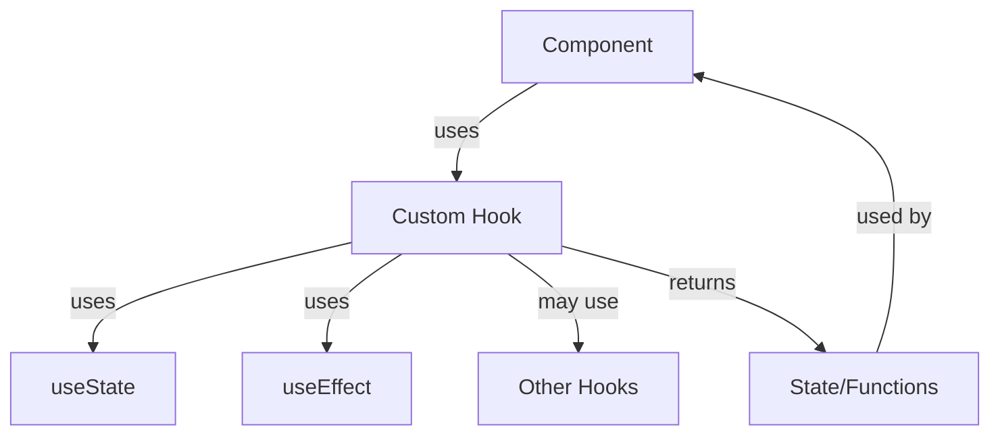

import Tabs from '@theme/Tabs';
import TabItem from '@theme/TabItem';

# React Custom Hooks

## Introduction

Custom Hooks are one of the most powerful features of React Hooks, allowing you to extract component logic into reusable functions. They're JavaScript functions that can use other hooks and follow the same rules as the built-in React hooks. Custom hooks provide a clean way to share stateful logic between components without forcing you to add more components to your component tree.

In this tutorial, we'll learn:
- What custom hooks are and why they're useful
- How to create your own custom hooks
- Best practices for naming and structuring custom hooks
- Real-world examples of custom hooks

## Understanding Custom Hooks

### What is a Custom Hook?

A custom hook is a JavaScript function that:
- Starts with the word "use" (e.g., `useFormInput`, `useFetch`)
- Can call other hooks (like `useState`, `useEffect`, `useContext`)
- Extracts component logic into reusable functions

Custom hooks don't introduce any new features to React; they simply enable you to reuse stateful logic between components.

### Why Use Custom Hooks?

Consider a scenario where you have similar functionality across multiple components:

```jsx
function UserProfile() {
  const [data, setData] = useState(null);
  const [loading, setLoading] = useState(true);
  const [error, setError] = useState(null);

  useEffect(() => {
    fetch('/api/user')
      .then(response => response.json())
      .then(data => {
        setData(data);
        setLoading(false);
      })
      .catch(error => {
        setError(error);
        setLoading(false);
      });
  }, []);

  // Render logic...
}

function ProductList() {
  const [data, setData] = useState(null);
  const [loading, setLoading] = useState(true);
  const [error, setError] = useState(null);

  useEffect(() => {
    fetch('/api/products')
      .then(response => response.json())
      .then(data => {
        setData(data);
        setLoading(false);
      })
      .catch(error => {
        setError(error);
        setLoading(false);
      });
  }, []);

  // Render logic...
}
```

Notice the duplication? This is where custom hooks come in. We can extract this common logic into a custom hook:

```jsx
function useFetch(url) {
  const [data, setData] = useState(null);
  const [loading, setLoading] = useState(true);
  const [error, setError] = useState(null);

  useEffect(() => {
    fetch(url)
      .then(response => response.json())
      .then(data => {
        setData(data);
        setLoading(false);
      })
      .catch(error => {
        setError(error);
        setLoading(false);
      });
  }, [url]);

  return { data, loading, error };
}
```

Now we can use it like this:

```jsx
function UserProfile() {
  const { data, loading, error } = useFetch('/api/user');
  
  if (loading) return <p>Loading...</p>;
  if (error) return <p>Error: {error.message}</p>;
  
  return <div>{/* Render user data */}</div>;
}

function ProductList() {
  const { data, loading, error } = useFetch('/api/products');
  
  if (loading) return <p>Loading...</p>;
  if (error) return <p>Error: {error.message}</p>;
  
  return <div>{/* Render product data */}</div>;
}
```

Much cleaner!

## Creating Your First Custom Hook

Let's start with a simple example - creating a custom hook for managing form input fields.

```jsx
import { useState } from 'react';

function useInput(initialValue) {
  const [value, setValue] = useState(initialValue);
  
  function handleChange(e) {
    setValue(e.target.value);
  }
  
  return {
    value,
    onChange: handleChange
  };
}

// Usage in a component
function SimpleForm() {
  const nameInput = useInput('');
  const emailInput = useInput('');
  
  function handleSubmit(e) {
    e.preventDefault();
    console.log('Submitted:', nameInput.value, emailInput.value);
  }
  
  return (
    <form onSubmit={handleSubmit}>
      <div>
        <label>Name:</label>
        <input type="text" {...nameInput} />
      </div>
      <div>
        <label>Email:</label>
        <input type="email" {...emailInput} />
      </div>
      <button type="submit">Submit</button>
    </form>
  );
}
```

In this example, `useInput` is a custom hook that wraps the `useState` logic for an input field. It returns an object with `value` and `onChange` properties that can be spread into an input element.

## Hooks Composition

One of the powerful features of custom hooks is that they can call other hooks, including other custom hooks. This is called "hooks composition".

Let's build a more complex form hook that builds upon our `useInput` hook:

```jsx
function useForm(initialValues) {
  const [values, setValues] = useState(initialValues);
  const [errors, setErrors] = useState({});
  const [isSubmitting, setIsSubmitting] = useState(false);
  
  function handleChange(e) {
    const { name, value } = e.target;
    setValues({
      ...values,
      [name]: value
    });
  }
  
  function handleSubmit(callback) {
    return (e) => {
      e.preventDefault();
      setIsSubmitting(true);
      callback(values);
    };
  }
  
  function reset() {
    setValues(initialValues);
    setErrors({});
  }
  
  return {
    values,
    errors,
    isSubmitting,
    handleChange,
    handleSubmit,
    reset
  };
}

// Usage in a component
function RegistrationForm() {
  const { values, handleChange, handleSubmit } = useForm({
    username: '',
    email: '',
    password: ''
  });
  
  const submitForm = (formValues) => {
    console.log('Form submitted with:', formValues);
    // API call would go here
  };
  
  return (
    <form onSubmit={handleSubmit(submitForm)}>
      <div>
        <label>Username:</label>
        <input
          type="text"
          name="username"
          value={values.username}
          onChange={handleChange}
        />
      </div>
      <div>
        <label>Email:</label>
        <input
          type="email"
          name="email"
          value={values.email}
          onChange={handleChange}
        />
      </div>
      <div>
        <label>Password:</label>
        <input
          type="password"
          name="password"
          value={values.password}
          onChange={handleChange}
        />
      </div>
      <button type="submit">Register</button>
    </form>
  );
}
```

## Real-World Examples

Let's explore some practical custom hooks that you might use in real applications:

### 1. `useLocalStorage` - Persisting state in localStorage

```jsx
function useLocalStorage(key, initialValue) {
  // State to store our value
  const [storedValue, setStoredValue] = useState(() => {
    try {
      // Get from local storage by key
      const item = window.localStorage.getItem(key);
      // Parse stored json or if none return initialValue
      return item ? JSON.parse(item) : initialValue;
    } catch (error) {
      // If error also return initialValue
      console.log(error);
      return initialValue;
    }
  });

  // Return a wrapped version of useState's setter function that ...
  // ... persists the new value to localStorage.
  const setValue = value => {
    try {
      // Allow value to be a function so we have same API as useState
      const valueToStore =
        value instanceof Function ? value(storedValue) : value;
      // Save state
      setStoredValue(valueToStore);
      // Save to local storage
      window.localStorage.setItem(key, JSON.stringify(valueToStore));
    } catch (error) {
      // A more advanced implementation would handle the error case
      console.log(error);
    }
  };

  return [storedValue, setValue];
}

// Usage
function App() {
  const [name, setName] = useLocalStorage('name', 'Bob');

  return (
    <div>
      <input
        type="text"
        placeholder="Enter your name"
        value={name}
        onChange={e => setName(e.target.value)}
      />
    </div>
  );
}
```

### 2. `useDocumentTitle` - Update document title

```jsx
function useDocumentTitle(title) {
  useEffect(() => {
    document.title = title;
    return () => {
      document.title = 'React App'; // Default title when component unmounts
    };
  }, [title]);
}

// Usage
function PageComponent() {
  const [count, setCount] = useState(0);
  useDocumentTitle(`You clicked ${count} times`);

  return (
    <div>
      <p>You clicked {count} times</p>
      <button onClick={() => setCount(count + 1)}>
        Click me
      </button>
    </div>
  );
}
```

### 3. `useWindowSize` - Track window dimensions

```jsx
function useWindowSize() {
  const [windowSize, setWindowSize] = useState({
    width: undefined,
    height: undefined,
  });
  
  useEffect(() => {
    // Handler to call on window resize
    function handleResize() {
      // Set window width/height to state
      setWindowSize({
        width: window.innerWidth,
        height: window.innerHeight,
      });
    }
    
    // Add event listener
    window.addEventListener("resize", handleResize);
    
    // Call handler right away so state gets updated with initial window size
    handleResize();
    
    // Remove event listener on cleanup
    return () => window.removeEventListener("resize", handleResize);
  }, []); // Empty array ensures that effect is only run on mount and unmount
  
  return windowSize;
}

// Usage
function ResponsiveComponent() {
  const size = useWindowSize();
  
  return (
    <div>
      <h1>Window size:</h1>
      {size.width < 768 ? (
        <p>You are on a small screen</p>
      ) : (
        <p>Your screen is at least 768px wide</p>
      )}
      <p>Width: {size.width}px / Height: {size.height}px</p>
    </div>
  );
}
```

### 4. `useFetch` - Data fetching hook

```jsx
function useFetch(url, options) {
  const [data, setData] = useState(null);
  const [loading, setLoading] = useState(true);
  const [error, setError] = useState(null);
  const [refetchIndex, setRefetchIndex] = useState(0);

  useEffect(() => {
    let isMounted = true;
    
    const fetchData = async () => {
      setLoading(true);
      try {
        const response = await fetch(url, options);
        if (!response.ok) {
          throw new Error(`HTTP error! Status: ${response.status}`);
        }
        
        const result = await response.json();
        
        if (isMounted) {
          setData(result);
          setError(null);
        }
      } catch (error) {
        if (isMounted) {
          setError(error.message);
          setData(null);
        }
      } finally {
        if (isMounted) {
          setLoading(false);
        }
      }
    };

    fetchData();
    
    return () => {
      isMounted = false;
    };
  }, [url, options, refetchIndex]);
  
  // Function to manually refetch data
  const refetch = () => {
    setRefetchIndex(prevIndex => prevIndex + 1);
  };
  
  return { data, loading, error, refetch };
}

// Usage
function UserData() {
  const { data, loading, error, refetch } = useFetch('https://jsonplaceholder.typicode.com/users/1');
  
  if (loading) return <div>Loading...</div>;
  if (error) return <div>Error: {error}</div>;
  
  return (
    <div>
      <h1>{data.name}</h1>
      <p>Email: {data.email}</p>
      <button onClick={refetch}>Refresh Data</button>
    </div>
  );
}
```

## Best Practices for Custom Hooks

### Naming Conventions

Always start custom hook names with "use" to follow React's convention and allow React's linting rules to check for violations of hooks rules.

Good:
- `useFetch`
- `useFormInput`
- `useLocalStorage`

Not recommended:
- `fetchData` (doesn't follow hook naming convention)
- `inputState` (doesn't start with "use")

### Keep Hooks Focused

Each hook should ideally do one thing and do it well. This makes your code more maintainable and your hooks more reusable.

### Document Your Hooks

Add comments or JSDoc annotations to describe:
- What the hook does
- Parameters it accepts
- Values it returns
- Any side effects

Example:

```jsx
/**
 * Hook for handling form input state
 * 
 * @param {any} initialValue - Initial value for the input
 * @returns {Object} Object containing value and onChange handler
 */
function useInput(initialValue) {
  // Implementation...
}
```

### Testing Custom Hooks

You can test custom hooks using libraries like `@testing-library/react-hooks`. Here's a simple example:

```jsx
// useCounter.js
import { useState } from 'react';

export function useCounter(initialValue = 0) {
  const [count, setCount] = useState(initialValue);
  
  const increment = () => setCount(c => c + 1);
  const decrement = () => setCount(c => c - 1);
  const reset = () => setCount(initialValue);
  
  return { count, increment, decrement, reset };
}

// useCounter.test.js
import { renderHook, act } from '@testing-library/react-hooks';
import { useCounter } from './useCounter';

test('should increment counter', () => {
  const { result } = renderHook(() => useCounter(0));
  
  act(() => {
    result.current.increment();
  });
  
  expect(result.current.count).toBe(1);
});
```

## Visualizing Custom Hooks Flow

Here's a diagram showing how a custom hook works:



## Summary

Custom hooks are a powerful pattern in React that allows you to:

1. Extract and reuse stateful logic between components
2. Compose simpler hooks into more complex ones
3. Keep your component code clean and focused on rendering
4. Share functionality without render props or higher-order components

By creating custom hooks, you can build a library of reusable functionality that makes your code more maintainable and your development process more efficient.

## Practice Exercises

1. Create a `useToggle` hook that toggles a boolean state.
2. Build a `useMediaQuery` hook that can detect if a CSS media query matches.
3. Develop a `useDebounce` hook that delays updating a value until a certain amount of time has passed.
4. Create a `usePrevious` hook that stores the previous value of a state or prop.
5. Combine multiple hooks to create a `useSearchFilter` hook that can filter an array based on a search term.

## Additional Resources

- [React Documentation on Custom Hooks](https://reactjs.org/docs/hooks-custom.html)
- [React Hooks API Reference](https://reactjs.org/docs/hooks-reference.html)
- [Collection of React Hooks](https://usehooks.com/)
- [Awesome React Hooks](https://github.com/rehooks/awesome-react-hooks)
- [Rules of Hooks](https://reactjs.org/docs/hooks-rules.html)

Remember, the key to mastering custom hooks is practice and understanding their use cases. Start by implementing them in simple scenarios and gradually move to more complex applications.