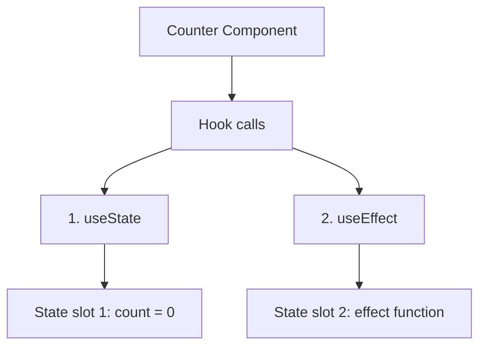

# React Rules of Hooks

React Hooks are a powerful feature introduced in React 16.8 that allows you to use state and other React features without writing a class. However, with this power comes responsibility. To ensure hooks work correctly, you must follow specific rules. In this guide, we'll explore these rules in detail and understand why they're crucial.

## Introduction to the Rules of Hooks

React Hooks provide a more direct API to React concepts you already know: props, state, context, refs, and lifecycle. But unlike these familiar concepts, hooks have two important rules that you must follow to use them effectively:

1. **Only call hooks at the top level**
2. **Only call hooks from React functions**

Breaking these rules can lead to bugs that are difficult to trace and debug. Let's dive deeper into each rule.

## Rule #1: Only Call Hooks at the Top Level

### The Rule Explained

The first rule means:

> Don't call hooks inside loops, conditions, or nested functions.

Instead, always use hooks at the top level of your React function, before any early returns.

### Why This Rule Matters

React relies on the order in which hooks are called to maintain state between re-renders. When you use multiple state or effect hooks in a component, React associates each hook's internal state with its call order.

Let's see how this works:

```jsx
function Counter() {
  // First hook - useState
  const [count, setCount] = useState(0);
  
  // Second hook - useEffect
  useEffect(() => {
    document.title = `You clicked ${count} times`;
  });
  
  return (
    <div>
      <p>You clicked {count} times</p>
      <button onClick={() => setCount(count + 1)}>
        Click me
      </button>
    </div>
  );
}
```

Behind the scenes, React is mapping each hook call to its state in an ordered array:



### What Happens When the Rule is Violated

Let's see what could go wrong if we use a hook inside a condition:

```jsx
function Counter() {
  // This is wrong! ❌
  const [count, setCount] = useState(0);
  
  if (count > 0) {
    // This hook might not run in every render!
    useEffect(() => {
      document.title = `Count: ${count}`;
    });
  }
  
  // Sometimes we have this hook, sometimes we don't
  useEffect(() => {
    console.log('Always runs');
  });
  
  return (
    <button onClick={() => setCount(count + 1)}>
      Count: {count}
    </button>
  );
}
```

In this example:

1. On the first render when `count` is 0, the condition is false
2. Only two hooks run: `useState` and the second `useEffect`
3. When the button is clicked and `count` becomes 1, now three hooks run
4. React expects the same number and order of hooks on each render

This inconsistency breaks React's ability to correctly preserve state between renders.

### The Correct Approach

Move the conditional logic inside the hook:

```jsx
function Counter() {
  const [count, setCount] = useState(0);
  
  // ✅ This is correct
  useEffect(() => {
    if (count > 0) {
      document.title = `Count: ${count}`;
    }
  });
  
  useEffect(() => {
    console.log('Always runs');
  });
  
  return (
    <button onClick={() => setCount(count + 1)}>
      Count: {count}
    </button>
  );
}
```

## Rule #2: Only Call Hooks from React Functions

### The Rule Explained

The second rule states:

> Only call hooks from React function components or custom hooks.

Don't call hooks from:
- Regular JavaScript functions
- Class components
- Event handlers
- Lifecycle methods

### Valid Places to Call Hooks

✅ **React Function Components**:

```jsx
function MyComponent() {
  // You can use hooks here
  const [name, setName] = useState('John');
  return <div>Hello, {name}</div>;
}
```

✅ **Custom Hooks**:

```jsx
// Custom hooks must start with "use"
function useFormInput(initialValue) {
  const [value, setValue] = useState(initialValue);
  
  function handleChange(e) {
    setValue(e.target.value);
  }
  
  return {
    value,
    onChange: handleChange
  };
}
```

### Invalid Places to Call Hooks

❌ **Regular JavaScript Functions**:

```jsx
// This is wrong!
function formatDate() {
  // Can't use hooks here
  const [date, setDate] = useState(new Date());
  return date.toLocaleDateString();
}
```

❌ **Class Components**:

```jsx
class Counter extends React.Component {
  render() {
    // This won't work!
    const [count, setCount] = useState(0);
    return <div>{count}</div>;
  }
}
```

❌ **Event Handlers Defined Outside Components**:

```jsx
// This is incorrect
const handleClick = () => {
  // Can't use hooks here
  const [clicked, setClicked] = useState(false);
};

function Button() {
  return <button onClick={handleClick}>Click me</button>;
}
```

## Creating Custom Hooks

Custom hooks are an excellent way to reuse stateful logic between components. When creating custom hooks, follow these guidelines:

1. Name must start with `use` (e.g., `useFormInput`, `useWindowSize`)
2. Can call other hooks inside
3. Should follow both rules of hooks

Here's an example of a custom hook that manages form input state:

```jsx
// Custom hook for form inputs
function useFormInput(initialValue) {
  const [value, setValue] = useState(initialValue);
  
  function handleChange(e) {
    setValue(e.target.value);
  }
  
  return {
    value,
    onChange: handleChange
  };
}

// Using the custom hook in a component
function LoginForm() {
  const username = useFormInput('');
  const password = useFormInput('');
  
  function handleSubmit(e) {
    e.preventDefault();
    console.log(`Username: ${username.value}, Password: ${password.value}`);
  }
  
  return (
    <form onSubmit={handleSubmit}>
      <input type="text" placeholder="Username" {...username} />
      <input type="password" placeholder="Password" {...password} />
      <button type="submit">Login</button>
    </form>
  );
}
```

## Real-world Example: User Authentication Status

Let's see a practical example that demonstrates both rules of hooks in a user authentication component:

```jsx
function UserDashboard() {
  // ✅ All hooks at the top level
  const [user, setUser] = useState(null);
  const [loading, setLoading] = useState(true);
  const [error, setError] = useState(null);
  
  useEffect(() => {
    async function fetchUserData() {
      try {
        setLoading(true);
        // Simulate API call
        const response = await fetch('/api/user/profile');
        
        if (!response.ok) {
          throw new Error('Failed to fetch user data');
        }
        
        const userData = await response.json();
        setUser(userData);
      } catch (err) {
        setError(err.message);
      } finally {
        setLoading(false);
      }
    }
    
    fetchUserData();
  }, []); // Empty dependency array means this runs once on mount
  
  // ✅ Conditional rendering, not conditional hooks
  if (loading) {
    return <div>Loading user data...</div>;
  }
  
  if (error) {
    return <div>Error: {error}</div>;
  }
  
  if (!user) {
    return <div>No user found</div>;
  }
  
  return (
    <div>
      <h1>Welcome, {user.name}</h1>
      <p>Email: {user.email}</p>
      {/* More dashboard content */}
    </div>
  );
}
```

This example follows both rules:

1. All hooks are called at the top level, not inside conditionals or loops
2. Hooks are only called from a React function component

## Common Mistakes and How to Avoid Them

### Mistake #1: Conditional Hook Calls

```jsx
// ❌ WRONG
function UserProfile({ userId }) {
  if (userId !== null) {
    // This breaks the rules of hooks
    const [user, setUser] = useState(null);
    // ...
  }
  // ...
}

// ✅ CORRECT
function UserProfile({ userId }) {
  const [user, setUser] = useState(null);
  
  useEffect(() => {
    if (userId !== null) {
      // Fetch user data
    }
  }, [userId]);
  // ...
}
```

### Mistake #2: Using Hooks in Regular Functions

```jsx
// ❌ WRONG
function formatUserData(user) {
  // This breaks the rules of hooks
  const [formattedName, setFormattedName] = useState(user.name);
  // ...
  return formattedName;
}

// ✅ CORRECT
// Make it a custom hook
function useFormattedUserData(user) {
  const [formattedName, setFormattedName] = useState(user.name);
  // ...
  return formattedName;
}

// Or keep it as a regular function without hooks
function formatUserData(user) {
  return `${user.firstName} ${user.lastName}`;
}
```

### Mistake #3: Dynamic Hook Calls

```jsx
// ❌ WRONG
function TodoList({ todos }) {
  // This breaks the first rule of hooks
  for (let i = 0; i < todos.length; i++) {
    const [isComplete, setComplete] = useState(false);
    // ...
  }
  // ...
}

// ✅ CORRECT
function TodoList({ todos }) {
  // Create a state array for all todos
  const [completedState, setCompletedState] = useState(
    todos.map(() => false)
  );
  
  // Update a specific todo's completion state
  const updateCompletion = (index, isComplete) => {
    const newState = [...completedState];
    newState[index] = isComplete;
    setCompletedState(newState);
  };
  
  return (
    <ul>
      {todos.map((todo, index) => (
        <li key={todo.id}>
          {todo.text}
          <input
            type="checkbox"
            checked={completedState[index]}
            onChange={(e) => updateCompletion(index, e.target.checked)}
          />
        </li>
      ))}
    </ul>
  );
}
```

## Tools to Help You Follow the Rules

### ESLint Plugin

React provides an ESLint plugin that helps catch violations of these rules:

```bash
npm install eslint-plugin-react-hooks --save-dev
```

Then in your ESLint configuration file:

```json
{
  "plugins": [
    "react-hooks"
  ],
  "rules": {
    "react-hooks/rules-of-hooks": "error",
    "react-hooks/exhaustive-deps": "warn"
  }
}
```

This plugin automatically detects many issues with hook usage during development.

## Summary

The rules of hooks are essential for ensuring that your React components behave predictably and that hooks maintain their state correctly between renders. Let's recap:

1. **Only call hooks at the top level** - Don't use hooks inside loops, conditions, or nested functions
2. **Only call hooks from React functions** - Use hooks only in React functional components or custom hooks

Following these rules will help prevent bugs and make your components easier to understand and maintain.

Remember that React uses the call order of hooks to correctly associate state with each hook. Breaking the rules disrupts this mechanism and can cause unpredictable behavior in your applications.

## Additional Resources and Exercises

### Resources

- [Official React Hooks Rules Documentation](https://reactjs.org/docs/hooks-rules.html)
- [Hooks API Reference](https://reactjs.org/docs/hooks-reference.html)

### Exercises

1. **Fix the Bug**: Review the following code and fix the rules of hooks violations:

   ```jsx
   function WeatherWidget({ city }) {
     if (city) {
       const [weather, setWeather] = useState(null);
       useEffect(() => {
         fetchWeather(city).then(data => setWeather(data));
       }, [city]);
     }
     
     return city ? (
       <div>Weather for {city}: {weather ? weather.temperature : 'Loading...'}</div>
     ) : (
       <div>Please select a city</div>
     );
   }
   ```

2. **Convert to Custom Hook**: Extract the following repeated logic into a custom hook:

   ```jsx
   function UserProfile() {
     const [user, setUser] = useState(null);
     const [loading, setLoading] = useState(true);
     const [error, setError] = useState(null);
     
     useEffect(() => {
       async function fetchData() {
         try {
           setLoading(true);
           const data = await fetchUserProfile();
           setUser(data);
         } catch (e) {
           setError(e.message);
         } finally {
           setLoading(false);
         }
       }
       fetchData();
     }, []);
     
     // ... rest of the component
   }
   
   function ProductPage() {
     const [product, setProduct] = useState(null);
     const [loading, setLoading] = useState(true);
     const [error, setError] = useState(null);
     
     useEffect(() => {
       async function fetchData() {
         try {
           setLoading(true);
           const data = await fetchProductDetails();
           setProduct(data);
         } catch (e) {
           setError(e.message);
         } finally {
           setLoading(false);
         }
       }
       fetchData();
     }, []);
     
     // ... rest of the component
   }
   ```

3. **Find the Issues**: Identify all the rules of hooks violations in the code below:

   ```jsx
   class ProfilePage extends React.Component {
     render() {
       const [user] = useState(null);
       
       function handleClick() {
         const [clicked, setClicked] = useState(false);
         setClicked(true);
       }
       
       for (let i = 0; i < user.posts.length; i++) {
         useEffect(() => {
           console.log(`Post ${i} rendered`);
         });
       }
       
       return (
         <div>
           <h1>{user.name}</h1>
           <button onClick={handleClick}>Click me</button>
         </div>
       );
     }
   }
   ```

By understanding and adhering to the rules of hooks, you'll be able to leverage React's powerful hooks API effectively and build maintainable, bug-free applications.