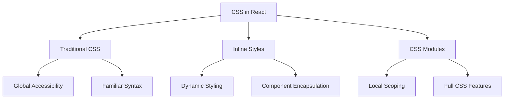

# React CSS Basics

## Introduction

Styling is a fundamental aspect of any web application. In React, you have multiple ways to apply CSS to your components, ranging from traditional approaches to React-specific methods. This guide will walk you through the basics of using CSS in React applications, helping you make informed decisions about styling strategies for your projects.

React doesn't enforce any specific way of styling your components. This flexibility allows you to use whatever approach fits your project requirements best, whether that's traditional CSS files, inline styles, or more sophisticated solutions.

## Traditional CSS in React

### Using External CSS Files

The simplest way to style React components is by importing CSS files directly into your components.

#### How to use external CSS files:

1. Create a CSS file (e.g., `styles.css`)
2. Write your CSS rules
3. Import the file in your React component

```css
/* styles.css */
.button {
  background-color: #4CAF50;
  color: white;
  padding: 10px 20px;
  border: none;
  border-radius: 4px;
  cursor: pointer;
}

.button:hover {
  background-color: #45a049;
}
```

```jsx
// Button.jsx
import React from 'react';
import './styles.css';

function Button() {
  return (
    <button className="button">Click me</button>
  );
}

export default Button;
```

**Note**: In React, we use `className` instead of `class` to apply CSS classes since `class` is a reserved keyword in JavaScript.

### Advantages of External CSS Files:

- Familiar approach for developers coming from traditional web development
- Clear separation of concerns
- Browser caching benefits
- Easy to implement global styles

### Disadvantages:

- No encapsulation by default (styles could leak to other components)
- No direct connection between the component and its styles
- Potential class name collisions in larger applications

## Inline Styles in React

React allows you to apply styles directly to elements using the `style` attribute. However, unlike standard HTML, React's inline styles are specified as JavaScript objects where property names are camelCased.

```jsx
import React from 'react';

function InlineStyleExample() {
  const buttonStyle = {
    backgroundColor: '#4CAF50',
    color: 'white',
    padding: '10px 20px',
    border: 'none',
    borderRadius: '4px',
    cursor: 'pointer',
  };

  return (
    <button style={buttonStyle}>
      Styled with inline styles
    </button>
  );
}

export default InlineStyleExample;
```

### Dynamic Inline Styles

One advantage of inline styles is the ability to easily create dynamic styles based on component state or props:

```jsx
import React, { useState } from 'react';

function DynamicStyleButton() {
  const [isHovered, setIsHovered] = useState(false);
  
  const buttonStyle = {
    backgroundColor: isHovered ? '#45a049' : '#4CAF50',
    color: 'white',
    padding: '10px 20px',
    border: 'none',
    borderRadius: '4px',
    cursor: 'pointer',
    transition: 'background-color 0.3s',
  };

  return (
    <button
      style={buttonStyle}
      onMouseEnter={() => setIsHovered(true)}
      onMouseLeave={() => setIsHovered(false)}
    >
      Hover me!
    </button>
  );
}

export default DynamicStyleButton;
```

### Advantages of Inline Styles:

- Styles are scoped to the component
- Easy to implement dynamic styling
- No need for class naming conventions
- JavaScript and styles in one place

### Disadvantages:

- No support for CSS pseudo-classes (like `:hover`) directly
- No CSS animations
- Can make components harder to read with complex styles
- No style reuse across components without creating shared style objects

## CSS Modules

CSS Modules solve the problem of style isolation by automatically creating unique class names when you import CSS files as modules.

### Setting up CSS Modules:

1. Create a CSS file with `.module.css` extension (e.g., `Button.module.css`)
2. Write your CSS rules
3. Import the styles as a JavaScript object

```css
/* Button.module.css */
.button {
  background-color: #4CAF50;
  color: white;
  padding: 10px 20px;
  border: none;
  border-radius: 4px;
  cursor: pointer;
}

.primary {
  background-color: #2196F3;
}

.large {
  font-size: 18px;
  padding: 12px 24px;
}
```

```jsx
// Button.jsx
import React from 'react';
import styles from './Button.module.css';

function Button({ primary, large, children }) {
  let buttonClasses = styles.button;
  
  if (primary) {
    buttonClasses += ` ${styles.primary}`;
  }
  
  if (large) {
    buttonClasses += ` ${styles.large}`;
  }

  return (
    <button className={buttonClasses}>
      {children}
    </button>
  );
}

export default Button;
```

### Usage example:

```jsx
import React from 'react';
import Button from './Button';

function App() {
  return (
    <div>
      <Button>Normal Button</Button>
      <Button primary>Primary Button</Button>
      <Button large>Large Button</Button>
      <Button primary large>Primary Large Button</Button>
    </div>
  );
}

export default App;
```

### Advantages of CSS Modules:

- Local scope by default (no style leakage between components)
- Uses normal CSS syntax
- Supports all CSS features
- Class names are automatically unique
- Composable and reusable

### Disadvantages:

- Setup might require configuration in some build systems
- Slightly different import pattern than regular CSS

## Conditional Styling in React

A common requirement in React applications is to apply styles conditionally based on props, state, or other dynamic values.

### Using Ternary Operators:

```jsx
import React from 'react';
import './styles.css';

function StatusButton({ isActive }) {
  return (
    <button className={isActive ? 'button active' : 'button'}>
      Status: {isActive ? 'Active' : 'Inactive'}
    </button>
  );
}

export default StatusButton;
```

### Using Template Literals:

```jsx
import React from 'react';
import styles from './StatusButton.module.css';

function StatusButton({ isActive, isDisabled }) {
  const buttonClass = `${styles.button} ${isActive ? styles.active : ''} ${isDisabled ? styles.disabled : ''}`;
  
  return (
    <button className={buttonClass} disabled={isDisabled}>
      Status: {isActive ? 'Active' : 'Inactive'}
    </button>
  );
}

export default StatusButton;
```

### Using a Helper Function (for complex conditions):

```jsx
import React from 'react';
import styles from './ComplexButton.module.css';

function ComplexButton({ primary, secondary, size, outlined }) {
  const getButtonClasses = () => {
    const classes = [styles.button];
    
    if (primary) classes.push(styles.primary);
    if (secondary) classes.push(styles.secondary);
    if (outlined) classes.push(styles.outlined);
    
    if (size === 'small') classes.push(styles.small);
    else if (size === 'large') classes.push(styles.large);
    
    return classes.join(' ');
  };
  
  return (
    <button className={getButtonClasses()}>
      Complex Button
    </button>
  );
}

export default ComplexButton;
```

## Styling Best Practices in React

1. **Component-Based Styling**: Match your styling structure with your component structure.

2. **Think in Components**: Design reusable style components that match your UI components.

3. **Avoid Global Styles**: Limit global styles to foundational elements like resets, typography, and brand colors.

4. **Consider Performance**: Be mindful of how your styling solution affects performance, especially for large applications.

5. **Consistent Naming Conventions**: Choose and stick with a naming convention like BEM or a simpler variant.

```css
/* Example using BEM (Block Element Modifier) */
.card {}
.card__header {}
.card__content {}
.card--featured {}
```

6. **Use Variables for Consistency**: Maintain design consistency using CSS variables or a theme system.

```css
:root {
  --primary-color: #4CAF50;
  --secondary-color: #2196F3;
  --text-color: #333333;
  --spacing-unit: 8px;
}

.button {
  background-color: var(--primary-color);
  color: white;
  padding: calc(var(--spacing-unit) * 1.5) calc(var(--spacing-unit) * 2.5);
}
```

## Real-World Example: A Styled Form Component

Let's build a styled form component combining several of the techniques we've learned:

```jsx
import React, { useState } from 'react';
import styles from './ContactForm.module.css';

function ContactForm() {
  const [formData, setFormData] = useState({
    name: '',
    email: '',
    message: ''
  });
  const [submitted, setSubmitted] = useState(false);
  const [error, setError] = useState('');
  
  const handleChange = (e) => {
    const { name, value } = e.target;
    setFormData(prevData => ({
      ...prevData,
      [name]: value
    }));
  };
  
  const handleSubmit = (e) => {
    e.preventDefault();
    
    // Basic validation
    if (!formData.name || !formData.email || !formData.message) {
      setError('Please fill in all fields');
      return;
    }
    
    // Form submission logic would go here
    console.log('Form submitted:', formData);
    setSubmitted(true);
    setError('');
  };
  
  if (submitted) {
    return (
      <div className={styles.formContainer}>
        <div className={styles.successMessage}>
          <h3>Thank you for your message!</h3>
          <p>We'll get back to you soon.</p>
          <button 
            className={styles.button}
            onClick={() => {
              setSubmitted(false);
              setFormData({ name: '', email: '', message: '' });
            }}
          >
            Send another message
          </button>
        </div>
      </div>
    );
  }
  
  return (
    <div className={styles.formContainer}>
      <h2 className={styles.formTitle}>Contact Us</h2>
      
      {error && <div className={styles.errorMessage}>{error}</div>}
      
      <form className={styles.form} onSubmit={handleSubmit}>
        <div className={styles.formGroup}>
          <label htmlFor="name" className={styles.label}>Name</label>
          <input
            type="text"
            id="name"
            name="name"
            value={formData.name}
            onChange={handleChange}
            className={styles.input}
          />
        </div>
        
        <div className={styles.formGroup}>
          <label htmlFor="email" className={styles.label}>Email</label>
          <input
            type="email"
            id="email"
            name="email"
            value={formData.email}
            onChange={handleChange}
            className={styles.input}
          />
        </div>
        
        <div className={styles.formGroup}>
          <label htmlFor="message" className={styles.label}>Message</label>
          <textarea
            id="message"
            name="message"
            value={formData.message}
            onChange={handleChange}
            className={styles.textarea}
            rows="5"
          />
        </div>
        
        <button type="submit" className={`${styles.button} ${styles.submitButton}`}>
          Send Message
        </button>
      </form>
    </div>
  );
}

export default ContactForm;
```

And here's the corresponding CSS Module:

```css
/* ContactForm.module.css */
.formContainer {
  max-width: 600px;
  margin: 0 auto;
  padding: 20px;
  border-radius: 8px;
  background-color: #f9f9f9;
  box-shadow: 0 2px 4px rgba(0, 0, 0, 0.1);
}

.formTitle {
  margin-top: 0;
  color: #333;
  text-align: center;
  padding-bottom: 10px;
  border-bottom: 1px solid #eee;
}

.form {
  display: flex;
  flex-direction: column;
  gap: 15px;
}

.formGroup {
  display: flex;
  flex-direction: column;
}

.label {
  margin-bottom: 5px;
  font-weight: 500;
  color: #555;
}

.input, .textarea {
  padding: 10px;
  border: 1px solid #ddd;
  border-radius: 4px;
  font-size: 16px;
}

.input:focus, .textarea:focus {
  outline: none;
  border-color: #4CAF50;
  box-shadow: 0 0 0 2px rgba(76, 175, 80, 0.2);
}

.button {
  padding: 10px 20px;
  background-color: #4CAF50;
  color: white;
  border: none;
  border-radius: 4px;
  font-size: 16px;
  cursor: pointer;
  transition: background-color 0.3s;
}

.button:hover {
  background-color: #45a049;
}

.submitButton {
  margin-top: 10px;
  align-self: flex-end;
}

.errorMessage {
  background-color: #ffebee;
  color: #c62828;
  padding: 10px;
  border-radius: 4px;
  margin-bottom: 15px;
}

.successMessage {
  text-align: center;
  padding: 20px;
}

.successMessage h3 {
  color: #4CAF50;
  margin-bottom: 10px;
}
```

## Summary

In this guide, we've explored the foundations of using CSS in React applications:

- **Traditional CSS**: Importing external CSS files into React components
- **Inline Styles**: Using JavaScript objects to define styles directly in components
- **CSS Modules**: Creating component-scoped styles with automatic class name uniqueness
- **Conditional Styling**: Applying styles conditionally based on props or state
- **Best Practices**: Guidelines for organizing and maintaining styles in React applications

Each approach has its own strengths and use cases:



Remember that in real-world applications, you might use a combination of these approaches depending on the specific requirements of your project.

## Exercises

1. Create a simple React button component with three variant styles: "default", "primary", and "danger" using CSS Modules.

2. Build a toggle switch component that changes its appearance based on its on/off state using inline styles.

3. Create a card component that has different styles for "featured" and "regular" versions using traditional CSS.

4. Implement a responsive navigation menu that changes its layout between desktop and mobile viewports.

5. Build a form with validation that applies error styles to invalid inputs and a success style when successfully submitted.

## Additional Resources

- [React Documentation on Styling](https://reactjs.org/docs/faq-styling.html)
- [CSS-Tricks Guide to CSS Modules](https://css-tricks.com/css-modules-part-1-need/)
- [MDN Web Docs CSS Reference](https://developer.mozilla.org/en-US/docs/Web/CSS)
- [A Complete Guide to Flexbox](https://css-tricks.com/snippets/css/a-guide-to-flexbox/)
- [A Complete Guide to CSS Grid](https://css-tricks.com/snippets/css/complete-guide-grid/)