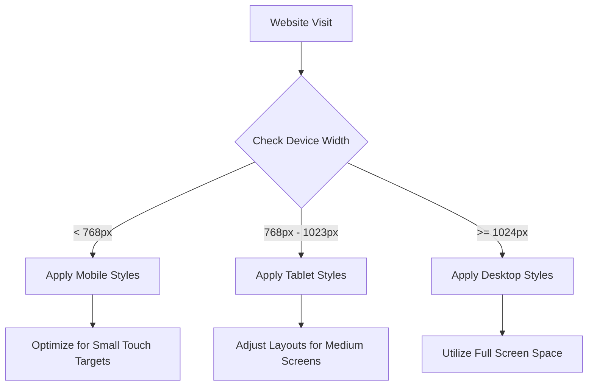

# React Responsive Design

## Introduction

Responsive design is a crucial aspect of modern web development that ensures your application looks and works well across all devices and screen sizes. With the variety of devices people use to access websites today—from smartphones and tablets to desktops and large monitors—building responsive interfaces has become essential.

In this guide, we'll explore how to implement responsive design techniques in React applications. You'll learn about various approaches, from CSS media queries to specialized React libraries, that will help your applications adapt gracefully to any screen size.

## Why Responsive Design Matters

Before diving into implementation details, let's understand why responsive design is important:

- **Better User Experience**: Users can access your application from any device without usability issues.
- **Wider Audience Reach**: Your application becomes accessible to users on all types of devices.
- **SEO Benefits**: Search engines favor mobile-friendly websites.
- **Maintenance Efficiency**: Maintaining one responsive site is easier than separate mobile and desktop versions.

## Fundamental Responsive Design Techniques in React

### 1. Using CSS Media Queries

The most basic and powerful technique for responsive design is CSS media queries. They allow you to apply different styles based on device characteristics like screen width.

```jsx
import React from 'react';
import './ResponsiveComponent.css';

function ResponsiveComponent() {
  return (
    <div className="container">
      <header className="header">
        <h1>Responsive React App</h1>
        <nav className="navigation">
          <ul>
            <li><a href="#home">Home</a></li>
            <li><a href="#about">About</a></li>
            <li><a href="#contact">Contact</a></li>
          </ul>
        </nav>
      </header>
      <main className="content">
        <p>This content will adjust based on screen size.</p>
      </main>
    </div>
  );
}

export default ResponsiveComponent;
```

And the corresponding CSS:

```css
/* Base styles (mobile first) */
.container {
  width: 100%;
  padding: 15px;
}

.header {
  display: flex;
  flex-direction: column;
}

.navigation ul {
  display: flex;
  flex-direction: column;
  list-style: none;
  padding: 0;
}

/* Tablet styles */
@media (min-width: 768px) {
  .container {
    padding: 20px;
  }
  
  .navigation ul {
    flex-direction: row;
  }
  
  .navigation li {
    margin-right: 20px;
  }
}

/* Desktop styles */
@media (min-width: 1024px) {
  .container {
    max-width: 1200px;
    margin: 0 auto;
    padding: 30px;
  }
  
  .header {
    flex-direction: row;
    justify-content: space-between;
    align-items: center;
  }
}
```

### 2. Mobile-First Approach

When building responsive React applications, it's generally recommended to use the mobile-first approach:

1. Start by designing and styling for mobile devices.
2. Use media queries to progressively enhance the layout for larger screens.

This approach ensures your application works well on smaller devices and typically results in cleaner, more efficient code.

### 3. Using Flexbox and Grid

Modern CSS layouts using Flexbox and Grid provide powerful tools for responsive design:

```jsx
import React from 'react';
import './FlexGridLayout.css';

function FlexGridLayout() {
  return (
    <div className="flex-container">
      <div className="card">Item 1</div>
      <div className="card">Item 2</div>
      <div className="card">Item 3</div>
      <div className="card">Item 4</div>
      <div className="card">Item 5</div>
      <div className="card">Item 6</div>
    </div>
  );
}

export default FlexGridLayout;
```

With this CSS:

```css
.flex-container {
  display: flex;
  flex-wrap: wrap;
  gap: 20px;
}

.card {
  flex-basis: 100%; /* Full width on mobile */
  background-color: #f0f0f0;
  padding: 20px;
  border-radius: 5px;
}

@media (min-width: 768px) {
  .card {
    flex-basis: calc(50% - 20px); /* Two columns on tablet */
  }
}

@media (min-width: 1024px) {
  .card {
    flex-basis: calc(33.333% - 20px); /* Three columns on desktop */
  }
}
```

## Advanced Responsive Techniques in React

### 1. Conditional Rendering Based on Screen Size

Sometimes you might want to render completely different components based on screen size:

```jsx
import React, { useState, useEffect } from 'react';

function ResponsiveLayout() {
  const [isMobile, setIsMobile] = useState(false);
  
  useEffect(() => {
    // Function to update state based on window size
    function handleResize() {
      setIsMobile(window.innerWidth < 768);
    }
    
    // Initial check
    handleResize();
    
    // Add event listener
    window.addEventListener('resize', handleResize);
    
    // Clean up
    return () => window.removeEventListener('resize', handleResize);
  }, []);
  
  return (
    <div>
      {isMobile ? (
        <MobileNavigation />
      ) : (
        <DesktopNavigation />
      )}
      <main>Content goes here</main>
    </div>
  );
}

function MobileNavigation() {
  return <nav className="mobile-nav">Mobile Menu</nav>;
}

function DesktopNavigation() {
  return <nav className="desktop-nav">Desktop Menu</nav>;
}

export default ResponsiveLayout;
```

### 2. Creating a Custom Hook for Responsive Design

For cleaner code, you can create a custom hook to handle the responsive logic:

```jsx
import { useState, useEffect } from 'react';

function useMediaQuery(query) {
  const [matches, setMatches] = useState(false);

  useEffect(() => {
    const media = window.matchMedia(query);
    
    // Update the state initially
    setMatches(media.matches);
    
    // Define callback for media query changes
    const listener = (event) => {
      setMatches(event.matches);
    };
    
    // Add the callback as a listener
    media.addEventListener('change', listener);
    
    // Clean up
    return () => {
      media.removeEventListener('change', listener);
    };
  }, [query]);

  return matches;
}

// Usage in a component
function ResponsiveComponent() {
  const isMobile = useMediaQuery('(max-width: 767px)');
  const isTablet = useMediaQuery('(min-width: 768px) and (max-width: 1023px)');
  const isDesktop = useMediaQuery('(min-width: 1024px)');
  
  return (
    <div>
      {isMobile && <p>Mobile view</p>}
      {isTablet && <p>Tablet view</p>}
      {isDesktop && <p>Desktop view</p>}
    </div>
  );
}

export default ResponsiveComponent;
```

### 3. Using Responsive CSS Units

Leveraging responsive CSS units like percentages, viewport width (`vw`), viewport height (`vh`), and `rem` units can make your designs more fluid:

```css
.container {
  width: 90%; /* Uses percentage of parent */
  max-width: 1200px; /* Sets maximum width */
  margin: 0 auto;
}

.hero-section {
  height: 50vh; /* 50% of viewport height */
  padding: 2rem; /* Based on root font size */
}

.responsive-font {
  font-size: calc(16px + 1vw); /* Base size plus responsive adjustment */
}
```

## Using React Libraries for Responsive Design

### 1. React-Responsive

The `react-responsive` library provides media query components to conditionally render components based on device characteristics:

```jsx
import React from 'react';
import { useMediaQuery } from 'react-responsive';

function ResponsiveComponent() {
  const isMobile = useMediaQuery({ maxWidth: 767 });
  const isTablet = useMediaQuery({ minWidth: 768, maxWidth: 1023 });
  const isDesktop = useMediaQuery({ minWidth: 1024 });
  
  return (
    <div>
      {isMobile && <div>Mobile View</div>}
      {isTablet && <div>Tablet View</div>}
      {isDesktop && <div>Desktop View</div>}
    </div>
  );
}

export default ResponsiveComponent;
```

To use the library, first install it:

```bash
npm install react-responsive
```

### 2. CSS-in-JS Solutions

Libraries like Styled Components and Emotion make responsive styling elegant by enabling media queries within your JavaScript:

```jsx
import React from 'react';
import styled from 'styled-components';

// Define responsive styles
const Card = styled.div`
  padding: 1rem;
  background-color: #fff;
  border-radius: 8px;
  box-shadow: 0 2px 4px rgba(0, 0, 0, 0.1);
  
  /* Mobile (default) */
  width: 100%;
  
  /* Tablet */
  @media (min-width: 768px) {
    width: 48%;
  }
  
  /* Desktop */
  @media (min-width: 1024px) {
    width: 30%;
  }
`;

const CardContainer = styled.div`
  display: flex;
  flex-wrap: wrap;
  gap: 20px;
`;

function ResponsiveCards() {
  return (
    <CardContainer>
      <Card>Card 1</Card>
      <Card>Card 2</Card>
      <Card>Card 3</Card>
    </CardContainer>
  );
}

export default ResponsiveCards;
```

Install styled-components:

```bash
npm install styled-components
```

## Responsive Images in React

Handling images responsively is crucial for performance:

```jsx
import React from 'react';
import './ResponsiveImages.css';

function ResponsiveImages() {
  return (
    <div className="img-container">
      {/* Method 1: CSS-based responsive image */}
      
      
      {/* Method 2: HTML picture element for art direction */}
      <picture>
        <source 
          media="(min-width: 1024px)" 
          srcSet="/images/large.jpg" 
        />
        <source 
          media="(min-width: 768px)" 
          srcSet="/images/medium.jpg" 
        />
        
      </picture>
      
      {/* Method 3: srcSet for resolution switching */}
      
    </div>
  );
}

export default ResponsiveImages;
```

And the corresponding CSS:

```css
.responsive-img {
  width: 100%;
  height: auto;
  max-width: 800px;
}

.img-container {
  width: 100%;
}
```

## Real-World Example: Building a Responsive Navigation System

Let's build a comprehensive responsive navigation system—one of the most common responsive UI patterns:

```jsx
import React, { useState, useEffect } from 'react';
import './ResponsiveNav.css';

function ResponsiveNav() {
  const [isMenuOpen, setIsMenuOpen] = useState(false);
  const [isDesktop, setIsDesktop] = useState(window.innerWidth >= 1024);
  
  // Update isDesktop state on window resize
  useEffect(() => {
    function handleResize() {
      setIsDesktop(window.innerWidth >= 1024);
      if (window.innerWidth >= 1024) {
        setIsMenuOpen(false);
      }
    }
    
    window.addEventListener('resize', handleResize);
    return () => window.removeEventListener('resize', handleResize);
  }, []);
  
  // Toggle mobile menu
  const toggleMenu = () => {
    setIsMenuOpen(!isMenuOpen);
  };
  
  return (
    <header className="header">
      <div className="logo">
        <h1>Brand Logo</h1>
      </div>
      
      {/* Mobile menu button */}
      {!isDesktop && (
        <button className="menu-toggle" onClick={toggleMenu} aria-label="Toggle navigation menu">
          {isMenuOpen ? '✕' : '☰'}
        </button>
      )}
      
      {/* Navigation links - shown always on desktop, or when menu is open on mobile */}
      <nav className={`navigation ${(isMenuOpen || isDesktop) ? 'active' : ''}`}>
        <ul>
          <li><a href="#home">Home</a></li>
          <li><a href="#services">Services</a></li>
          <li><a href="#about">About</a></li>
          <li><a href="#blog">Blog</a></li>
          <li><a href="#contact">Contact</a></li>
        </ul>
      </nav>
    </header>
  );
}

export default ResponsiveNav;
```

CSS for the responsive navigation:

```css
.header {
  display: flex;
  justify-content: space-between;
  align-items: center;
  padding: 1rem;
  background-color: #333;
  color: white;
}

.logo {
  font-size: 1.2rem;
}

.menu-toggle {
  background: none;
  border: none;
  color: white;
  font-size: 1.5rem;
  cursor: pointer;
}

/* Mobile navigation (default) */
.navigation {
  display: none;
  position: absolute;
  top: 60px;
  left: 0;
  right: 0;
  background-color: #333;
  padding: 1rem;
}

.navigation.active {
  display: block;
}

.navigation ul {
  list-style: none;
  padding: 0;
  margin: 0;
}

.navigation li {
  margin-bottom: 1rem;
}

.navigation a {
  color: white;
  text-decoration: none;
  font-size: 1.1rem;
}

/* Desktop navigation */
@media (min-width: 1024px) {
  .navigation {
    display: block;
    position: static;
    padding: 0;
  }
  
  .navigation ul {
    display: flex;
  }
  
  .navigation li {
    margin: 0 0 0 1.5rem;
  }
}
```

## Best Practices for React Responsive Design

Here are some tried-and-tested best practices:

1. **Use a Mobile-First Approach**: Design for small screens first, then enhance for larger screens.

2. **Test on Real Devices**: Emulators and browser tools are helpful, but test on actual devices when possible.

3. **Consider Performance**: Mobile devices often have slower connections and less processing power.

4. **Make Touch Targets Adequately Sized**: Buttons and interactive elements should be at least 44x44 pixels.

5. **Use Relative Units**: Prefer `rem`, `em`, `%`, `vh`, and `vw` over fixed pixel values.

6. **Optimize Images**: Use responsive image techniques to serve appropriately sized images.

7. **Avoid Horizontal Scrolling**: Content should fit within the viewport width.

8. **Use Feature Detection**: Don't assume features will work across all devices.

9. **Consider Device Orientation**: Remember users may rotate their devices.

10. **Use CSS Grid and Flexbox**: These modern layout tools make responsive design much easier.

## Common Responsive Breakpoints

While you should tailor breakpoints to your specific design, these are commonly used breakpoints:

```css
/* Small devices (phones) */
@media (max-width: 767px) {
  /* Styles here */
}

/* Medium devices (tablets) */
@media (min-width: 768px) and (max-width: 1023px) {
  /* Styles here */
}

/* Large devices (desktops) */
@media (min-width: 1024px) and (max-width: 1279px) {
  /* Styles here */
}

/* Extra large devices (large desktops) */
@media (min-width: 1280px) {
  /* Styles here */
}
```

## Visualizing Responsive Design Flow

Here's a diagram showing how responsive design adapts across different viewport sizes:



## Summary

Responsive design in React involves creating interfaces that adapt to different screen sizes and devices. We've covered:

- Using CSS media queries for responsive styling
- Taking a mobile-first approach
- Leveraging Flexbox and Grid for responsive layouts
- Conditionally rendering components based on screen size
- Creating custom hooks for responsive behavior
- Using specialized React libraries like `react-responsive`
- Implementing CSS-in-JS for responsive styling
- Handling responsive images
- Building real-world responsive components like navigation menus
- Following best practices for responsive design

By combining these techniques, you can create React applications that provide excellent user experiences across all devices, from smartphones to large desktop monitors.

## Practice Exercises

1. **Basic Responsive Card**: Create a card component that displays in a single column on mobile and in multiple columns on larger screens.

2. **Responsive Form**: Build a form that adjusts its layout based on screen size.

3. **Advanced Navigation**: Extend the navigation example to include dropdown menus that work responsively.

4. **Responsive Dashboard**: Create a simple dashboard with widgets that reflow based on available screen space.

5. **Custom Hook Practice**: Build a custom hook that provides information about the current device type (mobile, tablet, desktop) that you can use throughout your application.

## Additional Resources

- **MDN Web Docs on Responsive Design**: Comprehensive guides on media queries and responsive techniques.
- **React Responsive Documentation**: The official documentation for the react-responsive library.
- **CSS Tricks Flexbox Guide and CSS Grid Guide**: In-depth tutorials on Flexbox and Grid.
- **Google's Responsive Web Design Fundamentals**: A course covering responsive design principles.
- **A List Apart - Responsive Web Design**: The classic article that introduced responsive web design.

Remember that responsive design is both art and science—technical implementation combined with user experience considerations. As you practice, you'll develop an intuition for creating interfaces that work well across the full spectrum of devices.