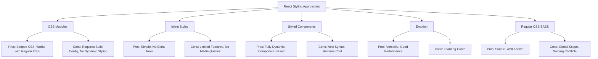

# React CSS Modules

## Introduction

When building React applications, managing CSS can become challenging as your project grows. Global CSS styles can lead to conflicts, naming collisions, and maintenance headaches. **CSS Modules** offers an elegant solution to this problem by locally scoping CSS to specific components.

CSS Modules is a CSS file in which all class names and animation names are scoped locally by default. It allows you to use the same CSS class name in different files without worrying about naming clashes. This approach combines the benefits of modular, component-based development with the power of CSS.

## What Are CSS Modules?

CSS Modules are regular CSS files that get processed during the build process to generate unique class names. When you import a CSS Module in your React component, you receive an object that maps the original class names to their transformed, locally-scoped versions.

The key benefits of CSS Modules include:

- **Local Scope**: CSS classes are locally scoped by default, preventing style leakage and collisions
- **Reusability**: Components maintain their own styles, making them more portable
- **Maintainability**: Styles are co-located with components, making the codebase easier to maintain
- **Developer Experience**: You can use simple, semantically meaningful class names without fear of conflicts

## Getting Started with CSS Modules

### Setting Up CSS Modules

If you're using Create React App, CSS Modules are already supported out of the box. For other setups, you might need to configure your webpack or other build tools.

To use CSS Modules in a Create React App project:

1. Create a CSS file with the `.module.css` extension
2. Import the styles in your component
3. Apply the classes using the imported styles object

Let's see this in action:

### Basic Example

First, create a CSS Module file named `Button.module.css`:

```css
.button {
  padding: 10px 15px;
  background-color: #0066cc;
  color: white;
  border: none;
  border-radius: 4px;
  cursor: pointer;
  font-size: 16px;
}

.button:hover {
  background-color: #0055aa;
}

.large {
  padding: 12px 20px;
  font-size: 18px;
}
```

Now, create a Button component that uses these styles:

```jsx
import React from 'react';
import styles from './Button.module.css';

function Button({ children, large }) {
  return (
    <button 
      className={large ? `${styles.button} ${styles.large}` : styles.button}
    >
      {children}
    </button>
  );
}

export default Button;
```

To use this component in your app:

```jsx
import Button from './Button';

function App() {
  return (
    <div>
      <h1>CSS Modules Example</h1>
      <Button>Click Me</Button>
      <Button large>Large Button</Button>
    </div>
  );
}
```

### What Happens Behind the Scenes

When your application builds, CSS Modules transforms class names to make them unique. For example, `.button` might become something like `.Button_button__2Xdp8`.

This transformation ensures that the styles only apply to elements where you explicitly use them through the `styles` object. If another component has a `.button` class, there won't be any conflict.

## Composing CSS Classes

CSS Modules allows you to compose classes, which helps in building more modular and reusable styles.

### Using Multiple Classes

You can apply multiple classes to an element using template literals or the `classnames` library:

```jsx
import React from 'react';
import styles from './Card.module.css';

function Card({ children, highlighted }) {
  return (
    <div className={`${styles.card} ${highlighted ? styles.highlighted : ''}`}>
      {children}
    </div>
  );
}
```

### Using the classnames Library

The `classnames` library makes it even easier to handle conditional classes:

```jsx
import React from 'react';
import classNames from 'classnames';
import styles from './Card.module.css';

function Card({ children, highlighted, size }) {
  const cardClass = classNames({
    [styles.card]: true,
    [styles.highlighted]: highlighted,
    [styles.small]: size === 'small',
    [styles.large]: size === 'large'
  });

  return <div className={cardClass}>{children}</div>;
}
```

## Composition in CSS Files

You can compose classes within your CSS Module files as well:

```css
.base {
  border: 1px solid #ddd;
  padding: 10px;
  border-radius: 4px;
}

.card {
  composes: base;
  box-shadow: 0 2px 4px rgba(0, 0, 0, 0.1);
  margin-bottom: 20px;
}

.highlighted {
  border-color: #0066cc;
  box-shadow: 0 2px 8px rgba(0, 102, 204, 0.4);
}
```

## Global Styles with CSS Modules

Sometimes you might need to define global styles. You can do this with the `:global` syntax:

```css
:global(.heading) {
  font-size: 24px;
  margin-bottom: 20px;
}

.card :global(.title) {
  font-weight: bold;
  color: #333;
}
```

The `.heading` class will be available globally, while the `.card` class remains locally scoped. The `.title` class will be global but is being used within the locally scoped `.card` context.

## Real-World Example: Building a Card Component

Let's build a reusable Card component with CSS Modules that has different variants:

First, create `Card.module.css`:

```css
.card {
  border-radius: 8px;
  overflow: hidden;
  box-shadow: 0 2px 8px rgba(0, 0, 0, 0.1);
  transition: box-shadow 0.3s ease;
}

.card:hover {
  box-shadow: 0 4px 12px rgba(0, 0, 0, 0.2);
}

.content {
  padding: 16px;
}

.header {
  padding: 12px 16px;
  border-bottom: 1px solid #eee;
  font-weight: bold;
}

.footer {
  padding: 12px 16px;
  border-top: 1px solid #eee;
  background: #f9f9f9;
}

/* Card variants */
.default {
  background: white;
  color: #333;
}

.primary {
  background: #e8f0fe;
  color: #1a73e8;
}

.success {
  background: #e6f7ed;
  color: #1e8e3e;
}

.warning {
  background: #fef7e0;
  color: #e37400;
}

.error {
  background: #fce8e6;
  color: #d93025;
}
```

Now, create the Card component:

```jsx
import React from 'react';
import PropTypes from 'prop-types';
import classNames from 'classnames';
import styles from './Card.module.css';

function Card({ 
  children, 
  header, 
  footer, 
  variant = 'default',
  className
}) {
  const cardClass = classNames(
    styles.card,
    styles[variant],
    className
  );

  return (
    <div className={cardClass}>
      {header && <div className={styles.header}>{header}</div>}
      <div className={styles.content}>{children}</div>
      {footer && <div className={styles.footer}>{footer}</div>}
    </div>
  );
}

Card.propTypes = {
  children: PropTypes.node.isRequired,
  header: PropTypes.node,
  footer: PropTypes.node,
  variant: PropTypes.oneOf(['default', 'primary', 'success', 'warning', 'error']),
  className: PropTypes.string
};

export default Card;
```

Now you can use this Card component in your application:

```jsx
import React from 'react';
import Card from './Card';

function Dashboard() {
  return (
    <div>
      <Card 
        header="Default Card" 
        footer="Card Footer"
      >
        This is a default card
      </Card>
      
      <Card 
        variant="primary" 
        header="Information"
      >
        This is an information card
      </Card>
      
      <Card 
        variant="success" 
        header="Success"
      >
        Operation completed successfully
      </Card>
      
      <Card 
        variant="warning" 
        header="Warning"
      >
        Please review your information
      </Card>
      
      <Card 
        variant="error" 
        header="Error"
      >
        An error occurred while processing your request
      </Card>
    </div>
  );
}
```

## Working with Media Queries in CSS Modules

CSS Modules work perfectly with media queries. Here's how to implement responsive styles:

```css
.container {
  padding: 20px;
}

@media (min-width: 768px) {
  .container {
    padding: 30px;
    display: flex;
  }
  
  .sidebar {
    flex: 0 0 30%;
  }
  
  .content {
    flex: 1;
  }
}
```

## CSS Modules with SASS/SCSS

You can use CSS Modules with preprocessors like SASS for even more powerful styling capabilities. To do this in Create React App:

1. Install SASS: `npm install sass`
2. Create files with `.module.scss` extension
3. Import them just like CSS modules

Example `Button.module.scss`:

```scss
$primary-color: #0066cc;
$hover-color: darken($primary-color, 10%);

.button {
  padding: 10px 15px;
  background-color: $primary-color;
  color: white;
  border: none;
  border-radius: 4px;
  cursor: pointer;
  
  &:hover {
    background-color: $hover-color;
  }
  
  &.large {
    padding: 12px 20px;
    font-size: 18px;
  }
  
  &.small {
    padding: 6px 10px;
    font-size: 14px;
  }
}
```

The usage in React components remains the same:

```jsx
import React from 'react';
import styles from './Button.module.scss';

function Button({ children, size }) {
  const buttonClass = `${styles.button} ${styles[size] || ''}`;
  return <button className={buttonClass}>{children}</button>;
}

export default Button;
```

## Best Practices for CSS Modules

1. **Keep modules small and focused**: Each CSS module should correspond to a specific component
2. **Use meaningful class names**: Since the names are scoped, you can use semantic names like `.title` instead of BEM-style naming
3. **Avoid element selectors**: Stick to class selectors for better specificity control
4. **Use composition**: Leverage the `composes` feature to create reusable style blocks
5. **Maintain a design system**: Create utility modules for colors, typography, and spacing
6. **Co-locate CSS modules**: Keep CSS module files next to the component files they style

## Common Pitfalls and Solutions

### Dynamic Class Names

To dynamically determine class names:

```jsx
import styles from './Component.module.css';

function Component({ type }) {
  // This will work if type is 'success', 'error', etc. and matches class names in your CSS
  return <div className={styles[type]}>Content</div>;
}
```

### Style Inheritance

If you want to build upon styles from another component, you can compose them:

```css
/* Button.module.css */
.button {
  /* button styles */
}

/* PrimaryButton.module.css */
.primaryButton {
  composes: button from './Button.module.css';
  background-color: blue;
}
```

## CSS Modules vs. Other Styling Approaches

Here's how CSS Modules compare to other React styling methods:



## Summary

CSS Modules provide an elegant solution for component-scoped styling in React applications. They offer the perfect balance between the simplicity of regular CSS and the scoping benefits of more complex CSS-in-JS solutions.

Key takeaways:

1. CSS Modules automatically scope your styles to the component that imports them
2. They work with your existing CSS knowledge - no new syntax to learn
3. They're easy to set up, especially in Create React App projects
4. CSS Modules can be combined with SASS/SCSS for more powerful styling
5. They help prevent style conflicts and enable more maintainable code

By using CSS Modules, you can write clean, modular CSS that aligns perfectly with React's component-based architecture, resulting in more maintainable and scalable applications.

## Additional Resources

- [Official CSS Modules GitHub Repository](https://github.com/css-modules/css-modules)
- [Create React App CSS Modules Documentation](https://create-react-app.dev/docs/adding-a-css-modules-stylesheet/)
- [CSS Modules with SASS in React](https://create-react-app.dev/docs/adding-a-sass-stylesheet/)

## Exercises

1. Create a simple Button component with primary, secondary, and danger variants using CSS Modules
2. Implement a Card component that supports light/dark themes through CSS Modules
3. Build a responsive navigation bar using media queries within CSS Modules
4. Create a form with styled inputs and validation states using CSS Modules and SCSS
5. Build a reusable grid system using CSS Modules composition

Happy coding!