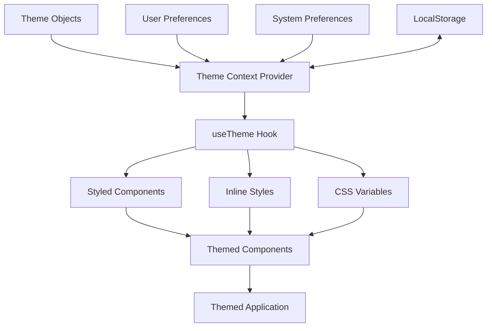

# React Theming

## Introduction

Theming in React allows you to create applications with consistent, customizable visual styles that can be changed dynamically. It's a powerful concept that enables features like dark/light mode switching, brand customization, and user preference settings.

In this tutorial, we'll learn how to implement theming in React applications. You'll understand how to:

- Create theme objects to store style variables
- Use theme providers to distribute theme values throughout your component tree
- Implement theme switching functionality
- Apply themes in various styling approaches (CSS-in-JS, CSS variables, etc.)

## Understanding React Themes

A theme is essentially a collection of design tokens and style variables that define the visual language of your application. These might include:

- Color palettes
- Typography scales
- Spacing measurements
- Border radii
- Shadow styles

### Benefits of Theming

- **Consistency**: Enforce a consistent look and feel across your application
- **Maintainability**: Change styles in one place rather than across many components
- **Adaptability**: Support different visual modes (dark/light) or brand variations
- **Accessibility**: Improve user experience by supporting user preferences

## Creating a Basic Theme

Let's start by creating a simple theme object:

```jsx
// themes.js
export const lightTheme = {
  colors: {
    primary: '#007bff',
    secondary: '#6c757d',
    background: '#ffffff',
    text: '#212529',
    border: '#dee2e6'
  },
  typography: {
    fontFamily: "'Roboto', sans-serif",
    fontSize: {
      small: '0.875rem',
      medium: '1rem',
      large: '1.25rem'
    }
  },
  spacing: {
    small: '0.5rem',
    medium: '1rem',
    large: '2rem'
  }
};

export const darkTheme = {
  colors: {
    primary: '#90caf9',
    secondary: '#ce93d8',
    background: '#121212',
    text: '#e0e0e0',
    border: '#424242'
  },
  // We can inherit the same values from light theme
  typography: lightTheme.typography,
  spacing: lightTheme.spacing
};
```

## Implementing a Theme Provider

To make your theme available throughout your application, you'll need a theme provider. React's Context API is perfect for this purpose.

### Creating a Theme Context

```jsx
// ThemeContext.js
import React, { createContext, useState, useContext } from 'react';
import { lightTheme, darkTheme } from './themes';

// Create context with default values
const ThemeContext = createContext({
  theme: lightTheme,
  isDarkMode: false,
  toggleTheme: () => {}
});

export const ThemeProvider = ({ children }) => {
  const [isDarkMode, setIsDarkMode] = useState(false);
  
  // Select theme based on mode
  const theme = isDarkMode ? darkTheme : lightTheme;
  
  // Toggle between light and dark themes
  const toggleTheme = () => {
    setIsDarkMode(prevMode => !prevMode);
  };
  
  return (
    <ThemeContext.Provider value={{ theme, isDarkMode, toggleTheme }}>
      {children}
    </ThemeContext.Provider>
  );
};

// Custom hook to use the theme context
export const useTheme = () => useContext(ThemeContext);
```

### Using the Theme Provider in Your App

```jsx
// App.jsx
import React from 'react';
import { ThemeProvider } from './ThemeContext';
import Dashboard from './Dashboard';

function App() {
  return (
    <ThemeProvider>
      <Dashboard />
    </ThemeProvider>
  );
}

export default App;
```

## Applying Themes with Different Styling Approaches

### 1. Inline Styles

The simplest way to apply themes is with inline styles:

```jsx
// Button.jsx
import React from 'react';
import { useTheme } from './ThemeContext';

const Button = ({ children, variant = 'primary' }) => {
  const { theme } = useTheme();
  
  const buttonStyle = {
    backgroundColor: theme.colors[variant],
    color: variant === 'primary' ? '#fff' : theme.colors.text,
    padding: `${theme.spacing.small} ${theme.spacing.medium}`,
    border: 'none',
    borderRadius: '4px',
    fontFamily: theme.typography.fontFamily,
    fontSize: theme.typography.fontSize.medium,
    cursor: 'pointer'
  };
  
  return (
    <button style={buttonStyle}>
      {children}
    </button>
  );
};

export default Button;
```

### 2. CSS-in-JS Libraries

Libraries like styled-components or emotion make theming more powerful:

#### With Styled Components

First, install styled-components:

```bash
npm install styled-components
```

Then implement theming:

```jsx
// App.jsx with styled-components
import React from 'react';
import { ThemeProvider as StyledThemeProvider } from 'styled-components';
import { ThemeProvider, useTheme } from './ThemeContext';
import Dashboard from './Dashboard';

function ThemedApp() {
  const { theme } = useTheme();
  
  return (
    <StyledThemeProvider theme={theme}>
      <Dashboard />
    </StyledThemeProvider>
  );
}

function App() {
  return (
    <ThemeProvider>
      <ThemedApp />
    </ThemeProvider>
  );
}

export default App;
```

```jsx
// StyledButton.jsx
import styled from 'styled-components';

const StyledButton = styled.button`
  background-color: ${props => props.variant === 'primary' 
    ? props.theme.colors.primary 
    : props.theme.colors.secondary};
  color: ${props => props.variant === 'primary' ? '#fff' : props.theme.colors.text};
  padding: ${props => `${props.theme.spacing.small} ${props.theme.spacing.medium}`};
  border: none;
  border-radius: 4px;
  font-family: ${props => props.theme.typography.fontFamily};
  font-size: ${props => props.theme.typography.fontSize.medium};
  cursor: pointer;
  
  &:hover {
    opacity: 0.9;
  }
`;

export default StyledButton;
```

### 3. CSS Variables

CSS variables offer a lightweight alternative and work well with component libraries:

```jsx
// ThemeProvider.jsx with CSS variables
import React from 'react';
import { useTheme } from './ThemeContext';

export const CSSVariableInjector = ({ children }) => {
  const { theme } = useTheme();
  
  // Convert theme object to CSS variables
  const getCssVariables = () => {
    return {
      '--color-primary': theme.colors.primary,
      '--color-secondary': theme.colors.secondary,
      '--color-background': theme.colors.background,
      '--color-text': theme.colors.text,
      '--color-border': theme.colors.border,
      '--font-family': theme.typography.fontFamily,
      '--font-size-small': theme.typography.fontSize.small,
      '--font-size-medium': theme.typography.fontSize.medium,
      '--font-size-large': theme.typography.fontSize.large,
      '--spacing-small': theme.spacing.small,
      '--spacing-medium': theme.spacing.medium,
      '--spacing-large': theme.spacing.large
    };
  };

  return (
    <div style={{ ...getCssVariables() }}>
      {children}
    </div>
  );
};
```

Then use these variables in your CSS:

```css
/* styles.css */
.button {
  background-color: var(--color-primary);
  color: white;
  padding: var(--spacing-small) var(--spacing-medium);
  border: none;
  border-radius: 4px;
  font-family: var(--font-family);
  font-size: var(--font-size-medium);
}

.button.secondary {
  background-color: var(--color-secondary);
}
```

```jsx
// CSSButton.jsx
import React from 'react';
import './styles.css';

const CSSButton = ({ children, variant = 'primary' }) => {
  const className = `button ${variant === 'secondary' ? 'secondary' : ''}`;
  
  return (
    <button className={className}>
      {children}
    </button>
  );
};

export default CSSButton;
```

## Implementing Theme Switching

Now let's add a theme toggle button:

```jsx
// ThemeToggle.jsx
import React from 'react';
import { useTheme } from './ThemeContext';

const ThemeToggle = () => {
  const { isDarkMode, toggleTheme } = useTheme();
  
  return (
    <button 
      onClick={toggleTheme}
      style={{
        background: 'transparent',
        border: '1px solid currentColor',
        borderRadius: '4px',
        padding: '8px 12px',
        cursor: 'pointer'
      }}
    >
      {isDarkMode ? '🌞 Light Mode' : '🌙 Dark Mode'}
    </button>
  );
};

export default ThemeToggle;
```

## Real-World Example: Themed Dashboard

Let's put everything together in a simple dashboard example:

```jsx
// Dashboard.jsx
import React from 'react';
import { useTheme } from './ThemeContext';
import { CSSVariableInjector } from './ThemeProvider';
import ThemeToggle from './ThemeToggle';
import StyledButton from './StyledButton';

const Dashboard = () => {
  const { theme } = useTheme();
  
  const containerStyle = {
    backgroundColor: theme.colors.background,
    color: theme.colors.text,
    minHeight: '100vh',
    padding: theme.spacing.large,
    fontFamily: theme.typography.fontFamily
  };
  
  const cardStyle = {
    backgroundColor: theme.colors.background,
    border: `1px solid ${theme.colors.border}`,
    borderRadius: '8px',
    padding: theme.spacing.medium,
    marginBottom: theme.spacing.medium,
    boxShadow: '0 2px 4px rgba(0,0,0,0.1)'
  };
  
  return (
    <CSSVariableInjector>
      <div style={containerStyle}>
        <header style={{ display: 'flex', justifyContent: 'space-between', alignItems: 'center' }}>
          <h1>Themed Dashboard</h1>
          <ThemeToggle />
        </header>
        
        <div style={cardStyle}>
          <h2>Welcome to Theme Demo</h2>
          <p>This dashboard demonstrates React theming with different approaches.</p>
          <div style={{ display: 'flex', gap: theme.spacing.medium }}>
            <StyledButton variant="primary">Primary Action</StyledButton>
            <StyledButton variant="secondary">Secondary Action</StyledButton>
          </div>
        </div>
        
        <div style={cardStyle}>
          <h2>Current Theme Values</h2>
          <pre style={{ 
            backgroundColor: theme.colors.background === '#ffffff' ? '#f5f5f5' : '#333', 
            padding: theme.spacing.medium,
            borderRadius: '4px',
            overflowX: 'auto'
          }}>
            {JSON.stringify(theme, null, 2)}
          </pre>
        </div>
      </div>
    </CSSVariableInjector>
  );
};

export default Dashboard;
```

## Theme Persistence with LocalStorage

To remember the user's theme preference across sessions, you can use localStorage:

```jsx
// ThemeContext.js with localStorage
import React, { createContext, useState, useContext, useEffect } from 'react';
import { lightTheme, darkTheme } from './themes';

const ThemeContext = createContext({
  theme: lightTheme,
  isDarkMode: false,
  toggleTheme: () => {}
});

export const ThemeProvider = ({ children }) => {
  // Check localStorage for saved preference, default to light mode
  const [isDarkMode, setIsDarkMode] = useState(() => {
    const savedTheme = localStorage.getItem('theme');
    return savedTheme === 'dark';
  });
  
  const theme = isDarkMode ? darkTheme : lightTheme;
  
  const toggleTheme = () => {
    setIsDarkMode(prevMode => !prevMode);
  };
  
  // Save theme preference to localStorage whenever it changes
  useEffect(() => {
    localStorage.setItem('theme', isDarkMode ? 'dark' : 'light');
  }, [isDarkMode]);
  
  return (
    <ThemeContext.Provider value={{ theme, isDarkMode, toggleTheme }}>
      {children}
    </ThemeContext.Provider>
  );
};

export const useTheme = () => useContext(ThemeContext);
```

## Respecting User's System Preferences

You can also respect the user's system preferences using the `prefers-color-scheme` media query:

```jsx
// ThemeContext.js with system preference detection
import React, { createContext, useState, useContext, useEffect } from 'react';
import { lightTheme, darkTheme } from './themes';

const ThemeContext = createContext({
  theme: lightTheme,
  isDarkMode: false,
  toggleTheme: () => {}
});

export const ThemeProvider = ({ children }) => {
  // Function to get initial theme state from localStorage or system preference
  const getInitialThemeState = () => {
    const savedTheme = localStorage.getItem('theme');
    
    // If user has explicitly set a theme, use that
    if (savedTheme) {
      return savedTheme === 'dark';
    }
    
    // Otherwise, check system preference
    if (window.matchMedia) {
      return window.matchMedia('(prefers-color-scheme: dark)').matches;
    }
    
    // Default to light mode
    return false;
  };

  const [isDarkMode, setIsDarkMode] = useState(getInitialThemeState);
  
  const theme = isDarkMode ? darkTheme : lightTheme;
  
  const toggleTheme = () => {
    setIsDarkMode(prevMode => !prevMode);
  };
  
  // Save theme preference to localStorage whenever it changes
  useEffect(() => {
    localStorage.setItem('theme', isDarkMode ? 'dark' : 'light');
  }, [isDarkMode]);
  
  // Listen for system preference changes
  useEffect(() => {
    const mediaQuery = window.matchMedia('(prefers-color-scheme: dark)');
    
    const handleChange = (e) => {
      // Only update if user hasn't explicitly chosen a theme
      if (!localStorage.getItem('theme')) {
        setIsDarkMode(e.matches);
      }
    };
    
    // Modern browsers
    if (mediaQuery.addEventListener) {
      mediaQuery.addEventListener('change', handleChange);
      return () => mediaQuery.removeEventListener('change', handleChange);
    } 
    // Older browsers
    else if (mediaQuery.addListener) {
      mediaQuery.addListener(handleChange);
      return () => mediaQuery.removeListener(handleChange);
    }
  }, []);
  
  return (
    <ThemeContext.Provider value={{ theme, isDarkMode, toggleTheme }}>
      {children}
    </ThemeContext.Provider>
  );
};

export const useTheme = () => useContext(ThemeContext);
```

## Theme Architecture Diagram

Here's a visual representation of our theme architecture:



## Summary

In this tutorial, we've covered:

1. Creating theme objects to centralize design tokens
2. Setting up theme providers with React Context
3. Implementing theme switching with light/dark mode
4. Applying themes using different styling approaches:
   - Inline styles
   - CSS-in-JS with styled-components
   - CSS variables
5. Persisting theme preferences with localStorage
6. Respecting system preferences with `prefers-color-scheme`

Theming is a powerful technique to create flexible, user-friendly React applications that can adapt to different visual requirements and user preferences.

## Additional Resources and Exercises

### Resources
- [React Context API Documentation](https://reactjs.org/docs/context.html)
- [Styled Components Theming](https://styled-components.com/docs/advanced#theming)
- [CSS Variables MDN Documentation](https://developer.mozilla.org/en-US/docs/Web/CSS/Using_CSS_custom_properties)

### Exercises

1. **Theme Expansion**: Extend the theme object with additional design tokens like animation durations, border widths, or box-shadow levels.

2. **Theme Selector**: Create a theme selector dropdown that allows users to choose between more than just light and dark themes (e.g., add a "high contrast" theme for accessibility).

3. **Component Library**: Build a small themed component library with buttons, cards, inputs, and other common UI elements.

4. **Theme Generator**: Create a theme generator tool that allows users to customize their theme colors and see live previews.

5. **Theme Animation**: Add smooth transitions between theme changes using CSS transitions.