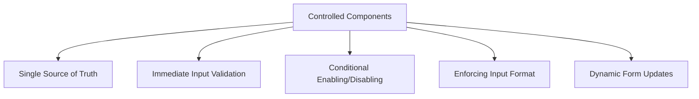

# React Controlled Components

## Introduction

Forms are a fundamental part of web applications, allowing users to interact with your application by inputting data. In React, there are two main approaches to handling form elements: controlled components and uncontrolled components. This guide focuses on **controlled components**, which are the recommended way to implement form inputs in React.

Controlled components are form elements whose values are controlled by React through state. This means that the React component that renders the form also controls what happens in that form on subsequent user input. Let's dive into how controlled components work and why they're valuable in React applications.

## What Are Controlled Components?

In HTML, form elements like `<input>`, `<textarea>`, and `<select>` typically maintain their own state and update it based on user input. In React, we can move this state management to React's state, creating what we call a "controlled component".

A controlled component has these key characteristics:

1. The form element's value is controlled by React state
2. The form element's value changes only when the state changes
3. User interactions with the form element trigger state updates

## Basic Implementation of a Controlled Component

Let's start with a simple example of a controlled text input:

```jsx
import React, { useState } from 'react';

function ControlledInput() {
  // State to store the input value
  const [inputValue, setInputValue] = useState('');
  
  // Event handler for input changes
  const handleChange = (event) => {
    setInputValue(event.target.value);
  };
  
  return (
    <div>
      <input 
        type="text"
        value={inputValue} // Value attribute set to React state
        onChange={handleChange} // onChange handler updates state
      />
      <p>You typed: {inputValue}</p>
    </div>
  );
}

export default ControlledInput;
```

### How It Works:

1. We create a state variable `inputValue` using the `useState` hook
2. We set the `value` attribute of the input to our state variable
3. We provide an `onChange` handler that updates the state when the user types
4. React re-renders the component with the new state value, updating what's displayed in the input

This creates a "single source of truth" where React state is the authority on what the input should display.

## Controlled Components with Different Form Elements

Let's explore how to create controlled components with different form elements:

### Text Input Fields

```jsx
import React, { useState } from 'react';

function TextInputExample() {
  const [name, setName] = useState('');
  
  const handleNameChange = (e) => {
    setName(e.target.value);
  };
  
  return (
    <div>
      <label htmlFor="name">Name:</label>
      <input
        id="name"
        type="text"
        value={name}
        onChange={handleNameChange}
        placeholder="Enter your name"
      />
      <p>Hello, {name || 'stranger'}!</p>
    </div>
  );
}
```

### Textarea Elements

Unlike HTML, where a textarea's content goes between opening and closing tags, React uses a `value` attribute:

```jsx
import React, { useState } from 'react';

function TextareaExample() {
  const [comment, setComment] = useState('');
  
  const handleCommentChange = (e) => {
    setComment(e.target.value);
  };
  
  return (
    <div>
      <label htmlFor="comment">Comment:</label>
      <textarea
        id="comment"
        value={comment}
        onChange={handleCommentChange}
        rows={4}
        cols={40}
        placeholder="Enter your comment"
      />
      <p>Character count: {comment.length}</p>
    </div>
  );
}
```

### Select Dropdown

Again, React uses the `value` attribute instead of selecting an option through HTML's selected attribute:

```jsx
import React, { useState } from 'react';

function SelectExample() {
  const [fruit, setFruit] = useState('apple');
  
  const handleFruitChange = (e) => {
    setFruit(e.target.value);
  };
  
  return (
    <div>
      <label htmlFor="fruit">Choose a fruit:</label>
      <select
        id="fruit"
        value={fruit}
        onChange={handleFruitChange}
      >
        <option value="apple">Apple</option>
        <option value="banana">Banana</option>
        <option value="orange">Orange</option>
        <option value="grape">Grape</option>
      </select>
      <p>You selected: {fruit}</p>
    </div>
  );
}
```

### Checkbox Inputs

Checkboxes use the `checked` attribute instead of `value`:

```jsx
import React, { useState } from 'react';

function CheckboxExample() {
  const [isSubscribed, setIsSubscribed] = useState(false);
  
  const handleSubscriptionChange = (e) => {
    setIsSubscribed(e.target.checked);
  };
  
  return (
    <div>
      <label>
        <input
          type="checkbox"
          checked={isSubscribed}
          onChange={handleSubscriptionChange}
        />
        Subscribe to newsletter
      </label>
      <p>Subscription status: {isSubscribed ? 'Subscribed' : 'Not subscribed'}</p>
    </div>
  );
}
```

### Radio Buttons

Radio buttons are controlled similarly to checkboxes:

```jsx
import React, { useState } from 'react';

function RadioButtonExample() {
  const [gender, setGender] = useState('');
  
  const handleGenderChange = (e) => {
    setGender(e.target.value);
  };
  
  return (
    <div>
      <fieldset>
        <legend>Gender:</legend>
        <label>
          <input
            type="radio"
            value="male"
            checked={gender === 'male'}
            onChange={handleGenderChange}
          />
          Male
        </label>
        <label>
          <input
            type="radio"
            value="female"
            checked={gender === 'female'}
            onChange={handleGenderChange}
          />
          Female
        </label>
        <label>
          <input
            type="radio"
            value="other"
            checked={gender === 'other'}
            onChange={handleGenderChange}
          />
          Other
        </label>
      </fieldset>
      <p>Selected gender: {gender || 'None selected'}</p>
    </div>
  );
}
```

## Handling Multiple Inputs

When you have multiple input fields in a form, you can manage them efficiently by:

1. Using a single state object to hold all form values
2. Creating a generic handler that updates the appropriate field based on input names

```jsx
import React, { useState } from 'react';

function MultipleInputsForm() {
  const [formData, setFormData] = useState({
    firstName: '',
    lastName: '',
    email: '',
    message: '',
  });
  
  const handleChange = (e) => {
    const { name, value } = e.target;
    setFormData({
      ...formData,
      [name]: value,
    });
  };
  
  const handleSubmit = (e) => {
    e.preventDefault();
    console.log('Form submitted with data:', formData);
    // Here you would typically send the data to your server
    alert('Form submitted successfully!');
  };
  
  return (
    <form onSubmit={handleSubmit}>
      <div>
        <label htmlFor="firstName">First Name:</label>
        <input
          id="firstName"
          name="firstName"
          type="text"
          value={formData.firstName}
          onChange={handleChange}
        />
      </div>
      
      <div>
        <label htmlFor="lastName">Last Name:</label>
        <input
          id="lastName"
          name="lastName"
          type="text"
          value={formData.lastName}
          onChange={handleChange}
        />
      </div>
      
      <div>
        <label htmlFor="email">Email:</label>
        <input
          id="email"
          name="email"
          type="email"
          value={formData.email}
          onChange={handleChange}
        />
      </div>
      
      <div>
        <label htmlFor="message">Message:</label>
        <textarea
          id="message"
          name="message"
          value={formData.message}
          onChange={handleChange}
          rows={4}
        />
      </div>
      
      <button type="submit">Submit</button>
      
      <div>
        <h3>Form Data Preview:</h3>
        <pre>{JSON.stringify(formData, null, 2)}</pre>
      </div>
    </form>
  );
}
```

## Real-World Example: Registration Form

Here's a practical example of a registration form using controlled components:

```jsx
import React, { useState } from 'react';

function RegistrationForm() {
  const [formData, setFormData] = useState({
    username: '',
    email: '',
    password: '',
    confirmPassword: '',
    agreeToTerms: false,
    notificationPreference: 'email',
  });
  
  const [errors, setErrors] = useState({});
  
  const handleChange = (e) => {
    const { name, value, type, checked } = e.target;
    setFormData({
      ...formData,
      [name]: type === 'checkbox' ? checked : value,
    });
    
    // Clear error for this field when user starts typing again
    if (errors[name]) {
      setErrors({
        ...errors,
        [name]: null,
      });
    }
  };
  
  const validate = () => {
    const newErrors = {};
    
    // Username validation
    if (!formData.username.trim()) {
      newErrors.username = 'Username is required';
    } else if (formData.username.length < 3) {
      newErrors.username = 'Username must be at least 3 characters';
    }
    
    // Email validation
    if (!formData.email.trim()) {
      newErrors.email = 'Email is required';
    } else if (!/\S+@\S+\.\S+/.test(formData.email)) {
      newErrors.email = 'Email address is invalid';
    }
    
    // Password validation
    if (!formData.password) {
      newErrors.password = 'Password is required';
    } else if (formData.password.length < 6) {
      newErrors.password = 'Password must be at least 6 characters';
    }
    
    // Confirm password validation
    if (formData.password !== formData.confirmPassword) {
      newErrors.confirmPassword = 'Passwords do not match';
    }
    
    // Terms validation
    if (!formData.agreeToTerms) {
      newErrors.agreeToTerms = 'You must agree to the terms';
    }
    
    setErrors(newErrors);
    return Object.keys(newErrors).length === 0;
  };
  
  const handleSubmit = (e) => {
    e.preventDefault();
    
    if (validate()) {
      // Form is valid, proceed with submission
      console.log('Registration data:', formData);
      alert('Registration successful!');
      
      // Reset form after successful submission
      setFormData({
        username: '',
        email: '',
        password: '',
        confirmPassword: '',
        agreeToTerms: false,
        notificationPreference: 'email',
      });
    }
  };
  
  return (
    <div className="registration-form">
      <h2>Create an Account</h2>
      <form onSubmit={handleSubmit}>
        <div className="form-group">
          <label htmlFor="username">Username:</label>
          <input
            id="username"
            name="username"
            type="text"
            value={formData.username}
            onChange={handleChange}
            className={errors.username ? 'error' : ''}
          />
          {errors.username && <span className="error-message">{errors.username}</span>}
        </div>
        
        <div className="form-group">
          <label htmlFor="email">Email:</label>
          <input
            id="email"
            name="email"
            type="email"
            value={formData.email}
            onChange={handleChange}
            className={errors.email ? 'error' : ''}
          />
          {errors.email && <span className="error-message">{errors.email}</span>}
        </div>
        
        <div className="form-group">
          <label htmlFor="password">Password:</label>
          <input
            id="password"
            name="password"
            type="password"
            value={formData.password}
            onChange={handleChange}
            className={errors.password ? 'error' : ''}
          />
          {errors.password && <span className="error-message">{errors.password}</span>}
        </div>
        
        <div className="form-group">
          <label htmlFor="confirmPassword">Confirm Password:</label>
          <input
            id="confirmPassword"
            name="confirmPassword"
            type="password"
            value={formData.confirmPassword}
            onChange={handleChange}
            className={errors.confirmPassword ? 'error' : ''}
          />
          {errors.confirmPassword && <span className="error-message">{errors.confirmPassword}</span>}
        </div>
        
        <div className="form-group">
          <label>Notification Preferences:</label>
          <div className="radio-group">
            <label>
              <input
                type="radio"
                name="notificationPreference"
                value="email"
                checked={formData.notificationPreference === 'email'}
                onChange={handleChange}
              />
              Email
            </label>
            <label>
              <input
                type="radio"
                name="notificationPreference"
                value="sms"
                checked={formData.notificationPreference === 'sms'}
                onChange={handleChange}
              />
              SMS
            </label>
            <label>
              <input
                type="radio"
                name="notificationPreference"
                value="none"
                checked={formData.notificationPreference === 'none'}
                onChange={handleChange}
              />
              None
            </label>
          </div>
        </div>
        
        <div className="form-group checkbox-group">
          <label>
            <input
              type="checkbox"
              name="agreeToTerms"
              checked={formData.agreeToTerms}
              onChange={handleChange}
              className={errors.agreeToTerms ? 'error' : ''}
            />
            I agree to the Terms and Conditions
          </label>
          {errors.agreeToTerms && <span className="error-message">{errors.agreeToTerms}</span>}
        </div>
        
        <button type="submit" className="submit-button">Register</button>
      </form>
    </div>
  );
}

export default RegistrationForm;
```

## Benefits of Controlled Components

Using controlled components offers several advantages:



1. **Single Source of Truth**: Form data is stored in the React component state, making it easier to manage and access.

2. **Immediate Input Validation**: You can validate user input as it's typed and provide immediate feedback.

3. **Conditional Logic**: You can enable/disable fields or change form elements based on other inputs.

4. **Input Formatting**: You can format input (e.g., phone numbers, credit cards) as users type.

5. **Dynamic Form Adjustments**: You can dynamically change form fields or options based on user input.

## Potential Challenges

While controlled components are powerful, they do have some challenges:

1. **Performance Considerations**: For forms with many fields or complex validation, constant re-rendering might impact performance.

2. **Extra Boilerplate Code**: You need to write state and handler code for every form element.

3. **File Inputs**: Handling file inputs requires special consideration as they're inherently uncontrolled.

## Best Practices

Follow these best practices when working with controlled components:

1. **Initialize State Properly**: Always provide initial values for form fields.
   
2. **Batch Multiple Field Updates**: Use a single state object for related form fields.
   
3. **Consider Form Libraries**: For complex forms, consider using libraries like Formik or React Hook Form.
   
4. **Validate at Appropriate Times**: Validate on blur, submit, or after a debounced change event, not on every keystroke.
   
5. **Provide Feedback**: Always give users clear feedback about validation errors.

## Summary

Controlled components are a fundamental React pattern for managing form state. By controlling form elements through React state, you gain precise control over user input, enabling features like input validation, conditional rendering, and dynamic form behavior.

The key steps to implementing controlled components are:

1. Create state to store the form data
2. Set form element values from state
3. Update state through onChange handlers
4. Process the final form data on submission

While controlled components require more initial setup than uncontrolled components, they provide a more predictable and manageable approach to form handling in React applications.

## Exercises

To practice working with controlled components, try these exercises:

1. Create a simple login form with validation for email and password fields.
2. Build a multi-step form wizard that preserves data between steps.
3. Implement a dynamic form where certain fields appear or disappear based on user selections.
4. Create a form that allows users to add or remove form fields dynamically (like adding multiple phone numbers).
5. Implement a complex validation scenario where one field's validity depends on another field's value.

## Additional Resources

- [React Official Documentation on Forms](https://reactjs.org/docs/forms.html)
- [Formik Library for React Forms](https://formik.org/)
- [React Hook Form](https://react-hook-form.com/)
- [Yup Schema Validation](https://github.com/jquense/yup)

By mastering controlled components, you'll be well-equipped to handle a wide variety of form scenarios in your React applications, from simple contact forms to complex, multi-step wizards with intricate validation requirements.