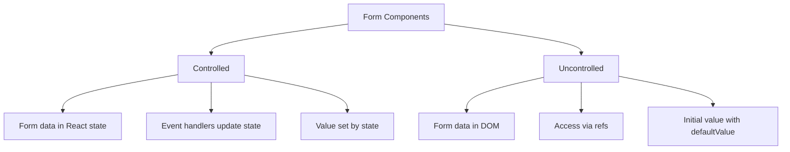

# React Uncontrolled Components

## Introduction

When working with forms in React, you have two main approaches to handle form data: controlled components and uncontrolled components. In controlled components, form data is handled by React state. In contrast, **uncontrolled components** let the DOM handle form data directly, providing a simpler but less React-centric approach to form management.

Uncontrolled components are sometimes compared to traditional HTML forms, as they rely on direct DOM access rather than state management. Let's explore how they work, when to use them, and their advantages and limitations.

## What are Uncontrolled Components?

In an uncontrolled component:

- Form data is managed by the DOM itself, not by React state
- You access form values using a ref instead of listening to input events
- Initial form values are set using HTML attributes like `defaultValue` rather than through React props

This approach can be simpler and requires less code in some cases, particularly for simple forms or when integrating with non-React code.

## Using Refs with Uncontrolled Components

To work with uncontrolled components, we need to use React refs to access DOM elements directly:

```jsx
import React, { useRef } from 'react';

function SimpleForm() {
  // Create a ref to store the input DOM element
  const inputRef = useRef(null);

  const handleSubmit = (event) => {
    event.preventDefault();
    // Access the current input value directly from the DOM
    alert('A name was submitted: ' + inputRef.current.value);
  };

  return (
    <form onSubmit={handleSubmit}>
      <label>
        Name:
        <input type="text" ref={inputRef} defaultValue="John Doe" />
      </label>
      <button type="submit">Submit</button>
    </form>
  );
}
```

Notice that we're using `defaultValue` instead of `value` to set the initial value. This is a key difference from controlled components.

## Controlled vs. Uncontrolled: Key Differences

Let's compare the two approaches to better understand when to use each:



### Key Differences:

| Aspect            | Controlled Components   | Uncontrolled Components |
|-------------------|-------------------------|-------------------------|
| Data Storage      | React state             | DOM                     |
| Value Access      | From state variables    | Via refs                |
| Updates           | Through state setters   | Directly in DOM         |
| Initial Values    | Set with `value` prop   | Set with `defaultValue` |
| Code Required     | More (state + handlers) | Less                    |
| Validation        | Immediate (on change)   | Typically on submit     |
| React Integration | Tight                   | Loose                   |

## When to Use Uncontrolled Components

Uncontrolled components are useful in certain scenarios:

1. **Simple forms** with minimal validation requirements
2. When integrating with **non-React code libraries**
3. When working with **file inputs**, which are inherently uncontrolled
4. **One-time form submissions** where you only need values upon form submission
5. For **performance optimization** of forms with many fields

## Practical Example: File Upload

File inputs are naturally uncontrolled in React. Here's how to create a file upload component:

```jsx
import React, { useRef } from 'react';

function FileUploader() {
  const fileInputRef = useRef(null);
  
  const handleSubmit = (event) => {
    event.preventDefault();
    
    // Access the selected file
    const file = fileInputRef.current.files[0];
    
    if (file) {
      // Create a FormData object for sending the file
      const formData = new FormData();
      formData.append('file', file);
      
      // Example of how you might upload the file
      console.log('File selected:', file.name);
      console.log('File size:', file.size, 'bytes');
      console.log('File type:', file.type);
      
      // In a real application, you would send the formData to a server
      // fetch('/api/upload', { method: 'POST', body: formData });
    }
  };
  
  return (
    <form onSubmit={handleSubmit}>
      <label>
        Upload file:
        <input 
          type="file" 
          ref={fileInputRef} 
        />
      </label>
      <button type="submit">Upload</button>
    </form>
  );
}
```

## Example: Multi-Field Registration Form

Here's a more complex example of an uncontrolled registration form:

```jsx
import React, { useRef } from 'react';

function RegistrationForm() {
  // Create refs for each form field
  const nameRef = useRef(null);
  const emailRef = useRef(null);
  const passwordRef = useRef(null);
  const bioRef = useRef(null);
  const termsRef = useRef(null);
  
  const handleSubmit = (event) => {
    event.preventDefault();
    
    // Validate the form
    if (!nameRef.current.value) {
      alert('Name is required');
      return;
    }
    
    if (!emailRef.current.value.includes('@')) {
      alert('Please enter a valid email');
      return;
    }
    
    if (passwordRef.current.value.length < 8) {
      alert('Password must be at least 8 characters long');
      return;
    }
    
    if (!termsRef.current.checked) {
      alert('You must accept the terms and conditions');
      return;
    }
    
    // Collect form data
    const formData = {
      name: nameRef.current.value,
      email: emailRef.current.value,
      password: passwordRef.current.value,
      bio: bioRef.current.value,
      acceptedTerms: termsRef.current.checked
    };
    
    console.log('Form submitted with data:', formData);
    // In a real app, you would send this data to your backend
  };
  
  return (
    <form onSubmit={handleSubmit} className="registration-form">
      <div className="form-group">
        <label htmlFor="name">Name:</label>
        <input 
          type="text" 
          id="name" 
          ref={nameRef} 
          defaultValue="" 
        />
      </div>
      
      <div className="form-group">
        <label htmlFor="email">Email:</label>
        <input 
          type="email" 
          id="email" 
          ref={emailRef} 
          defaultValue="" 
        />
      </div>
      
      <div className="form-group">
        <label htmlFor="password">Password:</label>
        <input 
          type="password" 
          id="password" 
          ref={passwordRef} 
          defaultValue="" 
        />
      </div>
      
      <div className="form-group">
        <label htmlFor="bio">Bio:</label>
        <textarea 
          id="bio" 
          ref={bioRef} 
          defaultValue="" 
        />
      </div>
      
      <div className="form-group checkbox">
        <input 
          type="checkbox" 
          id="terms" 
          ref={termsRef} 
          defaultChecked={false} 
        />
        <label htmlFor="terms">I accept the terms and conditions</label>
      </div>
      
      <button type="submit">Register</button>
    </form>
  );
}
```

## Special Cases and Best Practices

### Setting Default Values

To set a default value in an uncontrolled component, use the appropriate HTML attribute:

- For text inputs, use `defaultValue`
- For checkboxes and radio buttons, use `defaultChecked`

```jsx
<input type="text" ref={inputRef} defaultValue="Default text" />
<input type="checkbox" ref={checkboxRef} defaultChecked={true} />
```

### Working with Select Elements

Select elements work similarly to other form elements:

```jsx
import React, { useRef } from 'react';

function FruitSelector() {
  const selectRef = useRef(null);
  
  const handleSubmit = (event) => {
    event.preventDefault();
    alert('You selected: ' + selectRef.current.value);
  };
  
  return (
    <form onSubmit={handleSubmit}>
      <label>
        Pick your favorite fruit:
        <select ref={selectRef} defaultValue="apple">
          <option value="apple">Apple</option>
          <option value="banana">Banana</option>
          <option value="orange">Orange</option>
          <option value="grape">Grape</option>
        </select>
      </label>
      <button type="submit">Submit</button>
    </form>
  );
}
```

### Using `useRef` with Function Components

In modern React with hooks, we use `useRef` to create references:

```jsx
import React, { useRef } from 'react';

function TextInputWithFocusButton() {
  const inputRef = useRef(null);
  
  const focusInput = () => {
    // Directly manipulate the DOM when needed
    inputRef.current.focus();
  };
  
  return (
    <>
      <input ref={inputRef} type="text" />
      <button onClick={focusInput}>Focus the input</button>
    </>
  );
}
```

## Benefits and Limitations

### Benefits of Uncontrolled Components

1. **Simpler code** for basic form scenarios
2. **Less rendering** - can be more performant for large forms
3. **Works better with certain third-party DOM libraries**
4. **Easy integration** with non-React code
5. **Natural file input handling**

### Limitations

1. **Less control** over immediate form validation
2. **Harder to implement dynamic behavior** (like disabling a submit button based on validation)
3. **Mixing refs and state** can become complex
4. **Form state is not centralized** in your React component

## Summary

Uncontrolled components provide a way to handle form data directly through the DOM rather than through React state. They use refs to interact with form elements and can simplify code in certain scenarios. While controlled components are generally recommended for most React applications, uncontrolled components have their place, especially for simple forms, file inputs, or when integrating with non-React code.

Remember these key points about uncontrolled components:

- They store form data in the DOM itself
- They use refs to access current values
- They use `defaultValue` instead of `value` for initial values
- They typically validate on submit rather than during typing
- They're simpler but provide less control than controlled components

## Exercises

1. Create an uncontrolled login form with username and password fields
2. Build a file upload component that shows a preview of the selected image
3. Create a form that mixes both controlled and uncontrolled components and understand when to use each
4. Implement form validation for an uncontrolled registration form
5. Use the `useRef` hook to create an autofocus effect on a form field when a component mounts

## Additional Resources

- [React Documentation on Uncontrolled Components](https://reactjs.org/docs/uncontrolled-components.html)
- [React Hooks: useRef](https://reactjs.org/docs/hooks-reference.html#useref)
- [MDN Web Docs: HTML Forms](https://developer.mozilla.org/en-US/docs/Web/HTML/Element/form)

By choosing the right approach between controlled and uncontrolled components, you can build forms that are both user-friendly and maintainable.