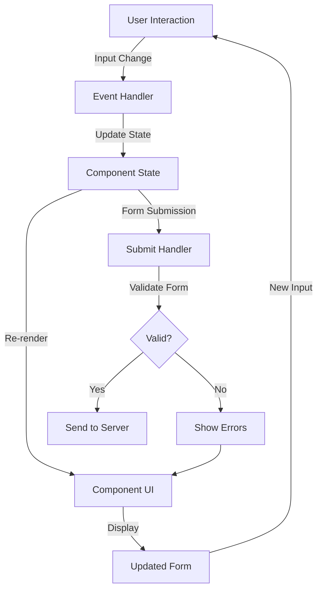

# React Form Patterns

Forms are an essential part of most web applications, allowing users to input data and interact with your application. In React, there are several patterns and approaches to handle forms efficiently. This guide will walk you through common React form patterns to help you build better user interfaces.

## Introduction

When working with forms in React, you'll need to make decisions about how to:
- Manage form state
- Handle user input
- Validate data
- Submit data to a server

React offers several patterns for these tasks, each with its own advantages. Understanding these patterns will help you choose the right approach for your specific use case.

## Controlled Components Pattern

The most fundamental React form pattern is the controlled component pattern, where React controls the form's state.

### How it works

1. Create state variables for each form input
2. Set the `value` prop of inputs to the corresponding state variable
3. Update the state when inputs change using `onChange` handlers

### Example

```jsx
import React, { useState } from 'react';

function ControlledForm() {
  const [username, setUsername] = useState('');
  const [email, setEmail] = useState('');
  const [password, setPassword] = useState('');

  const handleSubmit = (event) => {
    event.preventDefault();
    console.log({ username, email, password });
    // Submit data to server
  };

  return (
    <form onSubmit={handleSubmit}>
      <div>
        <label htmlFor="username">Username:</label>
        <input
          id="username"
          type="text"
          value={username}
          onChange={(e) => setUsername(e.target.value)}
        />
      </div>
      
      <div>
        <label htmlFor="email">Email:</label>
        <input
          id="email"
          type="email"
          value={email}
          onChange={(e) => setEmail(e.target.value)}
        />
      </div>
      
      <div>
        <label htmlFor="password">Password:</label>
        <input
          id="password"
          type="password"
          value={password}
          onChange={(e) => setPassword(e.target.value)}
        />
      </div>
      
      <button type="submit">Register</button>
    </form>
  );
}
```

### Advantages

- Complete control over form inputs
- Access to input values at any time
- Immediate validation and feedback
- Ability to enforce input formats

### Disadvantages

- More boilerplate code
- Can become unwieldy with many form fields

## Single State Object Pattern

Instead of creating separate state variables for each input, you can use a single state object to manage your entire form.

### Example

```jsx
import React, { useState } from 'react';

function SingleStateForm() {
  const [formData, setFormData] = useState({
    username: '',
    email: '',
    password: ''
  });

  const handleChange = (e) => {
    const { name, value } = e.target;
    setFormData({
      ...formData,
      [name]: value
    });
  };

  const handleSubmit = (event) => {
    event.preventDefault();
    console.log(formData);
    // Submit data to server
  };

  return (
    <form onSubmit={handleSubmit}>
      <div>
        <label htmlFor="username">Username:</label>
        <input
          id="username"
          name="username"
          type="text"
          value={formData.username}
          onChange={handleChange}
        />
      </div>
      
      <div>
        <label htmlFor="email">Email:</label>
        <input
          id="email"
          name="email"
          type="email"
          value={formData.email}
          onChange={handleChange}
        />
      </div>
      
      <div>
        <label htmlFor="password">Password:</label>
        <input
          id="password"
          name="password"
          type="password"
          value={formData.password}
          onChange={handleChange}
        />
      </div>
      
      <button type="submit">Register</button>
    </form>
  );
}
```

### Advantages

- Less state variables to manage
- Unified change handler for all inputs
- Easier to add or remove form fields
- Simpler to handle form submission

## Uncontrolled Components with Refs

If you prefer to let the DOM handle form state, you can use uncontrolled components with refs.

### Example

```jsx
import React, { useRef } from 'react';

function UncontrolledForm() {
  const usernameRef = useRef();
  const emailRef = useRef();
  const passwordRef = useRef();

  const handleSubmit = (event) => {
    event.preventDefault();
    const formData = {
      username: usernameRef.current.value,
      email: emailRef.current.value,
      password: passwordRef.current.value
    };
    console.log(formData);
    // Submit data to server
  };

  return (
    <form onSubmit={handleSubmit}>
      <div>
        <label htmlFor="username">Username:</label>
        <input
          id="username"
          type="text"
          ref={usernameRef}
          defaultValue=""
        />
      </div>
      
      <div>
        <label htmlFor="email">Email:</label>
        <input
          id="email"
          type="email"
          ref={emailRef}
          defaultValue=""
        />
      </div>
      
      <div>
        <label htmlFor="password">Password:</label>
        <input
          id="password"
          type="password"
          ref={passwordRef}
          defaultValue=""
        />
      </div>
      
      <button type="submit">Register</button>
    </form>
  );
}
```

### Advantages

- Less code for simple forms
- No state updates on every keystroke
- Useful when integrating with non-React code

### Disadvantages

- Limited control over user input
- Harder to implement immediate validation
- Can't enforce input formatting easily

## Form Validation Patterns

Form validation is crucial for ensuring users provide valid data. Here are common patterns for validation in React forms.

### Inline Validation Pattern

Validate each field as the user types or when it loses focus.

```jsx
import React, { useState } from 'react';

function ValidatedForm() {
  const [email, setEmail] = useState('');
  const [emailError, setEmailError] = useState('');

  const validateEmail = (value) => {
    if (!value) {
      setEmailError('Email is required');
    } else if (!/\S+@\S+\.\S+/.test(value)) {
      setEmailError('Email is invalid');
    } else {
      setEmailError('');
    }
  };

  const handleEmailChange = (e) => {
    const value = e.target.value;
    setEmail(value);
    validateEmail(value);
  };

  const handleSubmit = (event) => {
    event.preventDefault();
    validateEmail(email);
    
    if (!emailError) {
      console.log('Form submitted with:', email);
      // Submit data to server
    }
  };

  return (
    <form onSubmit={handleSubmit}>
      <div>
        <label htmlFor="email">Email:</label>
        <input
          id="email"
          type="email"
          value={email}
          onChange={handleEmailChange}
          onBlur={() => validateEmail(email)}
          className={emailError ? 'error' : ''}
        />
        {emailError && <p className="error-message">{emailError}</p>}
      </div>
      
      <button type="submit">Submit</button>
    </form>
  );
}
```

### Form-Level Validation Pattern

Validate all fields at once, typically on form submission.

```jsx
import React, { useState } from 'react';

function FormLevelValidation() {
  const [formData, setFormData] = useState({
    username: '',
    email: '',
    password: ''
  });
  
  const [errors, setErrors] = useState({});

  const handleChange = (e) => {
    const { name, value } = e.target;
    setFormData({
      ...formData,
      [name]: value
    });
  };

  const validateForm = () => {
    const newErrors = {};
    
    if (!formData.username) {
      newErrors.username = 'Username is required';
    }
    
    if (!formData.email) {
      newErrors.email = 'Email is required';
    } else if (!/\S+@\S+\.\S+/.test(formData.email)) {
      newErrors.email = 'Email is invalid';
    }
    
    if (!formData.password) {
      newErrors.password = 'Password is required';
    } else if (formData.password.length < 6) {
      newErrors.password = 'Password must be at least 6 characters';
    }
    
    setErrors(newErrors);
    return Object.keys(newErrors).length === 0;
  };

  const handleSubmit = (event) => {
    event.preventDefault();
    
    if (validateForm()) {
      console.log('Form submitted with:', formData);
      // Submit data to server
    }
  };

  return (
    <form onSubmit={handleSubmit}>
      <div>
        <label htmlFor="username">Username:</label>
        <input
          id="username"
          name="username"
          type="text"
          value={formData.username}
          onChange={handleChange}
          className={errors.username ? 'error' : ''}
        />
        {errors.username && <p className="error-message">{errors.username}</p>}
      </div>
      
      <div>
        <label htmlFor="email">Email:</label>
        <input
          id="email"
          name="email"
          type="email"
          value={formData.email}
          onChange={handleChange}
          className={errors.email ? 'error' : ''}
        />
        {errors.email && <p className="error-message">{errors.email}</p>}
      </div>
      
      <div>
        <label htmlFor="password">Password:</label>
        <input
          id="password"
          name="password"
          type="password"
          value={formData.password}
          onChange={handleChange}
          className={errors.password ? 'error' : ''}
        />
        {errors.password && <p className="error-message">{errors.password}</p>}
      </div>
      
      <button type="submit">Register</button>
    </form>
  );
}
```

## Using Custom Hooks for Forms

Custom hooks can significantly simplify form management by encapsulating form logic.

### Simple Form Hook

```jsx
import { useState } from 'react';

function useForm(initialValues) {
  const [values, setValues] = useState(initialValues);
  const [errors, setErrors] = useState({});

  const handleChange = (e) => {
    const { name, value } = e.target;
    setValues({
      ...values,
      [name]: value
    });
  };

  const resetForm = () => {
    setValues(initialValues);
    setErrors({});
  };

  return {
    values,
    errors,
    setErrors,
    handleChange,
    resetForm,
    setValues
  };
}

// Using the custom hook in a component
function SignupForm() {
  const { values, errors, handleChange, setErrors } = useForm({
    username: '',
    email: '',
    password: ''
  });

  const validateForm = () => {
    // Validation logic here
    // ...
    return isValid;
  };

  const handleSubmit = (event) => {
    event.preventDefault();
    if (validateForm()) {
      // Submit form
    }
  };

  return (
    <form onSubmit={handleSubmit}>
      {/* Form inputs here */}
    </form>
  );
}
```

## Using Form Libraries

For complex forms, consider using established form libraries that handle many common challenges.

### Example with React Hook Form

```jsx
import { useForm } from 'react-hook-form';

function ReactHookFormExample() {
  const { 
    register, 
    handleSubmit, 
    formState: { errors } 
  } = useForm();

  const onSubmit = (data) => {
    console.log('Form submitted with:', data);
    // Submit data to server
  };

  return (
    <form onSubmit={handleSubmit(onSubmit)}>
      <div>
        <label htmlFor="username">Username:</label>
        <input 
          id="username"
          {...register("username", { required: "Username is required" })}
        />
        {errors.username && <p className="error-message">{errors.username.message}</p>}
      </div>
      
      <div>
        <label htmlFor="email">Email:</label>
        <input
          id="email"
          type="email"
          {...register("email", { 
            required: "Email is required",
            pattern: {
              value: /\S+@\S+\.\S+/,
              message: "Email is invalid"
            }
          })}
        />
        {errors.email && <p className="error-message">{errors.email.message}</p>}
      </div>
      
      <div>
        <label htmlFor="password">Password:</label>
        <input
          id="password"
          type="password"
          {...register("password", { 
            required: "Password is required",
            minLength: {
              value: 6,
              message: "Password must be at least 6 characters"
            }
          })}
        />
        {errors.password && <p className="error-message">{errors.password.message}</p>}
      </div>
      
      <button type="submit">Register</button>
    </form>
  );
}
```

## Real-world Example: Multi-step Form Pattern

Multi-step forms break complex forms into manageable sections, improving user experience.

```jsx
import React, { useState } from 'react';

function MultiStepForm() {
  const [step, setStep] = useState(1);
  const [formData, setFormData] = useState({
    // Personal information
    firstName: '',
    lastName: '',
    email: '',
    
    // Address information
    address: '',
    city: '',
    zipCode: '',
    
    // Account information
    username: '',
    password: ''
  });

  const handleChange = (e) => {
    const { name, value } = e.target;
    setFormData({
      ...formData,
      [name]: value
    });
  };

  const nextStep = () => {
    setStep(step + 1);
  };

  const prevStep = () => {
    setStep(step - 1);
  };

  const handleSubmit = (e) => {
    e.preventDefault();
    console.log('Final form data:', formData);
    // Submit data to server
  };

  // Step 1: Personal Information
  const renderPersonalInfo = () => {
    return (
      <div className="form-step">
        <h2>Personal Information</h2>
        <div>
          <label htmlFor="firstName">First Name:</label>
          <input
            id="firstName"
            name="firstName"
            value={formData.firstName}
            onChange={handleChange}
          />
        </div>
        <div>
          <label htmlFor="lastName">Last Name:</label>
          <input
            id="lastName"
            name="lastName"
            value={formData.lastName}
            onChange={handleChange}
          />
        </div>
        <div>
          <label htmlFor="email">Email:</label>
          <input
            id="email"
            name="email"
            type="email"
            value={formData.email}
            onChange={handleChange}
          />
        </div>
        <button type="button" onClick={nextStep}>
          Next
        </button>
      </div>
    );
  };

  // Step 2: Address
  const renderAddress = () => {
    return (
      <div className="form-step">
        <h2>Address Information</h2>
        <div>
          <label htmlFor="address">Street Address:</label>
          <input
            id="address"
            name="address"
            value={formData.address}
            onChange={handleChange}
          />
        </div>
        <div>
          <label htmlFor="city">City:</label>
          <input
            id="city"
            name="city"
            value={formData.city}
            onChange={handleChange}
          />
        </div>
        <div>
          <label htmlFor="zipCode">Zip Code:</label>
          <input
            id="zipCode"
            name="zipCode"
            value={formData.zipCode}
            onChange={handleChange}
          />
        </div>
        <div className="buttons">
          <button type="button" onClick={prevStep}>
            Previous
          </button>
          <button type="button" onClick={nextStep}>
            Next
          </button>
        </div>
      </div>
    );
  };

  // Step 3: Account
  const renderAccount = () => {
    return (
      <div className="form-step">
        <h2>Account Setup</h2>
        <div>
          <label htmlFor="username">Username:</label>
          <input
            id="username"
            name="username"
            value={formData.username}
            onChange={handleChange}
          />
        </div>
        <div>
          <label htmlFor="password">Password:</label>
          <input
            id="password"
            name="password"
            type="password"
            value={formData.password}
            onChange={handleChange}
          />
        </div>
        <div className="buttons">
          <button type="button" onClick={prevStep}>
            Previous
          </button>
          <button type="submit">Submit</button>
        </div>
      </div>
    );
  };

  return (
    <form onSubmit={handleSubmit}>
      {/* Progress indicator */}
      <div className="progress-bar">
        <div className={`step ${step >= 1 ? 'active' : ''}`}>Personal</div>
        <div className={`step ${step >= 2 ? 'active' : ''}`}>Address</div>
        <div className={`step ${step >= 3 ? 'active' : ''}`}>Account</div>
      </div>
      
      {/* Display current step */}
      {step === 1 && renderPersonalInfo()}
      {step === 2 && renderAddress()}
      {step === 3 && renderAccount()}
    </form>
  );
}
```

## Form State Flow Visualization

Here's a visualization of how form state flows in React:



## Summary

In this guide, we've covered several important React form patterns:

1. **Controlled Components**: Managing form state in React state
2. **Single State Object Pattern**: Using one state object for all form fields
3. **Uncontrolled Components**: Using refs to access form values
4. **Validation Patterns**: Both inline and form-level validation
5. **Custom Hooks**: Creating reusable form logic
6. **Form Libraries**: Using established solutions for complex forms
7. **Multi-step Forms**: Breaking complex forms into manageable steps

Each pattern has its own advantages and use cases. Choose the right pattern based on:

- Form complexity
- Validation requirements
- User experience needs
- Team preferences and familiarity

## Additional Resources and Exercises

### Resources

- [React Documentation on Forms](https://reactjs.org/docs/forms.html)
- [React Hook Form Documentation](https://react-hook-form.com/)
- [Formik Documentation](https://formik.org/)

### Exercises

1. **Form Converter**: Take a simple HTML form and convert it to a controlled React form.
2. **Form Validation**: Add validation to a form with at least 5 fields of different types (text, email, number, etc.).
3. **Custom Form Hook**: Create a custom hook that handles form state, validation, and submission.
4. **Multi-step Form**: Build a multi-step wizard form with at least 3 steps and different field types.
5. **Form Library Comparison**: Try implementing the same form using React's built-in state management, React Hook Form, and Formik, then compare the approaches.

By mastering these form patterns, you'll be well-equipped to build user-friendly, maintainable forms in your React applications.