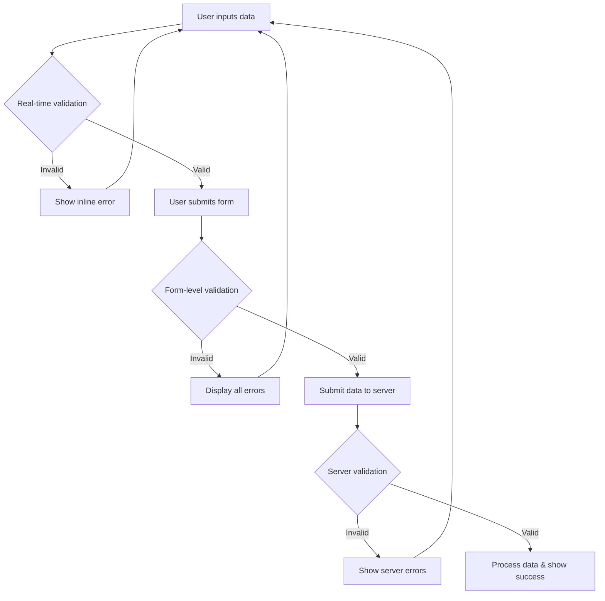

# React Form Validation

Forms are essential in web applications for collecting user input, but that input needs validation to ensure it meets your requirements. In this guide, we'll explore how to implement form validation in React applications.

## Introduction to Form Validation

Form validation is the process of checking user input to ensure it meets specific criteria before processing it. Effective validation:

- Prevents incorrect or harmful data from entering your application
- Provides immediate feedback to users
- Improves overall user experience
- Reduces server load by catching errors on the client side

React doesn't have built-in form validation, giving you the flexibility to implement validation that fits your specific needs.

## Types of Form Validation

### Client-Side Validation

Client-side validation occurs in the browser before data is sent to the server:

1. **Basic validation** - Using HTML5 attributes like `required`, `min`, `max`, etc.
2. **JavaScript validation** - Custom validation logic using JavaScript
3. **Library-assisted validation** - Using packages like Formik, Yup, or React Hook Form

### Server-Side Validation

Always implement server-side validation as a security measure, even with client-side validation in place.

## Basic Form Validation in React

Let's start with a simple example of validating a signup form:

```jsx
import React, { useState } from 'react';

function SignupForm() {
  const [formData, setFormData] = useState({
    username: '',
    email: '',
    password: ''
  });
  
  const [errors, setErrors] = useState({});
  
  const handleChange = (e) => {
    const { name, value } = e.target;
    setFormData({
      ...formData,
      [name]: value
    });
  };
  
  const validateForm = () => {
    let tempErrors = {};
    let isValid = true;
    
    if (!formData.username.trim()) {
      tempErrors.username = "Username is required";
      isValid = false;
    }
    
    if (!formData.email) {
      tempErrors.email = "Email is required";
      isValid = false;
    } else if (!/\S+@\S+\.\S+/.test(formData.email)) {
      tempErrors.email = "Email is invalid";
      isValid = false;
    }
    
    if (!formData.password) {
      tempErrors.password = "Password is required";
      isValid = false;
    } else if (formData.password.length < 6) {
      tempErrors.password = "Password must be at least 6 characters";
      isValid = false;
    }
    
    setErrors(tempErrors);
    return isValid;
  };
  
  const handleSubmit = (e) => {
    e.preventDefault();
    
    if (validateForm()) {
      // Form is valid, proceed with submission
      console.log("Form submitted successfully:", formData);
      // You would typically submit to an API here
    } else {
      console.log("Form validation failed");
    }
  };
  
  return (
    <form onSubmit={handleSubmit}>
      <div>
        <label>Username:</label>
        <input
          type="text"
          name="username"
          value={formData.username}
          onChange={handleChange}
        />
        {errors.username && <p className="error">{errors.username}</p>}
      </div>
      
      <div>
        <label>Email:</label>
        <input
          type="email"
          name="email"
          value={formData.email}
          onChange={handleChange}
        />
        {errors.email && <p className="error">{errors.email}</p>}
      </div>
      
      <div>
        <label>Password:</label>
        <input
          type="password"
          name="password"
          value={formData.password}
          onChange={handleChange}
        />
        {errors.password && <p className="error">{errors.password}</p>}
      </div>
      
      <button type="submit">Sign Up</button>
    </form>
  );
}

export default SignupForm;
```

In this example:
- We maintain form data and errors in separate state objects
- We implement a `validateForm` function that checks each field against our rules
- We display appropriate error messages when validation fails
- Validation happens during form submission

## Real-Time Validation

For a better user experience, you might want to validate inputs as the user types or when they finish entering data in a field:

```jsx
import React, { useState } from 'react';

function RealTimeValidationForm() {
  const [formData, setFormData] = useState({
    username: '',
    email: '',
    password: ''
  });
  
  const [errors, setErrors] = useState({});
  const [touched, setTouched] = useState({});
  
  const handleChange = (e) => {
    const { name, value } = e.target;
    setFormData({
      ...formData,
      [name]: value
    });
    
    // Validate field on change if it has been touched
    if (touched[name]) {
      validateField(name, value);
    }
  };
  
  const handleBlur = (e) => {
    const { name } = e.target;
    setTouched({
      ...touched,
      [name]: true
    });
    validateField(name, formData[name]);
  };
  
  const validateField = (name, value) => {
    let error = "";
    
    switch (name) {
      case "username":
        if (!value.trim()) error = "Username is required";
        break;
      case "email":
        if (!value) {
          error = "Email is required";
        } else if (!/\S+@\S+\.\S+/.test(value)) {
          error = "Email is invalid";
        }
        break;
      case "password":
        if (!value) {
          error = "Password is required";
        } else if (value.length < 6) {
          error = "Password must be at least 6 characters";
        }
        break;
      default:
        break;
    }
    
    setErrors(prevErrors => ({
      ...prevErrors,
      [name]: error
    }));
    
    return !error;
  };
  
  const validateForm = () => {
    let isValid = true;
    const newErrors = {};
    
    // Validate all fields
    Object.keys(formData).forEach(key => {
      const fieldIsValid = validateField(key, formData[key]);
      if (!fieldIsValid) {
        isValid = false;
      }
    });
    
    setErrors(newErrors);
    return isValid;
  };
  
  const handleSubmit = (e) => {
    e.preventDefault();
    
    // Mark all fields as touched
    const touchedFields = {};
    Object.keys(formData).forEach(key => {
      touchedFields[key] = true;
    });
    setTouched(touchedFields);
    
    if (validateForm()) {
      console.log("Form submitted successfully:", formData);
      // Submit to API
    }
  };
  
  return (
    <form onSubmit={handleSubmit}>
      <div>
        <label>Username:</label>
        <input
          type="text"
          name="username"
          value={formData.username}
          onChange={handleChange}
          onBlur={handleBlur}
          className={touched.username && errors.username ? "error-input" : ""}
        />
        {touched.username && errors.username && <p className="error">{errors.username}</p>}
      </div>
      
      <div>
        <label>Email:</label>
        <input
          type="email"
          name="email"
          value={formData.email}
          onChange={handleChange}
          onBlur={handleBlur}
          className={touched.email && errors.email ? "error-input" : ""}
        />
        {touched.email && errors.email && <p className="error">{errors.email}</p>}
      </div>
      
      <div>
        <label>Password:</label>
        <input
          type="password"
          name="password"
          value={formData.password}
          onChange={handleChange}
          onBlur={handleBlur}
          className={touched.password && errors.password ? "error-input" : ""}
        />
        {touched.password && errors.password && <p className="error">{errors.password}</p>}
      </div>
      
      <button type="submit">Sign Up</button>
    </form>
  );
}

export default RealTimeValidationForm;
```

This improved version:
- Validates fields when they lose focus (onBlur)
- Only shows errors after a field has been "touched"
- Provides real-time feedback as the user types
- Adds CSS classes to highlight invalid fields

## Using Formik for Form Validation

For complex forms, consider using libraries like Formik which simplify form handling and validation:

```jsx
import React from 'react';
import { Formik, Form, Field, ErrorMessage } from 'formik';
import * as Yup from 'yup';

const ValidationSchema = Yup.object().shape({
  username: Yup.string()
    .min(3, 'Username must be at least 3 characters')
    .required('Username is required'),
  email: Yup.string()
    .email('Invalid email address')
    .required('Email is required'),
  password: Yup.string()
    .min(6, 'Password must be at least 6 characters')
    .required('Password is required'),
});

function FormikSignupForm() {
  const initialValues = {
    username: '',
    email: '',
    password: '',
  };

  const handleSubmit = (values, { setSubmitting, resetForm }) => {
    setTimeout(() => {
      console.log('Form data:', values);
      // Submit to API here
      resetForm();
      setSubmitting(false);
    }, 500);
  };

  return (
    <Formik
      initialValues={initialValues}
      validationSchema={ValidationSchema}
      onSubmit={handleSubmit}
    >
      {({ isSubmitting, errors, touched }) => (
        <Form>
          <div>
            <label htmlFor="username">Username</label>
            <Field
              type="text"
              name="username"
              id="username"
              className={errors.username && touched.username ? "error-input" : ""}
            />
            <ErrorMessage name="username" component="p" className="error" />
          </div>

          <div>
            <label htmlFor="email">Email</label>
            <Field
              type="email"
              name="email"
              id="email"
              className={errors.email && touched.email ? "error-input" : ""}
            />
            <ErrorMessage name="email" component="p" className="error" />
          </div>

          <div>
            <label htmlFor="password">Password</label>
            <Field
              type="password"
              name="password"
              id="password"
              className={errors.password && touched.password ? "error-input" : ""}
            />
            <ErrorMessage name="password" component="p" className="error" />
          </div>

          <button type="submit" disabled={isSubmitting}>
            {isSubmitting ? 'Submitting...' : 'Submit'}
          </button>
        </Form>
      )}
    </Formik>
  );
}

export default FormikSignupForm;
```

Benefits of using Formik:
- Less boilerplate code
- Built-in form state management
- Easy integration with validation libraries like Yup
- Simplified error handling
- Form submission management

## Custom Validation Hook

For advanced cases, you might want to create a reusable validation hook:

```jsx
import { useState } from 'react';

const useFormValidation = (initialState, validate) => {
  const [values, setValues] = useState(initialState);
  const [errors, setErrors] = useState({});
  const [touched, setTouched] = useState({});
  const [isSubmitting, setIsSubmitting] = useState(false);

  const handleChange = (event) => {
    const { name, value } = event.target;
    setValues({
      ...values,
      [name]: value
    });
  };

  const handleBlur = (event) => {
    const { name } = event.target;
    setTouched({
      ...touched,
      [name]: true
    });
    
    const validationErrors = validate(values);
    setErrors(validationErrors);
  };

  const handleSubmit = (event, onSubmit) => {
    event.preventDefault();
    
    // Mark all fields as touched
    const touchedFields = {};
    Object.keys(values).forEach(key => {
      touchedFields[key] = true;
    });
    setTouched(touchedFields);
    
    const validationErrors = validate(values);
    setErrors(validationErrors);
    
    if (Object.keys(validationErrors).length === 0) {
      setIsSubmitting(true);
      onSubmit(values, () => {
        setIsSubmitting(false);
      });
    }
  };

  return {
    values,
    errors,
    touched,
    isSubmitting,
    handleChange,
    handleBlur,
    handleSubmit
  };
};

export default useFormValidation;
```

Then you can use this hook in your components:

```jsx
import React from 'react';
import useFormValidation from './useFormValidation';

function CustomHookForm() {
  const initialState = {
    username: '',
    email: '',
    password: ''
  };
  
  const validateForm = (values) => {
    let errors = {};
    
    // Username validation
    if (!values.username.trim()) {
      errors.username = "Username is required";
    }
    
    // Email validation
    if (!values.email) {
      errors.email = "Email is required";
    } else if (!/\S+@\S+\.\S+/.test(values.email)) {
      errors.email = "Email is invalid";
    }
    
    // Password validation
    if (!values.password) {
      errors.password = "Password is required";
    } else if (values.password.length < 6) {
      errors.password = "Password must be at least 6 characters";
    }
    
    return errors;
  };
  
  const submitForm = (values, callback) => {
    setTimeout(() => {
      console.log("Form submitted successfully:", values);
      callback();
      // You would typically submit to an API here
    }, 1000);
  };
  
  const {
    values,
    errors,
    touched,
    isSubmitting,
    handleChange,
    handleBlur,
    handleSubmit
  } = useFormValidation(initialState, validateForm);
  
  return (
    <form onSubmit={(e) => handleSubmit(e, submitForm)}>
      <div>
        <label>Username:</label>
        <input
          type="text"
          name="username"
          value={values.username}
          onChange={handleChange}
          onBlur={handleBlur}
          className={touched.username && errors.username ? "error-input" : ""}
        />
        {touched.username && errors.username && <p className="error">{errors.username}</p>}
      </div>
      
      <div>
        <label>Email:</label>
        <input
          type="email"
          name="email"
          value={values.email}
          onChange={handleChange}
          onBlur={handleBlur}
          className={touched.email && errors.email ? "error-input" : ""}
        />
        {touched.email && errors.email && <p className="error">{errors.email}</p>}
      </div>
      
      <div>
        <label>Password:</label>
        <input
          type="password"
          name="password"
          value={values.password}
          onChange={handleChange}
          onBlur={handleBlur}
          className={touched.password && errors.password ? "error-input" : ""}
        />
        {touched.password && errors.password && <p className="error">{errors.password}</p>}
      </div>
      
      <button type="submit" disabled={isSubmitting}>
        {isSubmitting ? 'Submitting...' : 'Sign Up'}
      </button>
    </form>
  );
}

export default CustomHookForm;
```

## Form Validation Flow

Here's a visual representation of a typical form validation flow:



## Common Validation Patterns

Here are some common validation patterns you might need:

### Email Validation
```jsx
const validateEmail = (email) => {
  return /^[^\s@]+@[^\s@]+\.[^\s@]+$/.test(email);
};
```

### Password Strength
```jsx
const validatePassword = (password) => {
  // At least 8 characters, 1 uppercase, 1 lowercase, 1 number, 1 special character
  const regex = /^(?=.*[a-z])(?=.*[A-Z])(?=.*\d)(?=.*[@$!%*?&])[A-Za-z\d@$!%*?&]{8,}$/;
  return regex.test(password);
};
```

### Number Validation
```jsx
const validateNumber = (value) => {
  return !isNaN(parseFloat(value)) && isFinite(value);
};
```

### URL Validation
```jsx
const validateURL = (url) => {
  try {
    new URL(url);
    return true;
  } catch (e) {
    return false;
  }
};
```

### Phone Number Validation
```jsx
const validatePhone = (phone) => {
  // Simple US phone validation
  return /^\(?(\d{3})\)?[- ]?(\d{3})[- ]?(\d{4})$/.test(phone);
};
```

## Best Practices for Form Validation

1. **Validate both client-side and server-side**: Never rely solely on client-side validation.

2. **Provide clear error messages**: Tell users exactly what went wrong and how to fix it.

3. **Show validation in real-time**: Don't wait until form submission to show errors.

4. **Use visual cues**: Use colors, icons, and other visual elements to indicate validation status.

5. **Focus on accessibility**: Ensure error messages are accessible to screen readers.

6. **Consider progressive validation**: Validate fields only after users have interacted with them.

7. **Handle different types of validations**:
   - Required fields
   - Format validation (email, phone, etc.)
   - Length validation
   - Range validation
   - Equality validation (password confirmation)

## Summary

Form validation is a crucial aspect of building React applications that collect user data. In this guide, we've covered:

- Basic form validation principles
- Implementing validation with React state
- Real-time validation techniques
- Using validation libraries like Formik and Yup
- Creating custom validation hooks
- Common validation patterns
- Best practices for form validation

By implementing proper form validation, you ensure your application receives clean, valid data while providing a better user experience.

## Additional Resources

- Practice creating a multi-step form with validation for each step
- Implement a dynamic form where fields appear based on previous inputs
- Try building a form with complex validation dependencies between fields
- Create a password strength meter that provides feedback as users type
- Experiment with different error message styles and placement for optimal UX

## Exercises

1. Create a registration form with these validations:
   - Username (required, min 3 characters)
   - Email (required, valid format)
   - Password (required, min 8 characters, at least 1 number, 1 uppercase)
   - Confirm password (must match password)

2. Add visual feedback that changes as the user types in the password field:
   - Red for weak passwords
   - Yellow for medium strength
   - Green for strong passwords

3. Create a form that validates a credit card number using the Luhn algorithm

4. Implement a form with conditional validation (e.g., if "Other" is selected in a dropdown, a text field becomes required)